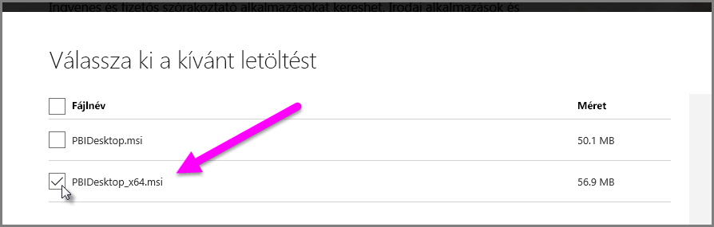

# Az Access- és .XLS-fájlok importálási hibáinak elhárítása a Power BI Desktopban
A **Power BI Desktopban** az **Access-adatbázisok** és az **Excel-munkafüzetek** korai verziói (Excel 2007-2003 típusú .XLS-fájlok) az *Access adatbázismotort* használják. Három gyakori helyzet van, amely meggátolhatja az Access adatbázismotor megfelelő működését:

### 1. helyzet: Nincs telepítve az Access adatbázismotor
Amikor a Power BI Desktop hibaüzenete azt jelzi, hogy az Access adatbázismotor nincs telepítve, telepíteni kell a 32 vagy a 64 bites Access adatbázismotort, attól függően, hogy melyik felel meg a Power BI Desktop verziójának. Az Access adatbázismotort [innen](http://www.microsoft.com/en-us/download/details.aspx?id=13255) telepítheti.

>[!NOTE]
>Ha a telepített Access adatbázismotor bitverziója különbözik a Microsoft Office bitverziójától, az Office-alkalmazások nem tudják használni az Access adatbázismotort.

### 2. helyzet: Az Access adatbázismotor bitverziója (32 vagy 64 bites) különbözik a Power BI Desktop bitverziójától
Ez a helyzet gyakran előfordul, ha a Microsoft Office 32 bites verziója van telepítve, de a Power BI Desktop telepített verziója 64 bites, vagy épp ellenkezőleg (ha Office 365-előfizetést használ, tekintse meg a **3. helyzetben** ismertetett problémát és megoldást). A következő megoldások közül bármelyik orvosolhatja ezt az eltérő bitverzióból eredő hibát:

1. Módosítsa úgy a Power BI Desktop verzióját, hogy megfeleljen a telepített Microsoft Office bitverziójának. A Power BI Desktop bitverziójának módosításához távolítsa el a Power BI Desktopot, majd egy olyan verzióját, amely megfelel a telepített Office-nak. A Power BI Desktop verziójának kiválasztásához a letöltési oldalon válassza a **Speciális letöltési beállítások** lehetőséget.
   
   
   
   A megjelenő letöltési oldalon válassza ki a nyelvet, majd kattintson a **Letöltés** gombra. A megjelenő képernyőn jelölje be a PBIDesktop.msi fájl melletti jelölőnégyzetet a 32 bites vagy a PBIDesktop_x64.msi fájl melletti jelölőnégyzetet a 64 bites verzióhoz. A lenti képen a 64 bites verzió van bejelölve.
   
   
   
   >[!NOTE]
   >A Power BI Desktop 32 bites verziójának használatakor a nagy méretű adatmodellek létrehozásakor kifogyhat a memóriából.
2. Módosítsa úgy a Microsoft Office verzióját, hogy megfeleljen a telepített Power BI Desktop bitverziójának. A Microsoft Office bitverziójának módosításához távolítsa el az Office-t, majd telepítse egy olyan verzióját, amely megfelel a telepített Power BI Desktopnak.
3. Ha a hiba akkor történt, amikor .XLS-fájlt (Excel 2007-2003 munkafüzetet) próbált megnyitni, az Access adatbázismotor használatának elkerüléséhez nyissa meg az .XLS-fájlt az Excelben, és mentse XLSX-fájlként.
4. Ha az előző három megoldás nem alkalmazható, telepítheti az Access adatbázismotor mindkét verzióját, de ez *nem* egy javasolt áthidaló megoldás. Mindkét verzió telepítésével megoldja az Excelhez készült Power Query és a Power BI Desktop hibáját, de más hibákat és problémákat okoz azoknál az alkalmazásoknál, amelyek automatikusan (alapértelmezés szerint) az Access adatbázismotor először telepített bitverzióját használják. Az Access adatbázismotor mindkét bitverziójának telepítéséhez [töltse le](http://www.microsoft.com/en-us/download/details.aspx?id=13255) mindkét verziót, majd futtassa mindkettőt a */passive* kapcsolóval. Például:
   
       c:\users\joe\downloads\AccessDatabaseEngine.exe /passive
   
       c:\users\joe\downloads\AccessDatabaseEngine_x64.exe /passive

### 3. helyzet: Probléma az Access- vagy .XLS-fájlok Office 365-előfizetéssel való használatakor
Ha Office 365-előfizetést használ (legyen szó **Office 2013-ról** vagy **Office 2016-ról**), az Access adatbázismotor szolgáltatója olyan virtuálisbeállításjegyzék-helyen van regisztrálva, amelyet *csak* az Office-folyamatok érhetnek el. Ennek következtében az adategyesítési motor (amely a nem Office 365 Excel és a Power BI Desktop futtatásáért felelős), amely nem Office-folyamat, nem használhatja az Access adatbázismotor szolgáltatóját.

A helyzet orvoslása érdekében letöltheti és telepítheti azt az Access adatbázismotor terjeszthető változatát, amely megfelel a telepített Power BI Desktop bitverziójának (a korábbi szakaszokban talál több információt a bitverziókról).

Letöltési hivatkozás: [Access adatbázismotor letöltése](http://www.microsoft.com/en-us/download/details.aspx?id=13255).

### Importálási problémát okozó egyéb helyzetek
Igyekszünk az Access- vagy .XLS-fájlokkal kapcsolatban előforduló lehető legtöbb hibára kitérni. Ha a jelen cikkben nem szereplő hibával találkozik, küldjön el egy rá vonatkozó kérdést a [Power BI támogatásnak](https://powerbi.microsoft.com/support/). Rendszeresen vizsgáljuk az olyan hibákat, amelyek több felhasználót is érintenek, és ezeket a cikkeinkben tárgyaljuk.

