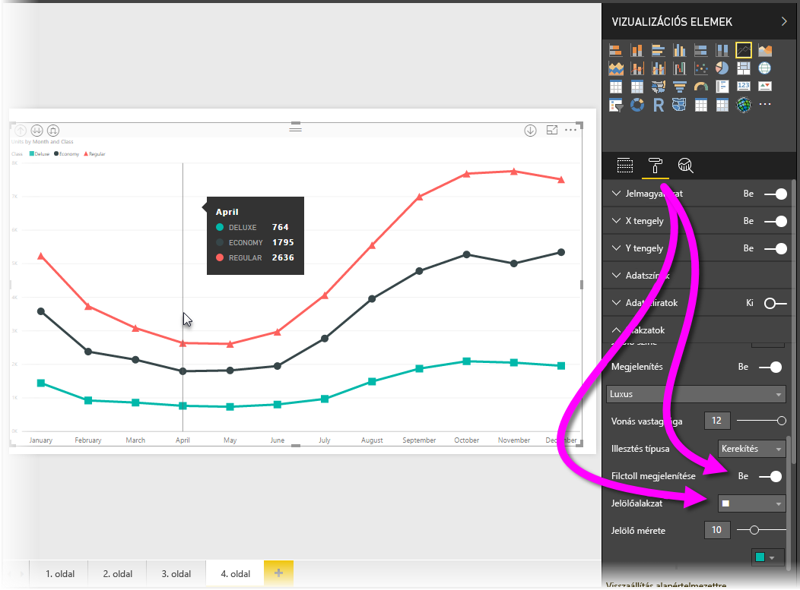
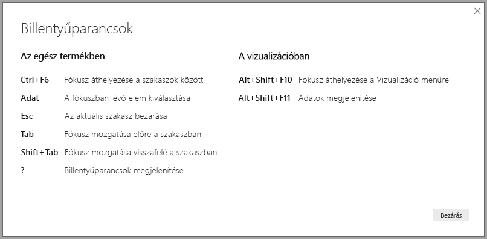
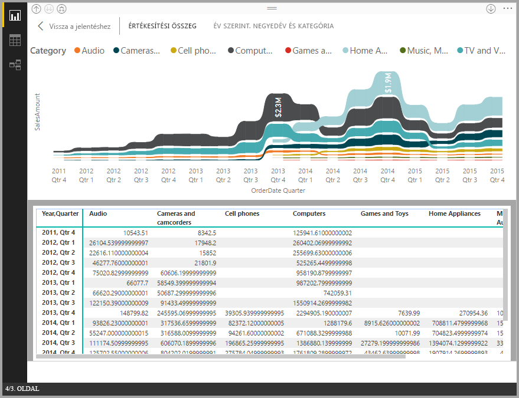
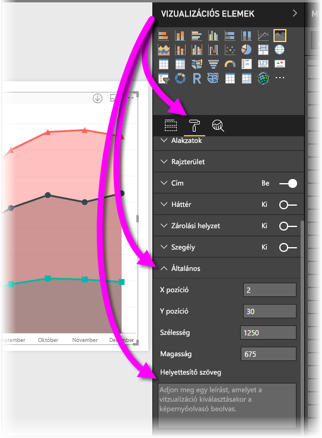

# Akadálymentesség a Power BI Desktop-jelentésekben
A **Power BI Desktop** rendelkezik olyan funkciókkal, amelyek lehetővé teszik a fogyatékkal élők számára, hogy könnyedén használják és kezeljék a **Power BI Desktop**-jelentéseket. A funkciók közé tartozik az a lehetőség, hogy a jelentések billentyűzettel vagy képernyőolvasóval is használhatók legyenek, az oldalak objektumai léptetéssel emelhetők ki, és a jelölők használata átgondolt a vizualizációkban.

> [!NOTE]
> Ezek az akadálymentességi funkciók a **Power BI Desktop** 2017. júniusi és újabb kiadásaiban érthetők el. A jövőbeli kiadásokban további akadálymentességi funkciókat tervezünk bevezetni.
> 
> 

## Power BI Desktop-jelentések használata billentyűzet vagy képernyőolvasó segítségével
A **Power BI Desktop** 2017. szeptemberi kiadásával kezdve a **?** billentyű lenyomásával megjeleníthet egy ablakot, amely ismerteti a **Power BI Desktopban** elérhető akadálymentességi billentyűparancsokat.

Az akadálymentességi fejlesztéseknek köszönhetően a **Power BI Desktop**-jelentések billentyűzettel vagy képernyőolvasóval is használhatók az alábbi technikák segítségével:

**Válthat fókuszt** a jelentés lapfülei vagy egy adott jelentésoldal objektumai között a **Ctrl+F6** billentyűkombinációval.

* Ha a fókusz a *jelentés lapfülein* van, a *Tab* vagy a *nyíl*billentyűk használatával válthat fókuszt az egyik jelentésoldalról a következőre. A képernyőolvasó felolvassa a jelentésoldal címét, valamint azt, hogy jelenleg ki van-e választva. A jelenleg aktív lévő jelentésoldal betöltéséhez nyomja le az *Enter* vagy a *Szóköz* billentyűt.
* Ha a fókusz egy betöltött *jelentésoldalon* van, a *Tab* billentyű használatával válthat fókuszt az oldal egyes objektumaira, beleértve a szövegdobozokat, képeket, alakzatokat és diagramokat. A képernyőolvasó felolvassa az objektum típusát és az adott objektum leírását, amit a szerzője adott meg. 

Az **Alt+Shift+F10** billentyűkombinációval áthelyezheti a fókuszt egy vizualizáció menüjére.

Az **Alt+Shift+F11** billentyűkombinációval megjelenítheti az *Adatok megjelenítése* ablak akadálymentesített verzióját.

Ezek az akadálymentesítési kiegészítések azért készültek, hogy a felhasználók képernyőolvasó és billentyűzetnavigáció segítségével is teljes mértékben használhassák a **Power BI Desktop**-jelentéseket.

## Akadálymentesített jelentések létrehozásával kapcsolatos tippek
Az alábbi tippek segítségével olyan **Power BI Desktop** jelentéseket hozhat létre, amelyek akadálymentesebbek.

* A **Vonal**, **Terület** és **Kombinált** vizualizációkhoz, valamint a **Pont** és **Buborék** vizualizációkhoz kapcsolja be a jelölőket, és használjon eltérő *Jelölőalakzatot* minden vonalhoz.
  
  * A *Jelölők* bekapcsolásához válassza ki a **Formátum** szakaszt a **Vizualizációk** panelen, bontsa ki az **Alakzatok** szakaszt, majd görgessen lefelé a **Jelölők** kapcsolóig, és állítsa *Be* állapotba.
  * Ezután válassza ki az egyes vonalak (vagy területek, ha **Terület** diagramot használ) nevét a legördülő listából az **Alakzatok** szakaszban. A legördülő lista alatt megadhatja az adott vonalhoz használt jelölő számos beállítását, például az alakját, a színét és a méretét.
  
  
  
  * A különböző *jelölőalakzatok* használata az egyes vonalakhoz megkönnyíti a jelentés használóinak a vonalak (vagy területek) elkülönítését egymástól.
* Az előző pontból következik az is, hogy ne használjon színt információ közlésére. Az alakzatok használata a vonalakon (jelölők, mint az előző felsoroláspontokban részleteztük) hasznos.
* Válasszon olyan *témát* a témakatalógusból, ami kontrasztos és színvakbarát, és importálja a [**Témák** előzetes verzióként elérhető szolgáltatás](desktop-report-themes.md) segítségével.
* A jelentés minden objektumához adjon meg *helyettesítő szöveget*. Ezzel biztosíthatja, hogy a jelentése felhasználói megértsék, mi a kommunikációs célja a vizualizációval, akkor is, ha nem látják a vizualizációt, a képet, az alakzatot vagy a szövegdobozt. A **Power BI Desktop** jelentés bármely objektumához megadhat *helyettesítő szöveget*, ha kijelöli az objektumot (például vizualizációt, alakzatot stb.), és a **Vizualizációk** panelen kiválasztja a **Formázás** szakaszt, kibontja az **Általános** elemet, majd legörget az aljára, és kitölti a **Helyettesítő szöveg** szövegdobozt.
  
  
* Győződjön meg arról, hogy elég kontraszt legyen a jelentéseiben a szöveg és a háttérszínek között.
* Könnyen olvasható szövegméretet és betűtípusokat használjon. A kis betűméret vagy a nehezen olvasható betűtípusok nehezítik a használatot.
* Adjon meg címet, tengelyfeliratokat és adatfeliratokat minden vizualizációhoz.

## Megfontolandó szempontok és korlátozások
Az akadálymentességi funkciók néhány ismert hibáját és korlátait az alábbi lista ismerteti:

* A JAWS támogatott a **Power BI szolgáltatásban** megtekintett jelentésekben, beleértve az összes beágyazott jelentést. A JAWS a **Power BI Desktopban** is támogatott, azonban a **Power BI Desktop**-fájlok megnyitása előtt meg kell nyitnia a képernyőolvasót, hogy a képernyőolvasó megfelelően működjön.

## Következő lépések
* [Jelentéstémák használata a Power BI Desktopban (előzetes verzió)](desktop-report-themes.md)

