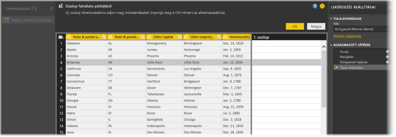
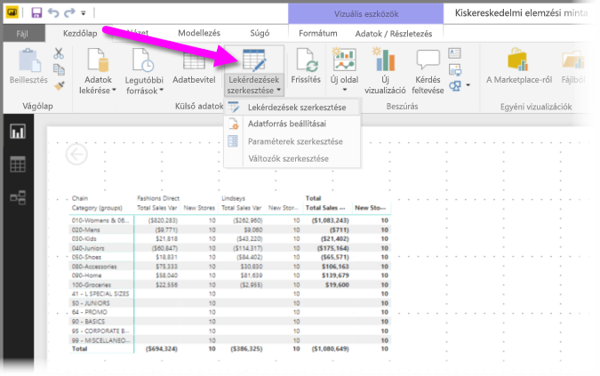
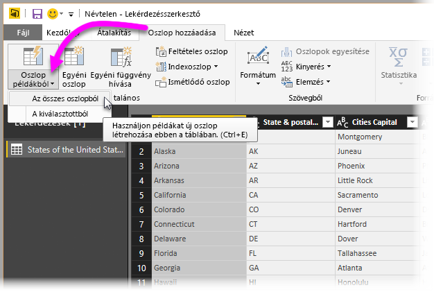
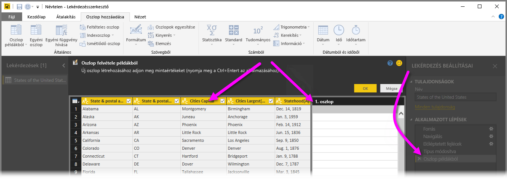
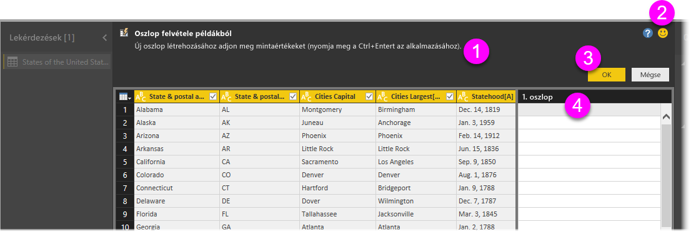
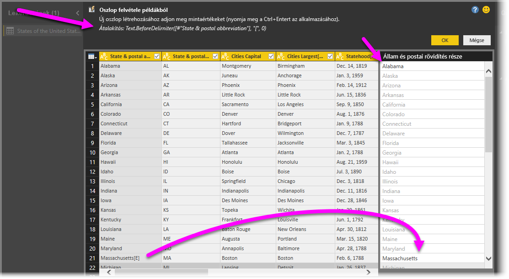

# Oszlop hozzáadása példából a Power BI Desktopban
A **Power BI Desktop** 2017. áprilisi kiadásától kezdve a **Lekérdezésszerkesztő** használatával új adatoszlopokat adhat a modellhez úgy, hogy egyszerűen megad egy vagy több mintaértéket az új oszlop számára. Létrehozhat új példaoszlopot az aktuális kijelölésnek megfelelően, vagy az adott táblában található összes oszlop (vagy csak a kijelölt oszlopok) alapján történő bemeneti értékek megadásával.

Így gyorsan és egyszerűen hozhat létre új oszlopokat, ami a következő helyzetekben lehet igazán hasznos:

* Ismeri az új sorban eredményül kapni kívánt adatokat, de nem tudja, hogy mely átalakítással (vagy átalakításegyüttessel) érheti el azt.
* Tudja, hogy melyik átalakításra van szüksége, de nem biztos abban, hogy hova kell kattintania vagy melyik elemet kell kiválasztania a felhasználói felületen ennek eléréséhez.
* Mindent tud a szükséges átalakításokról egy *Egyéni oszlop* kifejezés használatával az **M**-ben, de e kifejezések közül egy (vagy több) nem kattintható vagy nem adható hozzá a felhasználói felületen.

Az **Oszlop felvétele példákból** funkció használata egyszerű és átlátható. A következő néhány szakaszban bemutatjuk, hogy mennyire egyszerű is.

## A Lekérdezésszerkesztő használata egy új oszlop példából történő felvételére
Egy új oszlop példából történő létrehozásához indítsa el a **Lekérdezésszerkesztőt**. Ehhez kattintson a **Power BI Desktop** **Kezdőlap** szalagján a **Lekérdezések szerkesztése** gombra.

Ebben a cikkben a következő Wikipedia-cikk adatait használjuk (ez egy hivatkozás, amelyre rákattintva saját maga is lekérheti az adatokat, és követheti a folyamatot):

* [**Az Amerikai Egyesült Államok államai**](https://wikipedia.org/wiki/List_of_states_and_territories_of_the_United_States)

A **Lekérdezésszerkesztő** elindítását követően a rendszer betölt bizonyos adatokat, így máris megteheti az első lépéseket az oszlopok példákból történő felvételéhez. Egy új oszlop hozzáadásához a **Lekérdezésszerkesztőben** kattintson az **Oszlop hozzáadása** lapra a menüszalagon, majd válassza az **Oszlop példákból** lehetőséget. A legördülő listából választhatja **Az összes oszlopból** (ez az alapértelmezett beállítás, ha a legördülő lista helyett a gombra kattint) vagy **A kiválasztásból** beállítást is. Ebben a cikkben **Az összes oszlopból** beállítás kiválasztásával mutatjuk be a folyamatot.

## Az Oszlop felvétele példákból panel
Miután elvégezte a kijelölést az új oszlop példákból történő hozzáadásához, egy új panelen megjelennek az aktuális táblázat oszlopai (görgetéssel tekintheti meg az összeset). Egy új **Column1** oszlop is megjelenik a jobb oldalon – ez az az oszlop, amelyet a **Power BI Desktop** a példák alapján létre fog hozni. Az új **Column1** oszlop fejléce alatt található üres cellákba beírhatja azokat a példákat, amelynek alapján a Power BI szabályokat és átalakításokat hoz létre a példával való megfeleltetéshez.

Vegye észre azt is, hogy ez egy **Alkalmazott lépés** a **Lekérdezés beállításai** panelen. Mint mindig, a **Lekérdezésszerkesztő** rögzíti az átalakítás lépéseit, és sorrendben alkalmazza azokat a lekérdezésen.

Ennek neve **Oszlop felvétele példákból** panel, amelyhez négy fő terület tartozik:

1. A **Parancssáv**, amely a funkció vagy az átalakítás rövid leírását tartalmazza.
2. A **Visszajelzés küldése** lehetőség, amellyel segítheti a Power BI-t a funkció továbbfejlesztésében.
3. Az **OK** és a **Mégse** gombok, amelyek segítségével véglegesítheti az átalakításokat vagy az oszlop hozzáadását, illetve megszakíthatja a műveletet.
4. Az új oszlopterület, ahol bármelyik sorba beírhatja a mintaértékeket (így adva meg a példát a Power BI számára) az adott sor más oszlopaihoz képest.

A példának az oszlopba történő beírása során a Power BI az észlelt átalakítások alapján megjeleníti az éppen létrehozás alatt álló oszlop előnézetét. Itt például az első sorba az *Alabama* kifejezést írjuk be, a tábla első oszlopa *Alabama* értékének megfelelően. Az *Enter* billentyű lenyomásakor a Power BI a fenti érték alapján tölti ki az oszlopot.

Ezután azonban visszatérünk a *Massachusetts[E]* értéket tartalmazó sorhoz, és töröljük az utolsó *[E]* karaktert (mivel nincs rá szükség). A Power BI ekkor észleli a módosítást, és a példa alapján átalakítást hoz létre. A középső fenti panelen megtekintheti az átalakítás magyarázatát.

Újabb példák megadásakor a **Lekérdezésszerkesztő** újabb átalakításokat végez. Ha elégedett, az **OK** lehetőség kiválasztásával véglegesítheti a módosításokat.

## Az Oszlop felvétele példákból művelet működése
Szeretné működés közben is megtekinteni? Az alábbi videó a funkció használatát mutatja be a jelen példa korábbi részében megadott adatforrás használatával. Figyelje meg, és kövesse a lépéseket!

<iframe width="560" height="315" src="https://www.youtube.com/embed/-ykbVW9wQfw" frameborder="0" allowfullscreen></iframe>

## Megfontolandó szempontok és korlátozások
Számos átalakítás érhető el az **Oszlop felvétele példákból** funkció használatakor, de nem mindegyik támogatott. A *támogatott* átalakításokat az alábbi lista tartalmazza.

* **Referencia**
  
  * Hivatkozás egy adott oszlopra (beleértve a levágás, a törlés, valamint a kis- és nagybetűkre vonatkozó átalakításokat is)

* **Szövegátalakítások**
  
  * Egyesítés (támogatja a szövegkonstansok és a teljes oszlop értékeinek egyesítését)
  * Csere
  * Hossz
  * Kinyerés   
    * Első karakterek
    * Utolsó karakterek
    * Tartomány
    * Határolójel előtti szöveg
    * Határolójel utáni szöveg
    * Határolójelek közötti szöveg
    * Hossz

* Az alábbi támogatott **szövegátalakítások** a **Power BI Desktop** 2017. novemberi kiadásától kezdve érhetőek el:
    
  * Karakterek eltávolítása
  * Karakterek megtartása

> [!NOTE]
> Valamennyi *szöveg*átalakítás figyelembe veszi az oszlop értékének levágására, törlésére vagy a kis- és nagybetűkre vonatkozó lehetséges átalakítási igényét.
> 
> 

* **Dátumátalakítások**
  
  * Nap
  * Hét napja
  * Hét napjának neve
  * Év napja
  * Hónap
  * Hónap neve
  * Év negyedéve
  * Hónap hete
  * Év hete
  * Év
  * Kor
  * Év kezdete
  * Év vége
  * Hónap kezdete
  * Hónap vége
  * Negyedév kezdete
  * Hónap napjainak száma
  * Negyedév vége
  * Hét kezdete
  * Hét vége
  * Hónap napja
  * Nap kezdete
  * Nap vége

* **Időpont-átalakítások**
  
  * Óra
  * Perc
  * Másodperc  
  * Helyi időre

> [!NOTE]
> Valamennyi *dátum*- és *időpont*átalakítás figyelembe veszi az oszlop értékének *Dátum*, *Idő* vagy *Dátum/idő* értékre történő konvertálásának lehetséges igényét.
> 
> 

* **Számátalakítások** 

  * Abszolút érték
  * Arkusz koszinusz
  * Arkusz szinusz
  * Arkusz tangens
  * Konvertálás számmá
  * Koszinusz
  * Köbre emelés
  * Osztás
  * Kitevő
  * Faktoriális
  * Egész szám osztása
  * Páros
  * Páratlan
  * Természetes logaritmus
  * 10-es alapú logaritmus
  * Moduló
  * Szorzás
  * Kerekítés lefelé
  * Kerekítés felfelé
  * Előjel
  * Szinusz
  * Négyzetgyök
  * Négyzetre emelés
  * Kivonás
  * Összeg
  * Tangens

* Az alábbi támogatott **számátalakítások** a **Power BI Desktop** 2017. novemberi kiadásától kezdve érhetőek el:

  * Gyűjtés/Tartományok

* **Általános**
  
  * Feltételes oszlop