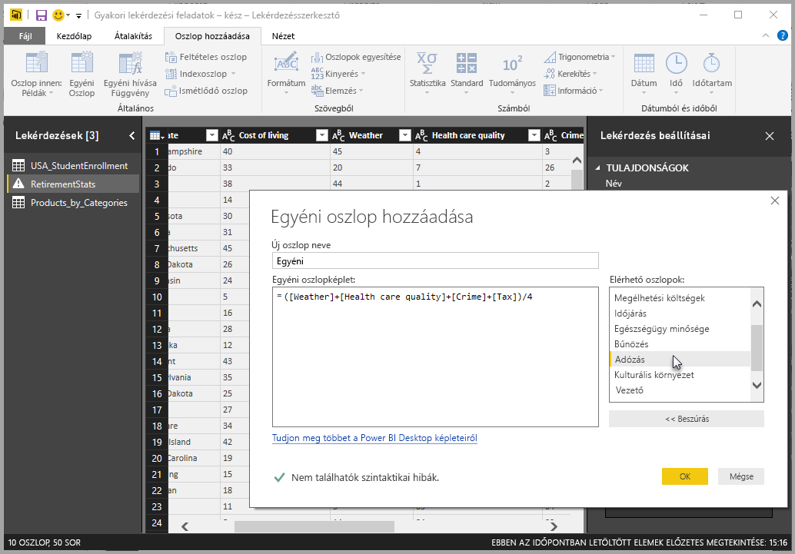
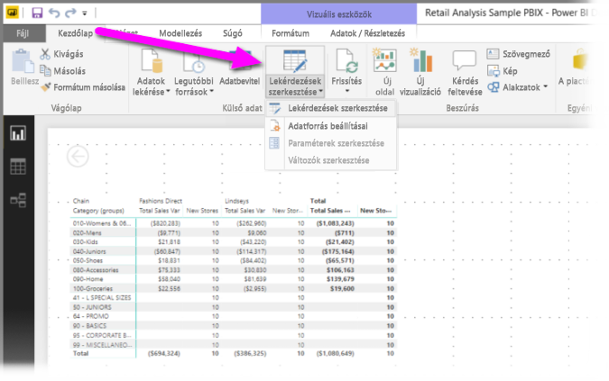
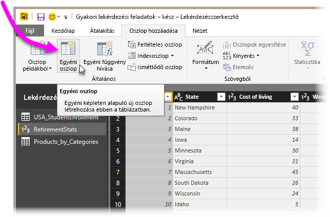
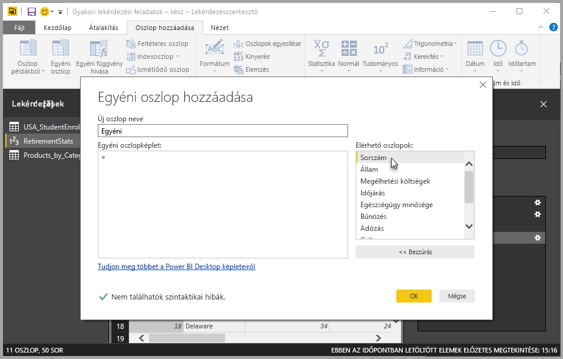
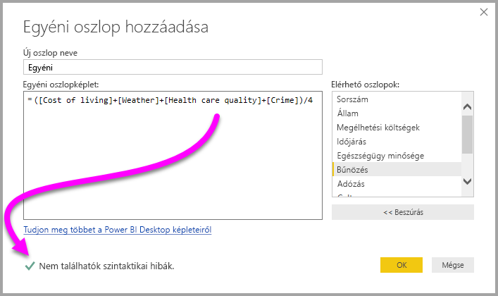
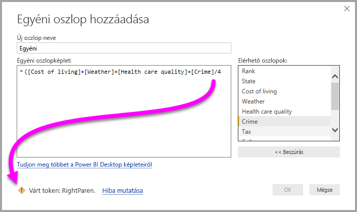
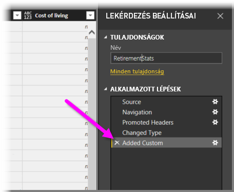
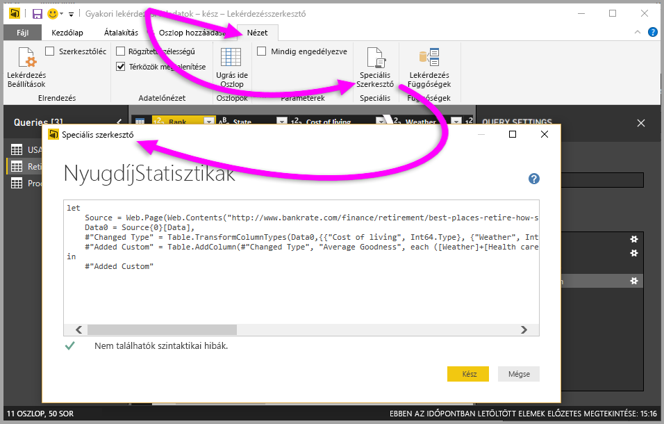

# Egyéni oszlop hozzáadása a Power BI Desktopban
A **Power BI Desktop** **Lekérdezésszerkesztőjével** egyszerűen adhat hozzá új egyéni adatoszlopokat a modellekhez. Ha egyéni oszlopokat szeretne létrehozni vagy átnevezni, egyszerű gombműveletekkel az egyéni oszlopot definiáló [M képleteket](https://msdn.microsoft.com/library/mt270235.aspx) hozhat létre. Az M képlet egy [átfogó függvényreferencia-tartalomkészlettel](https://msdn.microsoft.com/library/mt779182.aspx) rendelkezik. 

Az egyéni oszlopok létrehozása is a **Lekérdezésszerkesztőben** létrehozott lekérdezés egy **Alkalmazott lépése**, ami azt jelenti, hogy bármikor cserélhetők, előre-hátra mozgathatók vagy módosíthatók.

## Új egyéni oszlop hozzáadása a Lekérdezésszerkesztővel
Új egyéni oszlop létrehozásához indítsa el a **Lekérdezésszerkesztőt**. Ehhez kattintson a **Power BI Desktop** **Kezdőlap** szalagján a **Lekérdezések szerkesztése** gombra.

Miután elindította a **Lekérdezésszerkesztőt** és betöltött néhány adatot, egyéni oszlop hozzáadásához válassza a szalag **Oszlop hozzáadása** szakaszát, majd az **Egyéni oszlop lehetőséget**.

Ekkor megnyílik az **Egyéni oszlop hozzáadása** ablak, amelyet a következő szakaszban ismertetünk.

## Az Egyéni oszlop hozzáadása ablak
Az **Egyéni oszlop hozzáadása** ablak jobb oldali panelén az elérhető mezők listája látható, felül az egyéni oszlop nevével (ha át szeretné nevezni, csak írja be az új nevet a szövegmezőbe), valamint az új egyéni oszlopot definiáló [**M** képlettel](https://msdn.microsoft.com/library/mt779182.aspx), amelyet a jobb oldali mezők beillesztésével, operátorok hozzáadásával és egyéb módszerekkel hozhat létre (vagy írhat meg). 

## Képletek létrehozása az egyéni oszlopokhoz
Ha kijelöl egy mezőt a jobb oldali **Elérhető oszlopok:** listában, a **<< Beszúrás** gombbal adhatja hozzá az egyéni oszlop képletéhez. A hozzáadáshoz az is elég, ha a listában duplán az oszlop nevére kattint.

A képlet beírása és az oszlop létrehozása során az ablak alján valós időben láthatja (a beírás közben), hogy a rendszer észlel-e szintaxishibát. Ha minden rendben, egy zöld pipa látható.

Ha a szintaxis valamilyen hibát tartalmaz, egy sárga figyelmeztető ikon jelenik meg az észlelt hibával együtt, valamint egy hivatkozás, amely a kurzort a hiba helyére irányítja (a képletben).

Az **OK** gombra kattintva a rendszer hozzáadja az egyéni oszlopot a modellhez, és az **Egyéni oszlop hozzáadva** lépéssel kiegészíti a lekérdezés **Alkalmazott lépéseit**.

Ha duplán az **Egyéni oszlop hozzáadva** lépésre kattint az **Alkalmazott lépések** panelen, újra megnyílik az **Egyéni oszlop hozzáadása** ablak, amelyben az egyéni oszlop létrehozott képlete már be van töltve, és szükség esetén azonnal módosítható.

## A Speciális szerkesztő használata egyéni oszlopokhoz
A **Speciális szerkesztővel** is létrehozhat egyéni oszlopot (és módosíthatja a lekérdezés bármely lépését). A **Lekérdezésszerkesztőben** válassza a **Nézet** lapot, majd válassza a **Speciális szerkesztő** lehetőséget a **Speciális szerkesztő** megjelenítéséhez.

A **Speciális szerkesztő** teljes körű vezérlését biztosít a lekérdezés felett.

## Következő lépések
Egyéb módokon is létrehozhat egyéni oszlopot, például a **Lekérdezésszerkesztőben** megadott példák alapján. A következő cikkben további információt talál az egyéni oszlopok példákból való létrehozásáról:

* [Oszlop hozzáadása példából a Power BI Desktopban](desktop-add-column-from-example.md)
* [Bevezetés az M-képletes nyelvbe](https://msdn.microsoft.com/library/mt270235.aspx)
* [Az M-függvény segédanyagai](https://msdn.microsoft.com/library/mt779182.aspx)  

