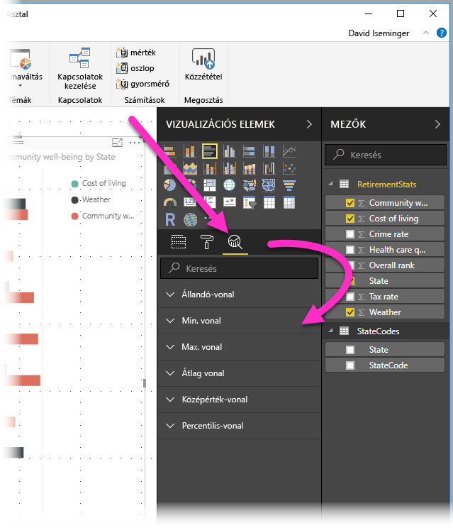
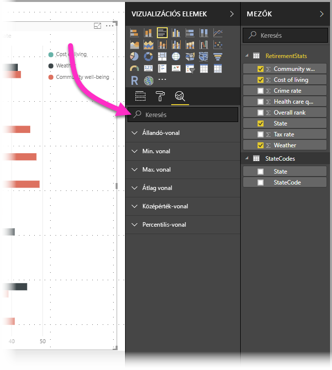
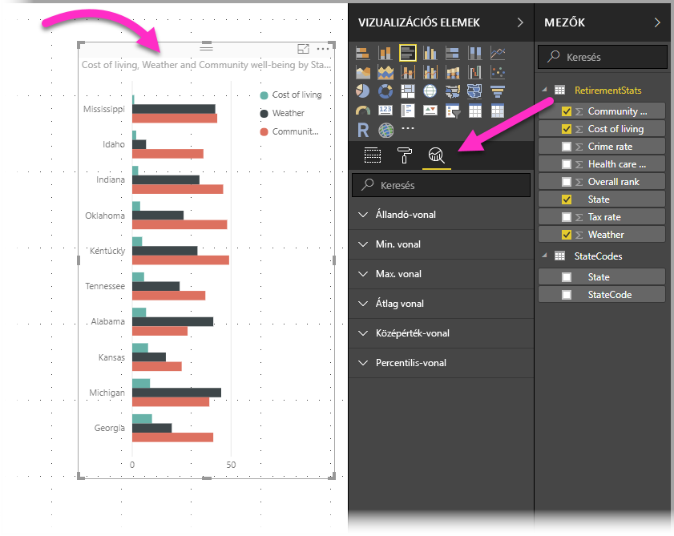
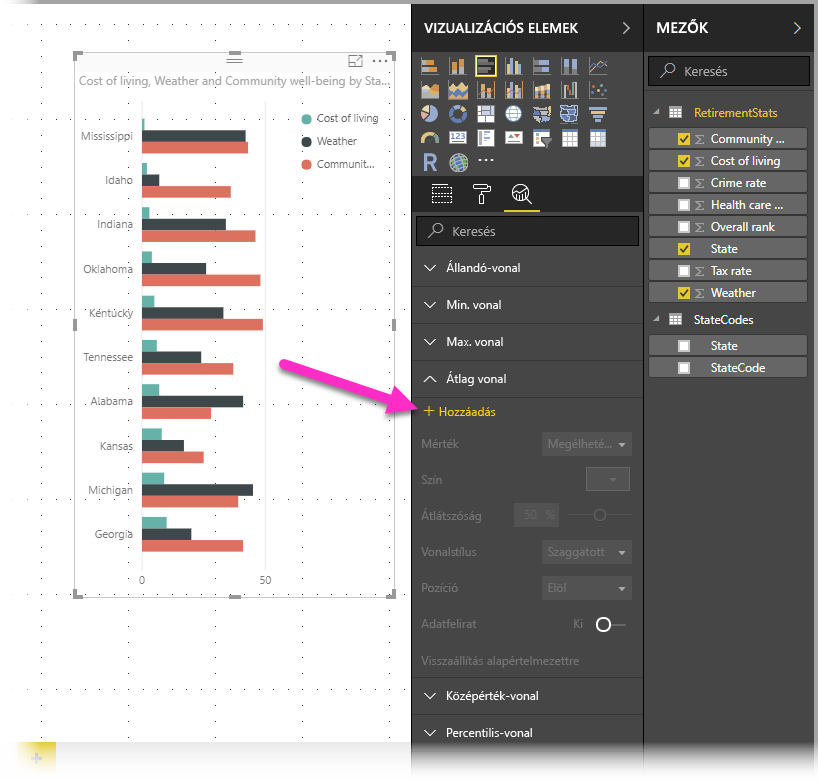
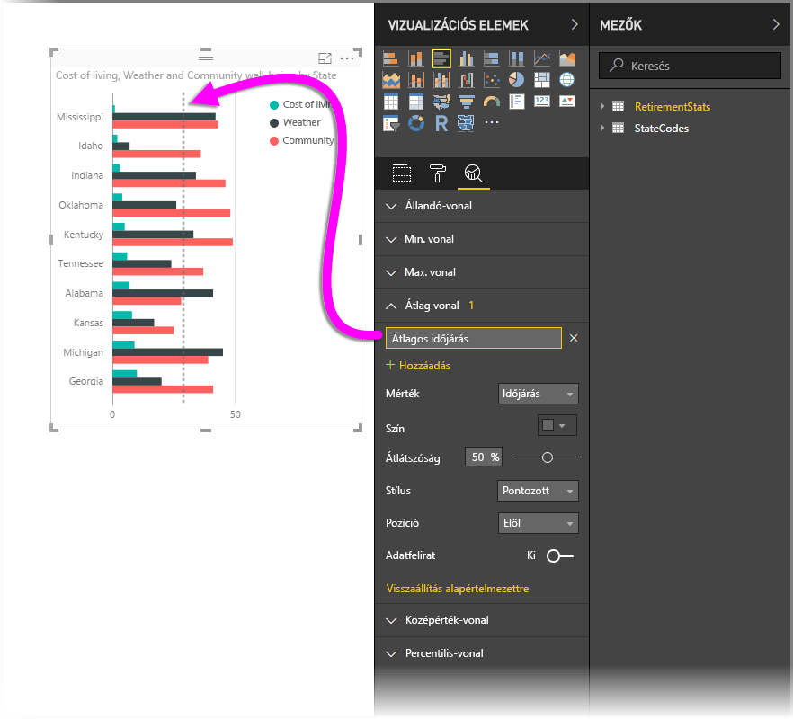
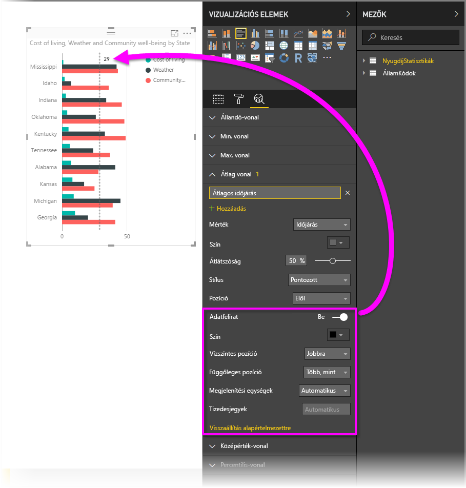
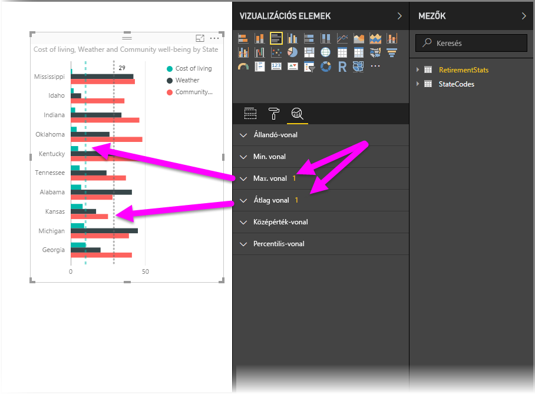
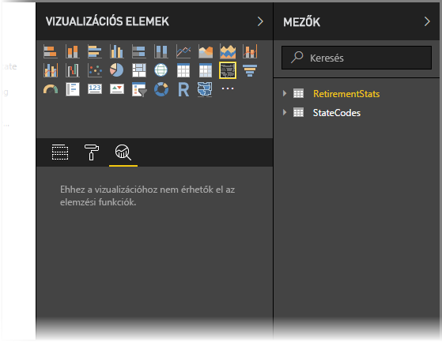

# Az Elemzés panel használata a Power BI Desktopban
A **Power BI Desktop** **Elemzés** paneljén dinamikus *referenciavonalak* adhatók hozzá a vizualizációkhoz, így irányítva rá a figyelmet a fontos trendekre vagy elemzésekre. Az **Elemzési** panel a Power BI Desktop **Vizualizációs elemek** területén található.

> [!NOTE]
> Az **Elemzés** panel csak akkor jelenik meg, ha a Power BI Desktop vásznán kiválaszt egy vizualizációt.

## Keresés az Elemzési panelen
A **Power BI Desktop** 2018. februári kiadásától kezdve (2.55.5010.201-es vagy újabb verzió) a **Vizualizációs elemek** panelen alszakaszként megtalálható **Elemzési** panelen is végezhető keresés. Ahogy az alábbi képen látható, az **Elemzési** panel kiválasztásakor megjelenik egy keresőmező is.

## Az Elemzés panel használata
Az **Elemzés** panelen a következő típusú dinamikus referenciavonalak hozhatók létre (nem mindegyik vonal érhető el az összes vizualizációtípushoz):

* Állandó-vonal az X tengelyen
* Állandó-vonal az Y tengelyen
* Min. vonal
* Max. vonal
* Átlagos vonal
* Középérték-vonal
* Percentilis-vonal

Az alábbi szakaszok az **Elemzés** panel és a dinamikus referenciavonalak vizualizációkban történő használatát mutatják be.

Az adott vizualizáció esetében rendelkezésre álló dinamikus referenciavonalak megtekintéséhez hajtsa végre a következő lépéseket:

1. Válasszon ki vagy hozzon létre egy vizualizációt, majd válassza ki az **Elemzés** ikont a **Vizualizációk** szakaszban.
   
   
2. Válassza ki a létrehozni kívánt vonaltípushoz tartozó lefelé mutató nyilat a beállítások körének kibontásához. Ebben az esetben most az **Átlagos vonal** típust választjuk.
   
   
3. Új vonal létrehozásához válassza a **+ Hozzáadás** lehetőséget. Ezt követően megadhatja a vonal nevét úgy, hogy duplán kattint a szövegmezőre, majd begépeli a nevet.
   
   Számos beállítási lehetőség áll rendelkezésére a vonalhoz kapcsolódóan, például kiválaszthatja annak *színét*, *átlátszóságát*, *stílusát* és *pozícióját* (a vizualizáció adatelemeihez képest), valamint megadhatja, hogy kívánja-e feliratozni. Lényeges továbbá, hogy kiválaszthatja a vonal alapjául szolgáló **Mértéket** a vizualizáción a **Mérték** legördülő lista kiválasztásával, amelyet a rendszer automatikusan feltölt a vizualizáció adatelemeivel. Ebben az esetben mértékként a *Weather* (Időjárás) elemet választjuk ki, ehhez az *Average Weather* (Átlagos időjárás) feliratot rendeljük, és az alább látható módon testreszabunk néhány egyéb beállítást is.
   
   
4. Ha adatfeliratot kíván megjeleníteni, mozgassa az **Adatfelirat** csúszkát bekapcsolt állásba. Ekkor rengeteg, az adatfelirathoz kapcsolódó beállítás jelenik meg az alábbi képen látható módon.
   
   
5. Az **Elemzés** panel **Átlagos vonal** eleme mellett egy szám jelenik meg. Ez a szám azt mutatja meg, hogy jelenleg hány dinamikus vonal található a vizualizáción, és hogy ezek milyen típusúak. Ha felveszünk egy **Max. vonalat** a *Cost of Living* (Megélhetési költség) elemhez, az **Elemzés** panelen az látható, hogy már egy **Max. vonal** dinamikus referenciavonalat is alkalmaztunk erre a vizualizációra.
   
   

Ha a kiválasztott vizualizációra nem lehet dinamikus referenciavonalat alkalmazni (ebben az esetben a **Térkép** vizualizációról van szó), akkor az **Elemzés** panelre kattintva az alábbiakat fogja látni.

Sokféle érdekes elemzést emelhet ki dinamikus referenciavonalak létrehozásával az **Elemzés** panelen.

További funkciók és képességek bevezetését tervezzük, így például azon vizualizációk körének kiszélesítését, amelyeken dinamikus referenciavonalak alkalmazhatók. Érdemes tehát gyakran visszalátogatni ide az újdonságokért.

## Előrejelzés alkalmazása
Az **Előrejelzés** funkció alkalmazása úgy történik, hogy kiválaszt egy vizualizációt, majd kibontja az **Előrejelzés** szakaszt az **Elemzés** panelen. Az Előrejelzést számos bemeneti paraméter megadásával módosíthatja, ilyen lehet például az *Előre jelzett hossz* vagy a *Megbízhatósági intervallum*. Az alábbi képen egy alapszintű vonaldiagram látható, amelyen előrejelzést alkalmaztunk, de csak a képzelete szabhat határt annak (és az *Előrejelzés* funkció teljes körű kipróbálása), hogy hányféleképpen alkalmazhatja azt a modelljeire.

## Korlátozások
A dinamikus referenciavonalak használatának lehetősége az éppen használt vizualizáció típusán alapul. Az alábbi listában az egyes vizualizációkhoz jelenleg rendelkezésre álló dinamikus vonalak vannak felsorolva:

A dinamikus vonalak teljes körű alkalmazása a következő vizualizációk esetében lehetséges:

* Területdiagram
* Vonaldiagram
* Pontdiagram
* Fürtözött oszlopdiagram
* Fürtözött sávdiagram

A következő vizualizációk esetében csak az *Állandó-vonal* típus érhető el az **Elemzés** panelen:

* Halmozott terület
* Halmozott sáv
* Halmozott oszlop
* 100%-ig halmozott sáv
* 100%-ig halmozott oszlop

A következő vizualizációk esetében csak a *Trendvonal* típus érhető el:

* Nem halmozott vonal
* Fürtözött oszlopdiagram

Végül pedig a nem Descartes-féle vizualizációk esetében jelenleg nem alkalmazhatók dinamikus vonalak az **Elemzés** panelen. Ilyen vizualizációk például:

* Mátrix
* Tortadiagram
* Gyűrű
* Tábla

A percentilis vonal csak akkor áll rendelkezésre, ha importált adatokat használ a **Power BI Desktop** alkalmazásban, vagy ha élő kapcsolatban van az **Analysis Service 2016** vagy újabb verzióját vagy az **Azure Analysis Services** szolgáltatást futtató kiszolgálón található modellel vagy a Power BI szolgáltatásban egy adatkészlettel. 

## Következő lépések
A Power BI Desktop műveletek és lehetőségek széles tárházát tartalmazza. A program képességeivel kapcsolatos további információkért lásd az alábbi forrásanyagokat:

* [A Power BI Desktop újdonságai](desktop-latest-update.md)
* [A Power BI Desktop letöltése](desktop-get-the-desktop.md)
* [Első lépések a Power BI Desktopban](desktop-getting-started.md)
* [Lekérdezések áttekintése a Power BI Desktopban](desktop-query-overview.md)
* [Adattípusok a Power BI Desktopban](desktop-data-types.md)
* [Adatok formázása és kombinálása a Power BI Desktoppal](desktop-shape-and-combine-data.md)
* [Gyakori lekérdezési feladatok a Power BI Desktopban](desktop-common-query-tasks.md)    

