# Elemzések megosztása és történetek felépítése a Power BI könyvjelzőivel 
A Power BI-ban a **könyvjelzők** használatával rögzítheti az egyes jelentésoldalak aktuális nézetkonfigurációját, beleértve a szűréseket és a vizualizációk állapotát, hogy később egyszerűen a mentett könyvjelzőre kattintva visszaállíthassa az adott állapotot. 

Egy tetszőleges sorrendbe rendezett teljes könyvjelzőgyűjteményt is létrehozhat, majd ezeket sorban megnyitva egy olyan bemutatót állíthat össze, amelyben lényegi összefüggések sorozatát mutathatja be, vagy előadhatja azt a történetet, amelyet a vizualizációkkal és a jelentésekkel be szeretne mutatni. 

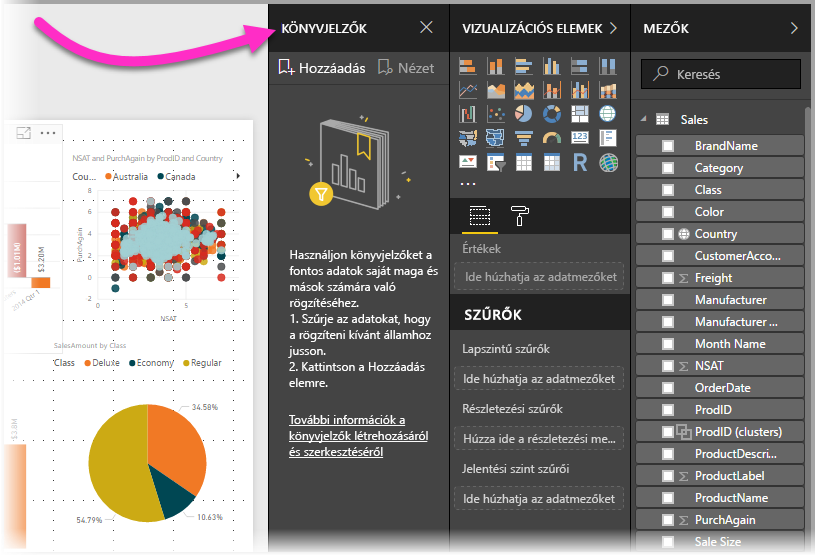

A könyvjelzőknek rengeteg felhasználási módja létezik. A segítségükkel nyomon követheti, hogy hol tart épp a jelentések készítésében (a könyvjelzők hozzáadása, törlése és átnevezése nem bonyolult dolog), illetve létrehozhat belőlük egy PowerPoint-szerű bemutatót is, amely a könyvjelzőkön végigléptetve bemutat egy történetet a jelentésen keresztül. Természetesen más alkalmazási területek is elképzelhetőek aszerint, hogy Ön mire szeretné leginkább használni a könyvjelzőket.

### A könyvjelzők előzetes verziójának engedélyezése (a 2018. márciusinál korábbi verziók esetében)
A Power BI Desktop 2018. márciusi verziójától kezdve a könyvjelzőkezelési funkció általánosan elérhető. 

Mindig ajánlott a legújabb kiadásra frissíteni. Ha mégis a Power BI Desktop korábbi verzióját használja, a **könyvjelzőkezelési** funkció a **2017. októberi** kiadással vált elérhetővé a **Power BI Desktopban**, valamint a könyvjelző-kompatibilis jelentésekben a **Power BI szolgáltatásban**. Az előzetes verziójú funkció engedélyezéséhez válassza a **Fájl > Lehetőségek és beállítások > Beállítások > Előzetes verziójú funkciók** lehetőséget, majd jelölje be a **Könyvjelzők** elem melletti jelölőnégyzetet. 

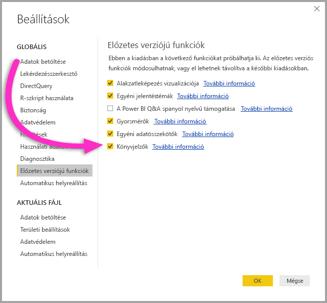

A könyvjelzőkezelési funkció előzetes verziójának engedélyezése után újra kell indítania a **Power BI Desktopot**.

## A könyvjelzők használata
A könyvjelzők használatához lépjen a **Nézet** menüszalagra, majd jelölje be a **Könyvjelzők panel** jelölőnégyzetét. 

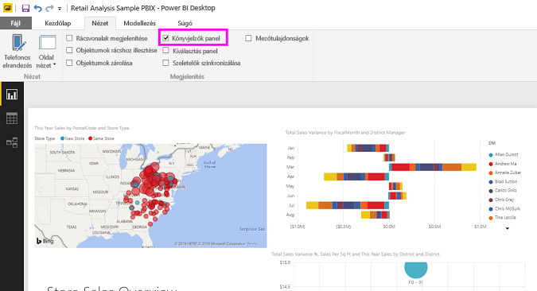

A létrehozott könyvjelzőkhöz a rendszer a következő elemeket menti:

* Az aktuális oldal
* Szűrők
* Szeletelők
* A rendezés iránya
* A részletezés helye
* Láthatóság (az egyes objektumoké, a **Kiválasztás** panel használatával)
* A látható objektumok fókusz vagy **Reflektorfény** módja

A könyvjelzők jelenleg még nem mentik a keresztkiemelési állapotokat. 

Állítson be egy jelentésoldalt úgy, amilyen állapotban a könyvjelzővel menteni szeretné. Miután a jelentésoldalt és a vizualizációkat a kívánt módon elrendezte, a könyvjelző hozzáadásához válassza a **Könyvjelzők** panel **Hozzáadás** gombját. 

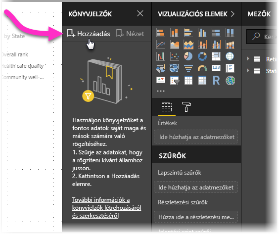

A **Power BI Desktop** létrehoz egy könyvjelzőt, amelynek egy általános nevet ad. A könyvjelzőket könnyen *átnevezheti*, *törölheti* vagy *frissítheti*, ha a könyvjelző neve melletti három pontra kattint, majd kiválasztja a megfelelő műveletet a megjelenő menüből.

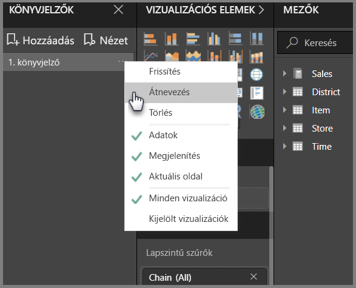

Miután létrehozott egy könyvjelzőt, a megjelenítéséhez egyszerűen kattintson rá a **Könyvjelzők** panelen. 

Azt is megadhatja, hogy az egyes könyvjelzők alkalmazzák-e az *adattulajdonságokat*, például a szűrőket és a szeletelőket, valamint a *megjelenítési* tulajdonságokat, például a reflektorfényt és annak láthatóságát, illetve a könyvjelző hozzáadásakor látható oldalt bemutató oldalmódosításokat. Ezek a funkciók akkor lehetnek hasznosak, ha könyvjelzőkkel szeretne váltani a vizualizációtípusok között – ekkor ugyanis célszerű kikapcsolni az adattulajdonságokat, így a szűrők nem állnak alaphelyzetbe, ha a felhasználók módosítják a vizualizációtípusokat. 

A módosítások elvégzéséhez kattintson a könyvjelző neve melletti három pontra (ahogyan azt az előző képen láthatja), majd jelölje be vagy törölje a jelölést az *Adatok*, *Megjelenítés*, és egyéb vezérlők jelölőnégyzeteiből. 

## A könyvjelzők rendezése
Előfordulhat, hogy a könyvjelzőket nem olyan sorrendben hozza létre, amilyenben aztán be szeretné őket mutatni. Ez nem jelent problémát, mivel a könyvjelzőket könnyedén átrendezheti.

A **Könyvjelzők** panelen egyszerűen húzza át a könyvjelzőket a megfelelő sorrendbe, amint az alábbi képen is látható. A könyvjelzők közötti sárga vonal jelzi a helyet, ahová az elhúzott könyvjelző kerülni fog.

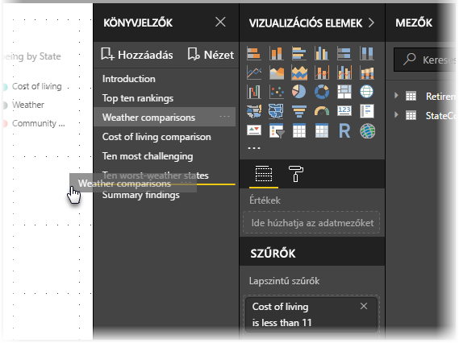

A könyvjelzők sorrendje a könyvjelzők **Nézet** funkciójának használatakor nyer jelentőséget, amint arra a következő szakasz kitér.

## Diavetítés a könyvjelzőkkel
Ha van több könyvjelzője, amelyeket sorrendben be szeretne mutatni, a **Könyvjelzők** panel **Nézet** gombjának kiválasztásával indíthatja el a diavetítést.

A **Nézet** módban érdemes odafigyelni a következőkre:

1. A könyvjelző neve a könyvjelző címsorában látható a vászon alján.
2. A könyvjelző címsorában lévő nyilakkal léptethet előre és hátra a könyvjelzők között.
3. A **Nézet** módból a **Könyvjelzők** panel **Kilépés** gombjával, vagy a könyvjelzők címsorán található **X** gombbal léphet ki. 

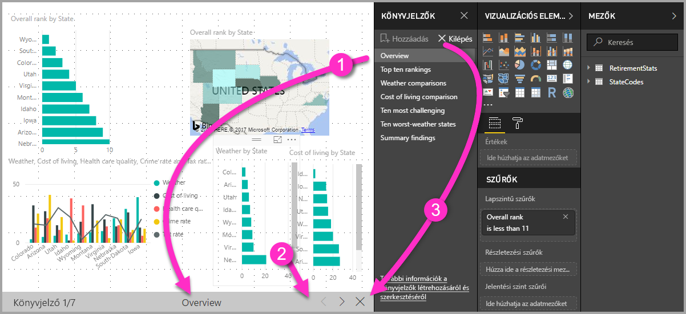

A **Nézet** módban bezárhatja a **Könyvjelzők** panelt (a panel X gombjára kattintva), így több hely marad a bemutatónak. A **Nézet** módban az összes vizualizáció interaktívan kezelhető, és keresztkiemelést is lehet alkalmazni, ahogy a normál használat során is. 

## Láthatóság – a Kiválasztás panel használatával
A könyvjelzőkkel együtt az új **Kiválasztás** panel is bevezetésre kerül. A **Kiválasztás** panel az aktuális oldalon lévő összes objektum listáját jeleníti meg, és lehetővé teszi az egyes objektumok kiválasztását és láthatóságának beállítását. 

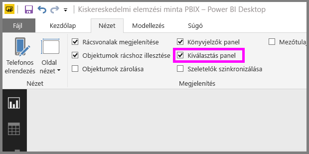

A **Kiválasztás** panelen kiválaszthatja az egyes objektumokat. Az egyes vizualizációk jobb oldalán lévő szem ikonra kattintva azt is ki- és bekapcsolhatja, hogy az adott objektum látható legyen-e. 

A könyvjelzők hozzáadásakor a rendszer az egyes objektumok láthatósági állapotát is menti a **Kiválasztás** panelen megadott beállítások szerint. 

Érdemes megjegyezni, hogy a **szeletelők** a láthatósági állapotuktól függetlenül szűrik a jelentésoldalt. Így számos különböző könyvjelzőt hozhat létre különböző szeletelőbeállításokkal, és az adott jelentésoldal sokféleképpen jelenhet meg (és különböző lényegi összefüggésekre mutathat rá) a különböző könyvjelzőkön.

## Alakzatok és képek könyvjelzői
Alakzatokat és képeket is hozzárendelhet a könyvjelzőkhöz. Ezzel a funkcióval, ha egy objektumra kattint, megjelenik az adott objektumhoz rendelt könyvjelző. Ez különösen hasznos lehet akkor, ha gombokkal dolgozik. Erről további információt a [Gombok használata a Power BI-ban](desktop-buttons.md) című cikkben találhat. 

Egy könyvjelző objektumhoz rendeléséhez jelölje ki az objektumot, majd bontsa ki a **Művelet** szakaszt az **Alakzat formázása** panelen, amint az alábbi képen is látható.

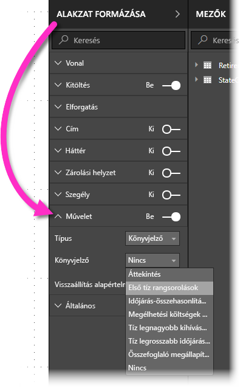

Miután **Be** állásba kapcsolta a **Művelet** kapcsolót, kiválaszthatja, hogy az objektum egy vissza gomb, egy könyvjelző vagy egy Q&A-parancs legyen-e. Ha a könyvjelzőt választja, megadhatja, hogy a meglévő könyvjelzők közül melyikhez legyen az objektum rendelve.

Az objektumokhoz rendelt könyvjelzőknek számos felhasználási módja van. Létrehozhat egy látványos tartalomjegyzéket a jelentésoldalon, vagy egyszerűen az egyes objektumokra kattintva különböző nézeteket (például különféle vizualizációtípusokat) mutathat be ugyanazokról az adatokról.

A szerkesztési módban Ctrl+kattintással nyithatja meg a hivatkozásokat, a szerkesztési módon kívül pedig elég rákattintani az objektumra. 

## A Reflektorfény használata
A könyvjelzőkkel egy időben bevezetett másik funkció a **Reflektorfény**. A **Reflektorfénnyel** felhívhatja például a figyelmet egy adott diagramra, amikor a könyvjelzőket **Nézet** módban mutatja be.

Lássuk, miben különbözik a **Reflektorfény** a **fókusz** módtól.

1. **Fókusz** módban egyetlen vizualizáció tölti ki a teljes vásznat, ha a **fókusz mód** ikonra kattint.
2. A **Reflektorfény** használatával viszont az eredeti méretében emelheti ki a vizualizációt azáltal, hogy az oldalon lévő összes többi vizualizációt majdnem teljesen elhalványítja. 

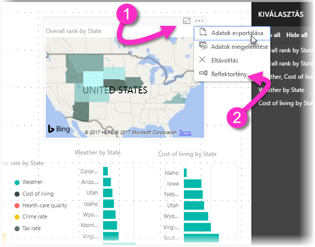

Ha az előző képen látható vizualizáció **fókusz** ikonjára kattintunk, az oldal így fog kinézni:

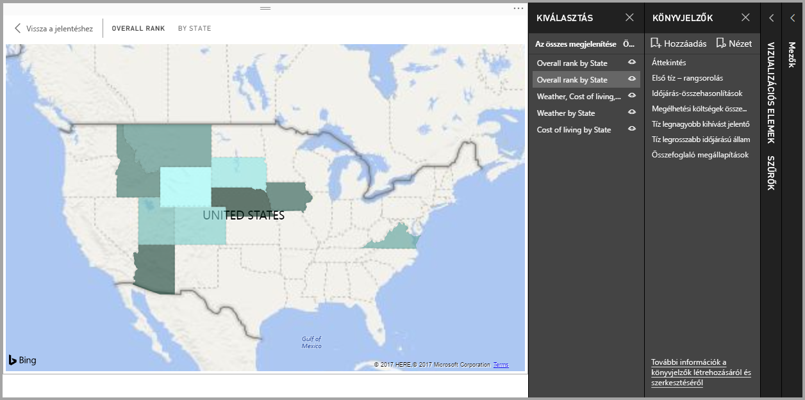

Ezzel szemben, ha a vizualizáció menüjében (...) a **Reflektorfény** elemre kattint, az oldal így néz majd ki:

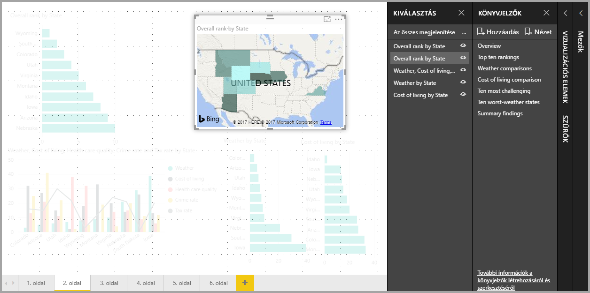

Ha egy könyvjelző hozzáadásakor bármelyik mód (fókusz vagy reflektorfény) be van kapcsolva, a könyvjelző megőrzi a beállítást.

## A könyvjelzők a Power BI szolgáltatásban
Ha egy, a **Power BI szolgáltatásban** közzétett jelentés tartalmaz könyvjelzőket, azokat a **Power BI szolgáltatásban** is megtekintheti és használhatja. Ha a jelentés tartalmaz könyvjelzőket, a vonatkozó paneleket a **Nézet > Kiválasztás panel** vagy a **Nézet > Könyvjelzők panel** kiválasztásával jelenítheti meg.

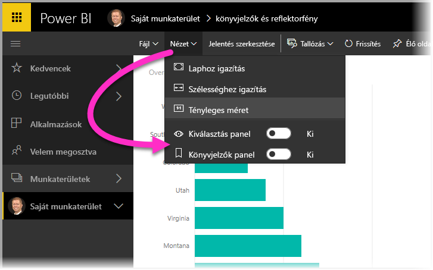

A **Könyvjelzők panel** ugyanúgy működik a **Power BI szolgáltatásban**, mint a **Power BI Desktopban**. Itt is le tudja játszani a könyvjelzőket diavetítésként a **Nézet** kiválasztásával.

Ügyeljen arra, hogy a könyvjelzők között a könyvjelző szürke címsorán léptethet, és nem a fekete nyilakkal, ez utóbbiak ugyanis a jelentésoldalak, és nem a könyvjelzők közötti váltásra szolgálnak.

## Korlátozások és szempontok
A **könyvjelzők** aktuális kiadásának használatára vonatkozik néhány korlátozás és egyéb szempont.

* A legtöbb egyéni vizualizáció zökkenőmentesen működik a könyvjelzőkkel. Ha hibát tapasztal egy könyvjelző és egy egyéni vizualizáció használatakor, lépjen kapcsolatba az egyéni vizualizáció létrehozójával, és kérje meg, hogy szolgáltasson támogatást a könyvjelzőkhöz. 
* Ha egy vizualizációt a könyvjelző létrehozását követően ad hozzá a jelentésoldalhoz, a vizualizáció az alapértelmezett állapotában jelenik meg. Ez azt is jelenti, hogy ha egy olyan oldalra vesz fel szeletelőt, ahol már hozott létre könyvjelzőket, a szeletelő az alapértelmezett állapotának megfelelően viselkedik majd.
* Ha a vizualizációkat a könyvjelzők létrehozását követően áthelyezi, a változást a könyvjelzők lekövetik. 

## Következő lépések
A könyvjelzőkhöz hasonló vagy azokkal együtt használható funkciókkal kapcsolatos részletesebb információkat az alábbi cikkekben talál:

* [Részletezés használata a Power BI Desktopban](desktop-drillthrough.md)
* [Irányítópult-csempe vagy jelentésvizualizáció megjelenítése Fókusz módban](service-focus-mode.md)

