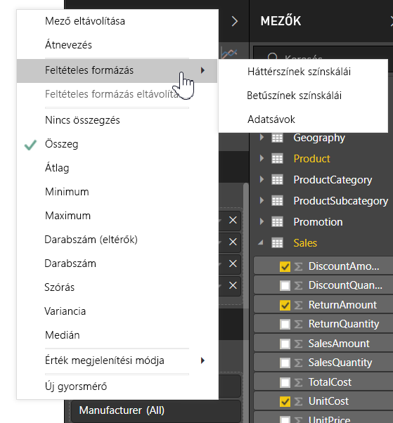
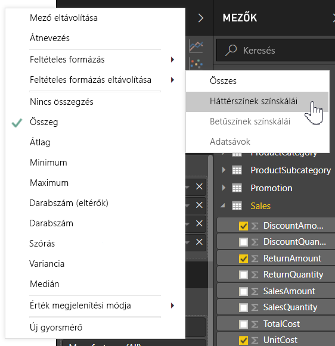
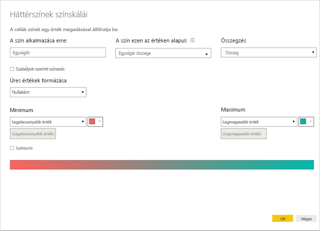
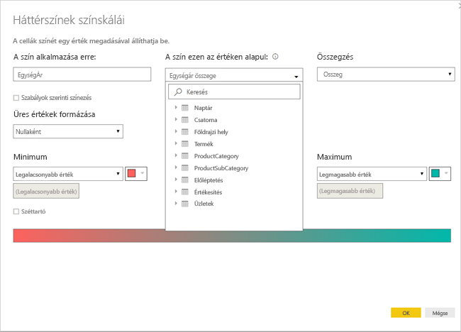
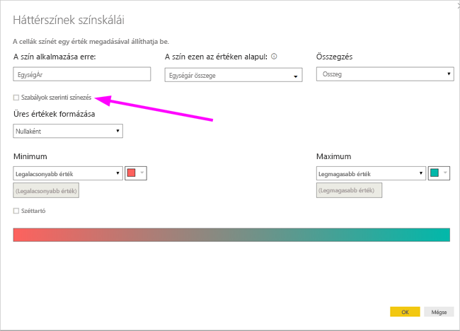
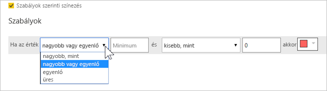
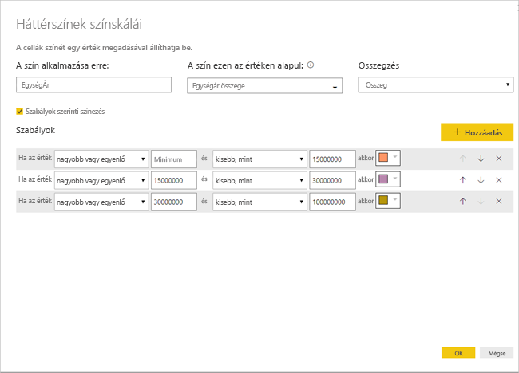
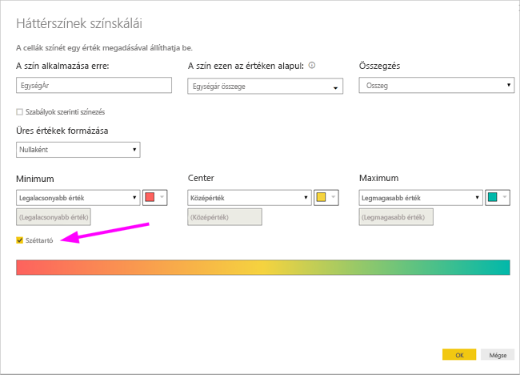
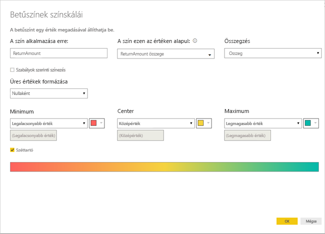

# Táblázatok feltételes formázása 
A táblázatok feltételes formázásával a cellák értéke, illetve más értékek vagy mezők alapján határozhat meg egyéni cellaszíneket, akár színátmenetek használatával is. A cellák értékei adatsávokkal is megjeleníthetők. 

A feltételes formázás használatához a Power BI Desktop **Vizualizációk** ablaktáblájának **Mezők** szakaszában kattintson a lefele mutató nyílra a formázással ellátni kívánt **Értékek** területen (vagy kattintson a jobb gombbal a mezőre). A mezők feltételes formázása kizárólag az **Értékek** terület **Mezők** szakaszában kezelhető.

A következő bekezdések ezt a három feltételes formázási lehetőséget ismertetik. Egy táblázatoszlopban egyszerre több lehetőség is használható.

> [!NOTE]
> A táblázatra alkalmazott feltételes formázás felülír minden, a feltételesen formázott cellákra vonatkozó egyéni táblázatstílust.

A vizualizációk feltételes formázásának törléséhez egyszerűen kattintson újra a mezőre a jobb gombbal, válassza a **Feltételes formázás eltávolítása** lehetőséget, majd válassza ki az eltávolítandó formázástípust.

## Háttérszínek színskálái

A **Feltételes formázás**, majd a **Háttérszínek színskálái** lehetőséget választva a következő párbeszédpanel jelenik meg.

Kijelölhet egy mezőt az adatmodellből a színezés alapjául, ha megadja a mezőt az **A szín ezen az értéken alapul:** beállításnál. Ezen kívül a kiválasztott mező összesítésének típusát is megadhatja az **Összegzés** értékeként. A színezendő mező az **A szín alkalmazása erre:** alatt van megadva, hogy követni tudja a beállításokat. Szöveges és dátummezőkre is alkalmazhat feltételes formázást, ha a formázás alapjául numerikus értéket választ.

Ha külön színeket szeretne használni adott értéktartományokhoz, jelölje be a **Szabályok szerinti színezés** lehetőséget. Színskála használatához hagyja jelöletlenül a **Szabályok szerinti színezés** jelölőnégyzetet. 

### Szabályok szerinti színezés

Ha a **Szabályok szerinti színezés** lehetőséget választja, megadhat egy vagy több értéktartományt, és mindegyikhez beállíthat egy színt.  Minden tartomány egy *Ha az érték* feltétellel kezdődik, és tartozik hozzá egy *és* kapcsolattal megadott feltétel és egy szín.

A táblázat egyes tartományokba eső értékű cellái a megadott színnel jelennek meg. A következő ábrán három szabály látható.

A példához tartozó táblázat ekkor a következőképpen jelenik meg:

### Színezés a minimumtól a maximumig

Megadhatja a *Minimum* és a *Maximum* értékét és a hozzájuk tartozó színeket. A **Széttartó** jelölőnégyzet bejelölése esetén megadhat egy választható *Középértéket* is.

A példához tartozó táblázat ekkor a következőképpen jelenik meg:

## Betűszínek színskálái

A **Feltételes formázás**, majd a **Betűszínek színskálái** lehetőséget választva a következő párbeszédpanel jelenik meg. A párbeszédpanel hasonló a **Háttérszínek színskálái** panelhez, de nem a cellák háttérszínét, hanem a szöveg színét változtatja meg.

A példához tartozó táblázat ekkor a következőképpen jelenik meg:

## Adatsávok

A **Feltételes formázás**, majd az **Adatsávok** lehetőséget választva a következő párbeszédpanel jelenik meg. 

A **Csak sávok megjelenítése** lehetőség alapértelmezés szerint nincs bejelölve, így a cellában az adatsáv és a tényleges érték is látható.

Ha a **Csak sávok megjelenítése** lehetőség be van jelölve, akkor a cellában csak az adatsáv látható.

