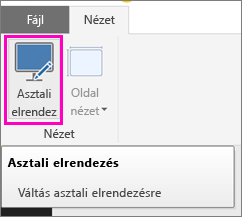
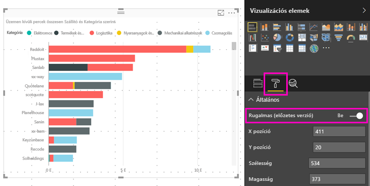

# Power BI-vizualizációk optimalizálása bármely méretre
Beállíthatja, hogy az irányítópulton vagy a jelentésben lévő vizualizációk *rugalmas* elrendezésűek legyenek, és a képernyő méretétől függően dinamikusan a lehető legtöbb adatot és elemzést jelenítsék meg egyszerre.

A vizualizáció méretének változásával a Power BI átrangsorolja az adatnézet elemeit, például eltávolítja a kitöltéseket, vagy automatikusan áthelyezi a jelmagyarázatot a vizualizáció tetejére, hogy az egyre kisebb méretű vizualizáció változatlanul áttekinthető maradjon. Az ilyen rugalmas elrendezés különösen hasznos a telehonokon futó Power BI mobilalkalmazásban lévő vizualizációk esetében.

Bármely X és Y tengellyel és szeletelőkkel rendelkező vizualizáció esetében bekapcsolható a rugalmasság.

## A rugalmasság bekapcsolása a Power BI Desktopban
1. A Power BI Desktop **Nézet** lapján ellenőrizze, hogy **Asztali elrendezésben** van-e.
   
    
2. Válasszon ki egy vizualizációt, majd a **Vizualizációk** ablaktáblán válassza a **Formátum** szakaszt.
3. Bontsa ki az **Általános** elemet, és állítsa a **Rugalmas** kapcsolót **Be** állásba.
   
    
   
     Ekkor [a telefonra optimalizált jelentések létrehozásakor](desktop-create-phone-report.md) ez a vizualizáció szépen átméreteződik a hozzáadás után.

## A rugalmasság bekapcsolása a Power BI szolgáltatásban
Bekapcsolhatja a Power BI szolgáltatás jelentéseiben lévő vizualizáció rugalmasan viselkedjenek. Ehhez szerkesztési jogosultsággal kell rendelkeznie a jelentésben.

1. A Power BI szolgáltatásban ([https://powerbi.com](https://powerbi.com)) válassza a **Jelentés szerkesztése** lehetőséget a jelentésben.
2. Válasszon ki egy vizualizációt, majd a **Vizualizációk** ablaktáblán válassza a **Formátum** szakaszt.
3. Bontsa ki az **Általános** elemet, és állítsa a **Rugalmas** kapcsolót **Be** állásba.
   
    
   
     Ekkor [az irányítópult telefonos nézetének létrehozásakor](service-create-dashboard-mobile-phone-view.md) ez a vizualizáció szépen átméreteződik a hozzáadás után.

## További lépések
* [A Power BI telefonos alkalmazásokhoz optimalizált jelentések létrehozása](desktop-create-phone-report.md)
* [Power BI-irányítópult telefonos nézetének létrehozása](service-create-dashboard-mobile-phone-view.md)
* [Telefonra optimalizált Power BI-jelentések megtekintése](mobile-apps-view-phone-report.md)
* További kérdései vannak? [Kérdezze meg a Power BI közösségét](http://community.powerbi.com/)

