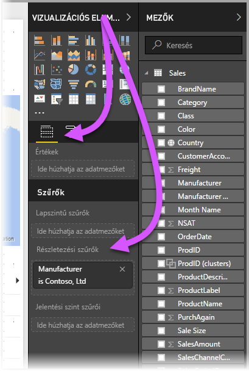
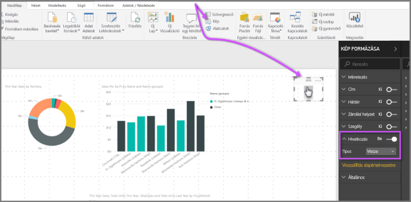
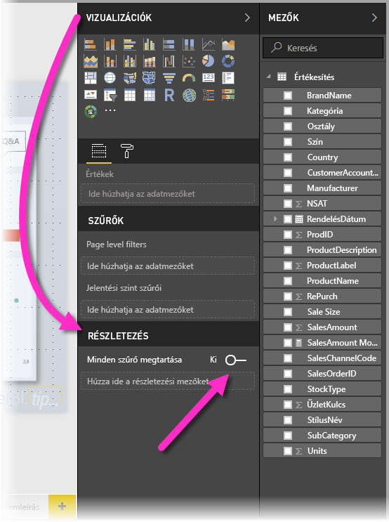
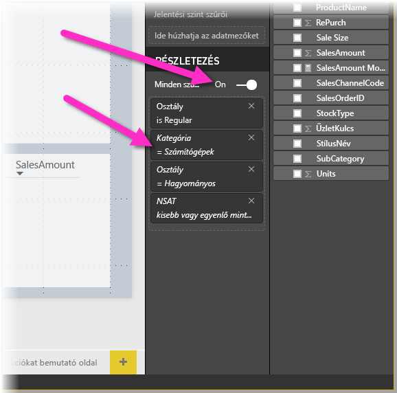
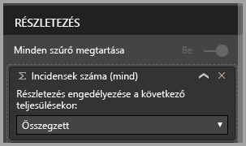

# Részletezés használata a Power BI Desktopban
A **Power BI Desktop** **részletezésével** olyan oldalt hozhat létre a jelentésben, amely adott entitásra összpontosít – például szállítóra, ügyfélre vagy gyártóra. Ezzel az összpontosított jelentésoldallal a felhasználók a jobb gombbal egy adatpontra kattinthatnak más jelentésoldalakon, és áthatolhatnak az összpontosított oldalra az ebben a környezetben szűrt részletek beszerzéséhez.

## A részletezés használata
1. A **részletezés** használatához hozzon létre egy jelentésoldalt, amely az azon entitástípusról megjeleníteni kívánt vizualizációkat tartalmazza, amelyhez a részletezést készíti. 

    Ha például gyártóknak szeretne áthatoló részletezést nyújtani, érdemes lehet olyan áthatoló részletezési oldalt létrehozni, amely az összes értékesítést, az összes kiszállított egységet, a kategória szerinti értékesítéseket, a régió szerinti értékesítéseket és egyebeket megjelenítő vizualizációkkal rendelkezik. Így amikor ehhez az oldalhoz jelenít meg részletezést, a vizualizációk arra a gyártóra fognak vonatkozni, amelyet kiválasztott.

2. Ezután a részletezési oldalon, a **Vizualizáció** panel **Mezők** szakaszában húzza a **Részletezési szűrők** szakaszra azt a mezőt, amelyhez részletezést szeretne készíteni.

    

    Amikor egy mezőt a **Részletezési szűrők** szakaszhoz ad, a **Power BI Desktop** automatikusan létrehoz egy *Vissza* gomb vizualizációt. Ez a vizualizáció gombként működik a közzétett jelentésekben, és lehetővé teszi, hogy a jelentést a **Power BI szolgáltatásban** használó felhasználók könnyedén visszatérjenek a jelentésoldalra, amelyről érkeztek (az oldalra, ahol kiválasztották a részletezést).

    

## Saját kép használata vissza gombhoz    
 Mivel a vissza gomb egy kép, lecserélheti ezen vizualizáció képét bármilyen kívánt képre, és az továbbra is vissza gombként fog működni, vagyis a jelentés használói visszatérhetnek az eredeti oldalra.

1. Kattintson a **Kezdőlap** lapon a **Kép** elemre, majd keresse meg a képet, és helyezze a részletező oldalra.
2. Válassza ki az új képet a Részletezés oldalon, és a Kép formázása szakaszban kapcsolja be a **Hivatkozás** csúszkát, és állítsa be a **Típus** értékeként azt, hogy **Vissza**. A kép most már vissza gombként működik.

    

    Amikor a **részletezési** oldal elkészült, és a felhasználók a jobb gombbal egy adatpontra kattintanak a **Részletezési szűrők** szakaszba helyezett mezőt használó jelentésben, megjelenik egy helyi menü, amely támogatja az áthatolást az adott oldalra.

    

    Amikor a jelentés felhasználói a részletezést választják, a rendszer szűri az oldalt, hogy megjelenítse azon adatpont információit, amelyre a jobb gombbal kattintottak. Ha például a Contoso (egy gyártó) egyik adatpontjára kattintottak a jobb gombbal, és a részletezést választották, a részletezés oldal, amelyre kerülnek, a Contoso cégre lesz szűrve.

## Összes szűrő átvétele a részletezésben

A **Power BI Desktop** alkalmazás 2018. májusi verziója óta átveheti az összes alkalmazott szűrőt a részletezési ablakban. Előfordulhat például, hogy csak egy adott termékkategóriát jelölt ki, és a vizualizációkat erre a kategóriára szűrte, majd ezután választott részletezést. Ilyen esetben elképzelhető, hogy szeretné megtekinteni, hogyan nézne ki a részletezés a szűrők alkalmazásával.

Az összes alkalmazott szűrő átvételéhez állítsa a **Vizualizációk** panel **Részletezés** szakaszában a **Pass all filters** (Összes szűrő átvétele) kapcsolót **Be** állásba. 

A **Power BI Desktop** alkalmazás 2018. május előtti verziói úgy működnek, mintha ez a kapcsoló **ki** állásba lenne húzva.

Amikor ezután részletez egy vizualizációt, láthatja, hogy mely szűrők lettek alkalmazva a forrásvizualizációra alkalmazott ideiglenes szűrők eredményeként. Ezek az átmeneti szűrők dőlt formázással jelennek meg a részletezési ablakban. 

Ugyanezt elvégezhetné eszköztipplapokkal is, de ez szokatlan élményhez vezetne (az eszköztipp látszólag nem megfelelően működne), ezért az eszköztippek e módon való használata nem javasolt.

## Mérték hozzáadása részletezéshez

Azonkívül, hogy az összes szűrőt átadhatja a részletezési ablaknak, mértéket (vagy összegzett numerikus oszlopot) is hozzáadhat a részletezési területhez. A részletező mező alkalmazásához csupán a Részletezés kártyára kell húznia azt. 

Mérték (vagy összegzett numerikus oszlop) hozzáadása esetén a mezőt a vizualizáció *Érték* területén használva jelenítheti meg az oldal részleteit.

Ezek a legfontosabb tudnivalók a **részletezés** jelentésekben való használatáról. Ez nagyszerű mód a részletezési szűrőhöz kiválasztott entitásinformációk kibővített nézetének megjelenítésére.

## Következő lépések

Az alábbi cikkeket is érdekesnek találhatja:

* [Szeletelők használata a Power BI Desktopban](desktop-slicers.md)

