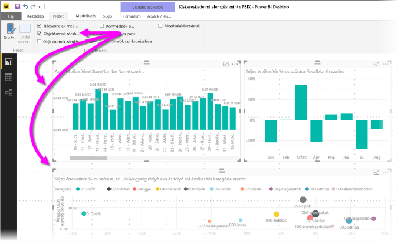
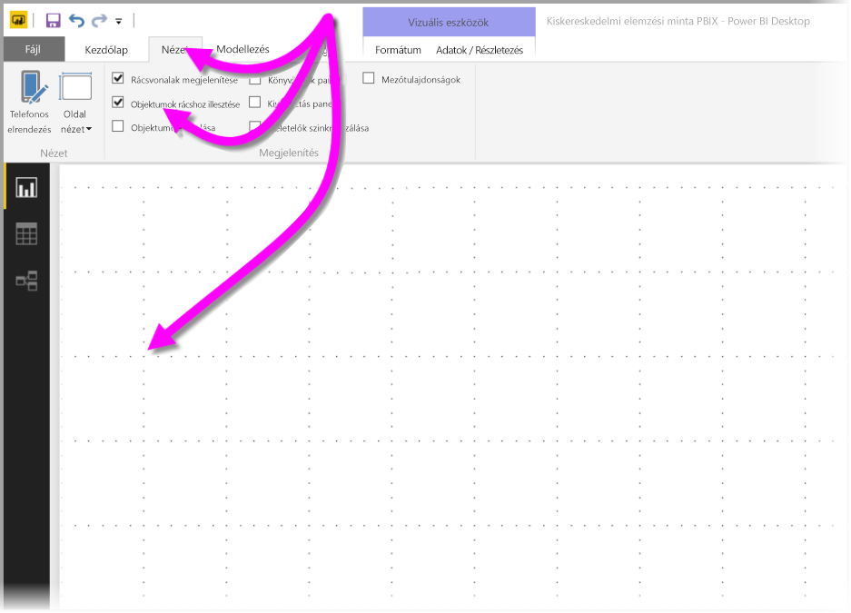
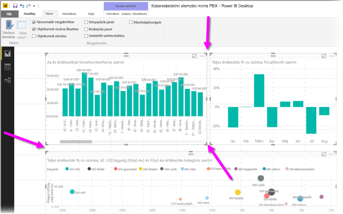
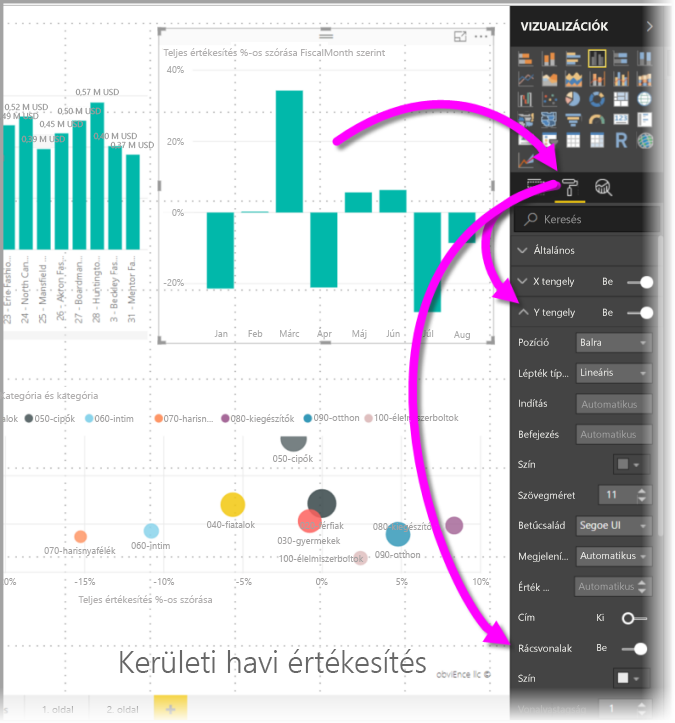
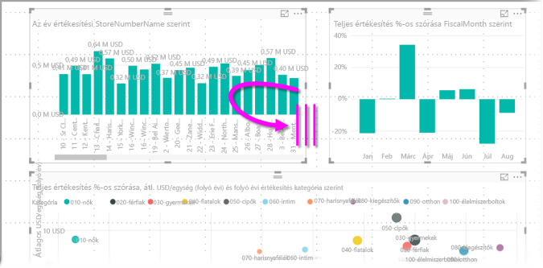
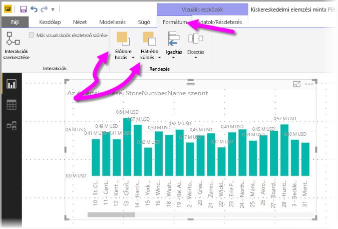
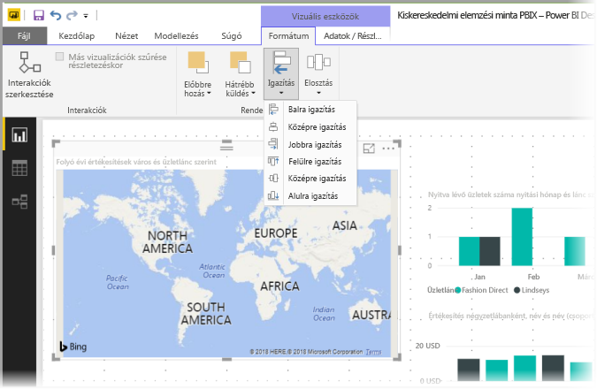
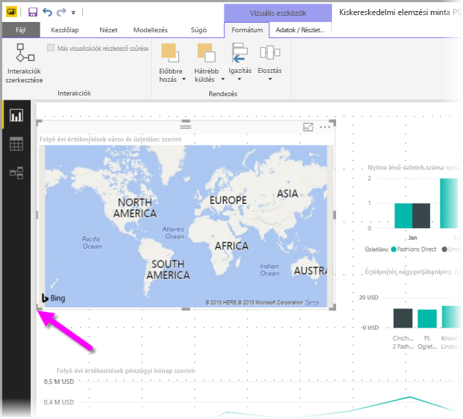
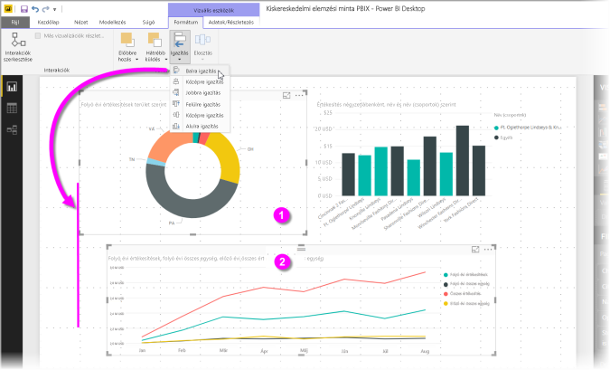
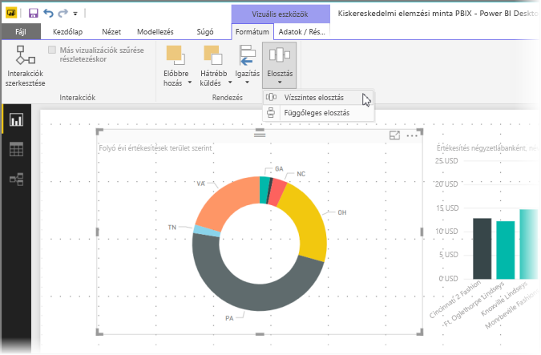

# Rácsvonalak és rácshoz illesztés használata Power BI Desktop-jelentésekben
A **Power BI Desktop** jelentésvásznon található rácsvonalak segítségével eligazíthatja a vizualizációkat egy jelentésoldalon, a rácshoz illesztés funkció pedig abban segít, hogy a jelentésben szereplő vizualizációk rendezetten, igazítva, egyenlő térközökkel jelenhessenek meg.

A **Power BI Desktopban** az objektumok mélységi (Z) indexét is beállíthatja (előrehozhatja, hátraviheti) egy jelentésben, valamint igazíthatja vagy egyenlően eloszthatja a kijelölt vizualizációkat a vásznon.

### Rácsvonalak és rácshoz illesztés engedélyezése
A rácsvonalak és a rácshoz illesztés engedélyezéséhez válassza a **Nézet** menüszalagot, majd jelölje be a **Rácsvonalak megjelenítése** és az **Objektumok rácshoz illesztése** melletti jelölőnégyzeteket. Bejelölheti az egyik vagy mindkét jelölőnégyzetet is, függetlenek egymástól.

> [!NOTE]
> Ha a **Rácsvonalak megjelenítése** és az **Objektumok rácshoz illesztése** le van tiltva, csatlakozzon bármely adatforráshoz, és azonnal engedélyezve lesznek.
> 
> 

### Rácsvonalak használata
A rácsvonalak olyan láthatók vonalzók, amelyek segítenek a látványelemek igazításában. Amikor megpróbálja meghatározni, hogy két (vagy több) vizualizáció vízszintesen vagy függőlegesen egy vonalban van-e, a rácsvonalak segítségével meghatározhatja, hogy egy vonalba esnek-e a szegélyeik.

A CTRL+kattintás kombinációval kijelölhet egyszerre egynél több vizualizációt, így megjelenik mindegyik vizualizáció szegélye, és jól látható, hogy a vizualizációk egy vonalban vannak-e.

#### Rácsvonalak használata a vizualizációkban
A Power BI-ban a vizualizációkon belül is találhatók rácsvonalak, és ezek vezetőként szolgálnak az adatpontok és az értékek összehasonlításához. A **Power BI Desktop** 2017. szeptemberi kiadásával kezdve már kezelheti ezeket a rácsvonalakat a vizualizációkon belül a **Megjelenítések** panel **Formátum** szakaszában található **X tengely** vagy **Y tengely** kártya segítségével (a vizualizáció típusának megfelelően). A vizualizáción belül a rácsvonalak alábbi elemeit módosíthatja:

* Rácsvonalak be- vagy kikapcsolása
* A rácsvonalak színének módosítása
* A rácsvonalak vonalvastagságának beállítása
* A vizualizációban szereplő rácsvonalak stílusának kiválasztása (például folytonos, szaggatott, pontozott)

A rácsvonalak bizonyos elemeinek módosítása különösen hasznos lehet az olyan jelentésekben, ahol sötét háttere van a vizualizációknak. Az alábbi ábra az **Y tengely** kártyán lévő **Rácsvonalak** szakaszt jeleníti meg.

### Rácshoz illesztés használata
Amikor engedélyezi az **Objektumok rácshoz illesztését**, a rendszer a **Power BI Desktop** vásznon szereplő összes vásznat automatikusan a legközelebbi rácstengelyhez illeszti, így sokkal könnyebb biztosítani, hogy két vagy több vizualizáció ugyanahhoz a vízszintes vagy függőleges helyhez vagy mérethez igazodjon.

Ezek a legfontosabb tudnivalók a **rácsvonalak** és a **rácshoz illesztés** használatáról, hogy gondoskodhasson a jelentésekben szereplő vizualizációk megfelelő igazításáról.

### Mélységi (Z) index, igazítás és elosztás használata
Kezelheti a jelentésekben a vizualizációkban gyakran az elemek *mélységi (Z) indexének* nevezett elölről-hátra sorrendet. Ezzel tetszés szerinti átfedésbe helyezheti a vizualizációkat, majd módosíthatja az egyes vizualizációk elölről-hátra sorrendjét. A **Formátum** menüszalag **Elrendezés** szakaszában található **Előbbre hozás** és **Hátrébb küldés** gombokkal állíthatja be a vizualizációk sorrendjét. A **Formátum** menüszalag azonnal megjelenik, amint kiválaszt egy vagy több vizualizációt az oldalon.

A **Formátum** menüszalag lehetővé teszi, hogy sokféle módon igazíthassa a vizualizációkat, így a vizualizációk a lehető legjobb elrendezésben jelennek meg az oldalon.

Az **Igazítás** gombbal igazíthatja a kijelölt vizualizációt a jelentésvászon pereméhez (vagy középpontjához), amint az az alábbi ábrán látható.

Amikor két vagy több vizualizáció van kijelölve, a rendszer egymáshoz igazítja őket, és a vizualizációk meglévő igazított határvonalát használja az igazításukhoz. Ha például két vizualizációt jelöl ki, és a **Balra igazítás** gombot választja, a vizualizációk a kijelölt vizualizációk bal szélső határvonalához igazodnak.

A vizualizációkat eloszthatja egyenlően a jelentés vásznon, akár függőlegesen, akár vízszintesen. Csak használja a **Formátum** menüszalag **Elosztás** gombját.

A rácsvonalak, valamint az igazítási és az elosztási eszközök megfelelő kiválasztásával a jelentések pont úgy fognak kinézni, ahogy szeretné.

