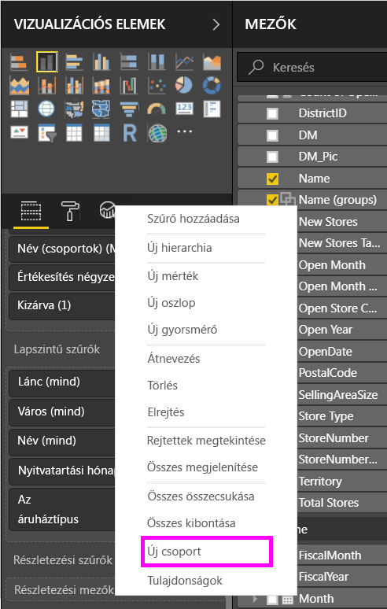
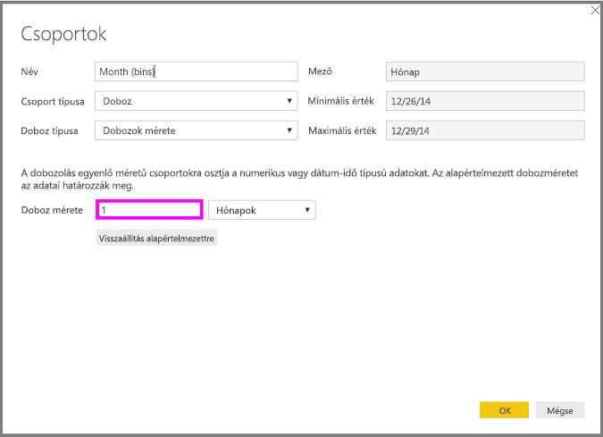
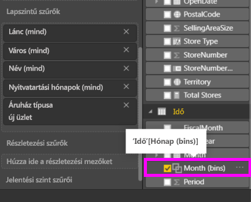

# Csoportosítás és dobozolás használata a Power BI Desktopban
Amikor a **Power BI Desktop** vizualizációkat hoz létre, az adatait az alapul szolgáló adatokban talált értékek alapján adattömbökbe (vagy csoportokba) gyűjti. Ez gyakran elegendő is, de lehetnek alkalmak, amikor finomítani szeretné az adattömbök megjelenítését. Előfordulhat például, hogy három termékkategóriát egy nagyobb kategóriában (egy *csoportban*) szeretne elhelyezni. Az is előfordulhat, hogy az eladási adatokat 1 000 000 dollár méretű dobozokban szeretné látni, nem pedig egyenlően elosztva, 923 983 dolláros részekben.

A Power BI Desktopban **csoportosíthatja** az adatokat, és így jobban áttekintheti, elemezheti és feltárhatja a vizualizációkban foglalt adatokat és tendenciákat. A **dobozméretet** is meghatározhatja. A folyamatot, amelynek során az értékeket egyenlő méretű csoportokra osztja, gyakran *dobozolásnak* nevezik, és ez lehetővé teszi az adatok könnyebben értelmezhető vizualizációját.

### A csoportosítás használata
A csoportosítás használatához a CTRL+kattintással válasszon ki két vagy több elemet egy vizualizáción. Ezután kattintson a jobb gombbal a több kijelölt elem egyikére, és válassza a **Csoport** lehetőséget a megjelenő menüben.

Ha létrejött a csoport, a rendszer hozzáadja a vizualizáció **Jelmagyarázat** gyűjtőjéhez, és a **Mezők** listában is megjelenik.

Ha már van egy csoportja, egyszerűen szerkesztheti a csoport tagjait. Ehhez kattintson a jobb gombbal a mezőre a **Jelmagyarázat** gyűjtőben vagy a **Mezők** listán, és válassza a **Csoportok szerkesztése** lehetőséget.

A megjelenő **Csoportok** ablakban létrehozhat új csoportokat, vagy módosíthatja a meglévőket. A csoportokat *át is nevezheti*. Ehhez kattintson duplán a **Csoportok és tagok** mezőben a csoport címére, és írjon be egy új nevet.

A csoportokkal sok mindent megtehet. Hozzáadhat elemeket a **Nem csoportosított értékek** listáról egy új vagy egy létező csoporthoz. Új csoport létrehozásához válasszon ki két vagy több elemet (a CTRL+kattintással) a **Nem csoportosított értékek** mezőből, és kattintson a mező alatti **Csoport** gombra.

Hozzáadhat egy nem csoportosított értéket egy létező csoporthoz: csak válassza ki a nem csoportosított értéket, aztán válassza ki a meglévő csoportot, amelybe fel szeretné venni, és kattintson a **Csoport** gombra. Ha el szeretne távolítani egy elemet egy csoportból, válassza ki a **Csoportok és tagok** mezőben, és kattintson a **Csoportosítás megszüntetése** parancsra. Azt is eldöntheti, hogy a nem csoportosított kategóriák bekerüljenek-e az **Egyéb** csoportba, vagy maradjanak csoportosítás nélkül.

> [!NOTE]
> A **Mezők** szakasz bármelyik mezőjéhez létrehozhat csoportokat, ehhez nem kell egy meglévő vizualizációból több elemet kijelölnie. Csak kattintson a jobb gombbal a mezőre, és válassza a megjelenő menüben az **Új csoport** elemet.
> 
> 

### A dobozolás használata
A dobozméretet a **Power BI Desktop** numerikus és időmezőihez állíthatja be. A dobozolással megfelelő méretűre állíthatja a **Power BI Desktop** által megjelenített adatokat.

Egy dobozméret alkalmazásához kattintson a jobb gombbal egy **Mezőre**, és válassza az **Új csoport** lehetőséget.

A **Csoportok** ablakban állítsa be a **Doboz méretét** a kívánt értékre.

Amikor az **OK** gombra kattint, észreveheti, hogy megjelenik a **Mezők** panelen egy új mező, amelyhez hozzá van fűzve a *(bins)* (dobozok) kifejezés. Ezután ezt a mezőt ráhúzhatja a vászonra, ha a dobozméretet alkalmazni szeretné egy vizualizációban.

Ha működés közben szeretné látni a **dobozolást**, tekintse meg ezt a [videót](https://www.youtube.com/watch?v=BRvdZSfO0DY).

Mindössze ennyit kell tudni a **csoportosítás** és a **dobozolás** használatáról, hogy a jelentéseiben szereplő vizualizációk pont úgy jelenítsék meg az adatokat, ahogyan szeretné.

