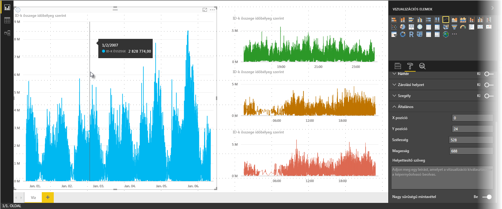

# Nagy sűrűségű sorok mintavétele a Power BI-ban
A **Power BI Desktop** 2017. júniusi kiadásától és a **Power BI szolgáltatás** frissítéseiben egy új mintavételi algoritmus érhető el, amelynek köszönhetően a vizualizációk hatékonyabban mintavételezik a nagy sűrűségű adatokat. Például létrehozhat egy vonaldiagramot a kereskedelmi egységek értékesítési adataiból, ahol minden egyes üzlet több mint tízezer értékesítési nyugtával rendelkezik. Egy ilyen értékesítési információkat tartalmazó vonaldiagram mintát vesz az egyes üzletek adataiból (reprezentatív adatokat választ, amelyek megmutatják, hogyan változtak az értékesítések az idő múlásával), és egy több adatsorozatú vonaldiagramot hoz létre, amely az alapul szolgáló adatokat ábrázolja. Ez gyakori eljárás a nagy sűrűségű pontdiagramok vizualizációjánál. Ebben a cikkben részletezzük, miben fejlődött a Power BI Desktop mintavételi folyamata nagy sűrűségű adatok esetén.

> [!NOTE]
> A cikkben bemutatott **nagy sűrűségű mintavételi** algoritmus elérhető a **Power BI Desktopban** és a **Power BI szolgáltatásban** is.
> 
> 

## A nagy sűrűségű sorok mintavételezésének működése
Korábban a **Power BI** determinisztikus módon választott mintaadatpontokat az alapul szolgáló adatok teljes tartományából. Például egy egész naptári évet lefedő vizualizáció nagy sűrűségű adatai esetén 350 mintaadatpont is megjelenhet a vizualizációban, amelyek mindegyike úgy lett kiválasztva, hogy biztosítsa a vizualizációban ábrázolt adatok teljességét (az alapul szolgáló adatok teljes sorozatát). Hogy jobban elképzelhesse, hogyan történik ez, képzelje el, hogy tőzsdei árfolyamadatokat ábrázolunk egy egyéves időszakból, és 365 adatpontot választottunk ki a vonaldiagramos vizualizáció létrehozásához (ami minden nap esetén egy adatpontot jelent).

Ebben az esetben egy tőzsdei árfolyam egy adott napon belül is számos értékkel rendelkezik. Természetesen van napi csúcs- és mélypont, de ezek a nap folyamán bármikor előfordulhatnak, amikor a tőzsde nyitva van. Nagy sűrűségű sorok mintavételezése esetén, ha az alapul szolgáló adatokat minden nap 10:30 és 24:00 időpontokban mintavételezzük, akkor reprezentatív pillanatképet kaphatunk az alapul szolgáló adatokról (az 12:30-as és az éjféli árakról), azonban a rendszer nem rögzíti a tőzsdei árfolyam reprezentatív adatponthoz (adott naphoz) tartozó csúcs- és mélypontját. A mintavételezés többek között ebben az esetben is reprezentatív az alapul szolgáló adatok szempontjából, azonban nem mindig rögzíti a kulcsfontosságú pontokat, amelyek jelen esetben az egyes napok tőzsdei árfolyamának csúcs- és mélypontjai.

Meghatározás szerint a nagy sűrűségű adatok mintavételezése a vizualizációk meglehetősen gyors és interakciókra reagáló módon való létrehozása érdekében történik. Ha a vizualizációban túl sok adatpont van, az lelassíthatja, és akadályozhatja a trendek megjelenítését. Az adatok mintavételezésétől függ tehát a mintavételezési algoritmus létrehozásának módja a lehető legjobb vizualizáció létrehozása érdekében. A Power BI Desktopban most javítottuk az algoritmust, hogy a válaszképesség, reprezentáció és a fontos pontok világos megőrzésének lehető legjobb kombinációját biztosítsa minden egyes időszeletben.

## Az új sor-mintavételezési algoritmus működése
A nagy adatsűrűségű sorok mintavételi algoritmusa folyamatos x tengellyel rendelkező vonaldiagramos és területdiagramos vizualizációkhoz érhető el.

Nagy adatsűrűségű vizualizációk esetén a **Power BI** intelligensen darabolja fel az adatokat nagy felbontású részletekre, majd kiválasztja az egyes részletek reprezentatív fontos pontjait. A nagy felbontású adatok darabolásának folyamata kifejezetten arra van hangolva, hogy a diagram vizuálisan megegyezzen az összes alapul szolgáló adatpont megjelenítésével, de gyorsabb és interaktívabb legyen.

### A nagy sűrűségű sorokat tartalmazó vizualizációk minimum és maximum értékei
Minden vizualizációra az alábbi vizuális korlátozások vonatkoznak:

* Legfeljebb **3500** adatpont *jeleníthető meg* a vizualizációban, függetlenül az alapul szolgáló adatpontok vagy adatsorok számától. Ezért ha 10 sorozat áll rendelkezésre, amelyek mindegyike 350 adatpontot tartalmaz, akkor a vizualizáció elérte az adatpontok számának felső korlátját. Ha viszont csak egyetlen sorozat van, az 3500 adatpontot tartalmazhat, ha az új algoritmus úgy ítéli meg, hogy a legjobb mintavételezési mód az alapul szolgáló adatokhoz.
* Minden vizualizációban legfeljebb **60 sorozat** szerepelhet. 60-nál több sorozat esetén az adatokat úgy kell feldarabolni, hogy több, legfeljebb 60 sorozatot tartalmazó vizualizáció jöjjön létre. Erre jó módszer a **szeletelők** használata, amelyekkel megjelenítheti csak az adatok egyes szakaszait (csak bizonyos sorozatokat). Ha például minden alkategóriát megjelenít a jelmagyarázatban, akkor egy szeletelővel szűrést állíthat be az általános kategória alapján ugyanazon a jelentésoldalon belül.

Ezek a paraméterek biztosítják a Power BI Desktop vizualizációinak nagyon gyors megjelenítését, gyors reakcióját a felhasználói műveletekre, valamint hogy nem okoznak túlzott számítási többletterhelést a vizualizációt megjelenítő számítógépen.

### A nagy adatsűrűségű sorokat tartalmazó vizualizációk reprezentatív adatpontjainak értékelése
Ha az alapul szolgáló adatpontok száma meghaladja a vizualizációban megjeleníthető adatpontok maximális számát (3500-at), akkor a *dobozolás* nevű folyamat veszi kezdetét, amely *dobozoknak* nevezett csoportokra darabolja az alapul szolgáló adatokat, majd a műveletek ismétlésével finomítja őket.

Az algoritmus a lehető legtöbb dobozt hozza létre a vizualizáció maximális részletessége érdekében. Az algoritmus minden dobozban megkeresi a legalacsonyabb és a legmagasabb adatértéket, így biztosítja, hogy kulcsfontosságú és releváns értéket rögzít és jelenít meg a vizualizációban (például kiugró értékeket). Miután a Power BI dobozolja és kiértékeli az adatokat, meghatározza a vizualizáció x tengelyének minimális felbontását, hogy a vizualizáció a lehető legrészletesebb legyen.

Ahogy korábban már említettük, az egyes sorozatok minimális részletessége 350 pont, a maximális pedig 3500.

Minden dobozt két adatpont ábrázol, amelyek a doboz reprezentatív adatpontjaiként szerepelnek a vizualizációban. Az adatpontok egyszerűen a doboz legmagasabb és legalacsonyabb értékei, így a kiválasztásukkal a dobozolási folyamat biztosítja, hogy minden fontos magas vagy releváns alacsony érték rögzítve lesz és megjelenik a vizualizációban.

Ha úgy érzi, hogy az alkalmankénti kiugró értékek rögzítése és a vizualizációbeli megfelelő megjelenítése igen sok elemzést igényel, igaza van, de éppen ez indokolta az új algoritmus és dobozolási eljárás kidolgozását.

## Elemleírások és nagy sűrűségű sorok mintavétele
Fontos megjegyezni, hogy ez a dobozolási folyamat, amely az adott doboz legalacsonyabb és legmagasabb értékének rögzítését, majd a megjelenítését eredményezi, hatással lehet arra, hogy az elemleírások hogyan jelenítik meg az adatokat, amikor a kurzort az adatpontok fölé viszi. Ahhoz, hogy ennek működését bemutathassuk, térjünk vissza a tőzsdei árfolyamok példájához.

Tegyük fel, hogy a tőzsdei árfolyamok alapján szeretne vizualizációt létrehozni, két különböző részvény összehasonlításával, és mindkettő **nagy sűrűségű mintavételt** használ. Az egyes sorozatok alapul szolgáló adatai számos adatpontot tartalmaznak (például a nap minden másodpercében rögzíti a tőzsdei árfolyamokat). A nagy sűrűségű sorok mintavételi algoritmusa minden sorozatot a többitől függetlenül dobozol.

Tegyük fel, hogy az első részvény ára 12:02-kor megugrik, majd tíz másodperccel később hirtelen lecsökken. Ez fontos adatpontnak számít. A részvény dobozolásakor a 12:02-kor tapasztalt maximális érték lesz az adott doboz reprezentatív adatpontja.

De a második részvény értéke sem csúcs-, sem mélypontot nem ért el a 12:02-es időpontot tartalmazó dobozban. Lehet, hogy a 12:02 időpontot tartalmazó doboz csúcs- és mélypontja három perccel később fordult elő. Ebben az esetben, ha a létrejött vonaldiagramon a 12:02-es időpont fölé viszi a kurzort, akkor megjelenik egy érték az első részvény elemleírásában (mivel 12:02-kor felment, és az az érték lett kiválasztva a doboz legmagasabb adatpontjaként), viszont a második részvénynek semmilyen értéke *nem* jelenik meg a 12:02-es elemleírásban. Ennek az oka, hogy a második részvény értéke sem csúcs-, sem mélypontot nem ért el a 12:02-es időpontot tartalmazó dobozban. Ezért a 12:02-es időpontnál nem szerepel megjeleníthető adat a második részvényről, és az elemleírásban sem jelenik meg adat.

Ez a helyzet gyakran előfordul az elemleírások esetében. Előfordulhat, hogy egy adott doboz legmagasabb és legalacsonyabb értékei nem felelnek meg tökéletesen az egyenletes skálával rendelkező x tengely értékpontjainak, így az elemleírás nem jeleníti meg az értéket.  

## Nagy sűrűségű sorok mintavételének bekapcsolása
Alapértelmezés szerint az új algoritmus **be** van kapcsolva. A beállítás módosításához lépjen a **Formátum** panel **Általános** kártyájára, ahol az alsó részen található a **Nagy sűrűségű mintavétel** csúszka. A kikapcsoláshoz csúsztassa **Ki** állapotba.

## Megfontolandó szempontok és korlátozások
Az új, nagy sűrűségű mintavételi algoritmus a Power BI fontos fejlesztése, de érdemes figyelembe vennie néhány szempontot, ha nagy sűrűségű értékeket és adatokat használ.

* A nagyobb részletesség, illetve a dobozolási folyamat miatt előfordulhat, hogy az **Elemleírások** csak akkor jelenítenek meg értéket, ha a kurzor a reprezentatív adatokon található. További információért olvassa el ebben a cikkben az *Elemleírások és nagy sűrűségű sorok mintavétele* szakaszt.
* Ha egy általános adatforrás mérete túl nagy, az új algoritmus kihagy egyes sorozatokat (jelmagyarázati elemeket), hogy megfeleljen az adatimportálás maximális korlátjának.
  
  * Ebben az esetben az új algoritmus betűrendbe rendezi a jelmagyarázat adatsorait, a betűrend szerint halad a jelmagyarázat elemein, majd amikor eléri az adatimportálás felső határát, nem importál további adatsorokat.
* Ha az alapul szolgáló adatkészlet több mint 60 sorozatból áll (mint korábban említettük, ez a sorozatok maximális száma), az új algoritmus betűrendbe helyezi a sorozatot, és kihagyja a betűrend szerinti 60. sorozat utáni elemeket.
* Ha az adatokban szereplő értékek nem *numerikus* vagy *dátum/idő* típusúak, a Power BI nem az új algoritmust használja, hanem visszavált az előző (nem nagy adatsűrűségű mintavételi) algoritmusra.
* Az új algoritmus nem támogatja az **Adatot nem tartalmazó elemek megjelenítése** beállítást.
* Az új algoritmus nem támogatott, ha élő kapcsolattal csatlakozik egy SQL Server Analysis Servicesben (2016-os vagy régebbi verzióban) üzemeltetett modellhez. A **Power BI-ban** és az Azure Analysis Servicesben üzemeltetett modellek azonban támogatják.

## Következő lépések
A pontdiagramokban használt nagy sűrűségű mintavételről a következő cikkben talál további információt.

* [Nagy sűrűségű mintavételezés a Power BI-pontdiagramokban](desktop-high-density-scatter-charts.md)

