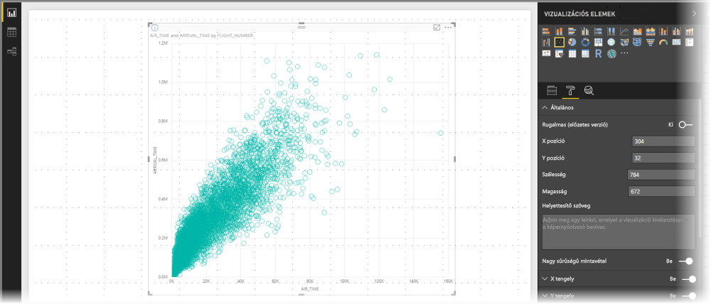
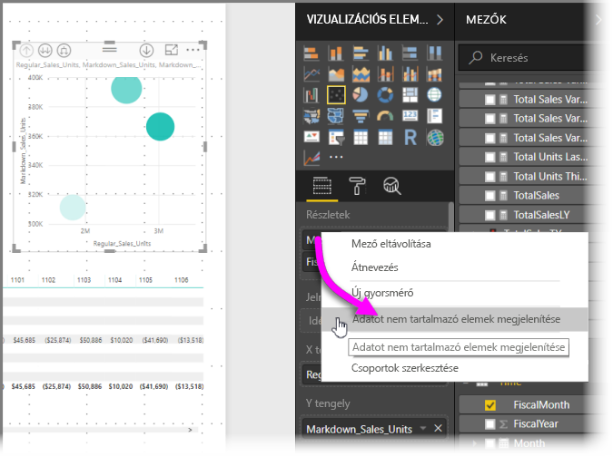
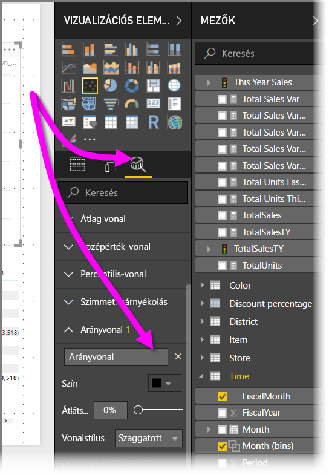
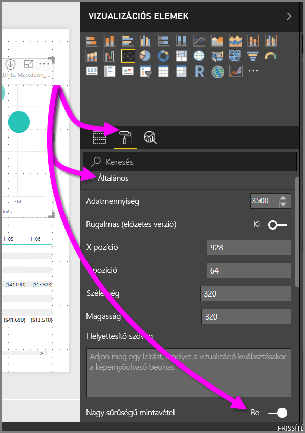

# Nagy sűrűségű mintavételezés a Power BI-pontdiagramokban
A **Power BI Desktop** 2017. szeptemberi kiadásától kezdve és a **Power BI szolgáltatás** frissítéseiben egy új mintavételi algoritmus érhető el, amelynek köszönhetően a pontdiagramok hatékonyabban jelenítik meg a nagy sűrűségű adatokat.

Ha például vállalata értékesítési tevékenységeiről készít pontdiagramot, az üzletenként évente több ezer adatpontot jelent. Egy ilyen értékesítési információkat tartalmazó pontdiagram mintát vesz az elérhető adatokból (reprezentatív adatokat választ, amelyek megmutatják, hogyan alakultak az értékesítések az idő múlásával), és egy pontdiagramot hoz létre, amely az alapul szolgáló adatokat ábrázolja. Ez a gyakori eljárás a nagy sűrűségű pontdiagramoknál. Ebben a cikkben részletezzük, miben fejlődött a Power BI mintavételi folyamata nagy sűrűségű adatok esetén.

> [!NOTE]
> A cikkben bemutatott **nagy sűrűségű mintavételi** algoritmus elérhető a **Power BI Desktop** és a **Power BI szolgáltatás** pontdiagramjaiban is.
> 
> 

## A nagy sűrűségű pontdiagramok működése
Korábban a **Power BI** determinisztikus módon választott mintaadatpontokat az alapul szolgáló adatok teljes tartományából pontdiagram létrehozásához. Pontosabban a Power BI kiválasztotta a pontdiagram-sorozat első és utolsó sorát, majd egyenlően osztotta el a fennmaradó sorokat úgy, hogy a pontdiagramon összesen 3500 adatpont jelenjen meg. Ha például a minta 35 000 sorral rendelkezett, akkor a program megjelenítette az első és az utolsó sort, és közöttük minden tizedik sort (35 000 / 10 = minden tizedik sor = 3500 adatpont). Korábban a nullértékek és a nem ábrázolható pontok (például a szöveges értékek) nem jelentek meg, így nem lettek figyelembe véve a vizualizáció készítésekor. Ilyen mintavételezéskor a pontdiagram észlelhető sűrűsége a reprezentatív adatpontokon is alapult, így a vizualizáció elméleti sűrűsége a mintavételezett pontoktól függött, nem az alapul szolgáló adatok teljes készletétől.

Ha engedélyezi a **nagy sűrűségű mintavételezést**, a Power BI egy olyan algoritmust implementál, amely kiküszöböli az átfedésben lévő pontok jelenlétét, és lehetővé teszi a vizualizáció pontjainak elérését a vizualizáció kezelésekor. Az algoritmus emellett biztosítja, hogy az adatkészlet összes pontja megjelenjen a vizualizációban, így kontextust biztosít a kiválasztott pontok számára ahelyett, hogy egyszerűen egy reprezentatív mintát jelenítene meg.

Meghatározás szerint a nagy sűrűségű adatok mintavételezése a vizualizációk meglehetősen gyors és interakciókra reagáló módon való létrehozása érdekében történik. Ha a vizualizációban túl sok adatpont van, az lelassíthatja, és akadályozhatja a trendek megjelenítését. A mintavételezési algoritmus létrehozása tehát a mintavételezés módjától függ, hogy a lehető legjobb vizualizációs élményben lehessen része, és ez biztosítja, hogy minden adat megjelenjen. A Power BI algoritmusa úgy lett továbbfejlesztve, hogy együtt valósuljon meg a válaszképesség, a megfelelő ábrázolás és a teljes adatkészlet minden kulcsfontosságú pontjának megőrzése a teljes adatkészletben.

> [!NOTE]
> A **nagy sűrűségű mintavételezési** algoritmust használó pontdiagramok a legmegfelelőbben négyzetes vizualizációkban jeleníthetők meg, ahogyan az összes pontdiagram.
> 
> 

## Az új pontdiagram-mintavételezési algoritmus működése
A pontdiagramokhoz használható új **nagy sűrűségű mintavételezési** algoritmus olyan módszereket alkalmaz, amelyek hatékonyabban rögzítik és jelenítik meg az alapul szolgáló adatokat és küszöbölik ki az átfedésben lévő pontok jelenlétét. Ehhez először egy kisméretű sugarat rendel minden egyes adatponthoz (ez a vizualizációban szereplő pontokhoz tartozó körök átmérője). Ezután megnöveli az adatpontokhoz tartozó sugarakat, és ahol kettő (vagy több) adatpont átfedésben lenne, egyetlen (megnövelt átmérőjű) kör jelöli az átfedésben lévő adatpontokat. Az algoritmus addig növeli az adatpontok sugarait, amíg el nem éri, hogy észszerű mennyiségű – 3500 darab – adatpont legyen ábrázolva a pontdiagramon.

Az algoritmus módszerei biztosítják, hogy a kiugró értékek megjelenjenek az eredményül kapott vizualizációban. Az algoritmus az átfedés meghatározásakor figyelembe veszi a méreteket, ezért az exponenciális méretek az alapul szolgáló megjelenített adatpontokhoz igazodva jelennek meg.

Az algoritmus megtartja a pontdiagram formáját is.

> [!NOTE]
> Ha a **nagy sűrűségű mintavételezési** algoritmust használja a pontdiagramokhoz, az adatok *pontos eloszlása* a cél, *nem* pedig a vizualizáció elméleti sűrűsége. Például ha egy pontdiagramon sok az átfedésben lévő kör egy bizonyos területen, abból arra lehet következtetni, hogy ott sok adatpont csoportosulhat. A **nagy sűrűségű mintavételezési** algoritmus egyetlen körrel jelenít meg több adatpontot, így a vizualizáció elméleti sűrűsége (vagy más néven „csoportosulása”) nem jelenik meg. Egy adott terület részletesebb megjelenítéséhez szeletelőkkel nagyíthatja ki azt.
> 
> 

Emellett a nem ábrázolható adatokat (például a null- és a szöveges értékeket) figyelmen kívül hagyja az algoritmus, és helyettük megjeleníthető adatokat ábrázol a pontdiagram, így még pontosabban megőrizhető annak valódi formája.

### Mikor használható a hagyományos algoritmus?
Bizonyos esetekben a **nagy sűrűségű mintavételezési** algoritmus nem alkalmazható az adott pontdiagramra, ezért a rendszer a hagyományos algoritmust használja. Ez a következő esetekben történhet:

* Ha a jobb gombbal a **Részletek** elemre kattint, és kiválasztja az **Adatot nem tartalmazó elemek megjelenítése** lehetőséget a menüből, a pontdiagram visszaáll az eredeti algoritmus használatára.
  
  
* Ha bármilyen érték szerepel a **Lejátszási** tengelyen, a pontdiagram visszaáll az eredeti algoritmus használatára.
* Ha az X és az Y tengely is hiányzik a pontdiagramon, az visszaáll az eredeti algoritmusra.
* Ha **arányvonalat** használ az **Elemzés** panelen, a diagram visszaáll az eredeti algoritmus használatára.
  
  

## A nagy sűrűségű mintavételezés bekapcsolása pontdiagramokhoz
A **nagy sűrűségű mintavétel** bekapcsolásához válasszon ki egy pontdiagramot, lépjen a **Formátum** ablaktáblára, bontsa ki az **Általános** kártyát, és a kártya aljának közelében váltsa át a **Nagy sűrűségű mintavétel** csúszkát a **Be** állásba.

> [!NOTE]
> Ha a csúszka be van kapcsolva, a Power BI minden esetben megkísérli a **nagy sűrűségű mintavételezési** algoritmus használatát. Ha az algoritmus nem használható (például megad valamilyen értéket a *Lejátszási* tengelyen), a csúszka **Be** állapotban marad annak ellenére, hogy a diagram visszaáll a hagyományos algoritmus használatára. Ha ezután eltávolítja az értéket a *Lejátszási* tengelyről (vagy a körülmények úgy változnak, hogy a nagy sűrűségű mintavételezési algoritmus használhatóvá válik), a diagram automatikusan a nagy sűrűségű mintavételezést fogja használni, mivel ez a funkció aktív.
> 
> [!NOTE]
> Az adatpontok index szerint vannak csoportosítva vagy kiválasztva. Az, hogy megjelenik-e jelmagyarázat, nem befolyásolja a mintavételezést az algoritmushoz, csak a vizualizáció elrendezésére van hatással.
> 
> 

## Megfontolandó szempontok és korlátozások
A nagy sűrűségű mintavételezési algoritmus a Power BI fontos fejlesztése, de érdemes figyelembe vennie néhány szempontot, ha nagy sűrűségű értékeket és pontdiagramokat használ.

* A **nagy sűrűségű mintavételezési** algoritmus kizárólag élő kapcsolatokkal használható a Power BI szolgáltatásra épülő modellekhez, importált modellekhez, vagy a DirectQueryhez.

## Következő lépések
A más diagramokban használt nagy sűrűségű mintavételről a következő cikkben talál további információt.

* [Nagy sűrűségű sorok mintavétele a Power BI-ban](desktop-high-density-sampling.md)

