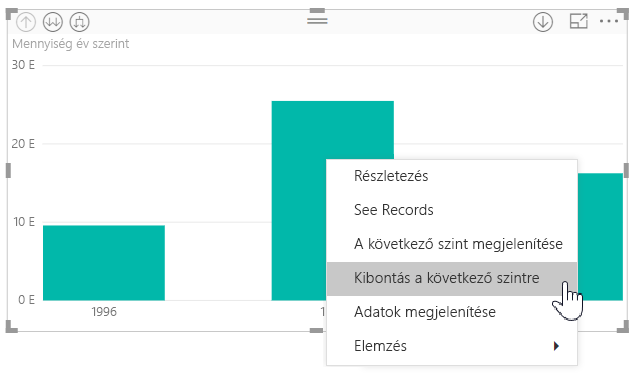
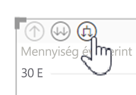
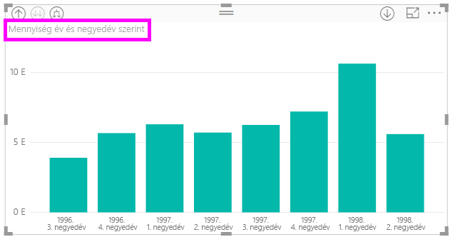
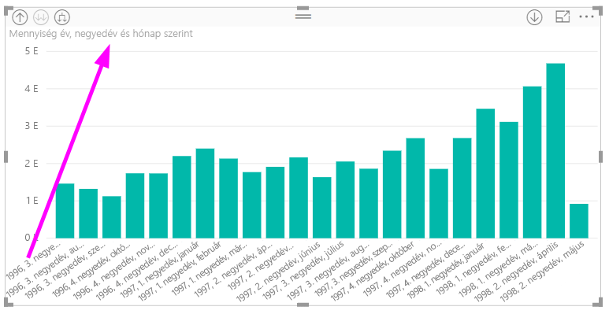
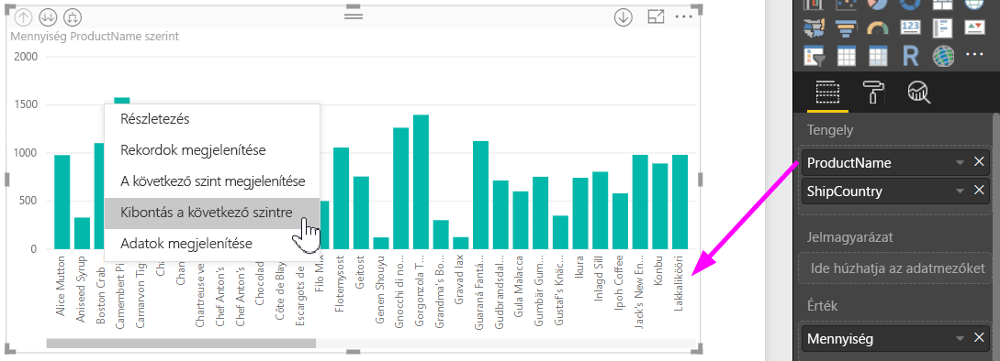
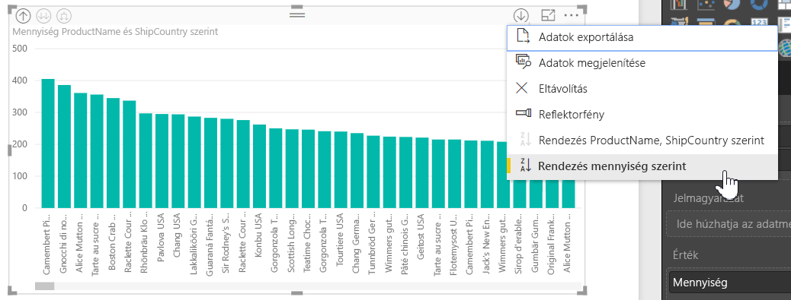
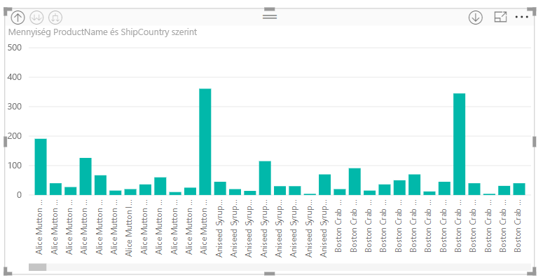

# Beágyazott hierarchiák feliratainak használata a Power BI Desktopban
A **Power BI Desktop** támogatja a **beágyazott hierarchiák feliratainak** használatát. Ez azon két funkció egyike, amelyek a részletes hierarchikus kibontást javítják. A jelenleg fejlesztés alatt álló második funkció az egymásba ágyazott hierarchiák feliratainak használata (érdemes figyelnie, mert gyakran frissítünk).   

## A beágyazott hierarchiák feliratainak működése
A beágyazott hierarchiák feliratai segítségével megtekintheti a hierarchiák feliratait, ha **Az összes kibontása** funkcióval kibontja a vizualizációkat. A hierarchiák feliratainak az egyik nagy előnye, hogy lehetőség van **rendezésre** a különböző hierarchiák feliratai szerint a hierarchikus adatok kibontása során.

### A beépített Kibontás funkció használata (hierarchiák feliratai szerinti rendezés nélkül)
Mielőtt megnézzük a beágyazott hierarchiák feliratainak a működését, tekintsük át a **Kibontás a következő szintre** funkció alapértelmezett viselkedését. Ez lehetővé teszi, hogy megértsük (és értékeljük), mennyire hasznosak lehetnek a beépített hierarchiák feliratai.

Az alábbi képen egy éves értékesítési adatokat tartalmazó sávdiagram látható. Ha a jobb egérgombbal kattint valamelyik sávra, a választható lehetőségek között megjelenik a **Kibontás a következő szintre** pont.

> [!NOTE]
> A jobb gombbal való kattintás helyett a vizualizáció bal felső sarkában látható *Kibontás* gombot is használhatja.

  

A **Kibontás a következő szintre** lehetőség kiválasztása után a vizualizáció kibontja a dátumhierarchiát az *Év* szinttől kezdve a *Negyedév* szintig, ahogy az az alábbi képen látható.

Megfigyelheti, hogy az *Év* és a *Negyedév* felirat egymásba ágyazva jelenik meg. Ez a feliratozási séma folytatódik, ha **Az összes kibontása** lehetőséget használva a hierarchiát a legalsó szintig kibontja.

Így viselkedik a beépített *Dátum* hierarchia, ami olyan mezőkhöz társul, amelyekben *dátum/idő* adattípus van. Lépjünk a következő szakaszra, és nézzük meg, hogy miben más az új beépített hierarchiák felirata funkció.

### A beágyazott hierarchiák feliratainak használata
Az alábbiakban bemutatunk egy másik diagramot olyan adatokkal, amelyek közt informális hierarchiáik vannak. Az alábbi vizualizációban látható oszlopdiagram a **Quantity** (Mennyiség) értékét mutatja, és a *ProductName* (Terméknév) értéket használja tengelyként. Az adatok között a *ProductName* és a *ShipCountry* (Szállítási ország) érték informális hierarchiát alkot. Innen újra kiválaszthatja a *Kibontás a következő szintre* lehetőséget, hogy megtekinthesse a hierarchia következő szintjét.

Ha a **Kibontás a következő szintre** lehetőséget választja, megjelenik a következő szint a hierarchiák feliratainak beágyazott megjelenítésével. Alapértelmezés szerint a beágyazott hierarchiák a mértékérték alapján vannak rendezve, ebben az esetben a **Quantity** érték alapján. Ha a beágyazott hierarchiák feliratai be vannak kapcsolva, az adatokat hierarchia szerint is rendezheti a felső sarokban található három pont (**...**), majd pedig a **Rendezés szempontja: ShipCountry** lehetőség kiválasztásával, az alábbi képen látható módon.

A **ShipCountry** érték kiválasztása után az adatok rendezése a kiválasztott informális hierarchia szerint történik az alábbi képen látható módon.

> [!NOTE]
> A beépített hierarchiák feliratai funkció még nem teszi lehetővé a beépített időhierarchia érték szerinti rendezését. Csak hierarchia szerint rendezhető.
> 
> 

## Hibaelhárítás
Lehetséges, hogy a vizualizációk kibontott beágyazott hierarchiaszint szerinti állapotban maradnak. Egyes esetekben előfordulhat, hogy néhány vizualizáció abban a módban marad, amelybe kibontotta azokat, és ilyenkor a felhatolás nem működik. Ez a következő lépések végrehajtása esetén történhet (a hiba javítása a következő lépések *alatt* található):

Lépések, amelyektől kibontott állapotban maradhatnak a vizualizációk:

1. Engedélyezi a **beágyazott hierarchiák feliratai** funkciót
2. Létrehoz néhány hierarchiákkal rendelkező vizualizációt
3. Ezután **Az összes kibontása** funkciót használja, és menti a fájlt
4. Ezt követően *letiltja* a **beágyazott hierarchiák feliratai** funkciót, és újraindítja a Power BI Desktopot
5. Ezután megnyitja újra a fájlt

Ha végrehajtja ezeket a lépéseket, és a vizualizációk kibontott nézetben ragadnak, a következőket teheti a hiba elhárításához:

1. Engedélyezze újra a **beágyazott hierarchiák feliratai** funkciót, majd indítsa újra a Power BI Desktopot
2. Nyissa meg újra a fájlt, és hatoljon vissza az érintett vizualizáció(k) tetejére
3. Mentse a fájlt
4. Tiltsa le a **beágyazott hierarchiák feliratai** funkciót, majd indítsa újra a Power BI Desktopot
5. Nyissa meg újra a fájlt

Másik lehetőségként egyszerűen törölheti és újra létrehozhatja a vizualizációt.

