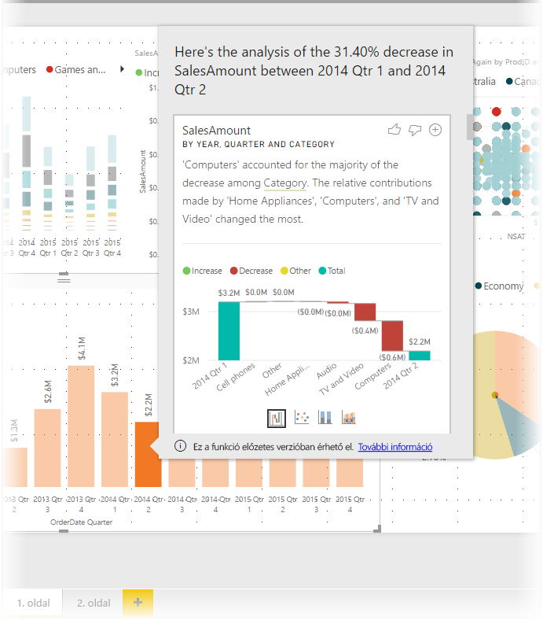
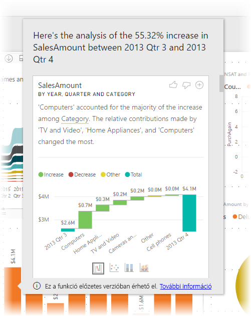
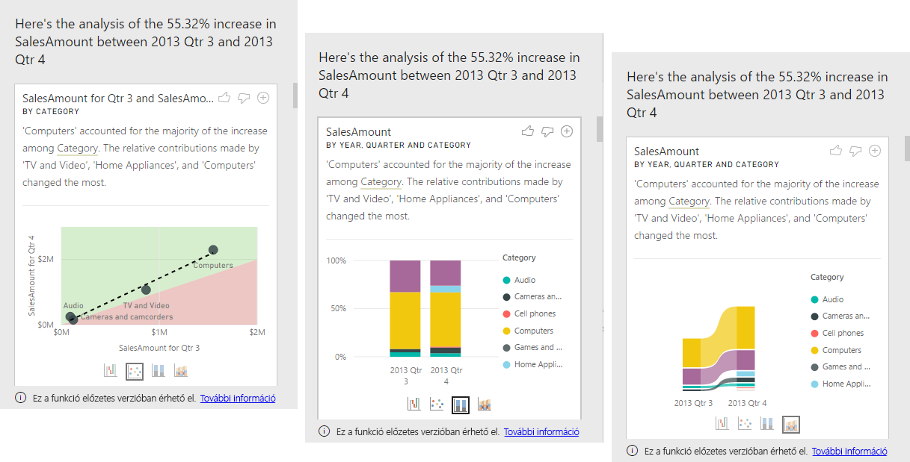

# A vizualizációkban megjelenő növekedések és csökkenések magyarázata a Power BI Desktop elemzéseivel (előzetes verzió)

A vizualizációkban gyakran láthatunk hirtelen növekedéseket, majd gyors visszaeséseket az értékek között, ami elgondolkodtathat, hogy vajon mi okoz ilyen ingadozásokat. A **Power BI Desktop** **elemzéseivel** néhány kattintással megtudhatja ezek okát.

Vegyük példaként a következő vizualizációt, amely az *Értékesítési összeget* *Év* és *Ország* szerint jeleníti meg. 2014-ben nagy csökkenést láthatunk az értékesítésnél, különösen az *1. negyedév* és a *2. negyedév* között. Az ilyen esetekben az adatok feltárásával megértheti a változás okát. 

A **Power BI Desktop** alkalmazáson belül kérheti a diagramokon látható növekedések és csökkenések értelmezését, megnézheti az eloszlási tényezőket, valamint az adatok gyors, automatikus, részletes elemzését is. Egyszerűen a jobb egérgombbal kattintson egy adatpontra, és válassza az **Elemzés > A csökkenés magyarázata** lehetőséget (vagy a növekedés magyarázatát, ha az előző oszlop alacsonyabb volt), vagy az **Elemzés > Az eloszlási különbségek keresése** lehetőséget. A rendszer ezt követően a magyarázatot egy könnyen használható ablakban jeleníti meg.

Az elemzés egy kontextus alapú funkció, amely az előző adatpontokat, például oszlopokat veszi figyelembe.

> [!NOTE]
> Ez a funkció egyelőre előzetes verzióként érhető el, ezért változhat. A **Power BI Desktop** 2017 szeptemberi és az annál újabb verzióiban az elemzés funkció alapértelmezés szerint engedélyezve van és működik (nem kell bejelölnie az előnézeti jelölőnégyzetet az engedélyezéshez).

## Elemzések használata
A diagramok növekedéseit vagy csökkenéseit megmagyarázó elemzések használatához a jobb egérgombbal kattintson egy oszlop- vagy vonaldiagramon található adatpontra, és válassza az **Elemzés > A növekedés magyarázata** lehetőséget (vagy az *A csökkenés magyarázata* lehetőséget, mivel az elemzés az előző adatponthoz viszonyított változást veszi figyelembe).

A **Power BI Desktop** ezt követően futtatja az adatokon a gépi tanulási algoritmusokat, majd feltölti a növekedést vagy csökkenést leginkább befolyásoló kategóriák leírását és vizualizációját egy ablakba. Ahogy az a következő képen látható, alapértelmezés szerint az elemzéseket *vízesés* vizualizáció formájában adja meg a rendszer.

A vízesés vizualizáció alján található kis ikonokra kattintva kiválaszthatja, hogy az elemzés pontdiagram, halmozott oszlopdiagram vagy szalagdiagram formájában jelenjen meg.

A lap tetején található *felfelé mutató hüvelykujj* és *lefelé mutató hüvelykujj* ikonokat használva visszajelzést adhat a vizualizációról és a funkcióról. Bár küldhet így visszajelzést, az algoritmus jelenleg nem tanul ezekből, így ez nem befolyásolja a funkció következő használatakor kapott eredményeket.

Továbbá a vizualizáció tetején található **+** gomb segítségével hozzáadhatja jelentéséhez a kiválasztott vizualizáció ugyanúgy, mintha manuálisan hozta volna létre. Ezt követően tetszőlegesen formázhatja vagy módosíthatja a hozzáadott vizualizációt bármely más, a jelentésében szereplő vizualizációhoz hasonlóan. Csak akkor adhat hozzá egy kiválasztott elemzési vizualizációt, ha a **Power BI Desktopban** szerkeszti a jelentést.

Az elemzéseket akkor használhatja, ha a jelentés olvasási vagy szerkesztési módban van, így azt mind az adatok elemzésére, mind pedig a jelentéshez könnyen hozzáadható vizualizációk létrehozásához is használhatja.

## A kapott eredmények részletei

Az elemzések által kapott adatok fényt derítenek a két időszak közötti eltérésekre, így könnyebben megértheti a változás okát.  

Ha például az *értékesítés* összességében 55%-kal nőtt a *3. negyedév* és a *4. negyedév* között, ami egyformán igaz minden *termékkategóriára* (a számítógépek, hangeszközök és egyebek értékesítése is 55%-kal nőtt), valamint minden országra és minden ügyféltípusra, akkor nagyon nehéz bármit is megállapítani az adatokból, amely megmagyarázná a változást. Általában azonban nem erről van szó, és olyan eltéréseket találhatunk a kategóriák között, mint hogy például a *számítógépek* és az *otthoni berendezések* sokkal nagyobb mértékben, 63 %-kal nőttek, míg a *TV- és hangeszközök* csak 23 %-kal, a *számítógépek* és *otthoni berendezések* így tehát nagyobb mértékben járultak hozzá a *4. negyedévi* összesítéshez, mint a *3. negyedévben*.  A növekedés oka jelen példa alapján tehát az lehet, hogy *a számítógépek és a TV- és hangeszközök értékesítése sokat erősödött*. 

Az algoritmus tehát nem egyszerűen a legnagyobb mértékű változást előidéző értékeket keresi meg. Ha például az értékesítések döntő többsége (98%-a) az Egyesült Államokban történik, a növekedés döntő része is erre az országra esik. Azonban ha az Egyesült Államok vagy egyéb országok nem változtatnak az összesített értékhez való relatív hozzájárulásukon, az *ország* egyáltalán nem számít érdekes szempontnak ebben a kontextusban.  

Az algoritmus a modell összes többi oszlopát felhasználja, és kiszámítja az egyes oszlopok lebontását az adott időszakok *előttre* és *utánra*, így meghatározva az egyes lebontásokban előforduló változások mértékét, majd azonosítva a legnagyobb mértékű változást tartalmazó oszlopokat. A fenti példában például a *kategória* elemet választottuk, mivel a *TV és videó* hozzájárulása 7%-ot esett, 33%-ról 26%-ra, míg az *otthoni berendezések* több mint 6%-ra nőtt a nulláról. 

Minden eredményként megjelenített oszlophoz négy vizualizáció tartozhat. Ezek közül három a két időszak közötti hozzájárulás változását emeli ki. Például a *2. negyedév* és a *3. negyedév* közötti növekedés magyarázatát.

### Pont

A pont vizualizáció az első időszak mértékének értékét jeleníti meg (az x tengelyen) a második időszak mértékének értékével szemben (y tengely), az oszlop (jelen esetben a *kategória* oszlop) minden értékére. Így, ahogyan az alábbi képen is látható, a zöld területre kerülnek azok az adatpontok, amelyek értéknövekedést jeleznek, a piros területre pedig azok, amelyek csökkenést jeleznek. 

A pontozott vonal az ideális állapotot mutatja, az e fölött található adatpontok így az összesített trend mértékénél jobban növekedtek, az alatta található pontok pedig ennél kevésbé.  

Tartsa észben, hogy a bármelyik időszakban üres értékkel rendelkező adatelemek nem jelennek meg a pont vizualizáción (ebben az esetben tehát az *otthoni berendezések*)

### A 100%-ig halmozott oszlopdiagram

A 100%-ig halmozott oszlopdiagram vizualizáció a mérték előtte és utána látható értékét jeleníti meg a kiválasztott oszlop szerint, egy 100%-ig halmozott oszlopban. Így egymás mellett hasonlíthatja össze az előtte és utána történt hozzájárulásokat. Az elemleírások a kiválasztott érték tényleges hozzájárulását jelenítik meg.

### A menüszalag-diagram

A menüszalag-diagram vizualizáció szintén a mérték előtte és utána látható értékét jeleníti meg. Különösen hasznos a hozzájárulások változásainak megjelenítésére akkor, ha megváltozott a hozzájárulások *sorrendje* (ha például a *számítógépek* volt az első számú hozzájáruló, azonban később a harmadik számú lett). 

### A vízesésdiagram

A negyedik vizualizáció a vízesésdiagram, amely a főbb tényleges növekedéseket vagy csökkenéseket jeleníti meg az adott időszakok között. Ez a vizualizáció érthetően mutatja a tényleges változásokat, azonban önmagában nem utal a hozzájárulás szintjében előállt változásokra, amely miatt az algoritmus érdekesnek találta az oszlopot. 

A relatív hozzájárulásban előforduló legnagyobb eltérést mutató oszlop meghatározásakor a program a következőket veszi figyelembe: 

* Számosság, mivel az eltérések statisztikailag kevésbé jelentősek és érdekesek, ha egy oszlop magas számossággal bír. 

* Azon kategóriák eltérései, amelyek esetén az eredeti értékek nagyon magasak, vagy a nullához nagyon közeliek voltak, nagyobb súllyal bírnak. Ha például egy kategória csak az összesített értékesítések 1%-áért felelős, azonban ez 6%-ra változott, az statisztikailag nagyobb jelentőséggel bír, így érdekesebb, mint egy olyan kategória, amelynek hozzájárulása 50%-ról 55%-ra nőtt. 

* A legnagyobb jelentőséggel bíró eredmények kiválasztásában különböző heurisztikák vállalnak szerepet, például az adatok közötti egyéb kapcsolatok.
 
A különböző oszlopok megvizsgálása után a rendszer a relatív hozzájárulásban legnagyobb változást mutatókat választja ki és jeleníti meg. Ezek esetében a leírásban azok az értékek jelennek meg, amelyek a legjelentősebb változást képviselték a hozzájárulásban. Emellett a legnagyobb tényleges növekedéssel és csökkenéssel bíró értékek is megjelennek.

## Megfontolandó szempontok és korlátozások
Mivel ezek az elemzések az előző adatponthoz képest bekövetkezett változást veszik alapul, a vizualizáció első adatpontjának kiválasztása esetén az elemzések nem érhetők el. 

A következő lista a **növekedés/csökkenés magyarázata** jelenleg nem támogatott forgatókönyveit tartalmazza:

* Legjobb N szűrők
* Belefoglalási/kizárási szűrők
* Mérték szűrők
* Nem additív mértékek és összesítések
* Nem numerikus mértékek
* Az „Érték megjelenítési módja” funkció használata
* Szűrt mértékek – A szűrt mértékek olyan vizualizációszintű számítások, amelyekre egy adott szűrőt alkalmaz (például *Franciaország összes értékesítése*). Ezeket az elemzés funkció által létrehozott vizualizációkhoz használhatja
* Az X tengelyen elhelyezkedő kategorikus oszlopok, hacsak nem egy skaláris oszlop szerinti rendezést ír elő. Hierarchia használata esetén a hierarchiában szereplő összes oszlopnak meg kell felelnie az adott feltételnek

Továbbá az elemzések esetében jelenleg nem támogatottak a következő modelltípusok és adatforrások:

* DirectQuery
* Élő kapcsolat
* Helyszíni Reporting Services
* Beágyazás

## Következő lépések
Ha többet szeretne megtudni a **Power BI Desktopról**, illetve a szoftver használatának kezdeti lépéseiről, tekintse meg a következő cikkeket.

* [Mi az a Power BI Desktop?](desktop-what-is-desktop.md)
* [Lekérdezések áttekintése a Power BI Desktopban](desktop-query-overview.md)
* [Adatforrások a Power BI Desktopban](desktop-data-sources.md)
* [Csatlakozás adatokhoz a Power BI Desktopban](desktop-connect-to-data.md)
* [Adatok formázása és kombinálása a Power BI Desktoppal](desktop-shape-and-combine-data.md)
* [Gyakori lekérdezési feladatok a Power BI Desktopban](desktop-common-query-tasks.md)   

