# A Mátrix vizualizáció használata a Power BI Desktopban
A **Mátrix** vizualizációval mátrixvizualizációkat (más néven *táblákat*) hozhat létre a **Power BI Desktop** jelentéseiben, és egyéb vizualizációk mellett keresztkiemelést alkalmazhat a mátrix elemei között. Továbbá kiválaszthat sorokat, oszlopokat vagy egyetlen cellát is, és keresztkiemeléssel láthatja el őket. Végül az elrendezési terület jobb kihasználásának érdekében, a mátrixvizualizáció támogatja a lépcsőzetes elrendezést.

A mátrix számos funkcióval rendelkezik, amelyeket a cikk következő szakaszaiban be is mutatunk.

> [!NOTE]
> A **Power BI Desktop** 2017 júliusi kiadása óta a mátrix- és táblavizualizációk az alkalmazott **Jelentési téma** stílusát tükrözik (beleértve a színeket is). Előfordulhat, hogy nem ezeket a színeket szeretné használni a mátrixvizualizációban. Ezt a **Jelentési téma** konfigurációjában módosíthatja. A témákról szóló további információkért tekintse meg a [**jelentési témák a Power BI Desktopban történő használatát**](desktop-report-themes.md) ismertető szakaszt.
> 
> 

## Hogyan számítja ki a Power BI az összegeket?

A **Mátrix** vizualizáció használatának ismertetése előtt fontos megérteni, hogy a Power BI hogyan számítja ki a táblázatok és mátrixok összegeit és részösszegeit. Az összegeket és részösszegeket tartalmazó sorok esetén a mögöttes adatok összes sorának mértéke adja az összeget, *nem* csak a látható vagy megjelenített sorok értékeinek összege. Ez azt jelenti, hogy az összeget tartalmazó sorban a várttól eltérő értékek szerepelhetnek. 

Tekintse meg az alábbi **Mátrix** vizualizációkat. 

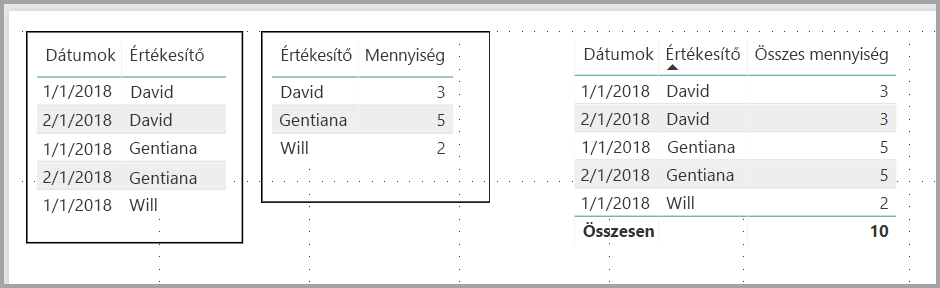

Ebben a példában a jobb szélső **Mátrix** vizualizáció minden sora az egyes értékesítő/dátum kombinációk *összegét* mutatja. Azonban mivel egy értékesítő több dátummal együtt is szerepel, a számok többször is előfordulhatnak. A mögöttes adatok pontos formája, valamint a látható adatok egyszerű összeadása így nem felel meg egymásnak. Ez egy gyakori trend akkor, ha az összegzett érték egy egy-a-többhöz kapcsolat egyéni oldalán áll.

Az összegek és a részösszegek megtekintésekor vegye figyelembe, hogy ezek az értékek a mögöttes adatokon alapulnak, és nem kizárólag a látható értékeken. 

## Lehatolás használata a Mátrix vizualizációval
A **Mátrix** vizualizációval számos érdekes, korábban nem elérhető lehatolási tevékenység hajtható végre. Például a lehatolás sorok, oszlopok vagy külön szakaszok és cellák használatával. Vessünk egy pillantást ezek működésére.

### Sorazonosítókon végzett lehatolás
Amikor a **Vizualizációk** ablaktáblán több mezőt ad hozzá a **Mezők** terület **Sorok** szakaszához, engedélyezi a mátrixvizualizáció sorain végzett lehatolást. Ez hasonlít egy hierarchia létrehozásához, amely utána lehetővé teszi a hierarchián keresztül való lehatolást (majd felhatolást) és az adatok elemzését minden szinten.

Az alábbi képen a **Sorok** szakasz egy *Kategória* és egy *Alkategória* részt tartalmaz, létrehozva egy csoportosítást (vagy hierarchiát) a részletezhető sorokban.

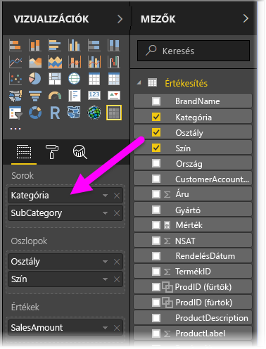

Ha a vizualizáció a **Sorok** szakaszban csoportosítást tartalmaz, a vizualizáció megjeleníti a *részletezés* és *kibontás* ikont a vizualizáció bal felső sarkában.

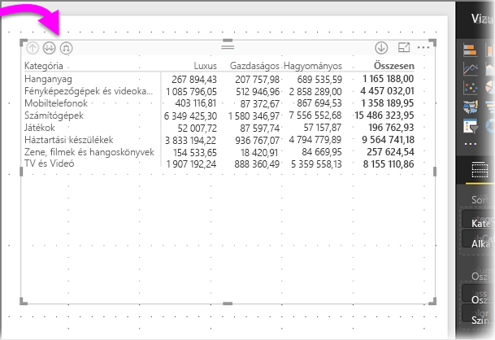

Az egyéb vizualizációk részletezési és kibontási viselkedéséhez hasonlóan, ha ezekre a gombokra kattint, akkor lehetőség nyílik a lehatolásra (vagy felhatolásra) a hierarchián keresztül. Ebben az esetben lehatolhatunk a *Kategóriából* az *Alkategóriához*, ahogy az alábbi képen is látható, ahol a „lehatolás egy szinttel” ikon (a lefelé mutató villa) lett kiválasztva.

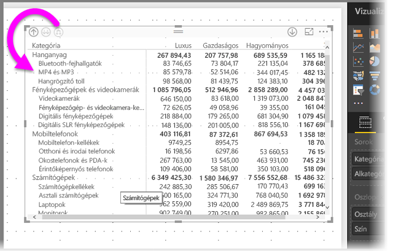

Az ikonok használatán kívül a jobb gombbal is kattinthat bármelyik sorazonosítóra, és részletes elemzést végezhet, ha kiválasztja ezt a lehetőséget a megjelenő menüből.

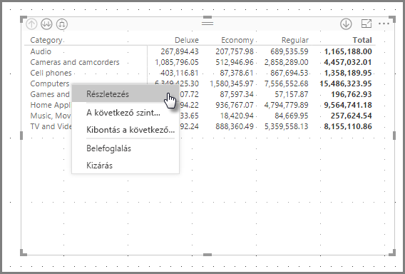

Figyelje meg, hogy van néhány lehetőség a megjelenő menüben, amely különböző eredményekhez vezet:

A **Részletes elemzés** kiválasztása kibontja az *ahhoz* a sorszinthez tartozó mátrixot, *kivéve* az egyéb összes sorfejlécet, annak a sorazonosítónak a kivételével, amelyre a jobb gombbal kattintott. Az alábbi képen a *Számítógépekre* a jobb gombbal kattintottak, és a **Részletes elemzés** lett kiválasztva. Figyelje meg, hogy egyéb legfelső szintű sorok már nem jelennek meg a mátrixban. Ez egy hasznos funkció, amely a **keresztkiemelés** szakaszban válik igazán hasznossá.

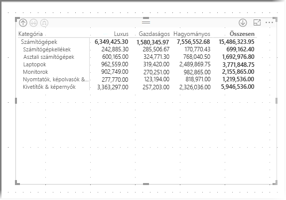

Ha a **Felhatolás** ikonra kattintunk, visszajutunk az előző, legfelső szintű nézethez. Ha ezután a **Következő szint megjelenítése** lehetőséget választja a helyi menüből, megjelenik a következő szinten (ebben az esetben az *Alkategória* mezőben) lévő elemek betűrendbe szedett listája, a magasabb szintű hierarchia-kategorizálás nélkül.

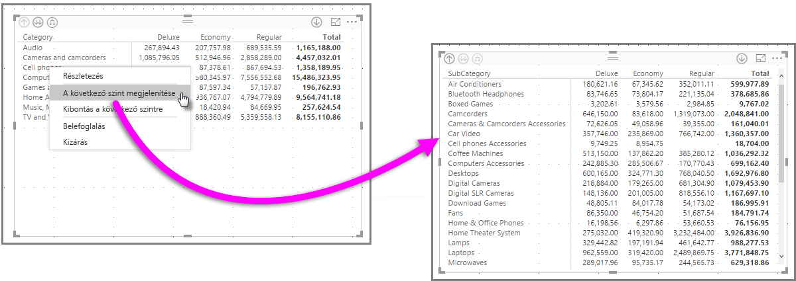

Ha a bal felső sarokban található **Felhatolás** ikonra kattintunk, hogy a mátrix megjelenítse a legfelső szintű kategóriákat, majd a jobb gombbal ismét kattintunk, és kiválasztjuk a **Kibontás a következő szintre** elemet, a következő jelenik meg:

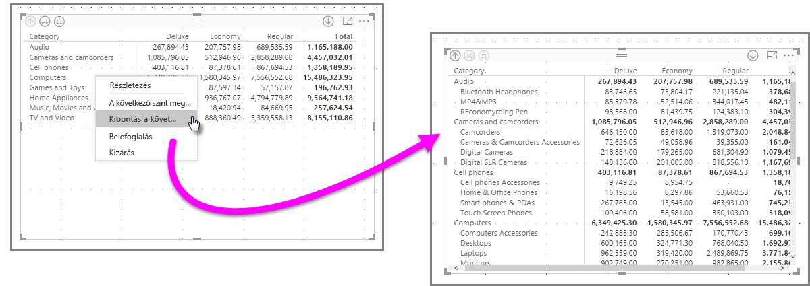

A **Belefoglalás** és a **Kizárás** menüelemet is használhatja annak a sornak (és bármely alkategóriának) a kizáráshoz (vagy eltávolításához) a mátrixból, amelyre a jobb gombbal kattintott.

### Oszlopfejléceken végzett lehatolás
A Sorokon végzett lehatoláshoz hasonlóan, az **Oszlopokon** is végezhet lehatolást. Az alábbi képen két mező található az **Oszlopok** mező területén, egy ahhoz hasonló hierarchiát létrehozva, amilyet a sorokhoz használtunk a cikk korábbi szakaszában. Az **Oszlopok** mező területén az *Osztály* és a *Szín* található.

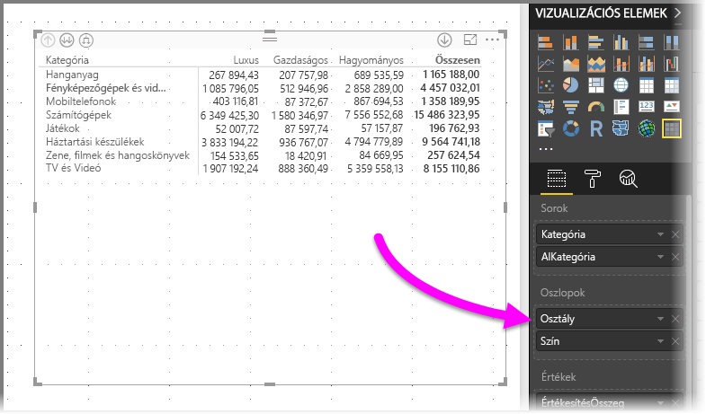

A **Mátrix** vizualizációban, ha a jobb gombbal az oszlopra kattintunk, megjelenik a lehatolás elvégzésének lehetősége. Az alábbi képen a jobb gombbal kattintottunk a *Deluxe* elemre, és kiválasztottuk a **Részletes elemzést**.

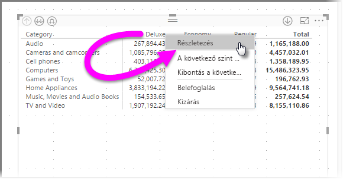

A **Részletes elemzés** kiválasztása után, megjelenik a *Deluxe* oszlophierarchiájának következő szintje, ami ebben az esetben a *Szín*.

A helyi menü többi eleme ugyanúgy működik az Oszlopok, ahogy a sorok esetében (lásd az előző szakaszt: **Sorazonosítókon végzett lehatolás**). **Megjelenítheti a következő szintet**, **kibonthat a következő szintre**, és a sorokhoz hasonlóan **belefoglalhatja** vagy **kizárhatja** az oszlopokat.

> [!NOTE]
> A lehatolás és felhatolás ikonjai a mátrixvizualizáció bal felső sarkában csak a sorokra vonatkoznak. Ha oszlopokon szeretne lehatolást végezni, a helyi menüt kell használnia (a jobb gombbal kattintva).
> 
> 

## Lépcsőzetes elrendezés mátrixvizualizációkkal
A **Mátrix** vizualizáció automatikusan behúzza egy hierarchia alkategóriáit minden szülő alatt, és ezt **lépcsőzetes elrendezésnek** hívjuk.

A mátrixvizualizáció *eredeti* verziójában az alkategóriák egy teljesen külön oszlopban jelentek meg, több helyet foglalva a vizualizációban. Az alábbi képen az eredeti **mátrix**vizualizáció egy táblája látható. Figyelje meg, hogy az alkategóriák egy teljesen külön oszlopban vannak.

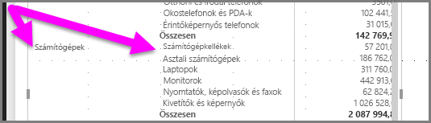

Az alábbi képen a **Mátrix** vizualizáció látható **lépcsőzetes elrendezéssel**. Figyelje meg, hogy a *Számítógépek* kategória saját, kis mértékben behúzott alkategóriákkal rendelkezik (Számítógép-kiegészítők, Asztali számítógépek, Laptopok, Monitorok stb.), ezzel átláthatóbb és tömörebb vizualizációt biztosít.

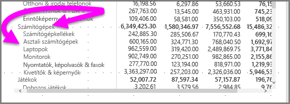

A **lépcsőzetes elrendezés** beállításait egyszerűen módosíthatja. Ha a **Mátrix** vizualizáció van kiválasztva, a **Vizualizációk** ablaktábla **Formátum** szakaszában (festőhenger ikon) bontsa ki a **Sorazonosítók** szakaszt. Két lehetőség érhető el: a **Lépcsőzetes elrendezés** váltógomb (amely ki- vagy bekapcsolja ezt az elrendezést) és a **Lépcsőzetes elrendezés behúzása** (a behúzás mértékét adja meg képpontokban).

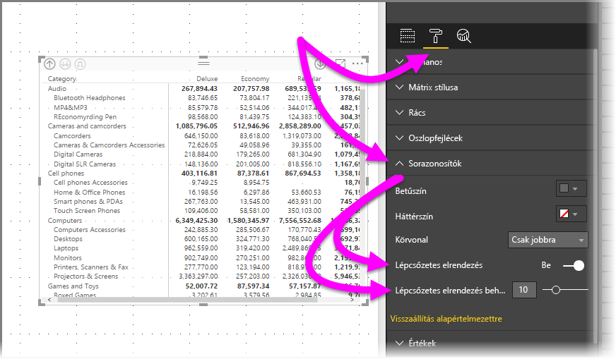

Ha kikapcsolja a **Lépcsőzetes elrendezést**, az alkategóriák egy másik oszlopban jelennek meg, nem pedig a szülőkategória alatt behúzva.

## Részösszegek a mátrixvizualizációkkal
A részösszegeket a soroknál és oszlopoknál is ki- vagy bekapcsolhatja a mátrixvizualizációkban. Az alábbi képen látható, hogy a sorok részösszegei **be** vannak kapcsolva.

A **Vizualizációk** ablaktábla **Formátum** szakaszában (festőhenger ikon) bontsa ki a **Részösszegek** kártyát, és állítsa a **Sorok részösszegei** csúszkát a **Ki** beállításra. Ha így tesz, a részösszegek nem jelennek meg.

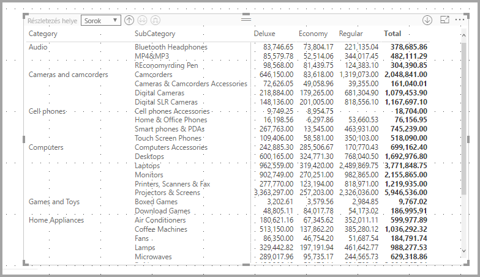

Ugyanez a folyamat vonatkozik az oszlopok részösszegeire.

## Keresztkijelölés a mátrixvizualizációkkal
A **Mátrix** vizualizációval a mátrix bármely eleme kiválasztható a keresztkijelölés alapjaként. Válasszon ki egy oszlopot a **Mátrixban**, ez az oszlop ki lesz emelve csakúgy, mint a jelentés lapon látható bármely egyéb vizualizáció. Ez az egyéb vizualizációk és egy adatpont kiválasztásának közös funkciója volt, de már a **Mátrix** vizualizációnál is elérhető.

Továbbá a Ctrl+kattintás is használható a keresztkijelöléshez. Például az alábbi képen alkategóriák egy gyűjteménye lett kiválasztva a **Mátrix** vizualizációból. Figyelje meg, hogy a vizualizációból ki nem választott elemek kiszürkítve jelennek meg, és az oldalon található egyéb vizualizációk a **Mátrix** vizualizációban végzett kijelöléseket tükrözik.

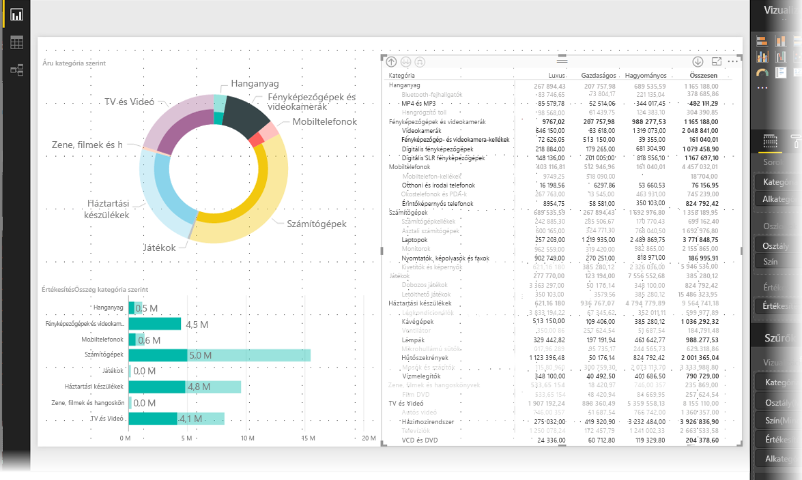

## Árnyékolás és betűtípus mátrixvizualizációkkal
A **Mátrix** vizualizációval **feltételes formázást** (színek és árnyékolás) alkalmazhat a mátrixban található cellák hátterére, valamint magára a szövegre és az értékekre is.

Feltételes formázás alkalmazásához a következő lehetőségek közül választhat, ha ki van választva egy mátrixvizualizáció:

* A **Mezők** ablaktáblán kattintson a jobb gombbal a Mezőre, és a menüből válassza a **Feltételes formázás** elemet.
  
  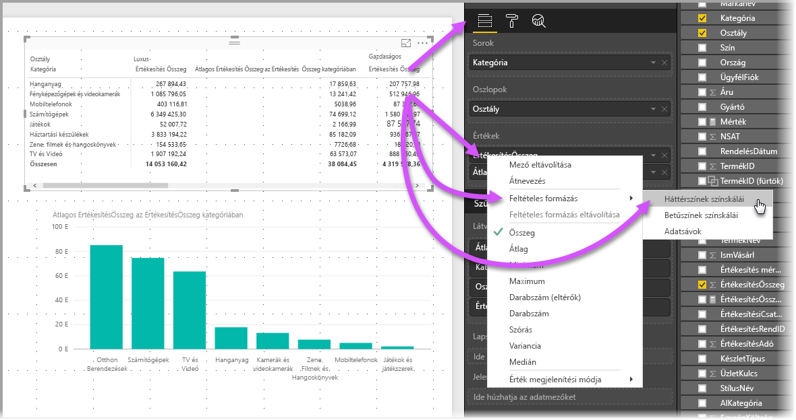
* Vagy a **Formátum** ablaktáblán bontsa ki a **Feltételes formázás** kártyát, és állítsa a **Háttérszínek színskálái** vagy a **Betűszínek színskálái** csúszkát **Be** állapotúra. Bármelyik bekapcsolása után megjelenik a *Speciális vezérlők* hivatkozása, amely lehetővé teszi a színek és a színformátum értékeinek testreszabását.
  
  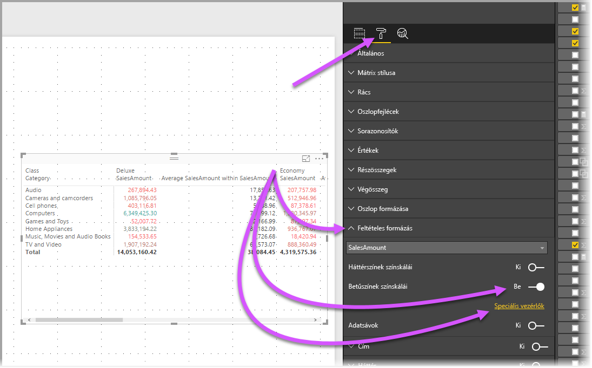

Bármelyik módszerrel ugyanaz az eredmény érhető el. A *Speciális vezérlők* kiválasztása az alábbi párbeszédpanelt jeleníti meg, amely lehetővé teszi a módosítások végrehajtását:

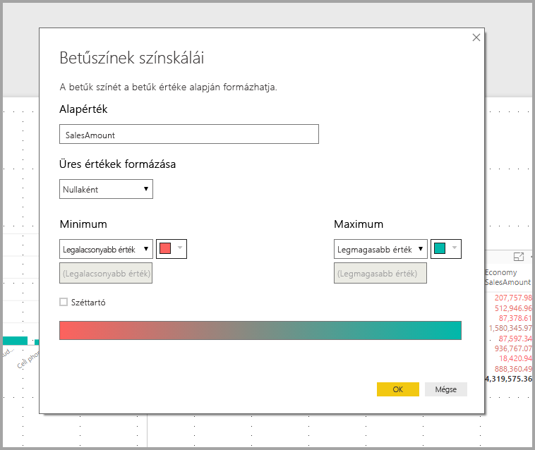

## Következő lépések

Az alábbi cikkeket is érdekesnek találhatja:

* [Rácsvonalak és rácshoz illesztés használata Power BI Desktop-jelentésekben](desktop-gridlines-snap-to-grid.md)
* [Adatforrások a Power BI Desktopban](desktop-data-sources.md)
* [Adattípusok a Power BI Desktopban](desktop-data-types.md)

 