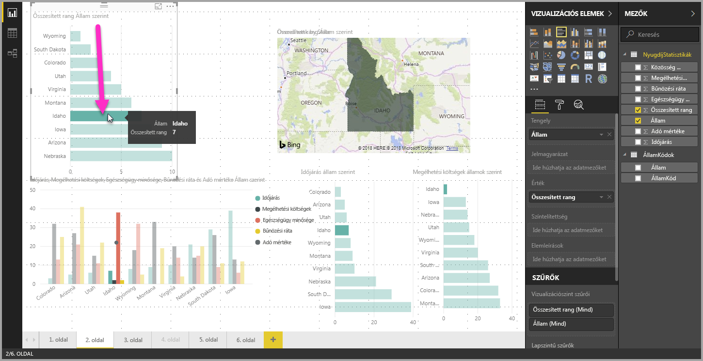
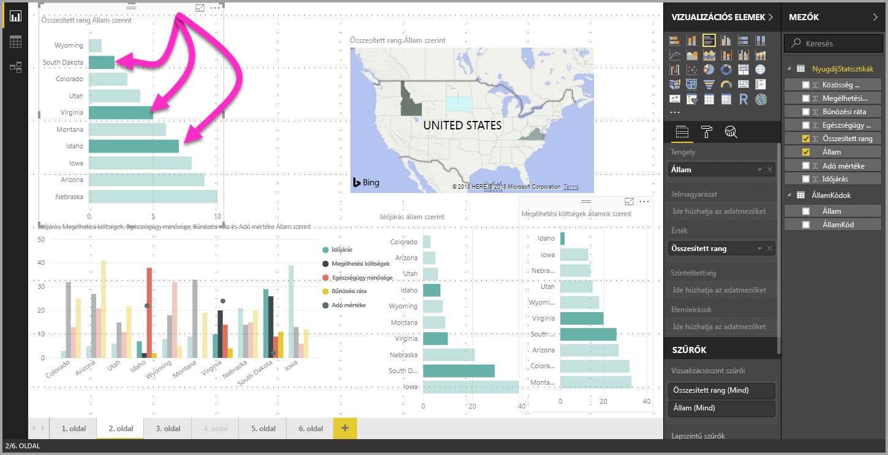

# Adatelemek többszörös kiválasztása a Power BI Desktop használatával

A **Power BI Desktopban** a vizualizációkban az adatpontok egyszerű kattintással emelhetők ki. Ha például egy fontos sávdiagram-elem található valamely vizualizációban, és azt szeretné, ha a jelentésoldal többi vizualizációja is kiemeléssel jelölje azt, akkor az egyik vizualizációban az adatpontra kattinthat, és ennek hatására az oldal többi vizualizációja is megjeleníti az eredményt. Ezt nevezzük alapszintű vagy egyszeres kijelöléses kiemelésnek. Az alábbi képen alapszintű kiemelés látható. 

A többszörös kijelöléssel azonban most már több adatpont is kijelölhető a **Power BI Desktop** jelentésoldalain, és így is kiemelhetők az eredmények az oldal vizualizációiban. Ez egy **and** utasításnak felel meg, azaz olyannak, amely például ezt mondja: „emeld ki az Idaho **és** Virginia államokra vonatkozó eredményeket”. A vizualizációkban a **CTRL + kattintás** művelettel választható ki több adatpont. Az alábbi képen **több adatpont van kiválasztva** többszörös kiválasztást használva.

Ez a funkció meglehetősen egyszerűnek tűnhet, valójában azonban ennek köszönhetően válik lehetővé számos lehetőség a jelentések létrehozásánál, megosztásánál és használatánál. 

## Következő lépések

Az alábbi cikkeket is érdekesnek találhatja:

* [Rácsvonalak és rácshoz illesztés használata Power BI Desktop-jelentésekben](desktop-gridlines-snap-to-grid.md)
* [Szűrők és kiemelés a Power BI-jelentésekben](power-bi-reports-filters-and-highlighting.md)

