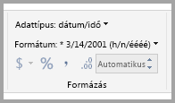
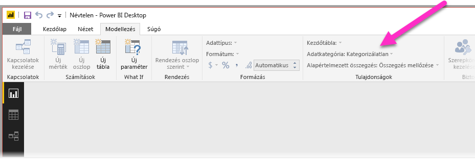
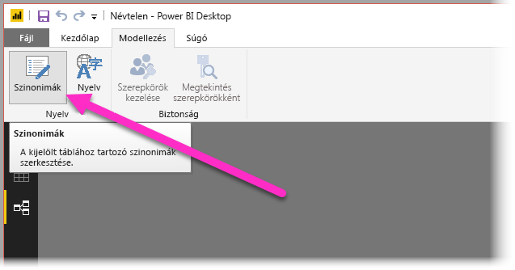
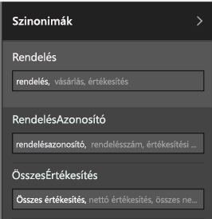

# A Q&A használata a Power BI Desktopban a természetes nyelvű lekérdezések lehetővé tételéhez
Hatékony eszköz a munkához, ha gyakori kifejezéseken és természetes nyelven alapuló kérdéseket tud feltenni az adataival kapcsolatban. Még hatékonyabb, ha az adatforrás válaszol is, és a **Power BI Desktop** alkalmazás Q&A szolgáltatása épp ezt teszi lehetővé.

Annak érdekében, hogy a Q&A sikeresen értelmezni tudja azt a nagyszámú kérdést, amelynek a megválaszolására képes, feltételezéseket kell tennie a modellről. Ha a modell struktúrája ezen feltételezések közül egynek vagy többnek nem felel meg, akkor módosítania kell a modellt. A Q&A használatához elvégzendő módosítások olyan általános optimalizálási elveket követnek, amelyeket minden Power BI-modellen érdemes elvégeznie, függetlenül attól, hogy használja-e a Q&A szolgáltatást. 

Az alábbi szakaszokból megtudhatja, hogyan módosíthatja a modelljét annak érdekében, hogy azt hatékonyan tudja használni a Power BI Q&A szolgáltatása.

## Hiányzó kapcsolatok hozzáadása

Ha a modellből hiányoznak táblák közötti kapcsolatok, akkor sem a Power BI-jelentések, sem pedig a Q&A szolgáltatás nem tudja kikövetkeztetni a vonatkozó táblák összekapcsolásának módját, ha kérdést tesz fel velük kapcsolatban. A kapcsolatok a megfelelő modellek legfontosabb elemei. Nem tehet fel például kérdést egy adott városban lévő ügyfelek összes értékesítéséről, ha hiányzik a *rendelések* tábla és az *ügyfelek* tábla közötti kapcsolat. Az alábbi képeken láthat egy olyan modellt, amely módosítást igényel, valamint egy olyan modellt, amely készen áll a Q&A szolgáltatással való használatra.

**Módosítást igényel**

**Készen áll a Q&A használatára**

## Táblák és oszlopok átnevezése

A táblák és oszlopok neveinek megválasztása nagyon fontos a Q&A használatához. Ha például van egy *Ügyféllista* nevű táblája, mely az ügyfelek listáját tartalmazza, akkor a „Budapesti ügyféllista listázása” lekérdezést kell használnia a „Budapesti ügyfelek listázása” lekérdezés helyett. 

Míg a Q&A képes például szavakra felosztani az elnevezéseket, illetve észlelni a többes számot, a Q&A feltételezi, hogy a táblák és az oszlopok neve pontosan tükrözi a tartalmukat.

Lássunk egy újabb példát. Tegyük fel, hogy van egy *Személyzet* nevű táblánk, mely utóneveket és vezetékneveket, valamint alkalmazotti azonosítókat tartalmaz, illetve van egy *Alkalmazottak* nevű táblánk, mely tartalmazza az alkalmazotti azonosítókat, a beosztások azonosítóit, valamint a kezdési dátumokat. Ez ugyan érthető lehet a modellt ismerő személyek számára, de ha egy másik felhasználó feltesz egy kérdést az „alkalmazottak számát” illetően, akkor az „Alkalmazottak” táblában lévő sorok számát fogja megkapni válaszként, miközben valószínűleg nem erre volt kíváncsi, hiszen ez az összes alkalmazott által valaha is betöltött beosztások száma. Célszerű átnevezni ezeket a táblákat, hogy pontosan tükrözzék, mit is tartalmaznak.

**Módosítást igényel**

**Készen áll a Q&A használatára**

## Helytelen adattípusok javítása

Az importált adatokhoz helytelen adattípus lehet beállítva. A Q&A a *karakterláncként* importált *dátum* és *szám* típusú oszlopokat például nem fogja dátumként, illetve számként értelmezni. Ügyeljen rá, hogy a megfelelő adattípust válassza a Power BI-modellben.

## Az évet és az azonosítót tartalmazó oszlopoknál állítsa be az „Összegzés mellőzése” lehetőséget

A Power BI alapértelmezés szerint agresszíven aggregálja a numerikus oszlopokat, ezért néha előfordulhat például, hogy az olyan kérdések esetében, mint például az „összes értékesítés évenként”, az értékesítés végösszegét és az évek végösszegét kapja meg válaszként. Ha meghatározott oszlopok esetében nem szeretné, hogy a Power BI hasonlóan járjon el, állítsa az oszlop **Összegzés szempontja** tulajdonságát az **Összegzés mellőzése** értékre. Fordítson különös figyelmet az **évet**, **hónapot**, **napot** és **azonosítót** tartalmazó oszlopokra, mivel ezek okozzák a legtöbb problémát. Más, összegzésre alkalmatlan oszlopoknál, mint például az *életkor*, szintén célszerű lehet az **Összegzés szempontja** tulajdonságot az **Összegzés mellőzése** vagy az **Átlag** értékre állítani. Ezt a beállítást a **Modellezés** lapon találhatja meg.

## Adatkategória választása a dátumot és földrajzi helyet tartalmazó oszlopokhoz

Az **Adatkategória** beállítással az adattípuson kívül további szemantikai információt is megadhat az oszlopok tartalmával kapcsolatban. Egy egész számokat tartalmazó oszlopot elláthat például az Irányítószám jelöléssel, egy karakterláncokat tartalmazó oszlopot pedig Város, Megye, Régió vagy más hasonló jelöléssel. Ezeket az információkat a Q&A két lényeges módon használja: A vizualizációk kiválasztásához, valamint a nyelvi feldolgozáshoz.

Egyrészt a Q&A az **Adatkategória** információit figyelembe veszi annak megállapításánál, hogy milyen típusú vizualizációt kell használnia. Felismeri például, hogy azok az oszlopok, amelyeknél az **Adatkategória** dátum vagy idő, jellemzően jól alkalmazhatók vonaldiagramok vízszintes tengelyeként, illetve buborékdiagramok lejátszási tengelyeként. Emellett azt is feltételezi, hogy ha egy oszlop **Adatkategóriája** földrajzi, akkor az azt tartalmazó eredmény jól mutathat térképen megjelenítve.

Másrészt a Q&A tesz néhány feltételezést azzal kapcsolatban, hogy a felhasználók vélhetően milyen módon említik a dátumokat és a földrajzi helyeket tartalmazó oszlopokat, ezzel segítve bizonyos típusú kérdések megértését. Ha például a „mikor” szót használja egy alkalmazott felvételéről szóló kérdésben, akkor azt szinte biztosan egy dátumoszlopként azonosítja a szolgáltatás, míg az „ügyfelek száma Hatvanban” lekérdezésben a „Hatvan” szót valószínűleg a várossal azonosítja, nem pedig a számmal.

## „Rendezés más oszlop alapján” tulajdonság választása a kapcsolódó oszlopokban

A **Rendezés más oszlop alapján** tulajdonság lehetővé teszi, hogy egy oszlopot automatikusan egy másik oszlop szerint rendezzen. Ha például az ügyfelek pólóméret szerinti rendezését kéri, akkor a Pólóméret oszlopot valószínűleg az alapul szolgáló méretszám szerint szeretné rendezni (XS, S, M, L és XL), nem pedig betűrend szerint (L, M, S, XL, XS).

## A modell normalizálása

Ne aggódjon, nem fogjuk azt javasolni, hogy alakítsa át a teljes modellt. Vannak azonban olyan struktúrák, amelyek egyszerűen annyira nehezen értelmezhetők, hogy a Q&A nem fogja tudni jól használni őket. Ha elvégez néhány alapvető normalizálási teendőt a modell szerkezetén, a Power BI-jelentések felhasználhatósága jelentősen megnő, csakúgy mint a Q&A-eredmények pontossága.

Az általános követendő szabály a következő: Minden egyedi „dolognak”, amelyet a felhasználó megemlít, pontosan egyetlen modellbeli objektumnak (táblának vagy oszlopnak) kell megfelelnie. Tehát ha a felhasználók ügyfeleket említenek, akkor egyetlen *ügyfél* objektumnak kell szerepelnie a modellben. Ha pedig a felhasználók értékesítéseket említenek, akkor egyetlen *értékesítés* objektum kell lennie. Egyszerűen hangzik, igaz? Az adatok kezdeti elrendezésétől függően valóban az lehet. Ha szüksége van rá, a **Lekérdezésszerkesztőben** rengeteg adatalakítási képességet elérhet, míg az egyszerűbb átalakítások közül sok elvégezhető egyszerűen a Power BI-modellben végzett számításokkal.

Az alábbi szakaszokban ismertetünk néhány olyan gyakori átalakítást, amelyet elképzelhető, hogy végre kell hajtania.

### Új táblák létrehozása a többoszlopos entitásokhoz

Ha több oszlop egyetlen különálló egységet jelképez egy nagyobb táblán belül, akkor ezeket az oszlopokat javasolt különválasztania egy önálló táblába. Ha például a *Cégek* táblában található Kapcsolattartó neve, Kapcsolattartó beosztása és Kapcsolattartó telefonszáma oszlop, akkor helyesebb, ha létrehoz egy különálló *Kapcsolattartók* táblát a Név, Beosztás és Telefonszám oszloppal, és összeköti azt a *Cégek* táblával. Ha így tesz, azzal nagyban megkönnyíti a felhasználók számára, hogy olyan kérdéseket tegyenek fel a kapcsolattartókra vonatkozóan, amelyek függetlenek azoktól a cégektől, melyeknek a kapcsolattartói, illetve a megjelenítést is rugalmasabbá teszi.

**Módosítást igényel**

**Készen áll a Q&A használatára**

### Adatok elforgatása a tulajdonságcsomagok megszüntetéséhez

Ha a modelljében tulajdonságcsomagok találhatók, azokat át kell strukturálni tulajdonságonként egyetlen oszlop használatára. A tulajdonságcsomagok, még ha kényelmes módot is nyújtanak nagyszámú tulajdonság kezeléséhez, természetüknél fogva számos olyan korlátozást tartalmaznak, amelyek megkerülésére sem a Power BI-jelentések, sem a Q&A nincs felkészítve.

Tegyük fel például, hogy van egy *Ügyféldemográfia* nevű tábla egy Ügyfélazonosító, egy Tulajdonság és egy Érték oszloppal, melyben az egyes sorok az ügyfél különböző tulajdonságait tartalmazzák (például életkor, családi állapot, város, stb.). Ez esetben az Érték oszlop jelentését túlterheli a Tulajdonság oszlop tartalma, és ez ellehetetleníti a Q&A számára az ezen adatokra vonatkozó legtöbb kérdés értelmezését. Még így is működhetnek az egyszerű kérdések, például ha az egyes ügyfelek életkorának megjelenítését kéri, mert ez a kérdés értelmezhető a következőként: „mutasd meg az ügyfeleket és az ügyfelek demográfiai adatait, ahol a tulajdonság az életkor”. Ez a modellstruktúra azonban nem teszi lehetővé a kissé összetettebb kérdések megválaszolását, ideértve például, ha egy adott városban lévő ügyfelek átlagos életkorára kíváncsi. A Power BI-jelentésekkel közvetlenül dolgozó felhasználók időnként találhatnak ötletes módszereket a keresett adatok elérésére, de a Q&A általánosságban csak akkor működik megfelelően, ha az egyes oszlopoknak egyetlen jelentése van.

**Módosítást igényel**

**Készen áll a Q&A használatára**

### Particionálás megszüntetése egyesítéssel

Ha az adatait több táblára particionálta, vagy ha elforgatta több oszlop értékeit, akkor a felhasználók számos gyakori műveletet nehezen vagy egyáltalán nem fognak tudni végrehajtani. Vegyük példaként a táblák particionálásának egy gyakori módját: az *Értékesítések2000-2010* táblát és az *Értékesítések2011-2020* táblát. Ha az összes lényeges jelentés egy adott évtizedre korlátozódik, akkor valószínűleg meghagyhatja ezt a struktúrát a Power BI-jelentésekhez. A Q&A rugalmassága miatt azonban a felhasználók megfelelő választ fognak várni az „összes értékesítés évenként” típusú kérdésekre. Ahhoz, hogy ezek működjenek, egyetlen táblában kell egyesítenie az adatokat a Power BI-modellben.

Hasonlóképpen vegyük egy átlagos elforgatott értékoszlop esetét: ilyen a *Könyvturné* tábla, mely a Szerző, a Könyv, illetve a Város1, a Város2 és a Város3 oszlopot tartalmazza. Ilyen struktúra esetén még a „könyvek száma városonként” típusú egyszerű kérdések sem értelmezhetők helyesen. A probléma megoldásához létre kell hoznia egy különálló *KönyvturnéVáros* táblát, mely a városok értékeit egyetlen oszlopban egyesíti.

**Módosítást igényel**

**Készen áll a Q&A használatára**

### Formázott oszlopok felosztása

Ha az adatokat olyan forrásból importálja, amely formázott oszlopokat tartalmaz, a Power BI-jelentések (és a Q&A) nem fogják tudni elérni az oszlopok tartalmát annak elemzéséhez. Ha tehát van például egy **Teljes cím** nevű oszlop, mely tartalmazza a címet, a várost és az országot, akkor javasolt ezt felosztani egy Cím, egy Város és egy Ország oszlopra, hogy a felhasználók ezeket külön-külön is lekérdezhessék.

**Módosítást igényel**

**Készen áll a Q&A használatára**

Hasonló módon, ha a személyek nevéhez egy teljes nevet tartalmazó oszlopot használ, adja hozzá az **Utónév** és a **Vezetéknév** oszlopot is arra az esetre, ha egy felhasználó a nevek egy részéről szeretne kérdéseket feltenni. 

### Új táblák létrehozása a többértékes oszlopokhoz

A fentiekhez hasonlóan, ha az adatokat olyan forrásból importálja, amely többértékes oszlopokat tartalmaz, a Power BI-jelentések (és a Q&A) nem fogják tudni elérni az oszlopok tartalmát annak elemzéséhez. Ha például van egy Zeneszerző nevű oszlop, amely egy zeneszám több zeneszerzőjének nevét is tartalmazza, akkor azt fel kell osztania több oszlopra egy különálló *Zeneszerzők* táblában.

**Módosítást igényel**

**Készen áll a Q&A használatára**

### Inaktív kapcsolatok megszüntetése denormalizálással

Az az egyetlen kivétel azon szabály alól, hogy „normalizálni jobb”, amikor egynél több úton is el lehet jutni egyik táblából egy másikba. Ha például van egy *Repülőjáratok* nevű táblája, mely az IndulóVárosAzonosítója és a CélvárosAzonosítója oszlopot egyaránt tartalmazza, és mindkettő a *Városok* táblához kapcsolódik, akkor ezen kapcsolatok egyikét inaktívnak kell jelölnie. Mivel a Q&A csak az aktív kapcsolatokat tudja használni, nem tudna kérdéseket feltenni vagy az induló városról, vagy pedig a célvárosról, attól függően, hogy melyik kapcsolatát inaktiválja. Ha ehelyett denormalizálja a városnevek oszlopait a *Repülőjáratok* táblában, akkor tud olyan kérdéseket feltenni, amelyek mind az induló városra, mind pedig a célvárosra utalnak.

**Módosítást igényel**

**Készen áll a Q&A használatára**

### Szinonimák hozzáadása a táblákhoz és az oszlopokhoz

Ez a lépés kifejezetten a Q&A szolgáltatásra vonatkozik (és általánosságban nem szükséges a Power BI-jelentésekhez). A felhasználók gyakran többféleképpen utalnak ugyanarra a dologra. Ilyen például az összes értékesítés, a nettó értékesítés és a teljes nettó értékesítés. A Power BI modellje lehetővé teszi, hogy hozzáadja ezeket a szinonimákat a modellben használt táblákhoz és oszlopokhoz. 

Ez a lépés rendkívül fontos lehet. Még ha egyszerű táblaneveket és oszlopneveket is használ, a Q&A szolgáltatásban kérdéseket feltevő felhasználók a számukra logikus szavakat fogják használni, és nem az oszlopok előre megadott listájából választanak. Minél több hasznos szinonimát tud hozzáadni, annál jobb lesz a felhasználók élménye a jelentés használatakor. Szinonimák hozzáadásához a **Kapcsolatok** nézetben válassza a menüszalag Szinonimák gombját az alábbi képen látható módon.

Ekkor megjelenik a **Szinonimák** mező a **Power BI Desktop** alkalmazás ablakának jobb oldalán, melyben hozzáadhatja a szinonimákat, ahogy azt az alábbi kép szemlélteti.

 Legyen óvatos a szinonimák hozzáadásakor, mivel ha ugyanazt a szinonimát egynél több oszlophoz vagy táblához is hozzáadja, az kétértelműséghez vezet. A Q&A a környezeti adatok felhasználásával megpróbálja a helyes szinonimát választani kétértelműség esetén, de nem mindig áll rendelkezésre elegendő környezeti adat. Ha például egy felhasználó az ügyfelek számáról érdeklődik, és a modelljében három dologhoz is hozzáadta az „ügyfél” szinonimát, akkor elképzelhető, hogy a felhasználó nem a keresett választ fogja kapni. Ilyen esetben mindenképp ügyeljen arra, hogy egyedi elsődleges szinonimát adjon meg, mivel ez a szinonima jelenik meg, amikor a rendszer megjeleníti a kérdést átfogalmazva. Ez segíthet a felhasználóknak észrevenni a kétértelműséget (például ha az átfogalmazás az „archivált ügyfélrekordokat” említi), mely jelezheti számukra, hogy érdemes lehet másként feltenni a kérdést.

## Következő lépések
A Power BI Desktop funkcióival kapcsolatban az alábbi cikkekben találhat további információt:

* [Részletezés használata a Power BI Desktopban](desktop-drillthrough.md)
* [Irányítópult-csempe vagy jelentésvizualizáció megjelenítése Fókusz módban](service-focus-mode.md)

