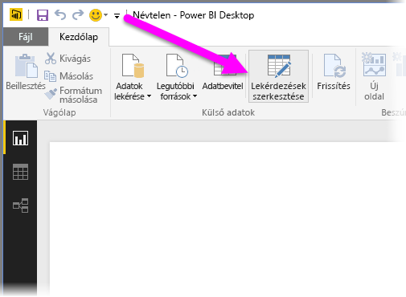
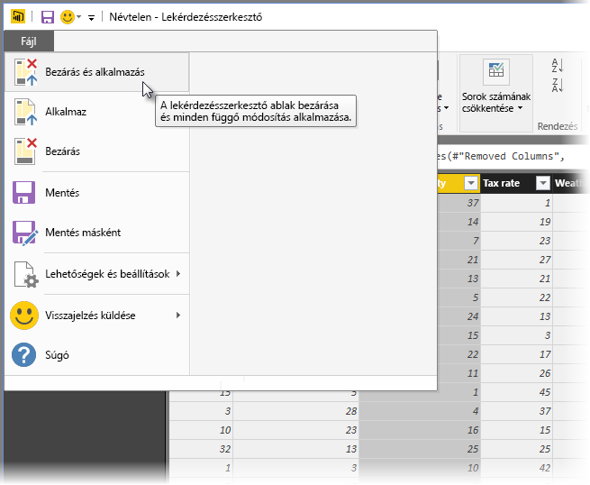

# Lekérdezések áttekintése a Power BI Desktopban
A **Power BI Desktop** segítségével adatokhoz csatlakozhat, lenyűgöző, alapvető fontosságú jelentéseket hozhat létre, és megoszthatja munkája eredményét másokkal, akik az Ön munkája alapján megalapozottabb üzleti döntéseket hozhatnak.

A Power BI Desktopban három nézet érhető el:

* **Jelentés** nézet – ebben a nézetben a lekérdezések segítségével lenyűgöző vizualizációkat hozhat létre, amelyeket tetszése szerint rendezhet el akár több oldalon, valamint megoszthat másokkal.
* **Adatok** nézet – a jelentésben szereplő adatokat adatmodell-formátumban jelenítheti meg, így értékeket adhat hozzá, új oszlopokat hozhat létre és kezelheti a kapcsolatokat.
* **Kapcsolatok** nézet – megtekintheti az adatmodellben létrehozott kapcsolatok grafikus ábrázolását, illetve szükség szerint kezelheti és módosíthatja a kapcsolatokat.

Ezek a nézetek a Power BI Desktop három bal oldali ikonjának egyikére kattintva érhetők el. Az alábbi ábrán a Jelentés nézet van kiválasztva, amelyet az ikon melletti sárga szalag jelöl.  

A Power BI Desktop beépített **Lekérdezésszerkesztőt** is tartalmaz, amellyel csatlakozhat egy vagy több adatforráshoz, igény szerint formázhatja és alakíthatja át az adatokat, majd az elkészült modellt betöltheti a Power BI Desktopba.

Ez a dokumentum áttekintést nyújt az adatok **Lekérdezésszerkesztőben** való használatáról. Természetesen többet is megtudhat a dokumentum végén található hivatkozásokkal, amelyek a támogatott adattípusokkal, az adatokhoz való kapcsolódással, az adatok formázásával, a kapcsolatok létrehozásával, illetve a kezdeti lépésekkel kapcsolatos részletes útmutatókra mutatnak.

Először azonban ismerkedjünk meg a **Lekérdezésszerkesztővel**.

## A Lekérdezésszerkesztő
A **Lekérdezésszerkesztő** megnyitásához válassza a **Lekérdezések szerkesztése** lehetőséget a Power BI Desktop **Kezdőlapján**.  

Adatkapcsolatok hiányában a **Lekérdezésszerkesztő** üres panelként jelenik meg, amely készen áll az adatok fogadására.  

Egy lekérdezés betöltése után a **Lekérdezésszerkesztő** nézete máris érdekesebbé válik. Ha csatlakoztatja az alábbi webes adatforrást, a **Lekérdezésszerkesztő** betölti az információkat az adatokról, és hozzáláthat az alakításukhoz.

[*http://www.bankrate.com/finance/retirement/best-places-retire-how-state-ranks.aspx*](http://www.bankrate.com/finance/retirement/best-places-retire-how-state-ranks.aspx)

Lássuk, hogyan néz ki a **Lekérdezésszerkesztő** az adatkapcsolat létrehozása után:

1. A menüszalagon számos gomb aktív, amelyekkel a lekérdezésben szereplő adatokat kezelheti.
2. A bal oldali panelen lévő listából kijelölheti, megtekintheti és alakíthatja a lekérdezéseket.
3. A középső panelen a kiválasztott lekérdezésből származó adatok jelennek meg, amelyeket formázhat.
4. Megjelenik a **Lekérdezés beállításai** ablak, amelyben a lekérdezés tulajdonságai, valamint az alkalmazott lépések szerepelnek.  
   
   

A következő szakaszokban bemutatjuk a négy említett területet: a menüszalagot, a lekérdezések panelt, az adatok nézetet és a Lekérdezés beállításai panelt.

## A Lekérdezések menüszalag
A **Lekérdezésszerkesztő** menüszalagja négy fület tartalmaz: **Kezdőlap**, **Átalakítás**, **Oszlop hozzáadása** és **Nézet**.

A **Kezdőlap** fül általános lekérdezési feladatokat tartalmaz, köztük az **Adatok lekérése** utasítást, amely minden lekérdezés első lépése. Az alábbi ábrán a **Kezdőlap** látható a menüszalagon.  

Az adatokhoz való csatlakozáshoz és a lekérdezés létrehozásának megkezdéséhez válassza az **Adatok lekérése** gombot. Ekkor megjelenik a leggyakoribb adatforrásokat tartalmazó menü.  

További információ az elérhető adatforrásokról: **Adatforrások**. További információ az adatokhoz való csatlakozásról, példákkal és a szükséges lépésekkel: **Csatlakozás adatokhoz**.

Az **Átalakítás** lapon a leggyakoribb adatátalakítási feladatokhoz férhet hozzá, mint például az oszlopok hozzáadása és eltávolítása, adattípusok módosítása, oszlopok felosztása, valamint egyéb adatvezérelt munkafolyamatok. Az alábbi ábrán az **Átalakítás** lap látható.  

További információ az adatok átalakításáról, példákkal: **Adatok kombinálása és formázása**.

Az **Oszlop hozzáadása** lap az oszlopok hozzáadásával, az oszlop adatainak formázásával és az egyéni oszlopok hozzáadásával kapcsolatos további feladatokat tartalmaz. Az alábbi ábrán az **Oszlop hozzáadása** lap látható.  

A menüszalagon található **Nézet** fül segítségével állíthatja be, hogy mely panelek és ablakok jelenjenek meg. Ezen kívül a Speciális szerkesztő megjelenítéséhez is használható. Az alábbi ábrán a **Nézet** fül látható.  

Hasznos tudnivaló, hogy a menüszalagon elérhető feladatok közül sokat a középső panelen, egy oszlopra vagy egyéb adatra jobb gombbal kattintva is elérhet.

## A bal oldali panel
A bal oldali panelen megjelenik az aktív lekérdezések száma, valamint a lekérdezés neve. Ha a bal oldali panelen kiválaszt egy ablaktáblát, a benne szereplő adatok megjelennek a középső panelen, ahol igény szerint átalakíthatók és formázhatók. Az alábbi ábrán a bal oldali panel látható, amely több lekérdezést tartalmaz.  

## A középső (adatok) panel
A középső panelen, vagy más néven az Adatok panelen a kiválasztott lekérdezésből származó adatok jelennek meg. A Lekérdezés nézet feladatainak legnagyobb része itt végezhető el.

Az alábbi ábrán a korábban létrehozott webes adatkapcsolat látható, ahol az **Overall score** (Összpontszám) oszlop van kiválasztva, a fejlécen a jobb gombbal kattintva elérhető helyi menü elemeivel együtt. Figyelje meg, hogy a helyi menü elemei megegyeznek a menüszalag fülein szereplő gombokkal.  

A helyi menü egyik elemére (vagy a menüszalag egyik gombjára kattintva) a lekérdezés elvégzi az adott lépést az adatokon, és menti a lekérdezés részeként. A **Lekérdezés beállításai** panel sorrendben rögzíti ezeket a lépéseket, a következő szakaszban leírtak szerint.  

## A Lekérdezés beállításai panel
A **Lekérdezés beállításai** panelen jelenik meg a lekérdezéshez tartozó összes lépés. Például a következő ábrán a **Lekérdezés beállításai** panel **Alkalmazott lépések** szakaszában megjelenik, hogy az imént módosította az **Overall Score** (Összpontszám) oszlop típusát.

A lekérdezésen végrehajtott további módosítási lépéseket az **Alkalmazott lépések** szakaszban rögzíti a rendszer.

Fontos tudnivaló, hogy az alapul szolgáló adatok *nem* változnak, hanem a Lekérdezésszerkesztő igazítja és formázza az adatok nézetét, és az alapul szolgáló adatokon végzett minden művelet az adatoknak a Lekérdezésszerkesztőben megjelenő formázott és módosított nézete alapján történik.

A **Lekérdezés beállításai** panelen igény szerint átnevezheti, törölheti, vagy átrendezheti a lépéseket. Ehhez kattintson a jobb gombbal az **Alkalmazott lépések** szakaszra, és válasszon a megjelenő helyi menüből. A rendszer minden lekérdezési lépést az **Alkalmazott lépések** panelen látható sorrendben végez el.

## A Speciális szerkesztő
Ha szeretné látni a kódot, amelyet a Lekérdezésszerkesztő az egyes lépésekkel létrehoz, vagy egyéni formázási kódot szeretne létrehozni, használhatja a **Speciális szerkesztőt**. A speciális szerkesztő elindításához a menüszalagon válassza a **Nézet** elemet, majd a **Speciális szerkesztő** lehetőséget. Ekkor megjelenik az aktuális lekérdezési kódot tartalmazó ablak.  

A kódot a **Speciális szerkesztő** ablakban közvetlenül szerkesztheti. Az ablak bezárásához válassza a **Kész** vagy a **Mégse** gombot.  

## A munka mentése
Ha elérte a lekérdezés kívánt formáját, a Lekérdezésszerkesztővel alkalmazhatja a beállításokat a Power BI Desktopban szereplő adatmodellre, és bezárhatja a Lekérdezésszerkesztőt. Ehhez válassza a **Bezárás és alkalmazás** elemet a Lekérdezésszerkesztő **Fájl** menüjében.  

A Power BI Desktop egy párbeszédpanelen jeleníti meg a folyamat állapotát.  

Ha elérte a lekérdezés kívánt formáját, vagy szeretné menteni az eddigi munkát, a Power BI Desktop egy .pbix fájlban menti a munkát.

A munka mentéséhez válassza a **Fájl \> Mentés** (vagy **Fájl \> Mentés másként**) lehetőséget, ahogy azt az alábbi ábra is mutatja.  

## Következő lépések
A Power BI Desktop műveletek és lehetőségek széles tárházát tartalmazza. A program képességeivel kapcsolatos további információkért lásd az alábbi forrásanyagokat:

* [Első lépések a Power BI Desktopban](desktop-getting-started.md)
* [Adatforrások a Power BI Desktopban](desktop-data-sources.md)
* [Csatlakozás adatokhoz a Power BI Desktopban](desktop-connect-to-data.md)
* [Adatok formázása és kombinálása a Power BI Desktoppal](desktop-shape-and-combine-data.md)
* [Gyakori lekérdezési feladatok a Power BI Desktopban](desktop-common-query-tasks.md)   

