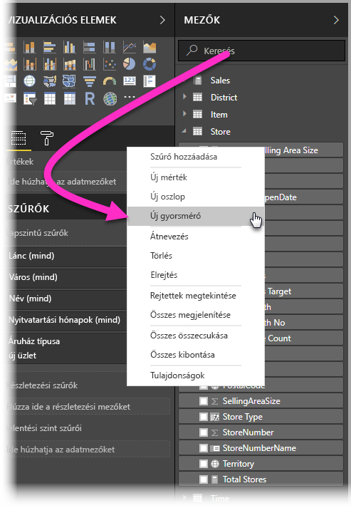
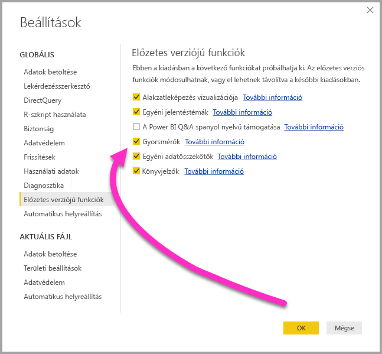
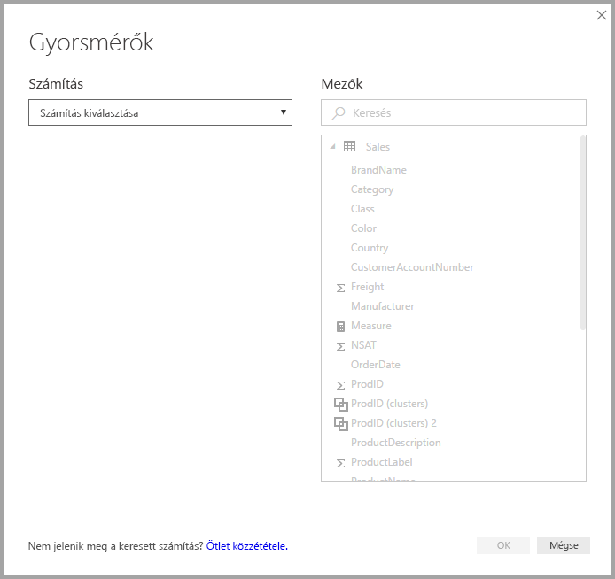
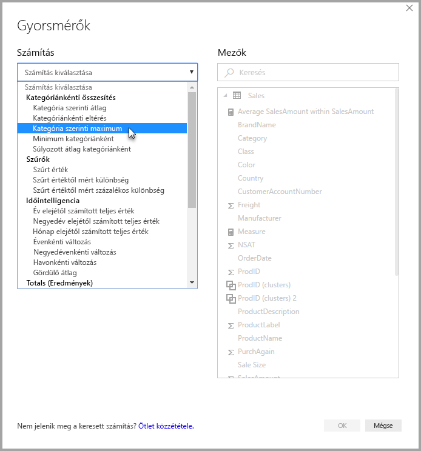
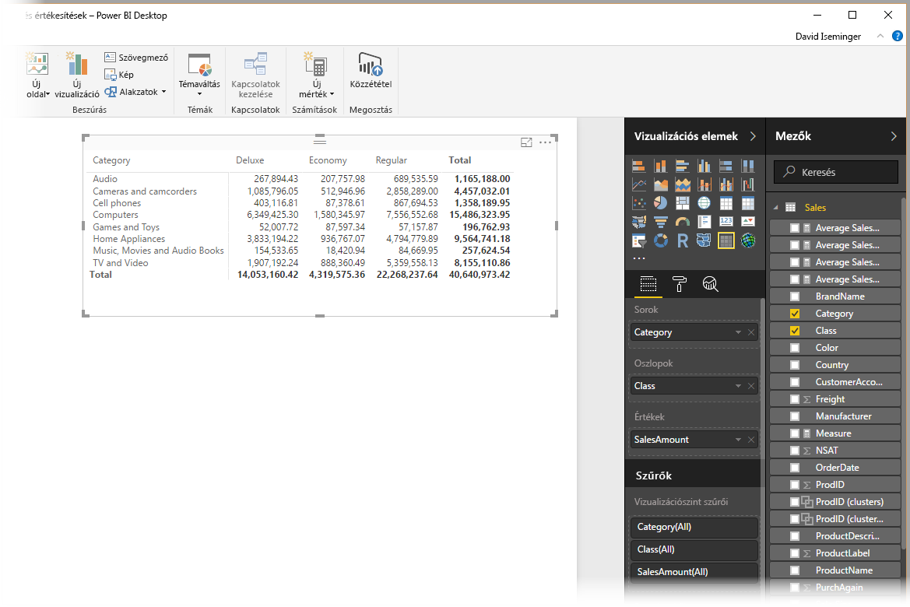
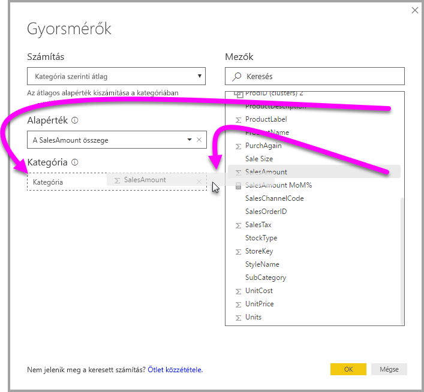
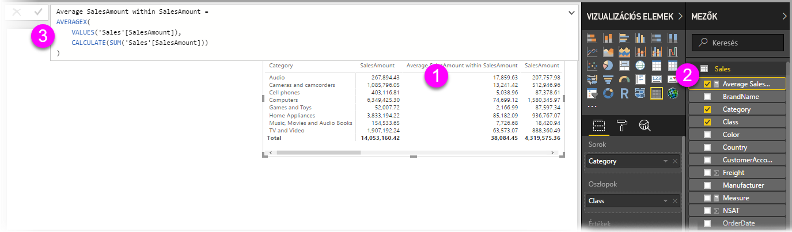
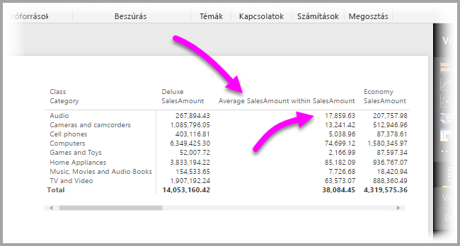
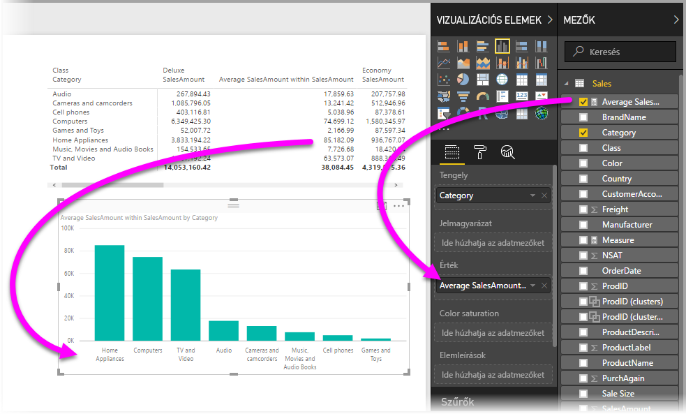
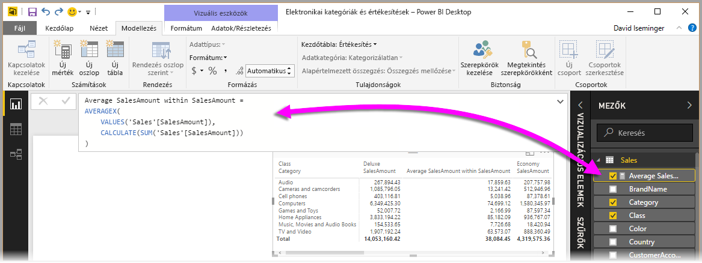

# A gyorsmérők használata általános és nagy igényű számítások egyszerű végrehajtásához
A **Gyorsmérők** használatával könnyedén végrehajthat általános és nagy igényű számításokat. A **gyorsmérők** DAX-parancsokat futtatnak a színfalak mögött (a DAX-ot nem kell megírnia, készen áll) a párbeszédpanelen megadott bemeneti adatok alapján, majd az eredmények használatra készen megjelennek a jelentésben. Ami a legjobb, hogy megtekintheti a gyorsmérő által végrehajtott DAX-ot, és így megismerheti a DAX-ot, vagy bővítheti az ismereteit.

**Gyorsmérők** létrehozásához kattintson a jobb gombbal egy mezőre a **Mezők** szakaszban, majd válassza a **Gyorsmérők** lehetőséget a megjelenő menüben. Kattinthat a jobb gombbal egy meglévő vizualizáció **Értékek** paneljének bármelyik értékére is (például egy *Sávdiagram* vizualizáció *Értékek* mezőjére). Számos számítási kategória áll rendelkezésre, és az egyes számításokat módosíthatja is az igényei szerint.

### Mostantól általánosan elérhetők a gyorsmérők

A **Power BI Desktop** 2018. februári kiadásától kezdve a gyorsmérők általánosan elérhetők (már nem előzetes verzióban érhetők el). Ha a **Power BI Desktop** egy korábbi verzióját használja, a **Power BI Desktop** **2017. áprilisi** kiadásától kezdve próbálhatja ki a **Gyorsmérők** szolgáltatást úgy, hogy a **Fájl > Lehetőségek és beállítások > Beállítások > Előzetes verziójú funkciók** lehetőséget választja, majd bejelöli a **Gyorsmérők** melletti jelölőnégyzetet.

Miután ezt beállította, újra kell indítania a **Power BI Desktopot**.

## A Gyorsmérők használata
Egy **Gyorsmérő** használatához kattintson a jobb gombbal egy mezőre (bármelyikre) a **Power BI Desktop** **Mezők** szakaszán, és válassza a megjelenő menüből a **Gyorsmérő** lehetőséget.

Az SQL Server Analysis Services (SSAS) élő kapcsolatok használatakor bizonyos **Gyorsmérők** elérhetők. A **Power BI Desktop** csak azokat a **Gyorsmérőket** jeleníti meg, amelyek támogatottak a kapcsolatban részt vevő SSAS-verzióhoz. Ha tehát csatlakozik egy SSAS élő adatforráshoz, és nem lát bizonyos **Gyorsmérőket** a listában, annak az az oka, hogy az az SSAS-verzió, amelyhez kapcsolódik, nem támogatja az adott **Gyorsmérő** megvalósításához használt DAX-mértéket.

Ha kiválasztotta a helyi menüben, megjelenik az alábbi **Gyorsmérők** ablak, ahol kiválaszthatja a kívánt számításokat, valamint a mezőket, amelyeken futtatni szeretné ezeket a számításokat.

Amikor a legördülő menüt választja, megjelenik az elérhető **Gyorsmérők** hosszú listája.

A Gyorsmérő számítási típusoknak öt külön csoportja van, mindegyikben található egy számításgyűjtemény. A csoportok és számítások a következők:

* **Kategóriánkénti összesítés**
  * Kategória szerinti átlag
  * Kategóriánkénti eltérés
  * Kategória szerinti maximum
  * Minimum kategóriánként
  * Súlyozott átlag kategóriánként
* **Szűrők**
  * Szűrt érték
  * Szűrt értéktől mért különbség
  * Szűrt értéktől mért százalékos különbség
  * Új kategóriákból történő értékesítések
* **Időintelligencia**
  * Év elejétől számított teljes érték
  * Negyedév elejétől számított teljes érték
  * Hónap elejétől számított teljes érték
  * Évenkénti változás
  * Negyedévenkénti változás
  * Havonkénti változás
  * Gördülő átlag
* **Összegek**
  * Göngyölített összeg
  * A kategória végösszege (szűrőkkel)
  * A kategória végösszege (szűrők nélkül)
* **Matematikai műveletek**
  * Összeadás
  * Kivonás
  * Szorzás
  * Osztás
  * Százalékos különbség
  * Korrelációs együttható
* **Szöveg**
  * Csillagos minősítés
  * Értékek összefűzött listája

Tervezzük bővíteni a számítások listáját, és szeretnénk visszajelzést kapni, milyen **gyorsmérőket** szeretne látni, és örülünk, ha beküldi a **gyorsmérőkre** vonatkozó ötleteit (az alapul szolgáló DAX-képletekkel együtt). A cikk végén erről további információt talál.

## Példa a gyorsmérőkre
Vessünk egy pillantást egy példára, hogy lássuk, hogyan működnek a **gyorsmérők**.

Az alábbi **Mátrix** vizualizáció elektronikai termékek értékesítéséről jelenít meg egy táblázatot. Ez egy alapszintű táblázat, szerepelnek benne az egyes kategóriákhoz tartozó összegek.

Kattintsunk a jobb gombbal az **Értékek** mező területére, és válasszuk a **Gyorsmérők** lehetőséget, majd a *Kategória szerinti átlag* elemet *Számításnak*. Ezután válasszuk a *SalesAmount összege* elemet *Alapértéknek*, és a jobb oldali panel *Mezők* mezőjéből a bal oldali *Kategória* területre áthúzva a mezőt adjuk meg a *SalesAmount* elemet.

Amikor az **OK** gombot választjuk, történik néhány érdekes dolog, amint az az alábbi listát követő ábrán is látható:

1. A **Mátrix** vizualizációban megjelent egy új oszlop, amely a számításunkat mutatja (ebben az esetben: *Átlagos SalesAmount a SalesAmount kategórián belül*).
2. Létrejött egy új **mérték**, és elérhető a **Mezők** területen, ki is van emelve (a Power BI egy sárga keretet helyez köré). Ez a mérték a jelentés bármely más vizualizációján is használható, nem csak azon, amelyhez eredetileg létrehoztuk.
3. A **gyorsmérőhez** használt DAX-formula megjelenik a Képletsávon.

Ami az első elemet illeti, észreveheti, hogy a rendszer alkalmazta a **gyorsmérőt** a vizualizációra. Megjelent egy új oszlop és egy társított érték, mindkettő a létrehozott **gyorsmérőn** alapul.

Ezenkívül a **gyorsmérő** megjelenik az adatmodell **Mezők** szakaszában, és ugyanúgy használható bármely más vizualizációhoz, mint bármely más mező a modellben. Az alábbi képen létrehoztunk egy gyors **sávdiagramot** a **gyorsmérő** által létrehozott új mező használatával.

Lépjen a következő szakaszra a harmadik elem, a DAX-képletek tárgyalásához.

## A DAX megismerése a gyorsmérők használatával
A **gyorsmérők** szolgáltatás egy másik nagy előnye, hogy közvetlenül megjeleníti a mérték megvalósításához létrehozott DAX-képletet. Az alábbi ábrán kiválasztottuk a **gyorsmérő** által létrehozott mértéket (most már szerepel a **Mezők** szakaszban, így csak rá kell kattintanunk). Amikor ezt tesszük, megjelenik a **Képletsáv**, ahol látható a DAX-képlet, amelyet a Power BI a mérték megvalósításához hozott létre.

Ez már önmagában nagyszerű, hiszen láthatjuk a mérték mögötti képletet. De ami talán még fontosabb, ennek köszönhetően a **Gyorsmérők** segítségével megtanulhatja, hogyan lehet létrehozni az alapul szolgáló DAX-képleteket.

Tegyük fel, hogy szüksége van egy éves adatokat összevető számításra, de nem biztos benne, hogyan építse fel a DAX-képletet (vagy ötlete sincs, hol kezdje). Ahelyett, hogy verné a fejét a falba, létrehozhat egy **gyorsmérőt** az **Évenkénti változás** számítással, és megnézheti az eredményt. Ahogy korábban, hozza létre a **Gyorsmérőt**, és nézze meg, hogyan jelenik meg a vizualizációban, hogyan működik a DAX-képlet, majd módosítsa közvetlenül a DAX-ot, vagy hozzon létre egy új mértéket, amíg a számítások a kívánt eredményt nem adják.

Olyan, mintha egy villámtanár azonnal megválaszolná a mi-lenne-ha típusú kérdéseit. Ezeket a mértékeket mindig törölheti a modellből, ha nem felelnek meg. Ez is egyszerű, kattintson jobb gombbal a mértékre, és válassza a **törlés** lehetőséget.

Ha már tökéletes a mérték, kedve szerint átnevezheti ugyanabból a helyi menüből.

## Korlátozások és szempontok
Figyelembe kell venni néhány korlátozást és szempontot.

* A **Gyorsmérők** csak akkor érhetők el, ha módosítani tudja a modellt, egyes élő kapcsolatok esetében ez azonban nem lehetséges (a táblázatos SSAS élő kapcsolatok támogatottak, ahogy ezt korábban említettük).
* A **Mezők** szakaszba felvett mértékek a jelentés bármelyik vizualizációjában használhatók.
* A **Gyorsmérőhöz** tartozó DAX-ot bármikor megtekintheti, ehhez jelölje ki a létrehozott mértéket a **Mezők** szakaszban, és a képlet megjelenik a **Képletsávban**.
* Nem tud időintelligencia gyorsmérőt létrehozni, ha DirectQuery módban dolgozik. Az ezekben a gyorsmérőkben használt DAX-függvények negatív hatással vannak a teljesítményre, amikor a program lefordítja őket T-SQL-utasításokká az adatforrásnak való küldéshez.

> [!WARNING]
> A gyorsmérők jelenleg *csak* olyan DAX-utasításokat hoznak létre, ahol a vesszők argumentumelválasztóként funkcionálnak. Ha az Ön **Power BI Desktop**-verziója olyan nyelvre van lokalizálva, amely tizedeselválasztóként használja a vesszőket, a gyorsmérők nem fognak megfelelően működni.
> 
> 

### Az időintelligencia és a gyorsmérők
A **Power BI Desktop** 2017. októberi frissítésével kezdve a saját egyéni dátumoszlopait használhatja az időintelligenciát használó **gyorsmérőkhöz**. Ha külső táblázatos modellt használ, ellenőrizze, hogy a modell létrehozásakor az adott tábla elsődleges dátum oszlopa Dátum táblaként lett-e megjelölve, amint az [ebben](https://docs.microsoft.com/sql/analysis-services/tabular-models/specify-mark-as-date-table-for-use-with-time-intelligence-ssas-tabular) a cikkben szerepel. Ha saját dátumtáblát importál, ügyeljen rá, hogy dátumtáblaként jelölje meg. Ennek módjáról [ebben a cikkben](https://docs.microsoft.com/power-bi/desktop-date-tables) olvashat.

### További információ és példák
Úgy tervezzük, hogy példákkal és útmutatókkal bővítjük az összes **gyorsmérők** számítást, ezért érdemes hamarosan újra áttekintenie az ezzel foglalkozó cikk frissítéseit.

Van olyan ötlete egy **gyorsmérőre**, amely még nem valósult meg? Remek! Látogasson el [erre az oldalra](https://go.microsoft.com/fwlink/?linkid=842906), és küldje be azokat a **gyorsmérőkre** vonatkozó ötleteit (DAX-képlettel együtt), amelyeket viszont szeretne látni a **Power BI Desktopban**, mi pedig megvizsgáljuk, hogy bekerülhet-e a **gyorsmérők** egy jövőbeli kiadásába.

