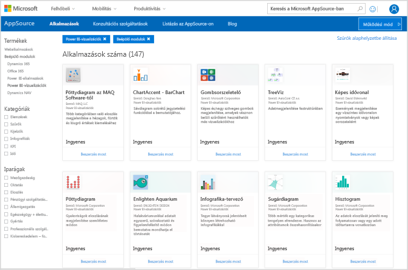
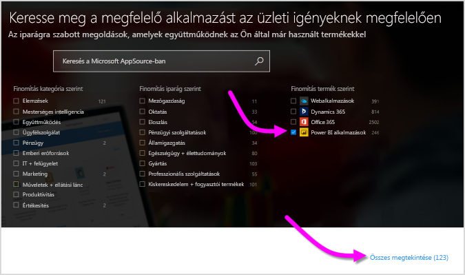
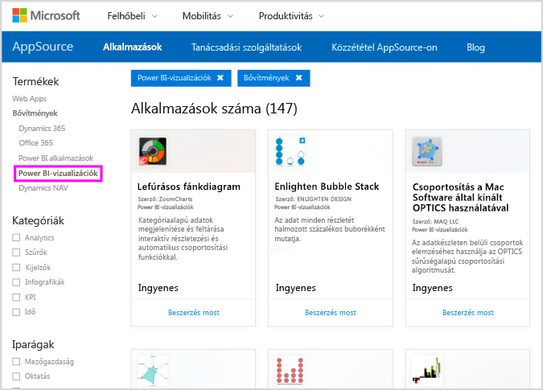
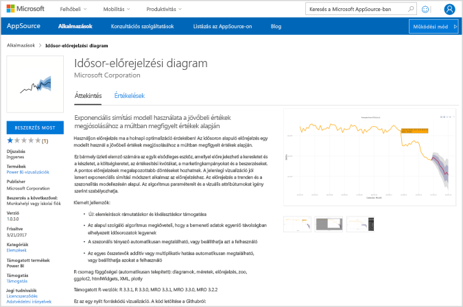
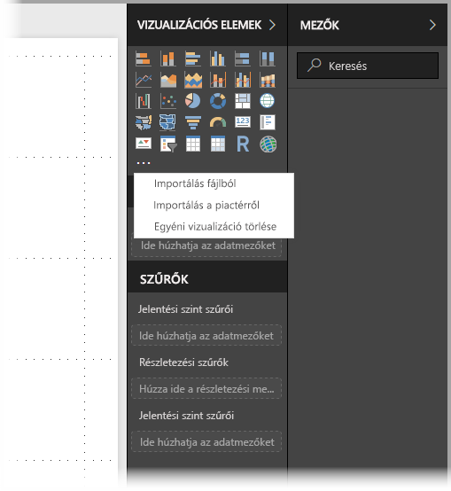
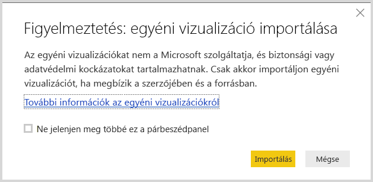
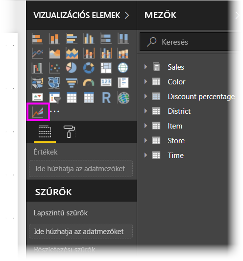
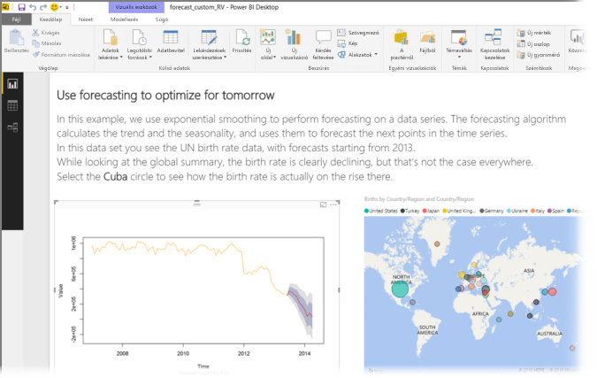
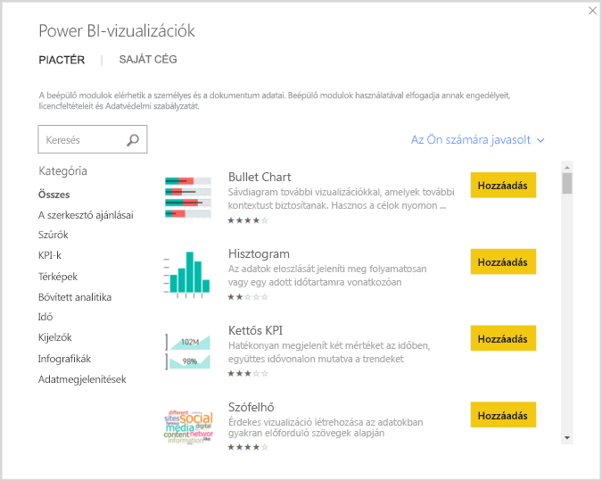

# Egyéni R-vizualizációk a Power BI-ban
A **Power BI Desktopban** és a **Power BI szolgáltatásban** az R ismerete és R-parancsfájlok használata nélkül is lehetősége van egyéni R-vizualizációk használatára. Ez lehetővé teszi az R-vizualizációk és R-szkriptek elemzési és vizuális sokoldalúságának kihasználását anélkül, hogy meg kellene tanulnia az R programozási nyelvet, vagy bármit is programoznia kellene.

Az egyéni R-vizualizációk használatához először ki kell választania és le kell töltenie a használni kívánt egyéni vizualizációt a Power BI **egyéni vizualizációinak** [**AppSource-**](https://appsource.microsoft.com/marketplace/apps?product=power-bi-visuals&page=1) katalógusából.

Az alábbi szakaszok az R-vizualizációk **Power BI Desktopban** történő kiválasztását, betöltését és használatát ismertetik.

## Egyéni R-vizualizációk használata
Az egyéni R-vizualizációk használatához le kell töltenie az egyes vizualizációkat az **egyéni vizualizációk** gyűjteményéből. Ezután a többi vizualizációtípushoz hasonlóan használhatja azokat a **Power BI Desktopban**. Az egyéni vizualizációk beszerzésének két módja van – letöltheti őket az **AppSource** webhelyről, vagy kikeresheti és beszerezheti őket a **Power BI Desktopon** belül. 

### Egyéni vizualizációk beszerzése az AppSource-ból

A vizualizációk az **AppSource** webhelyről történő kikeresésének és kiválasztásának lépései a következők:

1. Lépjen a Power BI-vizualizációk gyűjteményre, a következő címen: [https://appsource.microsoft.com](https://appsource.microsoft.com/). Jelölje be a *Power BI-alkalmazások* jelölőnégyzetet a *Pontosítás termék szerint* terület alatt, majd kattintson **Az összes megjelenítése** hivatkozásra.
   
   

2. A [Power BI-vizualizációk](https://appsource.microsoft.com/marketplace/apps?product=power-bi-visuals&page=1) gyűjtemény oldalán válassza a **Power BI-vizualizációk** elemet a bal oldali ablaktábla Bővítmények listájából.

   

3. Válassza ki a használni kívánt **vizualizációt** a katalógusból. Ekkor átkerül a vizualizációt ismertető oldalra. Kattintson a **Letöltés most** gombra a letöltéshez.
   
   > [!NOTE]
    > A tartalomkészítéshez a **Power BI Desktopban** telepítenie kell az R-t a helyi számítógépen. Amikor azonban a felhasználók meg szeretnék tekinteni az R-vizualizációkat a **Power BI szolgáltatásban**, nincs szükség arra, hogy az R helyben telepítve legyen.
   > 
   > 
   
   
   
   Nem kell telepíteni az R-t ahhoz, hogy egyéni R-vizualizációkat használhasson a **Power BI szolgáltatásban**. Ha viszont a **Power BI Desktopban** szeretne egyéni R-vizualizációkat használni, telepítenie *kell* az R-t a helyi számítógépen. Az R a következő helyekről tölthető le:
   
   * [CRAN](https://cran.r-project.org/)
   * [MRO](https://mran.microsoft.com/)

4. A vizualizáció letöltése után (ami ugyanúgy történik, mint bármely más fájl böngészőből történő letöltése), lépjen a **Power BI Desktopba**, kattintson a **Vizualizációk** ablaktáblában található, három pontot ábrázoló gombra (…), és válassza az **Importálás fájlból** lehetőséget.
   
   
5. A rendszer az alábbi képen látható módon figyelmezteti az egyéni vizualizációk importálásával kapcsolatban:
   
   
6. Lépjen arra a helyre, ahova a vizualizációt letöltötte, majd válassza ki a fájlt. A **Power BI Desktop** egyéni vizualizációi .pbiviz kiterjesztéssel rendelkeznek.
   
   
7. Amikor visszatér a Power BI Desktopba, a **Vizualizációk** ablaktáblán láthatja az új vizualizációtípust.
   
   
8. Új vizualizáció importálása (vagy egyéni R-vizualizációt tartalmazó jelentés megnyitása) esetén a **Power BI Desktop** telepíti a szükséges R-csomagokat.
   
   

9. Innentől kezdve ugyanúgy adhat hozzá adatokat a vizualizációhoz, mint bármely más **Power BI Desktop**-vizualizáció esetében. Ha végzett, a végleges vizualizáció megjelenik a vásznon. Az alábbi vizualizációban a **Forecasting** (Előrejelzés) R-vizualizációt használták az ENSZ születési arányra vonatkozó előrejelzéseivel (a vizualizáció a bal oldalon látható).

    

    A többi **Power BI Desktop**-vizualizációhoz hasonlóan ezt az R-vizualizációt tartalmazó jelentést is közzéteheti a **Power BI szolgáltatásban**, valamint megoszthatja másokkal.

    Érdemes gyakran ellenőrizni a gyűjteményt, mert folyamatosan új vizualizációkkal bővül.

### Egyéni vizualizációk beszerzése a **Power BI Desktopon** belül

1. A **Power BI Desktopon** belül is beszerezhet egyéni vizualizációkat. A **Power BI Desktopban** kattintson a **Vizualizációk** ablaktáblán található, három pontot ábrázoló gombra (…), és válassza az **Importálás a piactérről** lehetőséget.
   
   

2. Ekkor megjelenik a **Power BI-vizualizációk** párbeszédpanel, ahol görgetéssel áttekintheti az elérhető egyéni vizualizációkat, és kiválaszthatja az Önnek tetszőt. Kereshet név alapján, kiválaszthat egy kategóriát, vagy csak átgörgetheti az elérhető vizualizációk listáját. Ha végzett, kattintson a **Hozzáadás** gombra az egyéni vizualizáció a **Power BI Desktophoz** történő hozzáadásához.

   

## Egyéni R-vizualizációk közzététele
Ha saját R-vizualizációkat hoz létre a jelentésekben való használatra, megoszthatja őket a világgal, ha közzéteszi az egyéni vizualizációkat az **egyéni vizualizációk katalógusában**. A közzététel a GitHubon keresztül zajlik, a folyamat leírása pedig az alábbi helyen olvasható:

* [Közzététel az egyéni R-vizualizációk katalógusában](https://github.com/Microsoft/PowerBI-visuals#building-r-powered-custom-visual-corrplot)

## Egyéni R-vizualizációk hibaelhárítása
Az Egyéni R-vizualizációk rendelkeznek bizonyos függőségekkel, amelyeknek teljesülniük kell a vizualizációk megfelelő működése érdekében. Ha az egyéni R-vizualizációk nem futnak vagy töltődnek be megfelelően, a problémát általában az alábbiak egyike okozza:

* Hiányzik az R-motor
* Hibás az R-szkript, amelyen a vizualizáció alapul
* Hiányzó vagy elavult R-csomagok

Az alábbi szakasz hibaelhárítási lépéseket tartalmaz, amelyek segíthetnek az esetleg felmerülő problémák megoldásában.

### Hiányzó vagy elavult R-csomagok
Amikor egyéni R-vizualizációkat próbál meg telepíteni, találkozhat hiányzó vagy elavult R-csomagokra vonatkozó hibaüzenetekkel. Ez általában az alábbi okok egyikéből fakad:

* A telepített R nem kompatibilis az R-csomaggal
* Egy tűzfal, víruskereső szoftver vagy proxybeállítás megakadályozza, hogy az R kapcsolódjon az internethez
* Az internetkapcsolat lassú, vagy probléma van az internetkapcsolattal

A Power BI csapata aktívan dolgozik az ilyen jellegű problémák megelőzésén, és a következő Power BI Desktop az ilyen problémák megoldását szolgáló frissítéseket is tartalmaz. Addig is az alábbi lépések segítségével csökkentheti a problémák előfordulását:

1. Távolítsa el az egyéni vizualizációt, és telepítse újra. Ez kezdeményezi az R-csomagok újratelepítését.
2. Ha az R telepítése nem naprakész, frissítse, majd távolítsa el és telepítse újra az egyéni vizualizációt az előző lépésben leírt módon.
   
   Az R támogatott verzióit megtalálja az egyes egyéni R-vizualizációk leírásában, ahogy az az alábbi képen is látható.
   
     
     > [!NOTE]
    > Azt is megteheti, hogy megtartja az eredeti R-telepítést, és csak társítja a Power BI Desktopot a telepített aktuális verzióhoz. Ugorjon ide: **Fájl > Lehetőségek és beállítások > Lehetőségek > R-szkriptek használata**.
    >
    >
3. Telepítse az R-csomagokat manuálisan bármely R-konzol használatával. A módszer lépései a következők:
   
   a.  Töltse le az R-vizualizáció telepítési parancsfájlját, és mentse a fájlt egy helyi meghajtóra.
   
   b.  A konzolban futtassa a következő parancsot:
   
       > source(“C:/Users/david/Downloads/ScriptInstallPackagesForForecastWithWorkarounds.R”)    
   
   A tipikus alapértelmezett telepítési helyek az alábbiak:
   
       c:\Program Files\R\R-3.3.x\bin\x64\Rterm.exe (for CRAN-R)
       c:\Program Files\R\R-3.3.x\bin\x64\Rgui.exe (for CRAN-R)
       c:\Program Files\R\R-3.3.x\bin\R.exe (for CRAN-R)
       c:\Program Files\Microsoft\MRO-3.3.x\bin\R.exe (for MRO)
       c:\Program Files\Microsoft\MRO-3.3.x\bin\x64\Rgui.exe (for MRO)
       c:\Program Files\RStudio\bin\rstudio.exe (for RStudio)
4. Ha az előző lépés nem válik be, próbálja meg az alábbit:
   
   a. Használja az **R Studiót**, és kövesse a 3.b. lépésben leírtakat (futtassa a szkriptsort az R-konzolból).
   
   b. Ha az előző lépés nem válik be, módosítsa az **Eszközök > Globális funkciók > Csomagok** beállítást az **R Studióban**, és engedélyezze az alábbi jelölőnégyzetet: **Internet Explorer-kódtár/-proxy használata a HTTP-hez**. Ezután ismételje meg a fenti 3.b. lépést.

## Következő lépések
Tekintse meg az alábbi, az R programozási nyelv Power BI-ban történő használatára vonatkozó további információkat.

* [A Power BI egyéni vizualizációinak katalógusa](https://app.powerbi.com/visuals/)
* [R-szkriptek futtatása a Power BI Desktopban](desktop-r-scripts.md)
* [R-vizualizációk létrehozása a Power BI Desktopban](desktop-r-visuals.md)
* [Külső R IDE környezet használata a Power BI-jal](desktop-r-ide.md)

