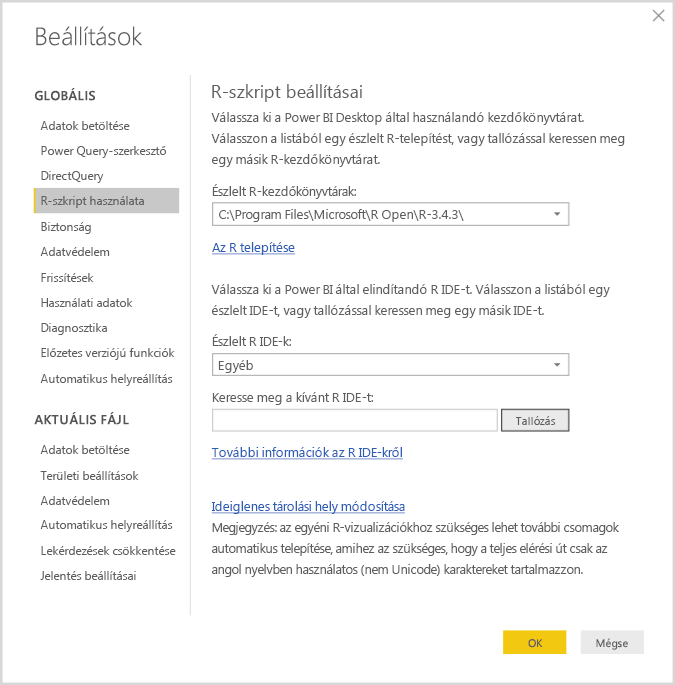
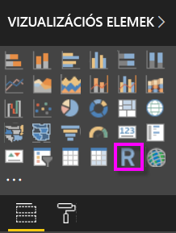
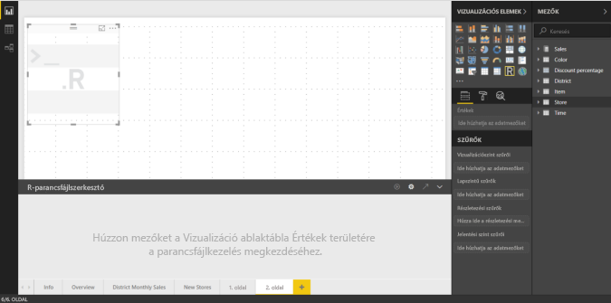
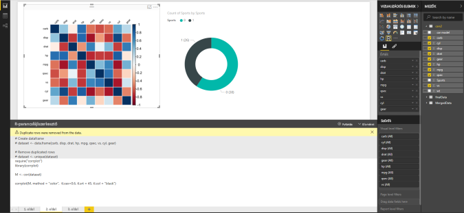
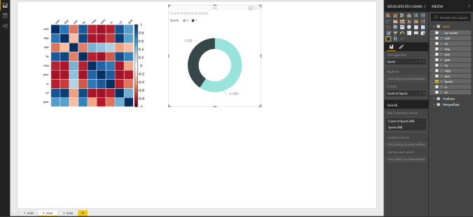
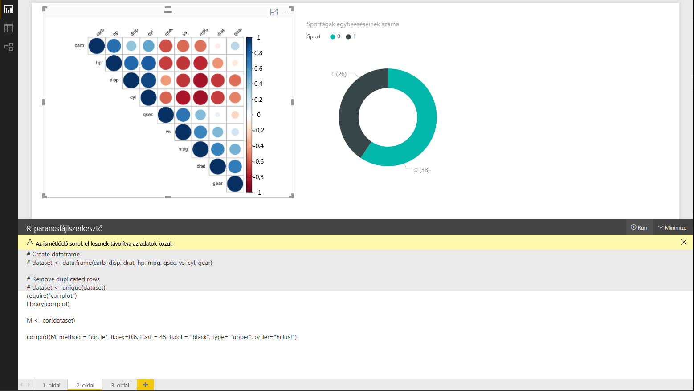
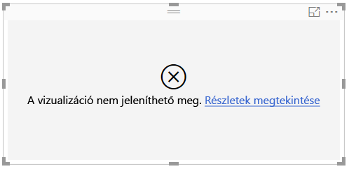

# Power BI-vizualizációk létrehozása az R programozási nyelvvel
A **Power BI Desktopban** az **R** használatával vizualizálhatja az adatokat.

## Az R telepítése
A **Power BI Desktop** nem tartalmazza, helyezi üzembe vagy telepíti az **R**-motort. Az R-szkriptek **Power BI Desktopban** való futtatásához külön kell telepítenie az **R**-t a helyi számítógépen. Az **R**-t számos helyről ingyen letöltheti és telepítheti, például a [Revolution Open letöltőoldalról](https://mran.revolutionanalytics.com/download/) vagy a [CRAN tárból](https://cran.r-project.org/bin/windows/base/). A **Power BI Desktopban** használható R-szkriptek jelenlegi kiadása támogatja az Unicode karaktereket és a szóközöket (üres karaktereket) a telepítési útvonalban.

## R-vizualizációk engedélyezése
Az R-vizualizációk engedélyezéséhez válassza ki a **Fájl > Lehetőségek és beállítások > Beállítások** lehetőséget, majd a megjelenő **Beállítások** lapon gondoskodjon arról, hogy a **Beállítások** ablak **R-szkriptek használata** szakaszában meg legyen adva az R helyi telepítési útvonala, ahogy az a következő képen látható. A következő képen az R helyi telepítési útvonala **C:\Program Files\R\R-3.2.0**, és ez az elérési út van megadva a szövegdobozban. Gondoskodjon arról, hogy a megjelenő elérési út megegyezzen annak a helyi R-telepítésnek a helyével, amelyet a **Power BI Desktoppal** használni kíván.
   
   

Miután megadta az R telepítési helyét, készen áll az R-vizualizációk létrehozására.

## R-vizualizációk létrehozása a Power BI Desktopban
1. Egy R-vizualizáció hozzáadásához kattintson az **R-vizualizáció** ikonra a **Vizualizáció** panelen, ahogy az a következő képen látható.
   
   

   Ha hozzáadunk egy jelentéshez egy R-vizualizációt, a **Power BI Desktop** a következőket teszi:
   
   - Megjelenik a jelentésvásznon egy helyőrző R-vizualizációs kép.
   
   - A középső panel aljánál megjelenik az **R-parancsfájlszerkesztő**.
   
   

2. Ezután adja meg a **Mezők** területen az **Értékek** szakaszban, hogy az R-szkript mely mezőket használja fel, ahogy azt a **Power BI Desktop** bármely más vizualizációja esetében is tenné. 
    
    Az R-parancsfájl számára csak a **Mezők** területhez hozzáadott mezők érhetők el. A **Power BI Desktop R-parancsfájlszerkesztőjében** az R-parancsfájlon dolgozva új mezőket adhat hozzá vagy eltávolíthatja a szükségtelen mezőket a **Mezők** területről. A **Power BI Desktop** automatikusan észleli, hogy mely mezők lettek hozzáadva vagy eltávolítva.
   
   > [!NOTE]
   > Az R-vizualizációk összesítésének alapértelmezett típusa *Nincs összegzés*.
   > 
   > 
   
3. Ezután a kiválasztott adatok alapján létrehozhat egy rajzot. 

    A mezők kiválasztásakor az **R-parancsfájlszerkesztő** létrehozza a támogató R-parancsfájlkötő kódot az alapján, hogy a szerkesztőpanel tetején, a szürke részen mely mezők lettek kiválasztva. Ahogy további mezőket adunk hozzá vagy távolítunk el, az R-parancsfájlszerkesztő automatikusan létrehozza vagy eltávolítja a hozzájuk tartozó támogató kódot.
   
   A következő képen látható példában három mezőt választottunk ki: hp, gear és drat. Ennek eredményeképp az R-parancsfájlszerkesztő a következő kötőkódot hozta létre:
   
   * Létrejött egy **dataset** nevű adathalmaz
     * Az adathalmaz a felhasználó által kiválasztott különböző mezőkből áll
   * Az alapértelmezett összesítés a *Nincs összegzés*
   * A táblavizualizációkhoz hasonlóan a rendszer csoportosítja a mezőket, és a duplikált sorok csak egyszer jelennek meg
   
   
   
   > [!TIP]
   > Bizonyos esetekben szükség lehet arra, hogy a rendszer ne végezzen automatikus csoportosítást, vagy minden sort megjelenítsen, a duplikáltakat is beleértve. Ebben az esetben hozzáadhat egy indexmezőt az adatkészlethez, amelynek hatására a rendszer minden sort egyedinek tekint, így megakadályozza a csoportosítást.
   > 
   > 
   
   A létrejött adathalmaz neve **dataset**, a kiválasztott oszlopok pedig a saját neveik alapján érhetők el. Például a gear mező úgy érhető el, ha az R-parancsfájlba beírja a *dataset$gear* kifejezést. A szóközöket vagy egyéb speciális karaktereket tartalmazó mezőknél használjon aposztrófot.

4. Mivel az adathalmaz automatikusan létrejön a kiválasztott mezők alapján, most már írhat olyan R-parancsfájlokat, amelyek az R alapértelmezett készülékére küldik az ábrázolást. Ha a parancsfájl elkészült, kattintson a **Futtatás** lehetőségre az **R-parancsfájlszerkesztőben** (**Futtatás** lehetőség a címsor jobb oldalán).
   
    A **Futtatás** lehetőség kiválasztásakor a **Power BI Desktop** azonosítja az ábrázolást, és megjeleníti azt a vásznon. Mivel a folyamat végrehajtása a helyi R-telepítésen történik, győződjön meg arról, hogy a szükséges csomagok telepítve vannak-e.
   
   A **Power BI Desktop** újrarajzolja a vizualizációt, ha a következő események bármelyike előfordul:
   
   * Ha a **Futtatás** lehetőséget választják az **R-parancsfájlszerkesztő** címsorán
   * Ha az adatok frissítés, szűrés vagy kiemelés miatt változnak

     A következő képen egy példa látható a korrelációrajzolási kódra, amely a különböző típusú gépkocsik tulajdonságai közötti korrelációkat ábrázolja.

     

5. A vizualizáció nagyobb méretű megtekintése érdekében az **R-parancsfájlszerkesztő** kis méretűre állítható. Természetesen a **Power BI Desktop** egyéb vizualizációihoz hasonlóan a korrelációs ábrázoláson keresztszűrést is alkalmazhat úgy, ha csak a sportkocsikat választja ki a gyűrűdiagramon (a fenti példaképen a jobb oldali kerek vizualizáció).

    

6. Emellett módosíthatja az R-szkriptet a vizualizáció testreszabásához, és az R képességeit kihasználva paramétereket adhat az ábrázolási parancshoz.

    Az eredeti ábrázolási parancs a következő volt:

    corrplot(M, method = "color",  tl.cex=0.6, tl.srt = 45, tl.col = "black")

    Az R-szkript néhány módosításával a parancs most a következő:

    corrplot(M, method = "circle", tl.cex=0.6, tl.srt = 45, tl.col = "black", type= "upper", order="hclust")

    Ennek eredményeképp az R-vizualizáció most csak köröket ábrázol, csak a felső felet veszi figyelembe, és újrarendezi a mátrixot a korrelált attribútumok fürtösítéséhez, ahogy az a következő képen látható.

    

    Ha egy R-szkript futtatása hibát eredményez, a rendszer nem ábrázolja az R-vizualizációt, hanem egy hibaüzenetet jelenít meg a vásznon. A hiba részleteinek megtekintéséhez kattintson a **Részletek megtekintése** lehetőségre a vásznon megjelenő R-vizualizációs hibaüzenetben.

    

    > **R-szkriptek biztonsága**: A R-vizualizációk alapjait az R-szkriptek jelentik, amelyek biztonsági vagy adatvédelmi kockázatot jelentő kódot tartalmazhatnak. Egy R-vizualizáció első alkalommal való megtekintésekor vagy használatakor egy biztonsági figyelmeztető üzenet jelenik meg. Csak akkor engedélyezze az R-vizualizációkat, ha megbízik a szerzőben és a forrásban, vagy ha már áttekintette és értelmezte az R-szkriptet.
    > 
    > 

## Ismert korlátozások
A **Power BI Desktopban** az R-vizualizációkra vonatkozik néhány korlátozás:

* Adatmennyiség korlátozásai – az R-vizualizációk által az ábrázoláshoz felhasznált adatmennyiség 150 000 sorban van korlátozva. 150 000-nél több sor kiválasztásakor a rendszer csak az első 150 000 sort használja fel, és megjelenít egy üzenetet a képen.
* Számítási idő korlátozása – ha egy R-vizualizáció számítási ideje meghaladja az öt percet, végrehajtási időtúllépés történik, ami egy hibát eredményez.
* Kapcsolatok – a Power BI Desktop többi vizualizációjához hasonlóan, ha több adatmezőt választ ki különböző táblákból, amelyek közt nincs meghatározott kapcsolat, akkor a rendszer hibát jelez.
* Az R-vizualizációk az adatok frissítésekor, szűrésekor és kiemelésekor frissülnek. Ugyanakkor a kép maga nem interaktív és nem szolgálhat keresztszűrés forrásaként.
* Az R-vizualizációk reagálnak más vizualizációk kiemeléseire, de nem lehet az elemeikre kattintva keresztszűrni más elemeket.
* A vásznon csak az alapértelmezett R megjelenítő eszközön ábrázolt ábrázolások jelennek meg helyesen. Kerülje az eltérő R megjelenítő eszközök használatát.
* Ebben a kiadásban az RRO-telepítéseket a Power BI Desktop 32 bites verziója nem azonosítja automatikusan, így az R telepítési könyvtárának elérési útját manuálisan kell megadni a **Lehetőségek és beállítások > Beállítások > R-szkript használata** ablakban.

## Következő lépések
Tekintse meg az alábbi, az R programozási nyelv Power BI-ban történő használatára vonatkozó további információkat.

* [R-szkriptek futtatása a Power BI Desktopban](desktop-r-scripts.md)
* [Külső R IDE környezet használata a Power BI-jal](desktop-r-ide.md)

