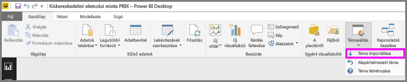
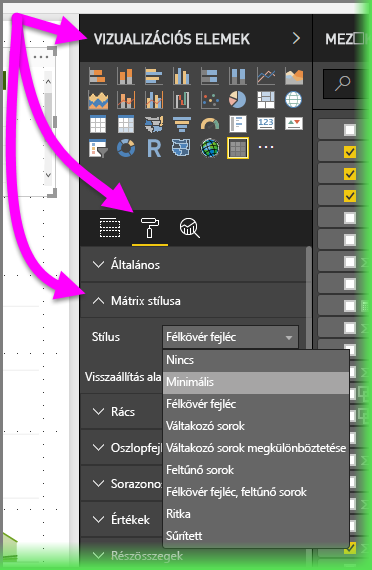
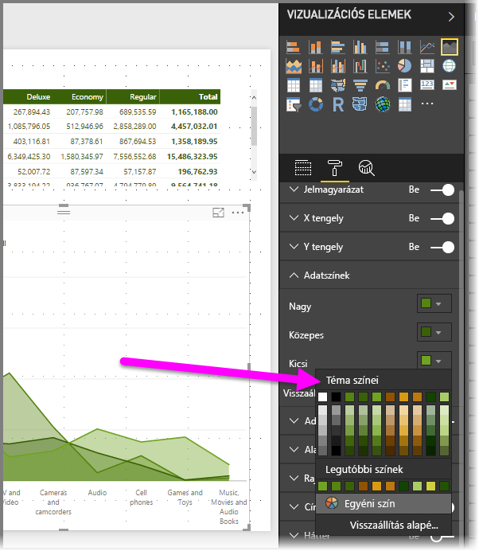

# Jelentéstémák használata a Power BI Desktopban (előzetes verzió)
A **Jelentéstémák** használatával egységes színtémát alkalmazhat az egész jelentésre, például a cég színeit, az évszaknak megfelelő színeket, vagy bármely más színtémát, amit csak szeretne. **Jelentéstémák** alkalmazásakor a jelentésben szereplő összes vizualizáció a kiválasztott téma színeit fogja használni (ez alól van néhány kivétel, amelyeket a cikk későbbi részében mutatunk be).

A **Jelentéstémák** alkalmazásához egy JSON-fájlra van szükség, amely olyan alapvető szerkezetet használ, amelyet aztán importálhat a Power BI Desktopba, majd alkalmazhatja a jelentésen. A JSON-fájl szerkezete egyszerű, és a mindössze néhány kattintásból álló importálási folyamat pillanatok alatt elvégezhető.

A **Power BI Desktop** 2017. szeptemberi kiadásától kezdődően még több jelentéstéma-elemet határozhat meg JSON-fájlok használatával, továbbá a **Formázás** panelen manuálisan beállítható szinte összes elemet testre szabhatja (és szabványosíthatja) JSON-fájl segítségével. A 2017. szeptemberi (és a későbbi) kiadások célja, hogy teljes körűen, egészen a legapróbb részletekig megszabhassa a jelentések megjelenését és működését.

### Jelentéstémák engedélyezése az előzetes verzióban
Az új **Jelentéstémák** funkciót a **Power BI Desktop** **2017. márciusi** kiadásától kezdve használhatja. Ennek az előzetes funkciónak az engedélyezéséhez válassza a **Fájl > Lehetőségek és beállítások > Lehetőségek > Előzetes verziójú funkciók** lehetőséget, majd jelölje be az **Egyéni jelentéstémák** lehetőség melletti jelölőnégyzetet. Miután ezt beállította, újra kell indítania a **Power BI Desktopot**.

## A jelentéstémák működése
Ha egy jelentéstémát szeretne alkalmazni egy Power BI Desktop jelentésre, kattintson a **Témaváltás** lehetőségre a **Kezdőlap** menüszalagon, majd a legördülő menüben válassza a **Téma importálása** elemet.

Ekkor megjelenik egy ablak, amelyben megkeresheti a JSON-témafájl helyét. A Power BI Desktop .JSON kiterjesztésű fájlokat keres, amely a Power BI-jelentéstémák fájltípusa. Az alábbi képen néhány ünnepi témafájl szerepel. Most egy március hónaphoz illő ünnepi témát fogunk kiválasztani.

A Power BI Desktop jelzi, ha a téma sikeresen betöltődött.

A témafájl sikeres importálása után tekintsük meg a JSON-fájl egyszerű és kézenfekvő szerkezetét.

## Egy jelentéstémát tartalmazó JSON-fájl szerkezete
Az előző szakaszban kiválasztott alapszintű JSON-fájl (*St Patricks Day.json*) egy szerkesztőben megnyitva a következőképpen néz ki.

Ez a JSON-fájl az alábbi kötelező sorokat tartalmazza:

* **name** – Ez a téma neve, amely az egyetlen kötelezően kitöltendő mező
* **dataColors** – Hexadecimális kódolású színkódok listája a Power BI Desktop vizualizációiban szereplő adatokhoz. A lista annyi színt tartalmazhat, amennyi szükséges
* **background**, **foreground** és **tableAccent** – Ezek az értékek a **tábla** és **mátrix** típusú vizualizációkban használt színeket határozzák meg. A színek használatának módja az alkalmazott tábla- vagy mátrixstílustól függ. A **tábla** és **mátrix** típusú vizualizációk alapértelmezés szerint alkalmazzák ezeket a stílusokat.

Ha egy stílust szeretne alkalmazni egy **tábla** vagy **mátrix** típusú vizualizációra, válassza ki a vizualizációt, majd a **Vizualizációk** ablaktáblán kattintson a **Formátum** szakaszra, majd bontsa ki a **Mátrix stílusa** lehetőséget és válasszon egy stílust a **Stílus** helyi menüből.

Ha egyszerűen kivágással és beillesztéssel szeretné létrehozni saját JSON-fájlját, a *St Patricks Day.json* fájl szövege itt található:

    {
        "name": "St Patricks Day",
        "dataColors": ["#568410", "#3A6108", "#70A322", "#915203", "#D79A12", "#bb7711", "#114400", "#aacc66"],
        "background":"#FFFFFF",
        "foreground": "#3A6108",
        "tableAccent": "#568410"
    }

Ezzel megadhatja saját hexadecimális színkódját a kiválasztott színekhez.

A **Power BI Desktop** 2017. szeptemberi kiadásától kezdve a JSON-fájl lényegesen összetettebb lehet. A JSON-fájlban csak azt a formátum szerepel, amelyiket módosítani szeretné, és minden más, ami *nem* szerepel a JSON-fájlban, a Power BI alapértelmezett beállításai szerint jelenik meg.

A JSON-fájlok létrehozásának számos előnye van. Megadhatja például, hogy minden diagram 12-es betűméretet használjon, vagy hogy egyes vizualizációk egy adott betűtípuscsaládot használjanak, esetleg kikapcsolhatja az adatcímkéket bizonyos diagramtípusoknál.

A részletes JSON-fájlok használata révén olyan témafájlt hozhat létre, amely szabványosítja a diagramokat és jelentéseket, így megkönnyíti a konzisztens vállalati jelentések létrehozását.

A részletes JSON-fájl formátumával kapcsolatos tudnivalókért tekintse meg a cikk végén található **Jelentéstémát tartalmazó JSON-fájlok formátuma** című szakaszt.

## Hogyan társulnak a jelentéshez a jelentéstéma színei?
Ha a jelentést közzéteszi a **Power BI szolgáltatásban**, a Jelentéstéma színei társítva maradnak.

Emellett a **Formátum** panel **Adatszínek** szakaszában megjelenik a választott jelentéstéma. Például a **St. Patrick's Day** téma zöld és barna színeinek alkalmazása után, ha kiválasztunk egy vizualizációt és a **Formátum > Adatszínek** részhez lépünk, a következőt fogjuk látni.

Látja ezt a sok zöld árnyalatot? Ez azért jelenik meg így, mert ezek a színek az előzőleg importált és alkalmazott **jelentéstéma** részei.

### Milyen helyzetekben nem társulnak a jelentéshez a jelentéstéma színei?
Ha egyéni színkészletet (vagy egyedi színeket) alkalmaz egy vizualizáció adott adatpontjára, az alkalmazott jelentéstéma *nem* írja felül a testre szabott adatpont színét.

Emellett, ha egy adatpont színét a színpaletta Téma színei szakaszával manuálisan adja meg, akkor azok az így beállított színek *nem* frissülnek új jelentéstéma alkalmazásakor. Az alapértelmezett színek visszaállításához (ha azt szeretné, hogy azok új jelentéstéma alkalmazásakor frissüljenek) válassza a **Visszaállítás alapértelmezettre** lehetőséget a **Téma színei** palettán.

Ezen kívül számos **egyéni vizualizáció** sem alkalmazza a jelentéstémákat.

## Azonnal használható jelentéstémák
Meg szeretne ismerkedni a **jelentéstémákkal**? Remek! Íme néhány használatra kész jelentéstémát tartalmazó JSON-fájl, amelyeket letölthet, majd a **Power BI Desktop**-jelentésbe importálhat, valamint egy kép arról a jelentéstémáról, amelyet a cikkben korábban a jelentésre alkalmaztunk.

* A **jelentéstémák** első kiadását bejelentő [blogbejegyzésben](https://powerbi.microsoft.com/blog/power-bi-desktop-march-feature-summary/) használt [téma](https://go.microsoft.com/fwlink/?linkid=843924) neve [*waveform.json*](https://go.microsoft.com/fwlink/?linkid=843924).

* Az alapértelmezett színtémánál a [látássérültek számára könnyebben látható téma](https://go.microsoft.com/fwlink/?linkid=843923) neve [*ColorblindSafe-Longer.json*](https://go.microsoft.com/fwlink/?linkid=843923).

* Rengeteg [Power View-téma](https://go.microsoft.com/fwlink/?linkid=843925) egy zip-fájlban, köztük a lentebb látható [*Apothecary.json*](https://go.microsoft.com/fwlink/?linkid=843925).

* Végül pedig egy kedves téma (a *Valentine's Day* nevű téma), amely garantáltan felkelti a nézők figyelmét.

Ha nem szeretné letölteni, innen kimásolhatja Valentine's Day nevű JSON-fájl kódját:

    {
        "name": "Valentine's Day",
        "dataColors": ["#990011", "#cc1144", "#ee7799", "#eebbcc", "#cc4477", "#cc5555", "#882222", "#A30E33"],
        "background":"#FFFFFF",
        "foreground": "#ee7799",
        "tableAccent": "#990011"
    }

A **jelentéstémák** színek segítségével tükrözhetik az Ön személyiségét, vagy a vállalat arculatát, esetleg az aktuális évszak, vagy ünnep hangulatát. Használja örömmel!

Íme néhány további jelentéstéma, amelyet kiindulási pontként használhat:

* [Sunflower-twilight](https://community.powerbi.com/t5/Themes-Gallery/Sunflower-Twilight/m-p/140749)
* [Plum](https://community.powerbi.com/t5/Themes-Gallery/Plum/m-p/140711)
* [Autumn](https://community.powerbi.com/t5/Themes-Gallery/Autumn/m-p/140746)
* [High contrast](https://community.powerbi.com/t5/Themes-Gallery/Color-Blind-Friendly/m-p/140597)

## Jelentéstémát tartalmazó JSON-fájlok formátuma
Az alapszintű JSON-fájl öt kötelező sort tartalmaz:

* **name** – Ez a téma neve, amely az egyetlen kötelezően kitöltendő mező
* **dataColors** – Hexadecimális kódolású színkódok listája a Power BI Desktop vizualizációiban szereplő adatokhoz. A lista annyi színt tartalmazhat, amennyi szükséges
* **background**, **foreground** és **tableAccent** – Ezek az értékek a **tábla** és **mátrix** típusú vizualizációkban használt színeket határozzák meg. A színek használatának módja az alkalmazott tábla- vagy mátrixstílustól függ. A **tábla** és **mátrix** típusú vizualizációk alapértelmezés szerint alkalmazzák ezeket a stílusokat.

Ha bővített formátumú JSON-fájlt szeretne létrehozni, amelynek formátuma sokkal részletesebben szabályozható, akkor egy **visualStyles** nevű szakaszt kell hozzáadnia a JSON-fájlhoz, és abban a szakaszban kell megadnia a formázás részleteit. A **visualStyles** szakasz formátuma a következőképpen néz ki:

    visualStyles: {
        visualName: {
            styleName: {
                cardName: [{
                    propertyName: propertyValue
                }]
            }
        }
    }

A **visualName** és a **cardName** szakaszokban megadhatja a vizualizáció és a kártya kívánt nevét, vagy egy csillag („*”) karakter használatával megadhatja, hogy az adott vizualizációhoz valamilyen tulajdonságot tartalmazó összes vizualizációra és kártyára vonatkozzon. A csillag („*”) karaktert bármikor alkalmazhatja, ha azt szeretné, hogy egy beállítás az egész jelentésre vonatkozzon, mint például a betűméret vagy egy adott betűtípuscsalád, amelyet a jelentés minden vizualizációjában látni szeretne.

> [!NOTE]
> Csak azokat a formázási elemeket kell megadnia, amelyeket módosítani szeretne. A JSON-fájlban nem szereplő formázási elemek egyszerűen az alapértelmezett értékeket és beállításokat veszik fel.
> 
> 

### A JSON-fájl elemeinek definíciói
Az ebben a szakaszban szereplő táblák a JSON-fájl létrehozásához szükséges vizualizációneveket (*visualName*), kártyaneveket (*cardName*) és enumerálásokat határoznak meg.

A *dateTime* érték meghatározásakor a dátumnak aposztrófok közötti ISO-formátumú dátumnak kell lennie, amely a „datetime” kifejezéssel kezdődik a következőképpen:

    “datetime’2011-10-05T14:48:00.000Z’”

A Boole-értékek lehetséges értéke *true* (igaz) vagy *false* (hamis). A karakterláncoknak idézőjelek között kell szerepelniük, például "ez egy karakterlánc".

| **visualName** |
| --- |
| areaChart |
| barChart |
| basicShape |
| card |
| clusteredBarChart |
| clusteredColumnChart |
| columnChart |
| comboChart |
| donutChart |
| filledMap |
| funnel |
| gauge |
| hundredPercentStackedBarChart |
| hundredPercentStackedColumnChart |
| image |
| kpi |
| lineChart |
| lineClusteredColumnComboChart |
| lineStackedColumnComboChart |
| map |
| multiRowCard |
| pieChart |
| pivotTable |
| ribbonChart |
| scatterChart |
| shapeMap |
| slicer |
| stackedAreaChart |
| tableEx |
| treemap |
| waterfallChart |

Az alábbi tábla *cardName* értékeket határoz meg. Az egyes cellákban szereplő első érték a JSON-fájl kifejezés, a második érték a kártyának a **Power BI Desktop** felhasználói felületén megjelenő neve.

| **cardName** |
| --- |
| axis: Mérőtengely |
| breakdown: Bontás |
| bubbles: Buborékok |
| calloutValue: Ábrafelirat értéke |
| card: Kártya |
| cardTitle: Kártya címe |
| categoryAxis: X-tengely |
| categoryLabels: Kategóriacímkék |
| columnFormatting: Mezőformázás |
| columnHeaders: Oszlopfejlécek |
| dataLabels: Adatfeliratok |
| fill: Kitöltés |
| fillPoint: Kitöltési pont |
| forecast: Előrejelzés |
| general: Általános |
| goals: Célok |
| grid: Rács |
| header: Fejléc |
| imageScaling: Skálázás |
| indicator: Jelző |
| items: Elemek |
| labels: Adatfeliratok |
| legend: Jelmagyarázat |
| lineStyles: Alakzatok |
| mapControls: Térképvezérlők |
| mapStyles: Térképstílusok |
| numericInputStyle: Numerikus bemenetek |
| percentBarLabel: Árfolyamcímke |
| plotArea: Rajzterület |
| plotAreaShading: Szimmetrikus árnyékolás |
| ratioLine: Arányvonalak |
| referenceLine: Állandó-vonal |
| ribbonChart: Szalagok |
| rotation: Elforgatás |
| rowHeaders: Sorazonosítók |
| kijelölés: Kijelölési vezérlők |
| sentimentColors: Hangulatszínek |
| shape: Alakzat |
| slider: Csúszka |
| status: Színkódok |
| subTotals: Részösszegek |
| target: Cél |
| total: Végösszeg |
| trend: Trendvonal |
| trendline: Trendtengely |
| valueAxis: Y-tengely |
| values: Értékek |
| wordWrap: Sortörés |
| xAxisReferenceLine: Állandóvonal az X-tengelyen |
| y1AxisReferenceLine: Állandóvonal |
| zoom: Nagyítás |

### Az egyes kártyákon belüli tulajdonságok
A következő szakasz az egyes kártyákon belüli tulajdonságokat határozza meg.

    "general":
        "responsive": {
          "type": [
            "bool"
          ],
          "displayName": [
            "(Preview) Responsive"
          ],
          "description": [
            "The visual will adapt to size changes"
          ]
        }
        "legend": {
        "show": {
          "type": [
            "bool"
          ],
          "displayName": [
            "Show"
          ]
        },
        "position": {
          "type": [
            "enumeration"
          ],
          "displayName": [
            "Position"
          ],
          "description": [
            "Select the location for the legend"
          ]
        },
        "showTitle": {
          "type": [
            "bool"
          ],
          "displayName": [
            "Title"
          ],
          "description": [
            "Display a title for legend symbols"
          ]
        },
        "labelColor": {
          "type": [
            "fill"
          ],
          "displayName": [
            "Color"
          ]
        },
        "fontFamily": {
          "type": [
            "formatting"
          ],
          "displayName": [
            "Font family"
          ]
        },
        "fontSize": {
          "type": [
            "formatting"
          ],
          "displayName": [
            "Text Size"
          ]
        }
      },
    "categoryAxis": {
        "show": {
          "type": [
            "bool"
          ],
          "displayName": [
            "Show"
          ]
        },
        "axisScale": {
          "type": [
            "enumeration"
          ],
          "displayName": [
            "Scale type"
          ]
        },
        "start": {
          "type": [
            "numeric",
            "dateTime"
          ],
          "displayName": [
            "Start"
          ],
          "description": [
            "Enter a starting value (optional)"
          ]
        },
        "end": {
          "type": [
            "numeric",
            "dateTime"
          ],
          "displayName": [
            "End"
          ],
          "description": [
            "Enter an ending value (optional)"
          ]
        },
        "axisType": {
          "type": [
            "enumeration"
          ],
          "displayName": [
            "Type"
          ]
        },
        "showAxisTitle": {
          "type": [
            "bool"
          ],
          "displayName": [
            "Title"
          ],
          "description": [
            "Title for the X-axis",
            "Title for the Y-axis"
          ]
        },
        "axisStyle": {
          "type": [
            "enumeration"
          ],
          "displayName": [
            "Style"
          ]
        },
        "labelColor": {
          "type": [
            "fill"
          ],
          "displayName": [
            "Color"
          ]
        },
        "fontFamily": {
          "type": [
            "formatting"
          ],
          "displayName": [
            "Font family"
          ]
        },
        "fontSize": {
          "type": [
            "formatting"
          ],
          "displayName": [
            "Text Size"
          ]
        },
        "labelDisplayUnits": {
          "type": [
            "formatting"
          ],
          "displayName": [
            "Display units"
          ],
          "description": [
            "Select the units (millions, billions, etc.)"
          ]
        },
        "labelPrecision": {
          "type": [
            "numeric"
          ],
          "displayName": [
            "Value decimal places"
          ],
          "description": [
            "Select the number of decimal places to display for the values"
          ]
        },
        "concatenateLabels": {
          "type": [
            "bool"
          ],
          "displayName": [
            "Concatenate labels"
          ],
          "description": [
            "Always concatenate levels of the hierarchy instead of drawing the hierarchy."
          ]
        },
        "preferredCategoryWidth": {
          "type": [
            "numeric"
          ],
          "displayName": [
            "Minimum category width"
          ]
        },
        "titleColor": {
          "type": [
            "fill"
          ],
          "displayName": [
            "Title color"
          ]
        },
        "titleFontFamily": {
          "type": [
            "formatting"
          ],
          "displayName": [
            "Font family"
          ]
        },
        "titleFontSize": {
          "type": [
            "formatting"
          ],
          "displayName": [
            "Title text size"
          ]
        },
        "position": {
          "type": [
            "enumeration"
          ],
          "displayName": [
            "Position"
          ],
          "description": [
            "Select left or right"
          ]
        },
        "color": {
          "type": [
            "fill"
          ],
          "displayName": [
            "Color"
          ],
          "description": [
            "Select color for data labels"
          ]
        },
        "duration": {
          "type": [
            "numeric"
          ]
        }
      },
    "valueAxis": {
        "show": {
          "type": [
            "bool"
          ],
          "displayName": [
            "Show"
          ]
        },
        "position": {
          "type": [
            "enumeration"
          ],
          "displayName": [
            "Position"
          ],
          "description": [
            "Select left or right"
          ]
        },
        "axisScale": {
          "type": [
            "enumeration"
          ],
          "displayName": [
            "Scale type"
          ]
        },
        "start": {
          "type": [
            "numeric",
            "dateTime"
          ],
          "displayName": [
            "Start"
          ],
          "description": [
            "Enter a starting value (optional)"
          ]
        },
        "end": {
          "type": [
            "numeric",
            "dateTime"
          ],
          "displayName": [
            "End"
          ],
          "description": [
            "Enter an ending value (optional)"
          ]
        },
        "showAxisTitle": {
          "type": [
            "bool"
          ],
          "displayName": [
            "Title"
          ],
          "description": [
            "Title for the Y-axis",
            "Title for the X-axis"
          ]
        },
        "axisStyle": {
          "type": [
            "enumeration"
          ],
          "displayName": [
            "Style"
          ]
        },
        "labelColor": {
          "type": [
            "fill"
          ],
          "displayName": [
            "Color"
          ]
        },
        "fontFamily": {
          "type": [
            "formatting"
          ],
          "displayName": [
            "Font family"
          ]
        },
        "fontSize": {
          "type": [
            "formatting"
          ],
          "displayName": [
            "Text Size"
          ]
        },
        "labelDisplayUnits": {
          "type": [
            "formatting"
          ],
          "displayName": [
            "Display units"
          ],
          "description": [
            "Select the units (millions, billions, etc.)"
          ]
        },
        "labelPrecision": {
          "type": [
            "numeric"
          ],
          "displayName": [
            "Value decimal places"
          ],
          "description": [
            "Select the number of decimal places to display for the values"
          ]
        },
        "titleColor": {
          "type": [
            "fill"
          ],
          "displayName": [
            "Title color"
          ]
        },
        "titleFontFamily": {
          "type": [
            "formatting"
          ],
          "displayName": [
            "Font family"
          ]
        },
        "titleFontSize": {
          "type": [
            "formatting"
          ],
          "displayName": [
            "Title text size"
          ]
        },
        "axisLabel": {
          "type": [
            "none"
          ],
          "displayName": [
            "Y-Axis (Column)"
          ]
        },
        "secShow": {
          "type": [
            "bool"
          ],
          "displayName": [
            "Show secondary"
          ]
        },
        "alignZeros": {
          "type": [
            "bool"
          ],
          "displayName": [
            "Align zeros"
          ],
          "description": [
            "Align the zero tick marks for both value axes"
          ]
        },
        "secAxisLabel": {
          "type": [
            "none"
          ],
          "displayName": [
            "Y-Axis (Line)"
          ]
        },
        "secPosition": {
          "type": [
            "enumeration"
          ],
          "displayName": [
            "Position"
          ],
          "description": [
            "Select left or right"
          ]
        },
        "secAxisScale": {
          "type": [
            "enumeration"
          ],
          "displayName": [
            "Scale type"
          ]
        },
        "secStart": {
          "type": [
            "numeric"
          ],
          "displayName": [
            "Start"
          ],
          "description": [
            "Enter a starting value (optional)"
          ]
        },
        "secEnd": {
          "type": [
            "numeric"
          ],
          "displayName": [
            "End"
          ],
          "description": [
            "Enter an ending value (optional)"
          ]
        },
        "secShowAxisTitle": {
          "type": [
            "bool"
          ],
          "displayName": [
            "Title"
          ],
          "description": [
            "Title for the Y-axis"
          ]
        },
        "secAxisStyle": {
          "type": [
            "enumeration"
          ],
          "displayName": [
            "Style"
          ]
        },
        "secLabelColor": {
          "type": [
            "fill"
          ],
          "displayName": [
            "Color"
          ]
        },
        "secFontFamily": {
          "type": [
            "formatting"
          ],
          "displayName": [
            "Font family"
          ]
        },
        "secFontSize": {
          "type": [
            "formatting"
          ],
          "displayName": [
            "Text Size"
          ]
        },
        "secLabelDisplayUnits": {
          "type": [
            "formatting"
          ],
          "displayName": [
            "Display units"
          ],
          "description": [
            "Select the units (millions, billions, etc.)"
          ]
        },
        "secLabelPrecision": {
          "type": [
            "numeric"
          ],
          "displayName": [
            "Value decimal places"
          ],
          "description": [
            "Select the number of decimal places to display for the values"
          ]
        },
        "secTitleColor": {
          "type": [
            "fill"
          ],
          "displayName": [
            "Title color"
          ]
        },
        "secTitleFontFamily": {
          "type": [
            "formatting"
          ],
          "displayName": [
            "Font family"
          ]
        },
        "secTitleFontSize": {
          "type": [
            "formatting"
          ],
          "displayName": [
            "Title text size"
          ]
        }
      },
    "dataPoint": {
        "defaultColor": {
          "type": [
            "fill"
          ],
          "displayName": [
            "Default color",
            "Default Column Color"
          ]
        },
        "fill": {
          "type": [
            "fill"
          ],
          "displayName": [
            "Fill"
          ]
        },
        "defaultCategoryColor": {
          "type": [
            "fill"
          ],
          "displayName": [
            "Default color",
            "Default Column Color"
          ]
        },
        "showAllDataPoints": {
          "type": [
            "bool"
          ],
          "displayName": [
            "Show all"
          ]
        }
      },
    "labels": {
        "show": {
          "type": [
            "bool"
          ],
          "displayName": [
            "Show"
          ]
        },
        "showSeries": {
          "type": [
            "bool"
          ],
          "displayName": [
            "Show"
          ]
        },
        "color": {
          "type": [
            "fill"
          ],
          "displayName": [
            "Color"
          ],
          "description": [
            "Select color for data labels"
          ]
        },
        "labelDisplayUnits": {
          "type": [
            "formatting"
          ],
          "displayName": [
            "Display units"
          ],
          "description": [
            "Select the units (millions, billions, etc.)"
          ]
        },
        "labelPrecision": {
          "type": [
            "numeric"
          ],
          "displayName": [
            "Value decimal places"
          ],
          "description": [
            "Select the number of decimal places to display for the values"
          ]
        },
        "showAll": {
          "type": [
            "bool"
          ],
          "displayName": [
            "Customize series"
          ]
        },
        "fontSize": {
          "type": [
            "formatting"
          ],
          "displayName": [
            "Text Size"
          ]
        },
        "fontFamily": {
          "type": [
            "formatting"
          ],
          "displayName": [
            "Font family"
          ]
        },
        "labelDensity": {
          "type": [
            "formatting"
          ],
          "displayName": [
            "Label density"
          ]
        },
        "labelOrientation": {
          "type": [
            "enumeration"
          ],
          "displayName": [
            "Orientation"
          ]
        },
        "labelPosition": {
          "type": [
            "enumeration"
          ],
          "displayName": [
            "Position"
          ]
        },
        "percentageLabelPrecision": {
          "type": [
            "numeric"
          ],
          "displayName": [
            "% decimal places"
          ],
          "description": [
            "Select the number of decimal places to display for the percentages"
          ]
        },
        "labelStyle": {
          "type": [
            "enumeration"
          ],
          "displayName": [
            "Label style"
          ]
        }
      },
    "lineStyles": {
        "strokeWidth": {
          "type": [
            "numeric"
          ],
          "displayName": [
            "Stroke width"
          ]
        },
        "strokeLineJoin": {
          "type": [
            "enumeration"
          ],
          "displayName": [
            "Join type"
          ]
        },
        "lineStyle": {
          "type": [
            "enumeration"
          ],
          "displayName": [
            "Line style"
          ]
        },
        "showMarker": {
          "type": [
            "bool"
          ],
          "displayName": [
            "Show marker"
          ]
        },
        "markerShape": {
          "type": [
            "enumeration"
          ],
          "displayName": [
            "Marker shape"
          ]
        },
        "markerSize": {
          "type": [
            "numeric"
          ],
          "displayName": [
            "Marker size"
          ]
        },
        "markerColor": {
          "type": [
            "fill"
          ],
          "displayName": [
            "Marker color"
          ]
        },
        "showSeries": {
          "type": [
            "bool"
          ],
          "displayName": [
            "Customize series",
            "Show"
          ]
        },
        "shadeArea": {
          "type": [
            "bool"
          ],
          "displayName": [
            "Shade area"
          ]
        }
      },
    "plotArea": {
        "transparency": {
          "type": [
            "numeric"
          ],
          "displayName": [
            "Transparency"
          ],
          "description": [
            "Set transparency for background color"
          ]
        }
      },
    "trend": {
        "show": {
          "type": [
            "bool"
          ],
          "displayName": [
            "Show"
          ]
        },
        "displayName": {
          "type": [
            "text"
          ],
          "displayName": [
            "Name"
          ],
          "description": [
            "Set trend line name"
          ]
        },
        "lineColor": {
          "type": [
            "fill"
          ],
          "displayName": [
            "Color"
          ],
          "description": [
            "Set trend line color"
          ]
        },
        "transparency": {
          "type": [
            "numeric"
          ],
          "displayName": [
            "Transparency"
          ],
          "description": [
            "Set transparency for trend line color"
          ]
        },
        "style": {
          "type": [
            "enumeration"
          ],
          "displayName": [
            "Style"
          ],
          "description": [
            "Set trend line style"
          ]
        },
        "combineSeries": {
          "type": [
            "bool"
          ],
          "displayName": [
            "Combine Series"
          ],
          "description": [
            "Show one trend line per series or combine"
          ]
        }
      },
      "y1AxisReferenceLine": {
        "show": {
          "type": [
            "bool"
          ],
          "displayName": [
            "Show"
          ]
        },
        "value": {
          "type": [
            "numeric"
          ],
          "displayName": [
            "Value"
          ],
          "description": [
            "Set reference line numeric value "
          ]
        },
        "lineColor": {
          "type": [
            "fill"
          ],
          "displayName": [
            "Color"
          ],
          "description": [
            "Set reference line color"
          ]
        },
        "transparency": {
          "type": [
            "numeric"
          ],
          "displayName": [
            "Transparency"
          ],
          "description": [
            "Set transparency for reference line color"
          ]
        },
        "style": {
          "type": [
            "enumeration"
          ],
          "displayName": [
            "Line style"
          ]
        },
        "position": {
          "type": [
            "enumeration"
          ],
          "displayName": [
            "Position"
          ],
          "description": [
            "Arrange relative to chart data points"
          ]
        },
        "dataLabelShow": {
          "type": [
            "bool"
          ],
          "displayName": [
            "Data label"
          ],
          "description": [
            "Display a data label for the reference line"
          ]
        },
        "dataLabelColor": {
          "type": [
            "fill"
          ],
          "displayName": [
            "Color"
          ],
          "description": [
            "Set the reference line data label color"
          ]
        },
        "dataLabelDecimalPoints": {
          "type": [
            "numeric"
          ],
          "displayName": [
            "Decimal Places"
          ]
        },
        "dataLabelHorizontalPosition": {
          "type": [
            "enumeration"
          ],
          "displayName": [
            "Horizontal Position"
          ],
          "description": [
            "Set the horizontal position for the reference line data label"
          ]
        },
        "dataLabelVerticalPosition": {
          "type": [
            "enumeration"
          ],
          "displayName": [
            "Vertical Position"
          ],
          "description": [
            "Set the vertical position for the reference line data label"
          ]
        },
        "dataLabelDisplayUnits": {
          "type": [
            "formatting"
          ],
          "displayName": [
            "Display units"
          ],
          "description": [
            "Select the units (millions, billions, etc.)"
          ]
        }
      },
    "referenceLine": {
        "show": {
          "type": [
            "bool"
          ],
          "displayName": [
            "Show"
          ]
        },
        "displayName": {
          "type": [
            "text"
          ],
          "displayName": [
            "Name"
          ],
          "description": [
            "Set reference line name"
          ]
        },
        "value": {
          "type": [
            "numeric"
          ],
          "displayName": [
            "Value"
          ],
          "description": [
            "Set reference line numeric value "
          ]
        },
        "lineColor": {
          "type": [
            "fill"
          ],
          "displayName": [
            "Color"
          ],
          "description": [
            "Set reference line color"
          ]
        },
        "transparency": {
          "type": [
            "numeric"
          ],
          "displayName": [
            "Transparency"
          ],
          "description": [
            "Set transparency for reference line color"
          ]
        },
        "style": {
          "type": [
            "enumeration"
          ],
          "displayName": [
            "Line style"
          ]
        },
        "position": {
          "type": [
            "enumeration"
          ],
          "displayName": [
            "Position"
          ],
          "description": [
            "Arrange relative to chart data points"
          ]
        },
        "dataLabelShow": {
          "type": [
            "bool"
          ],
          "displayName": [
            "Data label"
          ],
          "description": [
            "Display a data label for the reference line"
          ]
        },
        "dataLabelColor": {
          "type": [
            "fill"
          ],
          "displayName": [
            "Color"
          ],
          "description": [
            "Set the reference line data label color"
          ]
        },
        "dataLabelDecimalPoints": {
          "type": [
            "numeric"
          ],
          "displayName": [
            "Decimal Places"
          ]
        },
        "dataLabelHorizontalPosition": {
          "type": [
            "enumeration"
          ],
          "displayName": [
            "Horizontal Position"
          ],
          "description": [
            "Set the horizontal position for the reference line data label"
          ]
        },
        "dataLabelVerticalPosition": {
          "type": [
            "enumeration"
          ],
          "displayName": [
            "Vertical Position"
          ],
          "description": [
            "Set the vertical position for the reference line data label"
          ]
        },
        "dataLabelDisplayUnits": {
          "type": [
            "formatting"
          ],
          "displayName": [
            "Display units"
          ],
          "description": [
            "Select the units (millions, billions, etc.)"
          ]
        }
      },
    "line": {
        "lineColor": {
          "type": [
            "fill"
          ],
          "displayName": [
            "Line color"
          ]
        },
        "transparency": {
          "type": [
            "numeric"
          ],
          "displayName": [
            "Transparency"
          ],
          "description": [
            "Set transparency for background color"
          ]
        },
        "weight": {
          "type": [
            "numeric"
          ],
          "displayName": [
            "Weight"
          ]
        },
        "roundEdge": {
          "type": [
            "numeric"
          ],
          "displayName": [
            "Round edges"
          ]
        }
      },
    "fill": {
        "show": {
          "type": [
            "bool"
          ],
          "displayName": [
            "Show"
          ]
        },
        "fillColor": {
          "type": [
            "fill"
          ],
          "displayName": [
            "Fill color"
          ]
        },
        "transparency": {
          "type": [
            "numeric"
          ],
          "displayName": [
            "Transparency"
          ],
          "description": [
            "Set transparency for background color"
          ]
        }
      },
    "rotation": {
        "angle": {
          "type": [
            "numeric"
          ],
          "displayName": [
            "Rotation"
          ]
        }
      },
    "categoryLabels": {
        "show": {
          "type": [
            "bool"
          ],
          "displayName": [
            "Show"
          ]
        },
        "color": {
          "type": [
            "fill"
          ],
          "displayName": [
            "Color"
          ],
          "description": [
            "Select color for data labels"
          ]
        },
        "fontSize": {
          "type": [
            "formatting"
          ],
          "displayName": [
            "Text Size"
          ]
        },
        "fontFamily": {
          "type": [
            "formatting"
          ],
          "displayName": [
            "Font family"
          ]
        }
      },
    "wordWrap": {
        "show": {
          "type": [
            "bool"
          ],
          "displayName": [
            "Show"
          ]
        }
      },
    "dataLabels": {
        "color": {
          "type": [
            "fill"
          ],
          "displayName": [
            "Color"
          ],
          "description": [
            "Select color for data labels"
          ]
        },
        "fontSize": {
          "type": [
            "formatting"
          ],
          "displayName": [
            "Text Size"
          ]
        },
        "fontFamily": {
          "type": [
            "formatting"
          ],
          "displayName": [
            "Font family"
          ]
        }
      },
    "cardTitle": {
        "color": {
          "type": [
            "fill"
          ],
          "displayName": [
            "Color"
          ],
          "description": [
            "Select color for data labels"
          ]
        },
        "fontSize": {
          "type": [
            "formatting"
          ],
          "displayName": [
            "Text Size"
          ]
        },
        "fontFamily": {
          "type": [
            "formatting"
          ],
          "displayName": [
            "Font family"
          ]
        }
      },
    "card": {
        "outline": {
          "type": [
            "enumeration"
          ],
          "displayName": [
            "Outline"
          ]
        },
        "outlineColor": {
          "type": [
            "fill"
          ],
          "displayName": [
            "Outline color"
          ],
          "description": [
            "Color of the outline"
          ]
        },
        "outlineWeight": {
          "type": [
            "numeric"
          ],
          "displayName": [
            "Outline weight"
          ],
          "description": [
            "Thickness of the outline in pixels"
          ]
        },
        "barShow": {
          "type": [
            "bool"
          ],
          "displayName": [
            "Show bar"
          ],
          "description": [
            "Display a bar to the left side of the card as an accent"
          ]
        },
        "barColor": {
          "type": [
            "fill"
          ],
          "displayName": [
            "Bar color"
          ]
        },
        "barWeight": {
          "type": [
            "numeric"
          ],
          "displayName": [
            "Bar thickness"
          ],
          "description": [
            "Thickness of the bar in pixels"
          ]
        },
        "cardPadding": {
          "type": [
            "numeric"
          ],
          "displayName": [
            "Padding"
          ],
          "description": [
            "Background"
          ]
        },
        "cardBackground": {
          "type": [
            "fill"
          ],
          "displayName": [
            "Background"
          ]
        }
      },
    "percentBarLabel": {
        "show": {
          "type": [
            "bool"
          ],
          "displayName": [
            "Show"
          ]
        },
        "color": {
          "type": [
            "fill"
          ],
          "displayName": [
            "Color"
          ],
          "description": [
            "Select color for data labels"
          ]
        },
        "fontSize": {
          "type": [
            "formatting"
          ],
          "displayName": [
            "Text Size"
          ]
        },
        "fontFamily": {
          "type": [
            "formatting"
          ],
          "displayName": [
            "Font family"
          ]
        }
      },
    "axis": {
        "min": {
          "type": [
            "numeric"
          ],
          "displayName": [
            "Min"
          ]
        },
        "max": {
          "type": [
            "numeric"
          ],
          "displayName": [
            "Max"
          ]
        },
        "target": {
          "type": [
            "numeric"
          ],
          "displayName": [
            "Target"
          ]
        }
      },
    "target": {
        "show": {
          "type": [
            "bool"
          ],
          "displayName": [
            "Show"
          ]
        },
        "color": {
          "type": [
            "fill"
          ],
          "displayName": [
            "Color"
          ],
          "description": [
            "Select color for data labels"
          ]
        },
        "labelDisplayUnits": {
          "type": [
            "formatting"
          ],
          "displayName": [
            "Display units"
          ],
          "description": [
            "Select the units (millions, billions, etc.)"
          ]
        },
        "labelPrecision": {
          "type": [
            "numeric"
          ],
          "displayName": [
            "Value decimal places"
          ],
          "description": [
            "Select the number of decimal places to display for the values"
          ]
        },
        "fontSize": {
          "type": [
            "formatting"
          ],
          "displayName": [
            "Text Size"
          ]
        },
        "fontFamily": {
          "type": [
            "formatting"
          ],
          "displayName": [
            "Font family"
          ]
        }
      },
    "calloutValue": {
        "show": {
          "type": [
            "bool"
          ],
          "displayName": [
            "Show"
          ]
        },
        "color": {
          "type": [
            "fill"
          ],
          "displayName": [
            "Color"
          ],
          "description": [
            "Select color for data labels"
          ]
        },
        "labelDisplayUnits": {
          "type": [
            "formatting"
          ],
          "displayName": [
            "Display units"
          ],
          "description": [
            "Select the units (millions, billions, etc.)"
          ]
        },
        "labelPrecision": {
          "type": [
            "numeric"
          ],
          "displayName": [
            "Value decimal places"
          ],
          "description": [
            "Select the number of decimal places to display for the values"
          ]
        }
      },
    "forecast": {
        "show": {
          "type": [
            "bool"
          ],
          "displayName": [
            "Show"
          ]
        },
        "displayName": {
          "type": [
            "text"
          ],
          "displayName": [
            "Name"
          ],
          "description": [
            "Set forecast name"
          ]
        },
        "confidenceBandStyle": {
          "type": [
            "enumeration"
          ],
          "displayName": [
            "Confidence band style"
          ],
          "description": [
            "Set forecast confidence band style"
          ]
        },
        "lineColor": {
          "type": [
            "fill"
          ],
          "displayName": [
            "Color"
          ],
          "description": [
            "Set forecast line color"
          ]
        },
        "transparency": {
          "type": [
            "numeric"
          ],
          "displayName": [
            "Transparency"
          ],
          "description": [
            "Set transparency for background color"
          ]
        },
        "style": {
          "type": [
            "enumeration"
          ],
          "displayName": [
            "Line style"
          ]
        },
        "transform": {
          "type": [
            "queryTransform"
          ]
        }
      },
    "bubbles": {
        "bubbleSize": {
          "type": [
            "formatting"
          ],
          "displayName": [
            "Size"
          ]
        }
      },
    "mapControls": {
        "autoZoom": {
          "type": [
            "bool"
          ],
          "displayName": [
            "Auto zoom"
          ]
        },
        "zoomLevel": {
          "type": [
            "numeric"
          ]
        },
        "centerLatitude": {
          "type": [
            "numeric"
          ]
        },
        "centerLongitude": {
          "type": [
            "numeric"
          ]
        }
      },
    "mapStyles": {
        "mapTheme": {
          "type": [
            "enumeration"
          ],
          "displayName": [
            "Theme"
          ]
        }
      },
    "shape": {
        "map": {
          "type": [
            "geoJson"
          ]
        },
        "projectionEnum": {
          "type": [
            "enumeration"
          ],
          "displayName": [
            "Projection"
          ],
          "description": [
            "Projection"
          ]
        }
      },
    "zoom": {
        "autoZoom": {
          "type": [
            "bool"
          ],
          "displayName": [
            "Auto zoom"
          ],
          "description": [
            "Zoom in on shapes with available data"
          ]
        },
        "selectionZoom": {
          "type": [
            "bool"
          ],
          "displayName": [
            "Selection zoom"
          ],
          "description": [
            "Zoom in on selected shapes"
          ]
        },
        "manualZoom": {
          "type": [
            "bool"
          ],
          "displayName": [
            "Manual zoom"
          ],
          "description": [
            "Allow user to zoom and pan"
          ]
        }
      },
    "xAxisReferenceLine": {
        "show": {
          "type": [
            "bool"
          ],
          "displayName": [
            "Show"
          ]
        },
        "value": {
          "type": [
            "numeric"
          ],
          "displayName": [
            "Value"
          ],
          "description": [
            "Set reference line numeric value "
          ]
        },
        "lineColor": {
          "type": [
            "fill"
          ],
          "displayName": [
            "Color"
          ],
          "description": [
            "Set reference line color"
          ]
        },
        "transparency": {
          "type": [
            "numeric"
          ],
          "displayName": [
            "Transparency"
          ],
          "description": [
            "Set transparency for reference line color"
          ]
        },
        "style": {
          "type": [
            "enumeration"
          ],
          "displayName": [
            "Line style"
          ]
        },
        "position": {
          "type": [
            "enumeration"
          ],
          "displayName": [
            "Position"
          ],
          "description": [
            "Arrange relative to chart data points"
          ]
        },
        "dataLabelShow": {
          "type": [
            "bool"
          ],
          "displayName": [
            "Data label"
          ],
          "description": [
            "Display a data label for the reference line"
          ]
        },
        "dataLabelColor": {
          "type": [
            "fill"
          ],
          "displayName": [
            "Color"
          ],
          "description": [
            "Set the reference line data label color"
          ]
        },
        "dataLabelDecimalPoints": {
          "type": [
            "numeric"
          ],
          "displayName": [
            "Decimal Places"
          ]
        },
        "dataLabelHorizontalPosition": {
          "type": [
            "enumeration"
          ],
          "displayName": [
            "Horizontal Position"
          ],
          "description": [
            "Set the horizontal position for the reference line data label"
          ]
        },
        "dataLabelVerticalPosition": {
          "type": [
            "enumeration"
          ],
          "displayName": [
            "Vertical Position"
          ],
          "description": [
            "Set the vertical position for the reference line data label"
          ]
        },
        "dataLabelDisplayUnits": {
          "type": [
            "formatting"
          ],
          "displayName": [
            "Display units"
          ],
          "description": [
            "Select the units (millions, billions, etc.)"
          ]
        }
      },
    "fillPoint": {
        "show": {
          "type": [
            "bool"
          ],
          "displayName": [
            "Show"
          ]
        }
      },
    "colorByCategory": {
        "show": {
          "type": [
            "bool"
          ],
          "displayName": [
            "Show"
          ]
        }
      },
    "plotAreaShading": {
        "show": {
          "type": [
            "bool"
          ],
          "displayName": [
            "Show"
          ]
        },
        "upperShadingColor": {
          "type": [
            "fill"
          ],
          "displayName": [
            "Upper shading"
          ],
          "description": [
            "Shading color of the upper region"
          ]
        },
        "lowerShadingColor": {
          "type": [
            "fill"
          ],
          "displayName": [
            "Lower shading"
          ],
          "description": [
            "Shading color of the lower region"
          ]
        },
        "transparency": {
          "type": [
            "numeric"
          ],
          "displayName": [
            "Transparency"
          ],
          "description": [
            "Set transparency for background color"
          ]
        }
      },
    "ratioLine": {
        "show": {
          "type": [
            "bool"
          ],
          "displayName": [
            "Show"
          ]
        },
        "lineColor": {
          "type": [
            "fill"
          ],
          "displayName": [
            "Color"
          ],
          "description": [
            "Set reference line color"
          ]
        },
        "transparency": {
          "type": [
            "numeric"
          ],
          "displayName": [
            "Transparency"
          ],
          "description": [
            "Set transparency for line color"
          ]
        },
        "style": {
          "type": [
            "enumeration"
          ],
          "displayName": [
            "Line style"
          ]
        }
      },
    "grid": {
        "outlineColor": {
          "type": [
            "fill"
          ],
          "displayName": [
            "Outline color"
          ],
          "description": [
            "Color of the outline"
          ]
        },
        "outlineWeight": {
          "type": [
            "numeric"
          ],
          "displayName": [
            "Outline weight"
          ],
          "description": [
            "Thickness of the outline in pixels"
          ]
        },
        "gridVertical": {
          "type": [
            "bool"
          ],
          "displayName": [
            "Vert grid"
          ],
          "description": [
            "Show/Hide the vertical gridlines"
          ]
        },
        "gridVerticalColor": {
          "type": [
            "fill"
          ],
          "displayName": [
            "Vert grid color"
          ],
          "description": [
            "Color for the vertical gridlines"
          ]
        },
        "gridVerticalWeight": {
          "type": [
            "numeric"
          ],
          "displayName": [
            "Vert grid thickness"
          ],
          "description": [
            "Thickness of the vertical gridlines in pixels"
          ]
        },
        "gridHorizontal": {
          "type": [
            "bool"
          ],
          "displayName": [
            "Horiz grid"
          ],
          "description": [
            "Show/Hide the horizontal gridlines"
          ]
        },
        "gridHorizontalColor": {
          "type": [
            "fill"
          ],
          "displayName": [
            "Horiz grid color"
          ],
          "description": [
            "Color for the horizontal gridlines"
          ]
        },
        "gridHorizontalWeight": {
          "type": [
            "numeric"
          ],
          "displayName": [
            "Horiz grid thickness"
          ],
          "description": [
            "Thickness of the horizontal gridlines in pixels"
          ]
        },
        "rowPadding": {
          "type": [
            "numeric"
          ],
          "displayName": [
            "Row padding"
          ],
          "description": [
            "Padding in pixels applied to top and bottom of every row"
          ]
        },
        "imageHeight": {
          "type": [
            "numeric"
          ],
          "displayName": [
            "Image height"
          ],
          "description": [
            "The height of images in pixels"
          ]
        },
        "textSize": {
          "type": [
            "numeric"
          ],
          "displayName": [
            "Text Size"
          ]
        }
      },
    "columnHeaders": {
        "outline": {
          "type": [
            "enumeration"
          ],
          "displayName": [
            "Outline"
          ]
        },
        "fontColor": {
          "type": [
            "fill"
          ],
          "displayName": [
            "Font color"
          ],
          "description": [
            "Font color of the cells"
          ]
        },
        "backColor": {
          "type": [
            "fill"
          ],
          "displayName": [
            "Background color"
          ],
          "description": [
            "Background color of the cells"
          ]
        },
        "wordWrap": {
          "type": [
            "bool"
          ],
          "displayName": [
            "Word wrap"
          ]
        },
        "fontFamily": {
          "type": [
            "formatting"
          ],
          "displayName": [
            "Font family"
          ]
        },
        "fontSize": {
          "type": [
            "formatting"
          ],
          "displayName": [
            "Text Size"
          ]
        },
        "autoSizeColumnWidth": {
          "type": [
            "bool"
          ],
          "displayName": [
            "Auto-size column width"
          ]
        },
        "urlIcon": {
          "type": [
            "bool"
          ],
          "displayName": [
            "URL icon"
          ],
          "description": [
            "Show an icon instead of the full URL"
          ]
        }
      },
    "values": {
        "outline": {
          "type": [
            "enumeration"
          ],
          "displayName": [
            "Outline"
          ]
        },
        "backColor": {
          "type": [
            "fill"
          ],
          "displayName": [
            "Color scales"
          ]
        },
        "fontColorPrimary": {
          "type": [
            "fill"
          ],
          "displayName": [
            "Font color"
          ],
          "description": [
            "Font color of the odd rows"
          ]
        },
        "backColorPrimary": {
          "type": [
            "fill"
          ],
          "displayName": [
            "Background color"
          ],
          "description": [
            "Background color of the odd rows"
          ]
        },
        "fontColorSecondary": {
          "type": [
            "fill"
          ],
          "displayName": [
            "Alternate font color"
          ],
          "description": [
            "Font color of the even rows"
          ]
        },
        "backColorSecondary": {
          "type": [
            "fill"
          ],
          "displayName": [
            "Alternate background color"
          ],
          "description": [
            "Background color of the even rows"
          ]
        },
        "urlIcon": {
          "type": [
            "bool"
          ],
          "displayName": [
            "URL icon"
          ],
          "description": [
            "Show an icon instead of the full URL"
          ]
        },
        "fontFamily": {
          "type": [
            "formatting"
          ],
          "displayName": [
            "Font family"
          ]
        },
        "fontSize": {
          "type": [
            "formatting"
          ],
          "displayName": [
            "Text Size"
          ]
        },
        "wordWrap": {
          "type": [
            "bool"
          ],
          "displayName": [
            "Word wrap"
          ]
        },
        "bandedRowHeaders": {
          "type": [
            "bool"
          ],
          "displayName": [
            "Banded row style"
          ],
          "description": [
            "Apply banded row style to the last level of the row group headers, using the colors of the values."
          ]
        },
        "valuesOnRow": {
          "type": [
            "bool"
          ],
          "displayName": [
            "Show on rows"
          ],
          "description": [
            "Show values in row groups rather than columns"
          ]
        }
      },
    "total": {
        "outline": {
          "type": [
            "enumeration"
          ],
          "displayName": [
            "Outline"
          ]
        },
        "fontColor": {
          "type": [
            "fill"
          ],
          "displayName": [
            "Font color"
          ],
          "description": [
            "Font color of the cells"
          ]
        },
        "backColor": {
          "type": [
            "fill"
          ],
          "displayName": [
            "Background color"
          ],
          "description": [
            "Background color of the cells"
          ]
        },
        "applyToHeaders": {
          "type": [
            "bool"
          ],
          "displayName": [
            "Apply to labels"
          ]
        },
        "totals": {
          "type": [
            "bool"
          ],
          "displayName": [
            "Totals"
          ]
        },
        "fontFamily": {
          "type": [
            "formatting"
          ],
          "displayName": [
            "Font family"
          ]
        },
        "fontSize": {
          "type": [
            "formatting"
          ],
          "displayName": [
            "Text Size"
          ]
        }
      },
    "columnFormatting": {
        "fontColor": {
          "type": [
            "fill"
          ],
          "displayName": [
            "Font color"
          ],
          "description": [
            "Font color of the cells"
          ]
        },
        "backColor": {
          "type": [
            "fill"
          ],
          "displayName": [
            "Background color"
          ],
          "description": [
            "Background color of the cells"
          ]
        },
        "styleHeader": {
          "type": [
            "bool"
          ],
          "displayName": [
            "Color header"
          ]
        },
        "styleValues": {
          "type": [
            "bool"
          ],
          "displayName": [
            "Color values"
          ]
        },
        "styleTotal": {
          "type": [
            "bool"
          ],
          "displayName": [
            "Color total"
          ]
        },
        "styleSubtotals": {
          "type": [
            "bool"
          ],
          "displayName": [
            "Color subtotals"
          ]
        }
      },
    "rowHeaders": {
        "outline": {
          "type": [
            "enumeration"
          ],
          "displayName": [
            "Outline"
          ]
        },
        "fontColor": {
          "type": [
            "fill"
          ],
          "displayName": [
            "Font color"
          ],
          "description": [
            "Font color of the cells"
          ]
        },
        "backColor": {
          "type": [
            "fill"
          ],
          "displayName": [
            "Background color"
          ],
          "description": [
            "Background color of the cells"
          ]
        },
        "wordWrap": {
          "type": [
            "bool"
          ],
          "displayName": [
            "Word wrap"
          ]
        },
        "fontFamily": {
          "type": [
            "formatting"
          ],
          "displayName": [
            "Font family"
          ]
        },
        "fontSize": {
          "type": [
            "formatting"
          ],
          "displayName": [
            "Text Size"
          ]
        },
        "stepped": {
          "type": [
            "bool"
          ],
          "displayName": [
            "Stepped layout"
          ],
          "description": [
            "Render row headers with stepped layout"
          ]
        },
        "steppedLayoutIndentation": {
          "type": [
            "numeric"
          ],
          "displayName": [
            "Stepped layout indentation"
          ],
          "description": [
            "Set the indentation, in pixels, applied to row headers"
          ]
        },
        "urlIcon": {
          "type": [
            "bool"
          ],
          "displayName": [
            "URL icon"
          ],
          "description": [
            "Show an icon instead of the full URL"
          ]
        }
      },
    "subTotals": {
        "outline": {
          "type": [
            "enumeration"
          ],
          "displayName": [
            "Outline"
          ]
        },
        "fontColor": {
          "type": [
            "fill"
          ],
          "displayName": [
            "Font color"
          ],
          "description": [
            "Font color of the cells"
          ]
        },
        "backColor": {
          "type": [
            "fill"
          ],
          "displayName": [
            "Background color"
          ],
          "description": [
            "Background color of the cells"
          ]
        },
        "fontFamily": {
          "type": [
            "formatting"
          ],
          "displayName": [
            "Font family"
          ]
        },
        "fontSize": {
          "type": [
            "formatting"
          ],
          "displayName": [
            "Text Size"
          ]
        },
        "rowSubtotals": {
          "type": [
            "bool"
          ],
          "displayName": [
            "Total row"
          ]
        },
        "columnSubtotals": {
          "type": [
            "bool"
          ],
          "displayName": [
            "Total column"
          ]
        },
        "applyToHeaders": {
          "type": [
            "bool"
          ],
          "displayName": [
            "Apply to labels"
          ]
        }
      },
    "selection": {
        "selectAllCheckboxEnabled": {
          "type": [
            "bool"
          ],
          "displayName": [
            "Select All"
          ]
        },
        "singleSelect": {
          "type": [
            "bool"
          ],
          "displayName": [
            "Single Select"
          ]
        }
      },
    "header": {
        "show": {
          "type": [
            "bool"
          ],
          "displayName": [
            "Show"
          ]
        },
        "fontColor": {
          "type": [
            "fill"
          ],
          "displayName": [
            "Font color"
          ],
          "description": [
            "Font color of the cells"
          ]
        },
        "background": {
          "type": [
            "fill"
          ],
          "displayName": [
            "Background"
          ]
        },
        "outline": {
          "type": [
            "enumeration"
          ],
          "displayName": [
            "Outline"
          ]
        },
        "textSize": {
          "type": [
            "numeric"
          ],
          "displayName": [
            "Text Size"
          ]
        },
        "fontFamily": {
          "type": [
            "formatting"
          ],
          "displayName": [
            "Font family"
          ]
        }
      },
    "items": {
        "fontColor": {
          "type": [
            "fill"
          ],
          "displayName": [
            "Font color"
          ],
          "description": [
            "Font color of the cells"
          ]
        },
        "background": {
          "type": [
            "fill"
          ],
          "displayName": [
            "Background"
          ]
        },
        "outline": {
          "type": [
            "enumeration"
          ],
          "displayName": [
            "Outline"
          ]
        },
        "textSize": {
          "type": [
            "numeric"
          ],
          "displayName": [
            "Text Size"
          ]
        },
        "fontFamily": {
          "type": [
            "formatting"
          ],
          "displayName": [
            "Font family"
          ]
        }
      },
    "numericInputStyle": {
        "fontColor": {
          "type": [
            "fill"
          ],
          "displayName": [
            "Font color"
          ],
          "description": [
            "Font color of the cells"
          ]
        },
        "textSize": {
          "type": [
            "numeric"
          ],
          "displayName": [
            "Text Size"
          ]
        },
        "fontFamily": {
          "type": [
            "formatting"
          ],
          "displayName": [
            "Font family"
          ]
        },
        "background": {
          "type": [
            "fill"
          ],
          "displayName": [
            "Background"
          ]
        }
      },
    "slider": {
        "show": {
          "type": [
            "bool"
          ],
          "displayName": [
            "Show"
          ]
        },
        "color": {
          "type": [
            "fill"
          ],
          "displayName": [
            "Color"
          ]
        }
      },
    "dateRange": {
        "includeToday": {
          "type": [
            "bool"
          ],
          "displayName": [
            "Include today"
          ]
        }
      },
    "sentimentColors": {
        "increaseFill": {
          "type": [
            "fill"
          ],
          "displayName": [
            "Increase"
          ]
        },
        "decreaseFill": {
          "type": [
            "fill"
          ],
          "displayName": [
            "Decrease"
          ]
        },
        "totalFill": {
          "type": [
            "fill"
          ],
          "displayName": [
            "Total"
          ]
        },
        "otherFill": {
          "type": [
            "fill"
          ],
          "displayName": [
            "Other"
          ]
        }
      },
    "breakdown": {
        "maxBreakdowns": {
          "type": [
            "integer"
          ],
          "displayName": [
            "Max breakdowns"
          ],
          "description": [
            "The number of individual breakdowns to show (rest grouped into Other)"
          ]
        }
      },
    "indicator": {
        "indicatorDisplayUnits": {
          "type": [
            "formatting"
          ],
          "displayName": [
            "Display units"
          ],
          "description": [
            "Select the units (millions, billions, etc.)"
          ]
        },
        "indicatorPrecision": {
          "type": [
            "numeric"
          ],
          "displayName": [
            "Value decimal places"
          ],
          "description": [
            "Select the number of decimal places to display for the values"
          ]
        },
        "kpiFormat": {
          "type": [
            "text"
          ],
          "displayName": [
            "Format"
          ]
        }
      },
    "trendline": {
        "show": {
          "type": [
            "bool"
          ],
          "displayName": [
            "Show"
          ]
        }
      },
    "goals": {
        "showGoal": {
          "type": [
            "bool"
          ],
          "displayName": [
            "Goal"
          ]
        },
        "showDistance": {
          "type": [
            "bool"
          ],
          "displayName": [
            "Distance"
          ]
        }
      },
    "status": {
        "direction": {
          "type": [
            "enumeration"
          ],
          "displayName": [
            "Direction"
          ]
        },
        "goodColor": {
          "type": [
            "fill"
          ],
          "displayName": [
            "Good Color"
          ]
        },
        "neutralColor": {
          "type": [
            "fill"
          ],
          "displayName": [
            "Neutral Color"
          ]
        },
        "badColor": {
          "type": [
            "fill"
          ],
          "displayName": [
            "Bad Color"
          ]
        }
      }

### Enumerálások a JSON-fájlban
A következő szakasz a JSON-fájlban használható enumerálásokat határozza meg.

    {
        "legend": {
            "position": [
                {
                    "value": "Top",
                    "displayName": "Top"
                },
                {
                    "value": "Bottom",
                    "displayName": "Bottom"
                },
                {
                    "value": "Left",
                    "displayName": "Left"
                },
                {
                    "value": "Right",
                    "displayName": "Right"
                },
                {
                    "value": "TopCenter",
                    "displayName": "Top Center"
                },
                {
                    "value": "BottomCenter",
                    "displayName": "Bottom Center"
                },
                {
                    "value": "LeftCenter",
                    "displayName": "Left Center"
                },
                {
                    "value": "RightCenter",
                    "displayName": "Right center"
                }
            ],
            "legendMarkerRendering": [
                {
                    "value": "markerOnly",
                    "displayName": "Markers only"
                },
                {
                    "value": "lineAndMarker",
                    "displayName": "Line and markers"
                },
                {
                    "value": "lineOnly",
                    "displayName": "Line only"
                }
            ]
        },
        "categoryAxis": {
            "axisScale": [
                {
                    "value": "linear",
                    "displayName": "Linear"
                },
                {
                    "value": "log",
                    "displayName": "Log"
                }
            ],
            "axisType": [
                {
                    "value": "Scalar",
                    "displayName": "Continuous"
                },
                {
                    "value": "Categorical",
                    "displayName": "Categorical"
                }
            ],
            "axisStyle": [
                {
                    "value": "showTitleOnly",
                    "displayName": "Show title only"
                },
                {
                    "value": "showUnitOnly",
                    "displayName": "Show unit only"
                },
                {
                    "value": "showBoth",
                    "displayName": "Show both"
                }
            ],
            "gridlineStyle": [
                {
                    "value": "dashed",
                    "displayName": "Dashed"
                },
                {
                    "value": "solid",
                    "displayName": "Solid"
                },
                {
                    "value": "dotted",
                    "displayName": "Dotted"
                }
            ],
            "position": [
                {
                    "value": "Left",
                    "displayName": "Left"
                },
                {
                    "value": "Right",
                    "displayName": "Right"
                }
            ]
        },
        "valueAxis": {
            "position": [
                {
                    "value": "Left",
                    "displayName": "Left"
                },
                {
                    "value": "Right",
                    "displayName": "Right"
                }
            ],
            "axisScale": [
                {
                    "value": "linear",
                    "displayName": "Linear"
                },
                {
                    "value": "log",
                    "displayName": "Log"
                }
            ],
            "axisStyle": [
                {
                    "value": "showTitleOnly",
                    "displayName": "Show title only"
                },
                {
                    "value": "showUnitOnly",
                    "displayName": "Show unit only"
                },
                {
                    "value": "showBoth",
                    "displayName": "Show both"
                }
            ],
            "gridlineStyle": [
                {
                    "value": "dashed",
                    "displayName": "Dashed"
                },
                {
                    "value": "solid",
                    "displayName": "Solid"
                },
                {
                    "value": "dotted",
                    "displayName": "Dotted"
                }
            ],
            "secPosition": [
                {
                    "value": "Left",
                    "displayName": "Left"
                },
                {
                    "value": "Right",
                    "displayName": "Right"
                }
            ],
            "secAxisScale": [
                {
                    "value": "linear",
                    "displayName": "Linear"
                },
                {
                    "value": "log",
                    "displayName": "Log"
                }
            ],
            "secAxisStyle": [
                {
                    "value": "showTitleOnly",
                    "displayName": "Show title only"
                },
                {
                    "value": "showUnitOnly",
                    "displayName": "Show unit only"
                },
                {
                    "value": "showBoth",
                    "displayName": "Show both"
                }
            ]
        },
        "lineStyles": {
            "strokeLineJoin": [
                {
                    "value": "miter",
                    "displayName": "Miter"
                },
                {
                    "value": "round",
                    "displayName": "Round"
                },
                {
                    "value": "bevel",
                    "displayName": "Bevel"
                }
            ],
            "lineStyle": [
                {
                    "value": "dashed",
                    "displayName": "Dashed"
                },
                {
                    "value": "solid",
                    "displayName": "Solid"
                },
                {
                    "value": "dotted",
                    "displayName": "Dotted"
                }
            ],
            "markerShape": [
                {
                    "value": "circle",
                    "displayName": "●"
                },
                {
                    "value": "square",
                    "displayName": "■"
                },
                {
                    "value": "diamond",
                    "displayName": "◆"
                },
                {
                    "value": "triangle",
                    "displayName": "▲"
                },
                {
                    "value": "x",
                    "displayName": "☓"
                },
                {
                    "value": "shortDash",
                    "displayName": " -"
                },
                {
                    "value": "longDash",
                    "displayName": "—"
                },
                {
                    "value": "plus",
                    "displayName": "+"
                }
            ]
        },
        "trend": {
            "style": [
                {
                    "value": "dashed",
                    "displayName": "Dashed"
                },
                {
                    "value": "solid",
                    "displayName": "Solid"
                },
                {
                    "value": "dotted",
                    "displayName": "Dotted"
            }
        ]
    },
    "y1AxisReferenceLine": {
        "style": [
            {
                "value": "dashed",
                "displayName": "Dashed"
            },
            {
                "value": "solid",
                "displayName": "Solid"
            },
            {
                "value": "dotted",
                "displayName": "Dotted"
            }
        ],
        "position": [
            {
                "value": "back",
                "displayName": "Behind"
            },
            {
                "value": "front",
                "displayName": "In Front"
            }
        ],
        "dataLabelText": [
            {
                "value": "Value",
                "displayName": "Value"
            },
            {
                "value": "Name",
                "displayName": "Name"
            },
            {
                "value": "ValueAndName",
                "displayName": "Name and Value"
            }
        ],
        "dataLabelHorizontalPosition": [
            {
                "value": "left",
                "displayName": "Left"
            },
            {
                "value": "right",
                "displayName": "Right"
            }
        ],
        "dataLabelVerticalPosition": [
            {
                "value": "above",
                "displayName": "Above"
            },
            {
                "value": "under",
                "displayName": "Under"
            }
        ]
    },
    "referenceLine": {
        "style": [
            {
                "value": "dashed",
                "displayName": "Dashed"
            },
            {
                "value": "solid",
                "displayName": "Solid"
            },
            {
                "value": "dotted",
                "displayName": "Dotted"
            }
        ],
        "position": [
            {
                "value": "back",
                "displayName": "Behind"
            },
            {
                "value": "front",
                "displayName": "In Front"
            }
        ],
        "dataLabelText": [
      {
        "value": "Value",
        "displayName": "Value"
      },
      {
        "value": "Name",
        "displayName": "Name"
      },
      {
        "value": "ValueAndName",
        "displayName": "Name and Value"
      }
    ],
    "dataLabelHorizontalPosition": [
      {
        "value": "left",
        "displayName": "Left"
      },
      {
        "value": "right",
        "displayName": "Right"
      }
    ],
    "dataLabelVerticalPosition": [
      {
        "value": "above",
        "displayName": "Above"
      },
      {
        "value": "under",
        "displayName": "Under"
      }
    ]
    },
    "labels": {
    "labelOrientation": [
      {
        "value": "vertical",
        "displayName": "Vertical"
      },
      {
        "value": "horizontal",
        "displayName": "Horizontal"
      }
    ],
    "labelPosition": [
      {
        "value": "Auto",
        "displayName": "Auto"
      },
      {
        "value": "InsideEnd",
        "displayName": "Inside End"
      },
      {
        "value": "OutsideEnd",
        "displayName": "Outside End"
      },
      {
        "value": "InsideCenter",
        "displayName": "Inside Center"
      },
      {
        "value": "InsideBase",
        "displayName": "Inside Base"
      }
    ],
    "labelStyle": [
      {
        "value": "Category",
        "displayName": "Category"
      },
      {
        "value": "Data",
        "displayName": "Data value"
      },
      {
        "value": "Percent of total",
        "displayName": "Percent of total"
      },
      {
        "value": "Both",
        "displayName": "Category, data value"
      },
      {
        "value": "Category, percent of total",
        "displayName": "Category, percent of total"
      },
      {
        "value": "Data value, percent of total",
        "displayName": "Data value, percent of total"
      },
      {
        "value": "Category, data value, percent of total",
        "displayName": "All detail labels"
      }
     ]
    },
    "card": {
        "outline": [
          {
            "value": "None",
            "displayName": "None"
          },
          {
            "value": "BottomOnly",
            "displayName": "Bottom only"
          },
          {
            "value": "TopOnly",
            "displayName": "Top only"
          },
          {
            "value": "LeftOnly",
            "displayName": "Left only"
          },
          {
            "value": "RightOnly",
            "displayName": "Right only"
          },
          {
            "value": "TopBottom",
            "displayName": "Top + bottom"
          },
          {
            "value": "LeftRight",
            "displayName": "Left + right"
          },
          {
            "value": "Frame",
            "displayName": "Frame"
          }
         ]
    },
    "imageScaling": {
        "imageScalingType": [
          {
            "value": "Normal",
            "displayName": "Normal"
          },
          {
            "value": "Fit",
            "displayName": "Fit"
          },
          {
            "value": "Fill",
            "displayName": "Fill"
          }
        ]
    },
    "forecast": {
        "confidenceBandStyle": [
          {
            "value": "fill",
            "displayName": "Fill"
          },
          {
            "value": "line",
            "displayName": "Line"
          },
          {
            "value": "none",
            "displayName": "None"
          }
        ],
        "style": [
          {
            "value": "dashed",
            "displayName": "Dashed"
          },
          {
            "value": "solid",
            "displayName": "Solid"
          },
          {
            "value": "dotted",
            "displayName": "Dotted"
          }
        ]
        },
        "mapStyles": {
        "mapTheme": [
          {
            "value": "aerial",
            "displayName": "Aerial"
          },
          {
            "value": "canvasDark",
            "displayName": "Dark"
          },
          {
            "value": "canvasLight",
            "displayName": "Light"
          },
          {
            "value": "grayscale",
            "displayName": "Grayscale"
          },
          {
            "value": "road",
            "displayName": "Road"
          }
        ]
    },
    "shape": {
        "projectionEnum": [
          {
            "value": "albersUsa",
            "displayName": "Albers USA"
          },
          {
            "value": "equirectangular",
            "displayName": "Equirectangular"
          },
          {
            "value": "mercator",
            "displayName": "Mercator"
          },
          {
            "value": "orthographic",
            "displayName": "Orthographic"
          }
        ]
        },
        "xAxisReferenceLine": {
        "style": [
          {
            "value": "dashed",
            "displayName": "Dashed"
          },
          {
            "value": "solid",
            "displayName": "Solid"
          },
          {
            "value": "dotted",
            "displayName": "Dotted"
          }
        ],
        "position": [
          {
            "value": "back",
            "displayName": "Behind"
          },
          {
            "value": "front",
            "displayName": "In Front"
          }
        ],
        "dataLabelText": [
          {
            "value": "Value",
            "displayName": "Value"
          },
          {
            "value": "Name",
            "displayName": "Name"
          },
          {
            "value": "ValueAndName",
            "displayName": "Name and Value"
          }
        ],
        "dataLabelHorizontalPosition": [
          {
            "value": "left",
            "displayName": "Left"
          },
          {
            "value": "right",
            "displayName": "Right"
          }
        ],
        "dataLabelVerticalPosition": [
          {
            "value": "above",
            "displayName": "Above"
          },
          {
            "value": "under",
            "displayName": "Under"
          }
        ]
        },
        "ratioLine": {
        "style": [
          {
            "value": "dashed",
            "displayName": "Dashed"
          },
          {
            "value": "solid",
            "displayName": "Solid"
          },
          {
            "value": "dotted",
            "displayName": "Dotted"
          }
        ]
        },
        "columnHeaders": {
        "outline": [
          {
            "value": "None",
            "displayName": "None"
          },
          {
            "value": "BottomOnly",
            "displayName": "Bottom only"
          },
          {
            "value": "TopOnly",
            "displayName": "Top only"
          },
          {
            "value": "LeftOnly",
            "displayName": "Left only"
          },
          {
            "value": "RightOnly",
            "displayName": "Right only"
          },
          {
            "value": "TopBottom",
            "displayName": "Top + bottom"
          },
          {
            "value": "LeftRight",
            "displayName": "Left + right"
          },
          {
            "value": "Frame",
            "displayName": "Frame"
          }
        ]
        },
        "values": {
        "outline": [
          {
            "value": "None",
            "displayName": "None"
          },
          {
            "value": "BottomOnly",
            "displayName": "Bottom only"
          },
          {
            "value": "TopOnly",
            "displayName": "Top only"
          },
          {
            "value": "LeftOnly",
            "displayName": "Left only"
          },
          {
            "value": "RightOnly",
            "displayName": "Right only"
          },
          {
            "value": "TopBottom",
            "displayName": "Top + bottom"
          },
          {
            "value": "LeftRight",
            "displayName": "Left + right"
          },
          {
            "value": "Frame",
            "displayName": "Frame"
          }
        ]
        },
        "total": {
        "outline": [
          {
            "value": "None",
            "displayName": "None"
          },
          {
            "value": "BottomOnly",
            "displayName": "Bottom only"
          },
          {
            "value": "TopOnly",
            "displayName": "Top only"
          },
          {
            "value": "LeftOnly",
            "displayName": "Left only"
          },
          {
            "value": "RightOnly",
            "displayName": "Right only"
          },
          {
            "value": "TopBottom",
            "displayName": "Top + bottom"
          },
          {
            "value": "LeftRight",
            "displayName": "Left + right"
          },
          {
            "value": "Frame",
            "displayName": "Frame"
          }
        ]
        },
        "rowHeaders": {
        "outline": [
          {
            "value": "None",
            "displayName": "None"
          },
          {
            "value": "BottomOnly",
            "displayName": "Bottom only"
          },
          {
            "value": "TopOnly",
            "displayName": "Top only"
          },
          {
            "value": "LeftOnly",
            "displayName": "Left only"
          },
          {
            "value": "RightOnly",
            "displayName": "Right only"
          },
          {
            "value": "TopBottom",
            "displayName": "Top + bottom"
          },
          {
            "value": "LeftRight",
            "displayName": "Left + right"
          },
          {
            "value": "Frame",
            "displayName": "Frame"
          }
        ]
        },
        "subTotals": {
        "outline": [
          {
            "value": "None",
            "displayName": "None"
          },
          {
            "value": "BottomOnly",
            "displayName": "Bottom only"
          },
          {
            "value": "TopOnly",
            "displayName": "Top only"
          },
          {
            "value": "LeftOnly",
            "displayName": "Left only"
          },
          {
            "value": "RightOnly",
            "displayName": "Right only"
          },
          {
            "value": "TopBottom",
            "displayName": "Top + bottom"
          },
          {
            "value": "LeftRight",
            "displayName": "Left + right"
          },
          {
            "value": "Frame",
            "displayName": "Frame"
          }
        ],
        "rowSubtotalsPosition": [
          {
            "value": "Top",
            "displayName": "Top"
          },
          {
            "value": "Bottom",
            "displayName": "Bottom"
          }
        ]
        },
        "general": {
        "orientation": [
          {
            "value": "vertical",
            "displayName": "Vertical"
          },
          {
            "value": "horizontal",
            "displayName": "Horizontal"
          }
        ]
        },
        "data": {
        "relativeRange": [
          {
            "value": "Last",
            "displayName": "Last"
          },
          {
            "value": "Next",
            "displayName": "Next"
          },
          {
            "value": "This",
            "displayName": "This"
          }
        ],
        "relativePeriod": [
          {
            "value": "None",
            "displayName": "Select"
          },
          {
            "value": "Days",
            "displayName": "Days"
          },
          {
            "value": "Weeks",
            "displayName": "Weeks"
          },
          {
            "value": "Calendar Weeks",
            "displayName": "Weeks (Calendar)"
          },
          {
            "value": "Months",
            "displayName": "Months"
          },
          {
            "value": "Calendar Months",
            "displayName": "Months (Calendar)"
          },
          {
            "value": "Years",
            "displayName": "Years"
          },
          {
            "value": "Calendar Years",
            "displayName": "Years (Calendar)"
          }
        ],
        "mode": [
          {
            "value": "Between",
            "displayName": "Between"
          },
          {
            "value": "Before",
            "displayName": "Before"
          },
          {
            "value": "After",
            "displayName": "After"
          },
          {
            "value": "Basic",
            "displayName": "List"
          },
          {
            "value": "Dropdown",
            "displayName": "Dropdown"
          },
          {
            "value": "Relative",
            "displayName": "Relative"
          },
          {
            "value": "Single",
            "displayName": "Single Value"
          }
        ]
        },
        "header": {
        "outline": [
          {
            "value": "None",
            "displayName": "None"
          },
          {
            "value": "BottomOnly",
            "displayName": "Bottom only"
          },
          {
            "value": "TopOnly",
            "displayName": "Top only"
          },
          {
            "value": "LeftOnly",
            "displayName": "Left only"
          },
          {
            "value": "RightOnly",
            "displayName": "Right only"
          },
          {
            "value": "TopBottom",
            "displayName": "Top + bottom"
          },
          {
            "value": "LeftRight",
            "displayName": "Left + right"
          },
          {
            "value": "Frame",
            "displayName": "Frame"
          }
        ]
        },
        "items": {
        "outline": [
          {
            "value": "None",
            "displayName": "None"
          },
          {
            "value": "BottomOnly",
            "displayName": "Bottom only"
          },
          {
            "value": "TopOnly",
            "displayName": "Top only"
          },
          {
            "value": "LeftOnly",
            "displayName": "Left only"
          },
          {
            "value": "RightOnly",
            "displayName": "Right only"
          },
          {
            "value": "TopBottom",
            "displayName": "Top + bottom"
          },
          {
            "value": "LeftRight",
            "displayName": "Left + right"
          },
          {
            "value": "Frame",
            "displayName": "Frame"
          }
        ]
        },
        "status": {
        "direction": [
          {
            "value": "Positive",
            "displayName": "High is good"
          },
          {
            "value": "Negative",
            "displayName": "Low is good"
          }
         ]
       }
    }
