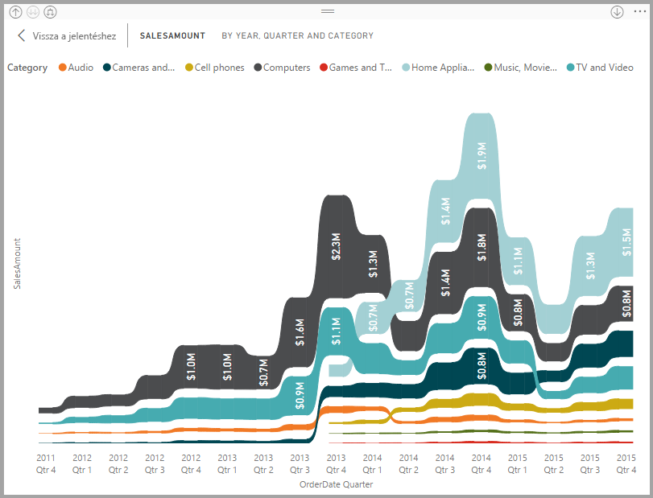
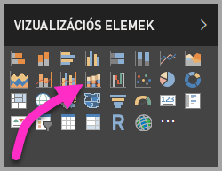
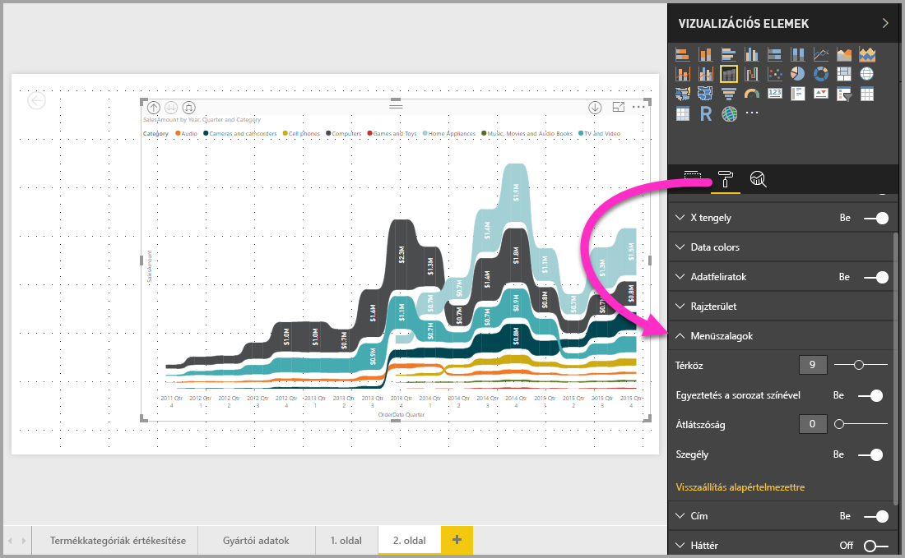

# Szalagdiagramok használata a Power BI-ban
Szalagdiagramok használatával megjelenítheti az adatokat a **Power BI**-ban, és gyorsan meghatározhatja a legmagasabb rangú (legnagyobb értéket képviselő) adatkategóriát. A szalagdiagramokkal hatékonyan ábrázolható a rangok időbeli változása: minden időszakban a legmagasabb rangú (értékű) kategória látható felül. A szalagdiagramok a 2017. szeptemberi kiadástól érhetők el a **Power BI Desktopban**, a **Power BI szolgáltatásban** pedig az ezt követő frissítésekben.

## Szalagdiagram létrehozása
Szalagdiagram létrehozásához válassza a **szalagdiagram** lehetőséget a **Vizualizációk** panelen.

A szalagdiagramok szalagok segítségével kapcsolják az adatkategóriákat a vizualizált időfolyamhoz, ezáltal megtekintheti, hogy az egyes kategóriák milyen rangsorban állnak egymáshoz képest a diagram x tengelyén (amely általában az idővonal).

## Szalagdiagram formázása
Szalagdiagram létrehozásakor a formázási lehetőségek a **Vizualizációk** panel **Formázás** szakaszában találhatók. A szalagdiagramok formázási lehetőségei a halmozott oszlopdiagramokéhoz hasonlóak, amelyeken kívül további, csak a szalagokra vonatkozó formázási lehetőségeket is tartalmaznak.

A szalagdiagramok formázási beállításaival a következőket módosíthatja:

* A **Térköz** beállítással módosíthatja a szalagok közötti üres terület méretét. A szám az oszlop maximális magasságának százalékos arányát jelenti.
* Az **Egyeztetés a sorozat színével** beállítással megadhatja, hogy a szalagok színe megegyezzen az adatsorozat színével. Ha ki van kapcsolva, a szalagok szürke színűek.
* Az **Átlátszóság** beállítással megadhatja a szalagok átlátszóságának mértékét. Az alapértelmezett érték 30.
* A **Határ** beállítással sötét szegélyt állíthat be a szalagok felső és alsó határához. A szegélyek alapértelmezés szerint ki vannak kapcsolva.

## Következő lépések
Ha többet szeretne megtudni a **Power BI Desktopról**, illetve a szoftver használatának kezdeti lépéseiről, tekintse meg a következő cikkeket.

* [Első lépések a Power BI Desktopban](desktop-getting-started.md)
* [Lekérdezések áttekintése a Power BI Desktopban](desktop-query-overview.md)
* [Adatforrások a Power BI Desktopban](desktop-data-sources.md)
* [Csatlakozás adatokhoz a Power BI Desktopban](desktop-connect-to-data.md)
* [Adatok formázása és kombinálása a Power BI Desktoppal](desktop-shape-and-combine-data.md)
* [Gyakori lekérdezési feladatok a Power BI Desktopban](desktop-common-query-tasks.md)   

