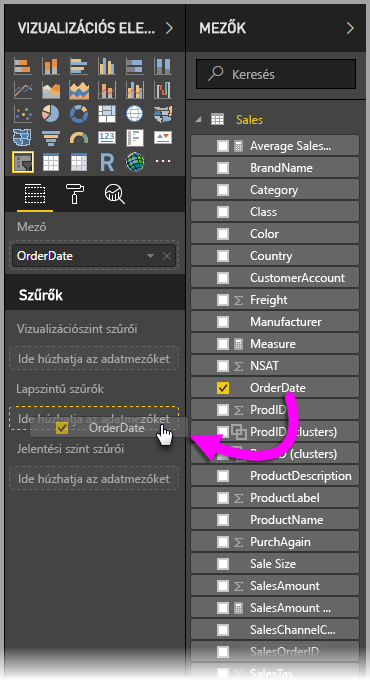

# Relatív dátumszeletelő és -szűrő használata a Power BI Desktopban
A **relatív dátumszeletelővel** vagy **relatív dátumszűrővel** időalapú szűrőket alkalmazhat az adatmodellek bármely dátumoszlopára. A **relatív dátumszeletelő** használatával például a megjelenítést korlátozhatja az utóbbi harminc napban (vagy hónapban, naptári hónapban stb.) történt értékesítési eseményekre. Az adatok frissítésekor pedig a relatív időszak automatikusan alkalmazza a vonatkozó relatív dátumkorlátokat.

## A relatív dátumtartomány-szeletelő használata
A relatív dátumszeletelőt bármely más szeletelőhöz hasonlóan használhatja. Egyszerűen hozzon létre egy **szeletelő** vizualizációt a jelentéshez, majd válasszon ki egy dátumértéket a **Mező** értékeként. A következő képen az *OrderDate* mező van kiválasztva.

Válassza ki a karátot a **relatív dátumszeletelő** jobb felső sarkában, és megjelenik egy menü.

A relatív dátumszeletelőnél válassza a *Relatív* lehetőséget.

Ezután válassza ki a beállításokat. A *relatív dátumszeletelő* első legördülő menüjében a következőlehetőségek közül választhat:

* Utolsó
* Következő
* Ez

Ezek a lehetőségek az alábbi ábrán láthatók.

A *relatív dátumszeletelő* következő (középső) beállításában egy szám beírásával megadhatja a relatív dátumtartományt.

A harmadik beállítással kiválaszthatja a dátumtartomány mértékegységét az alábbi lehetőségek közül:

* Napok
* Hetek
* Hetek (naptári)
* Hónapok
* Hónapok (naptári)
* Évek
* Évek (naptári)

Ezek a lehetőségek az alábbi ábrán láthatók.

Válassza a *Hónapok* lehetőséget a listából, és írjon be 2-t a középső beállításban. Ekkor a következők történnek: ha ma július 20. van, a szeletelő által korlátozott vizualizációk adatai az előző két hónapra, azaz a május 20-tól június 20-ig (a mai napig) tartó időszakra korlátozva jelennek meg.

Összehasonlításképp, ha a *Hónapok (naptár)* elemet választotta volna, a vizualizációk a május 1-től június 30-ig tartó időszakra (az utolsó két teljes naptári hónapra) lennének korlátozva.

## A relatív dátumtartomány-szűrő használata
Relatív dátumtartomány-szűrőt is létrehozhat az egyes jelentésoldalakhoz vagy a teljes jelentéshez. Ehhez egyszerűen húzzon egy dátummezőt a **Lapszintű szűrők** vagy a **Jelentési szint szűrői** területre a **Mező** ablaktáblán, amint az alábbi ábrán látható.

A dátummező áthúzása után a **relatív dátumszeletelő** testreszabásához hasonlóan módosíthatja a relatív dátumtartományt. Válassza a **Relatív dátum szerinti szűrés** lehetőséget a **Szűrő típusa** legördülő menüből.

A **Relatív dátum szerinti szűrés** kiválasztása után itt is három beállítás adható meg, köztük a középső numerikus mező, ahogy a szeletelő esetében is.

Ez minden, amit tudnia kell a relatív dátumkorlátozások jelentésekben való használatáról.

## Korlátozások és szempontok
A **relatív dátumtartomány-szeletelők** és -szűrők használatára jelenleg a következő korlátozások és szempontok vonatkoznak.

* A **Power BI** adatmodelljei nem tartalmaznak időzóna-információkat. A modellek tudják tárolni az időadatokat, de nem jelölik az időzónákat.
* A szeletelők és a szűrők minden esetben az UTC-időn alapulnak, így ha beállít egy szűrőt egy jelentésben, majd egy másik időzónában tartózkodó kollégájának, mindketten ugyanazokat az adatokat fogják látni. Ha azonban nem az UTC-időzónában tartózkodik, előfordulhat, hogy az időeltolódás nem felel meg a vártnak.
* A helyi időzónában rögzített adatok a **Lekérdezésszerkesztő** segítségével alakíthatók át UTC-idővé.

