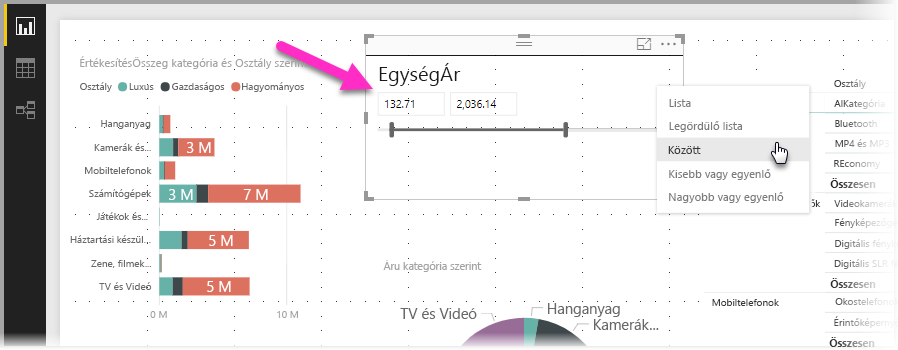
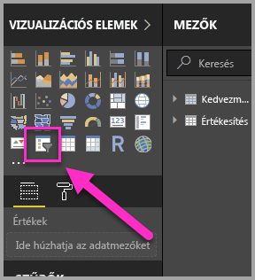
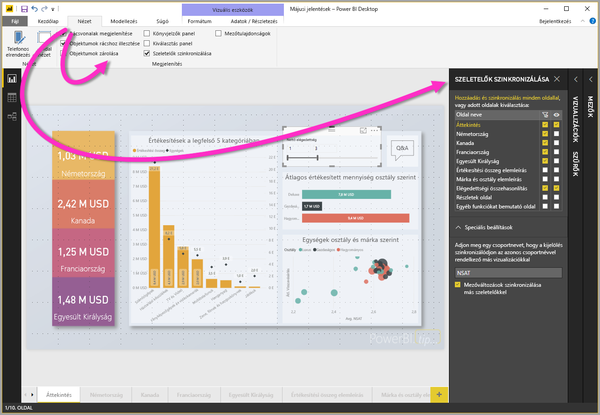
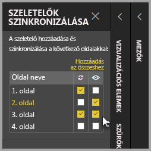
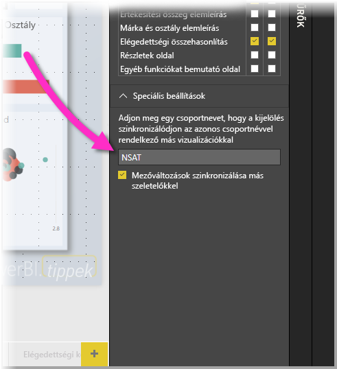

# Szeletelők használata a Power BI Desktopban

A **Power BI Desktop** **szeletelőivel** szűrheti a jelentésoldalon lévő vizualizációk eredményeit. Emellett a szeletelőkkel könnyedén módosíthatja az alkalmazott szűrőt maga a szeletelő kezelésével. Arra vonatkozóan is megadhat beállításokat, hogyan jelenjen meg a szeletelő, és hogyan kezelheti azt. Az alábbi ábrán egy olyan szeletelő látható, melynek legördülő lista *típusa* látható. 

A szeletelők különböző típusok egyikével jeleníthetők meg:

* Lista
* Legördülő lista
* Között
* Kisebb vagy egyenlő
* Nagyobb vagy egyenlő

A **Megjelenítések** panelen a **szeletelő** vizualizációra kattintva adhat hozzá szeletelőket jelentésekhez.

A szeletelők a **Power BI Desktopban** és a **Power BI szolgáltatásban** is hasonlóan működnek. A szeletelők használatáról bővebben a [Szeletelők a Power BI szolgáltatásban](power-bi-visualization-slicers.md) című cikkben olvashat.

## Szeletelők szinkronizálása jelentésoldalak között

A **Power BI Desktopban** szinkronizálhatja a szeletelőket több jelentésoldal között. A szeletelők szinkronizálásához a menüszalag **Nézet** paneljén kattintson a **Szeletelők szinkronizálása** lehetőségre. A szeletelők szinkronizálásakor megjelenik a **Szeletelők szinkronizálása** panel, a következő ábrán látható módon.

A **Szeletelők szinkronizálása** panelen megadhatja, hogyan legyen szinkronizálva a szeletelő a jelentésoldalak között. Megadhatja, hogy az egyes szeletelők **alkalmazva** legyenek-e az egyes különálló jelentésoldalakon, és hogy a szeletelő **látható** legyen-e az egyes különálló jelentésoldalakon.

Elhelyezhet például egy szeletelőt a jelentés **2. oldalán**, az alábbi ábrán látható módon. Ezután megadhatja, hogy az adott szeletelő minden kiválasztott oldalon *alkalmazva* legyen-e, és hogy a szeletelő *látható* legyen-e a jelentés minden kiválasztott oldalán. Ezek tetszőleges kombinációját alkalmazhatja minden egyes szeletelő esetében. 

A panelen található **Hozzáadás az összeshez** hivatkozással a kiválasztott szeletelőt a jelentés minden oldalán alkalmazhatja.

Vegye figyelembe, hogy a **Szeletelők szinkronizálása** panelen megjelenő kijelölések csak a *kiválasztott szeletelőre* érvényesek. Több szeletelőt is alkalmazhat különböző oldalakra, és a panelen megadhatja, hogy az egyes szeletelők hogyan legyenek egyenként alkalmazva a jelentés különböző oldalain. 

A szeletelők kijelölése szinkronizálható, azonban más kijelölések, mint például a stílusbeállítások, a szerkesztés és a törlés *nem* szinkronizálható. 

## Szeletelők speciális beállításai

Alkalmazhat **csoportnevet** is a szeletelők egy csoportjára a **Szeletelők szinkronizálása** panel **Speciális beállítások** szakaszában, és szinkronizálhatja az ugyanahhoz a csoporthoz tartozó szeletelőket a lapok között. 

Ezzel a funkcióval létrehozhat egy egyedi csoportot a szeletelőinek, mellyel szinkronizálva tarthatja őket. A program megad egy alapértelmezett nevet, de módosíthatja azt a kívánt egyéni névre. 

A csoportnév tovább növeli a szeletelők használatának rugalmasságát. Hozhat létre különálló csoportokat egyazon mezőt használó szeletelők szinkronizálásához, illetve hozzáadhatja egyetlen csoporthoz több mező szeletelőit is. 

## Következő lépések

Az alábbi cikkeket is érdekesnek találhatja:

* [Szeletelők a Power BI szolgáltatásban](power-bi-visualization-slicers.md)
* [A numerikustartomány-szeletelő használata a Power BI Desktopban](desktop-slicer-numeric-range.md)
* [Relatív dátumszeletelő és -szűrő használata a Power BI Desktopban](desktop-slicer-filter-date-range.md)

