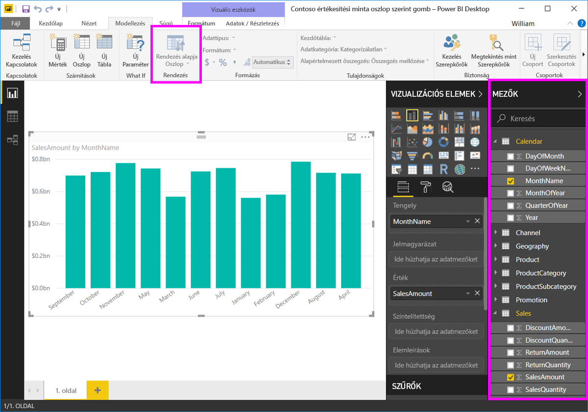

# Rendezés oszlop szerint a Power BI Desktopban
A **Power BI Desktopban** és a **Power BI szolgáltatásban** módosíthatja egy vizualizáció kinézetét, ha különböző adatmezők szerint rendezi. A vizualizáció rendezésének módosításával kiemelheti a közvetíteni kívánt információt, és biztosíthatja, hogy a vizualizáció tükrözze ezt a trendet (vagy hangsúlyt).

Akár numerikus adatokat használ (például értékesítési adatokat), akár szöveges adatokat (például államneveket), tetszése szerint rendezheti a vizualizációkat és az adatok megjelenését.  A **Power BI** nagy rugalmas rendezhetőséget és egyszerűen használható menüket biztosít. Bármilyen vizualizációnál kattintson a három pont menüre (...), majd válassza ki a mezőt, amely szerint rendezni szeretné az adatokat, amint az a következő ábrán látható.

## Részletes bemutatás példával
Vegyünk egy komolyabb példát, és vizsgáljuk meg, hogy működik a **Power BI Desktopban**.

Az alábbi vizualizáció költségeket, mennyiségeket és összegeket mutat be a gyártók neve szerint. A vizualizáció további rendezés nélkül az itt látható módon jelenik meg.

A vizualizáció jelenleg a **SalesQuantity** (Értékesített mennyiség) szerint van rendezve – ez megállapítható, ha egyeztetjük a csökkenő sávokat a jelmagyarázattal, de jobb mód is van az aktuális rendezési oszlop meghatározására: a vizualizáció jobb felső sarkában lévő három pont (...) menü. Amikor a három pontra kattintunk, a következőt látjuk:

* Az aktuális rendező mező a **SalesQuantity** (Értékesített mennyiség), amit a **Rendezés SalesQuantity szerint** félkövér kiemelése és a sárga sáv jelez. 

* Az aktuális rendezési irány növekvő, amit a kis **A/Z** ikon (az A per Z) és a lefelé mutató nyíl jelez.

A következő két szakasz külön tárgyalja a rendezési mezőt és irányt.

## A rendezéshez használt oszlop kiválasztása
Megfigyelhette a **További beállítások** menüben a **Rendezés SalesQuantity szerint** melletti sárga sávot, amely azt jelzi, hogy a vizualizáció a **SalesQuantity** oszlop szerint van rendezve. Más oszlop szerint is egyszerű rendezni – ehhez válassza a három pontot a menü megjelenítéséhez, majd válasszon egy másik oszlopot.

Az alábbi ábrán a *DiscountAmount* oszlop van kiválasztva, hogy a rendszer aszerint rendezze az adatokat. Ez az oszlop történetesen az egyik vonal a vizualizáción, nem az egyik sáv. A következőképpen néz ki a **Rendezés DiscountAmount szerint** kiválasztása után.

Vegye észre, hogy megváltozott a vizualizáció. Az értékek most a legmagasabb DiscountAmount-értéktől (ezen a vizualizáción a Fabrikam Inc.) a Northwind Tradershez tartozó legalacsonyabb értékig vannak rendezve. 

De mi történik, ha növekvő sorba szeretnénk rendezni az adatokat csökkenő helyett? A következő szakaszban bemutatjuk, ez is milyen egyszerű.

## A rendezés irányának kiválasztása – a legkisebbtől a legnagyobbig, a legnagyobbtól a legkisebbig
Ha közelebbről megvizsgáljuk a **Beállítások** menüt az előző képen, láthatjuk, hogy a **Rendezés DiscountAmount szerint** melletti ikon a következőt mutatja: **Z/A** (Z per A). Figyeljük meg:

Ha **Z/A** látszik, az azt jelenti, hogy a vizualizációt a rendszer a kiválasztott oszlop szerint, a legnagyobb értéktől a legkisebbig rendezi. Szeretné ezt módosítani? Semmi gond – csak koppintson vagy kattintson erre a **Z/A** ikonra, és a rendezés iránya **A/Z** lesz, azaz a rendszer a vizualizációt a legkisebb értéktől a legnagyobbig rendezi el (a kiválasztott oszlop alapján).

Ez itt ugyanaz a vizualizáció, miután a **Rendezés DiscountAmount szerint** melletti **Z/A** ikonra koppintva megváltoztattuk a rendezés irányát. Figyelje meg, hogy most a Northwind Traders az elsőként feltüntetett gyártó, a Fabrikam Inc. pedig az utolsó. A sorrend éppen ellentétes az előbbivel.

A rendezés a vizualizáció bármelyik oszlopa alapján elvégezhető. Egyszerűen kiválaszthatja a SalesQuantity oszlopot rendezési szempontként a **Rendezés SalesQuantity szerint** lehetőséggel, így elsőnek a legnagyobb mennyiség látszik, és a vizualizáció többi oszlopa is megmarad, függetlenül attól, hogy történetesen milyen adatot tartalmaznak az adott gyártóról. Itt láthatjuk a vizualizációt ezekkel a beállításokkal.

## Rendezés a Rendezés oszlop szerint gombbal
Van más mód is az adatok rendezésére, használhatjuk a **Rendezés oszlop szerint** gombot a **Modellezés** menüszalagon.

Ehhez a rendezési megközelítéshez ki kell választani egy oszlopot a **Mezők** panelen, majd válassza ki a **Rendezés oszlop szerint** gombot, hogy kiválassza, hogy hogyan (melyik oszlop alapján) akarja rendezni a vizualizációt. A **Rendezés oszlop szerint** gomb aktiválásához ki kell választania a rendezni kívánt oszlopot (mezőt) a **Mezők** panelen – máskülönben a gomb inaktív.

Nézzünk egy tipikus példát: az év minden hónapjához van adata, és ezeket az adatokat időrendbe szeretné rendezni. Az alábbi lépések bemutatják, hogyan oldhatja ezt meg.

1. Először is figyelje meg, hogy ha kijelöli a vizualizációt, de nem választ ki oszlopot a **Mezők** panelen, a **Rendezés oszlop szerint** gomb inaktív (szürkén jelenik meg).
   
   

2. Ha kiválasztjuk az oszlopot, amely szerint rendezni szeretnénk az adatokat, a **Mezők** panelen aktívvá válik a **Rendezés oszlop szerint** gomb.
   
   
3. Ekkor, ha ki van jelölve a vizualizáció, kiválaszthatja a *MonthOfYear* (Év hónapja) oszlopot az alapértelmezett (*MonthName*, Hónap neve) oszlop helyett, és a vizualizáció ekkor a kívánt sorrendben, a hónapok szerint rendezi az adatokat.
   
   

Ennyi az egész. Ne feledje, hogy a **Rendezés oszlop szerint** aktivizálásához ki kell választania egy oszlopot a **Mezők** panelen.

## Visszatérés a rendezési alapbeállításokhoz
Bármelyik oszlop szerint rendezheti az adatokat, de előfordulhat, hogy azt szeretné, hogy a vizualizáció visszatérjen az alapértelmezett rendezési oszlophoz. Semmi gond. Olyan vizualizációk esetén, ahol ki van választva rendezési oszlop (a kijelölt rendezési oszlop mellett egy sárga sáv látható a három pont menüben, amint azt már megtanultuk), egyszerűen nyissa meg a **További beállítások** menüt, válassza ismét azt az oszlopot, és a vizualizáció visszatér az alapértelmezett rendezési oszlophoz.

Vegyük példának az előző diagramunkat:

Ha visszatérünk a menübe, és ismét a **SalesQuantity** elemet választjuk, a vizualizáció visszaáll alapértékekre, és betűrendbe rendezi az adatokat **Manufacturer** (Gyártó) szerint, amint az az alábbi ábrán látható.

Így, hogy ennyi lehetőségünk van a vizualizációk rendezésére, egyszerű létrehozni éppen olyan diagramokat vagy ábrákat, amilyeneket szeretnénk.

