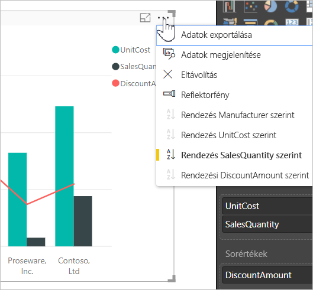
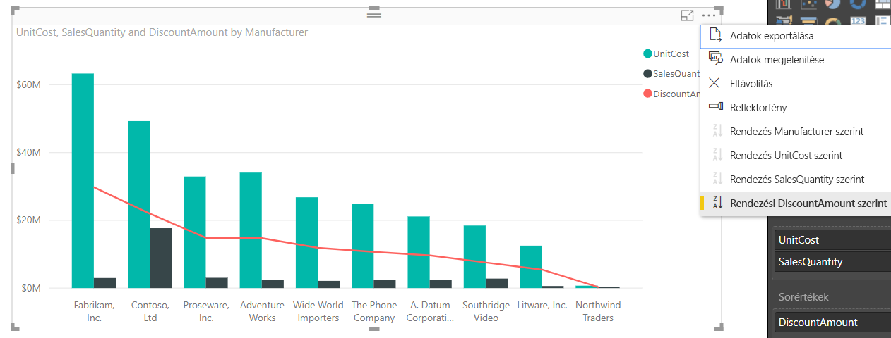
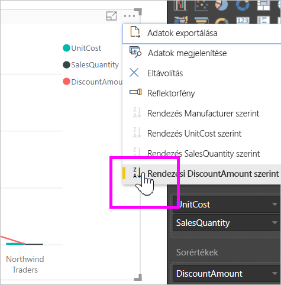
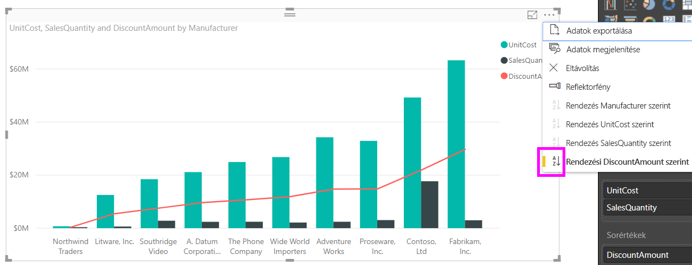
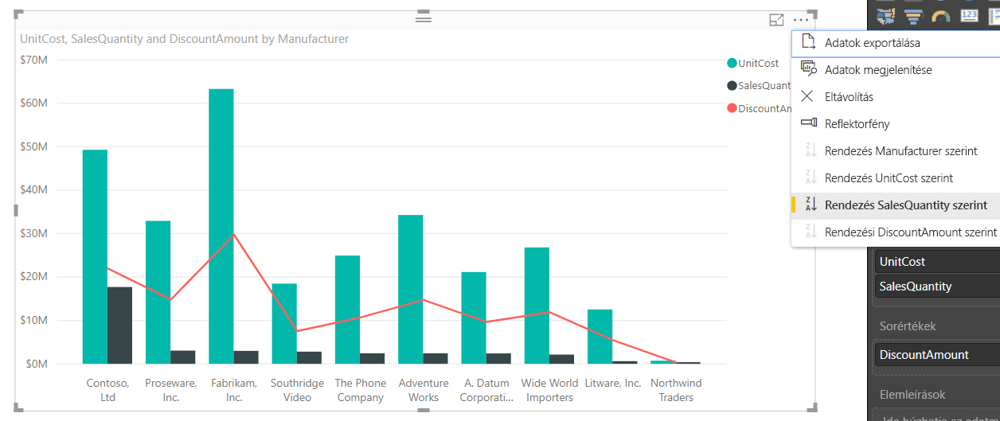
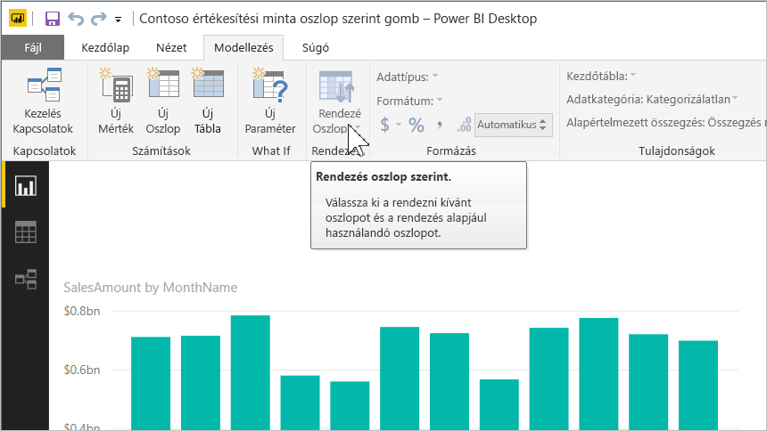
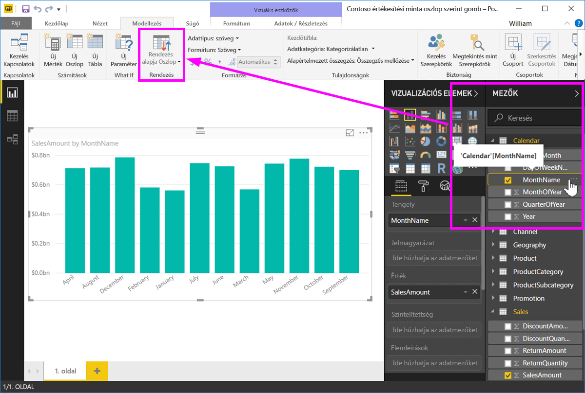
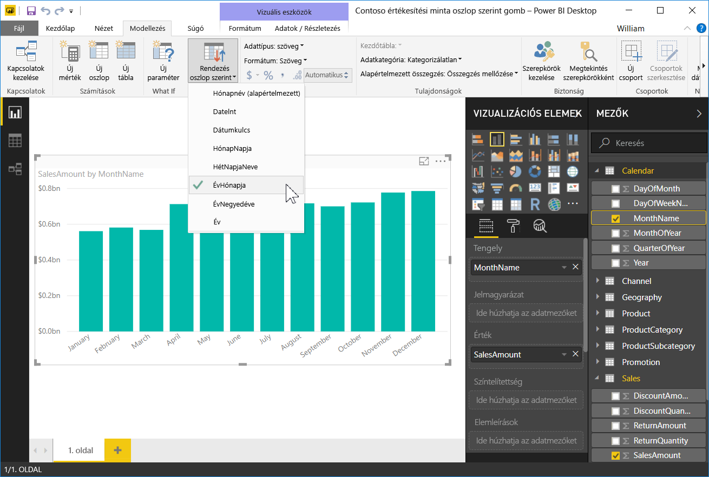
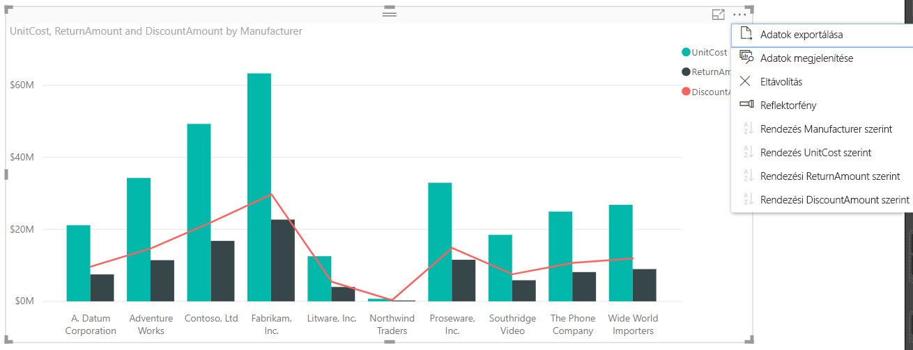

# Rendezés oszlop szerint a Power BI Desktopban
A **Power BI Desktopban** és a **Power BI szolgáltatásban** módosíthatja egy vizualizáció kinézetét, ha különböző adatmezők szerint rendezi. A vizualizáció rendezésének módosításával kiemelheti a közvetíteni kívánt információt, és biztosíthatja, hogy a vizualizáció tükrözze a közvetíteni kívánt trendet (vagy hangsúlyt).

Akár numerikus adatokat használ (például értékesítési adatokat), akár szöveges adatokat (például államneveket), tetszése szerint rendezheti a vizualizációkat és az adatok megjelenését.  A **Power BI** nagy rugalmas rendezhetőséget és egyszerűen használható menüket biztosít. Bármilyen vizualizációnál kattintson a három pont menüre (...), majd a **Rendezés szempontja** elemre, és válassza ki a mezőt, amely szerint rendezni szeretné az adatokat, amint az a következő ábrán látható.

## Részletes bemutatás példával
Vegyünk egy komolyabb példát, és vizsgáljuk meg, hogy működik a **Power BI Desktopban**.

Az alábbi vizualizáció listázza az első 15 államot időjárás alapján (legtöbb napsütéses nap, 1–50-ig rangsorolva, ahol az 1. a legnaposabb). Itt látható a vizualizáció a rendezés előtt.

A vizualizáció jelenleg **Megélhetési költség** szerint van rendezve – ez megállapítható, ha egyeztetjük a csökkenő sávokat a jelmagyarázattal, de jobb mód is van az aktuális rendezési oszlop meghatározására: a vizualizáció jobb felső sarkában lévő három pont menüben (...) elérhető **Rendezés szempontja** párbeszédpanelen. Amikor a három pontra kattintunk, a következőt látjuk:

Észrevehet néhány elemet a három pont kiválasztásakor megjelenő menüben:

* A **Megélhetési költségek** melletti sárga sávot, és a tényt, hogy a **Megélhetési költség** betűtípusa félkövér
* A **Rendezés szempontja** szavak melletti kis ikont, amelyen egy **Z/A** (Z az A fölött) és egy lefelé mutató nyíl látható.

A következő szakaszokban ezeket külön-külön tárgyalni fogjuk.

## A rendezéshez használt oszlop kiválasztása
Észrevehette a sárga sávot a **Rendezés szempontja** menüben a **Megélhetési költségek** mellett. Ez jelölte, hogy a vizualizáció a **Megélhetési költségek** oszlopot használta a vizualizáció rendezéséhez. Más oszlop szerint is egyszerű rendezni – ehhez válassza a három pontot a **Rendezés szempontja** menü megjelenítéséhez, majd válasszon egy másik oszlopot. Ennyire egyszerű.

Az alábbi ábrán a **Közösség jólléte** oszlopot választottuk ki, hogy a rendszer aszerint rendezze az adatokat. Ez az oszlop történetesen az egyik vonal a vizualizáción, nem az egyik sáv. Így néz ki a vizualizáció a **Közösség jólléte** kiválasztása után.

Vegye észre, hogy megváltozott a vizualizáció. Az értékek most a vizualizációban szereplő államok közül a legmagasabb „Közösség jólléte” értéktől (ebben az esetben RI, azaz Rhode Island) haladnak lefelé egészen az AZ (azaz Arizona) elemig, amely a legalacsonyabb értékkel rendelkezik. Ne feledjük, hogy a teljes diagram még mindig csak azt a 15 államot tartalmazza, amelyben a legtöbb napsütéses nap volt, csak most a vizualizáció egy másik oszlopa szerint rendeztük az adatokat.

De mi történik, ha növekvő sorba szeretnénk rendezni az adatokat csökkenő helyett? A következő szakaszban bemutatjuk, ez is milyen egyszerű.

## A rendezés irányának kiválasztása – a legkisebbtől a legnagyobbig, a legnagyobbtól a legkisebbig
Ha közelebbről megvizsgáljuk a **Rendezés szempontja** menüt az előző képen, láthatjuk, hogy a **Rendezés szempontja** melletti ikon a következőt mutatja: **Z/A** (Z az A fölött). Figyeljük meg:

Ha **Z/A** látszik, az azt jelenti, hogy a vizualizációt a rendszer a kiválasztott oszlop szerint, a legnagyobb értéktől a legkisebbig rendezi. Szeretné ezt módosítani? Semmi gond – csak koppintson vagy kattintson erre a **Z/A** ikonra, és a rendezés iránya **A/Z** lesz, azaz a rendszer a vizualizációt a legkisebb értéktől a legnagyobbig rendezi el (a kiválasztott oszlop alapján).

Ez itt ugyanaz a vizualizáció, de ez alkalommal már miután rákoppintottunk a **Rendezés szempontja** menün a **Z/A** ikonra a rendezés irányának módosításához. Láthatjuk, hogy most az AZ (Arizona) az első állam a listán, és az RI (Rhode Island) az utolsó – pont ellenkezőleg, mint korábban.

A vizualizáció bármelyik oszlopa alapján elvégezhetjük a rendezést, egyszerűen kiválaszthatjuk az Időjárás oszlopot rendezési szempontként, majd kiválaszthatjuk a **Z/A** rendezést a **Rendezés szempontja** menüben, így elsőnek a legnaposabb államot látjuk (a legmagasabb értéket – az Időjárás ebben az adatmodellben a napsütéses napok számával egyezik), és emellett megmarad a vizualizáció többi oszlopa is, függetlenül attól, hogy történetesen milyen adatot tartalmaznak az adott államhoz. Itt láthatjuk a vizualizációt ezekkel a beállításokkal.

## Rendezés a Rendezés oszlop szerint gombbal
Van más mód is az adatok rendezésére, használhatjuk a **Rendezés oszlop szerint** gombot a **Modellezés** menüszalagon.

Ehhez a rendezési megközelítéshez ki kell választani egy oszlopot a **Mezők** panelen, majd válassza ki a **Rendezés oszlop szerint** gombot, hogy kiválassza, hogy hogyan (melyik oszlop alapján) akarja rendezni a vizualizációt. A **Rendezés oszlop szerint** gomb aktiválásához ki kell választania a rendezni kívánt oszlopot (mezőt) a **Mezők** panelen – máskülönben a gomb inaktív.

Nézzünk egy tipikus példát: a hét minden napjához van adata, és ezeket az adatokat időrendbe szeretné rendezni. Az alábbi lépések bemutatják, hogyan oldhatja ezt meg.

1. Először is figyelje meg, hogy ha kijelöli a vizualizációt, de nem választ ki oszlopot a **Mezők** panelen, a **Rendezés oszlop szerint** gomb inaktív (szürkén jelenik meg).
   
   
2. Ha kiválasztjuk az oszlopot, amely szerint rendezni szeretnénk az adatokat, a **Mezők** panelen aktívvá válik a **Rendezés oszlop szerint** gomb.
   
   
3. Ekkor, ha ki van jelölve a vizualizáció, kiválaszthatjuk a *Hét napja* oszlopot az alapértelmezett (*Nap neve*) oszlop helyett, és a vizualizáció ekkor a kívánt sorrendben rendezi az adatokat: a hét napja szerint.
   
   

Ennyi az egész. Ne feledje, hogy a **Rendezés oszlop szerint** aktivizálásához ki kell választania egy oszlopot a **Mezők** panelen.

## Visszatérés a rendezési alapbeállításokhoz
Bármelyik oszlop szerint rendezheti az adatokat, de előfordulhat, hogy azt szeretné, hogy a vizualizáció visszatérjen az alapértelmezett rendezési oszlophoz. Semmi gond. Olyan vizualizációk esetén, ahol ki van választva rendezési oszlop (a kijelölt rendezési oszlop mellett egy sárga sáv látható a **Rendezés szempontja** menüben, amint azt már megtanultuk), egyszerűen nyissa meg a **Rendezés szempontja** menüt, válassza ismét azt az oszlopot, és a vizualizáció visszatér az alapértelmezett rendezési oszlophoz.

Vegyük példának az előző diagramunkat:

Ha visszatérünk a menübe, és ismét az **Időjárás** elemet választjuk, a vizualizáció visszaáll alapértékekre, és betűrendbe rendezi az adatokat **Államkód** szerint, amint az az alábbi ábrán látható.

Így, hogy ennyi lehetőségünk van a vizualizációk rendezésére, egyszerű létrehozni éppen olyan diagramokat vagy ábrákat, amilyeneket szeretnénk.

