# Elemleírások létrehozása jelentésoldalak alapján a Power BI Desktopban (előzetes verzió)
A **Power BI Desktopban** létrehozott jelentésoldalak alapján sokatmondóan látványos **jelentés-elemleírásokat** készíthet, amelyek akkor jelennek meg, ha az egérmutató a vizualizáció felett van. Elemleírásként szolgáló jelentésoldal létrehozásakor az egyéni elemleírásokban vizualizációk, képek és a jelentésoldalon létrejött bármely más elemek gyűjteményei is szerepelhetnek. 

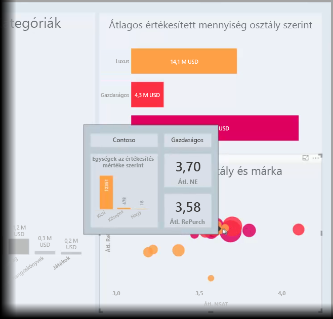

Tetszőleges számú elemleírás-oldalt létrehozhat. Minden elemleírás-oldal a jelentés egy vagy több mezőjéhez társítható, így ha az egérmutatót a kiválasztott mezőt tartalmazó vizualizáció fölé viszi, az elemleírás-oldalon létrehozott, az egérmutató alatti adatpont szerint szűrt elemleírás jelenik meg. 

A jelentések elemleírásainak számos felhasználási módja van. Tekintsük át az elemleírások létrehozását és a konfigurálásukhoz szükséges teendőket.

### Az elemleírás-készítési funkció előzetes verziójának engedélyezése 
Mivel a jelentések elemleírásai jelenleg előzetes verzióban érhetők el, elemleírások készítéséhez előbb engedélyeznie kell ezt a funkciót. A jelentés-elemleírások előzetes verziójának engedélyezéséhez válassza a **Fájl > Lehetőségek és beállítások > Beállítások > Előzetes verziójú funkciók** lehetőséget a Power BI Desktopban, majd jelölje be a **Jelentésoldal-alapú elemleírások** elem melletti jelölőnégyzetet. 

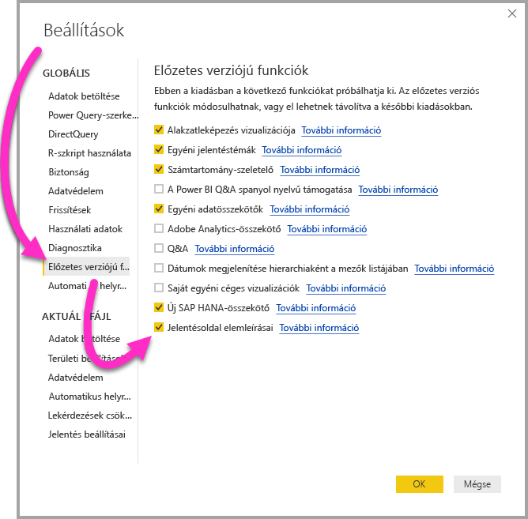

A jelentés-elemleírások készítésére szolgáló funkció előzetes verziójának engedélyezése után újra kell indítania a **Power BI Desktopot**.

## Elemleírás-oldal létrehozása jelentéshez
Kiindulásként hozzon létre egy új jelentésoldalt a **Power BI Desktop**-vászon alján, a lapfülek sávjában található **+** gombra kattintva. A gomb a jelentés utolsó oldala mellett van. 

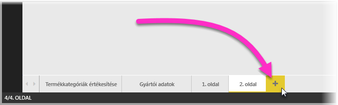

Az elemleírás bármekkora lehet, de figyelembe kell venni, hogy a jelentésvászon előtt fog megjelenni, tehát érdemes ésszerűen kicsire méretezni. Az **Oldalméret** kártya **Formátum** paneljén megjelenik egy új, *Elemleírás* nevű méretsablon. Ez az elemleíráshoz alkalmas jelentésvászon-méretet biztosít.

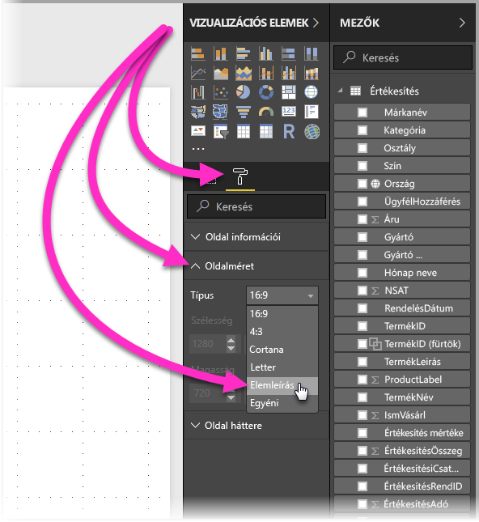

A **Power BI Desktop** alapértelmezés szerint az oldalon rendelkezésre álló helyhez igazítja a jelentésvásznat. Ez többnyire megfelelő, elemleírások esetén viszont nem az. Jobban látható, hogy milyen lesz a kész elemleírás, ha az **Oldal nézet** a tényleges méretre van állítva. 

Ehhez válassza a menüszalag **Nézet** elemét. Ott a következő ábrán látható módon válassza az **Oldal nézet > Tényleges méret** elemet.

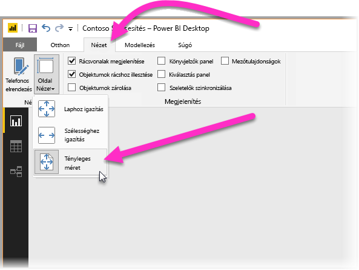

A jelentésoldalnak a rendeltetését egyértelműen leíró nevet is adhat. Válassza az **Oldal információi** kártyát a **Formátum** panelen, majd adja meg a nevet az ott található **Név** mezőben. A következő ábrán az elemleírásként szolgáló jelentés neve *Tooltip 1*, de bármilyen ötletes nevet megadhat.

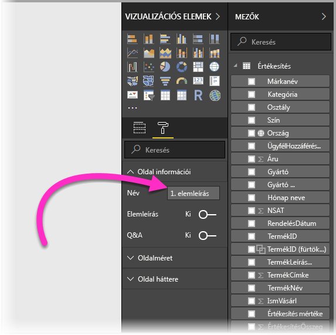

Innen kiindulva az elemleírásban megjeleníteni kívánt bármilyen vizualizációt létrehozhat. A következő ábrán két kártya és egy fürtözött sávdiagram látható az elemleírás-oldalon. Az oldal és az egyes vizualizációk háttérszíne is a kívánt megjelenésnek megfelelően van beállítva.

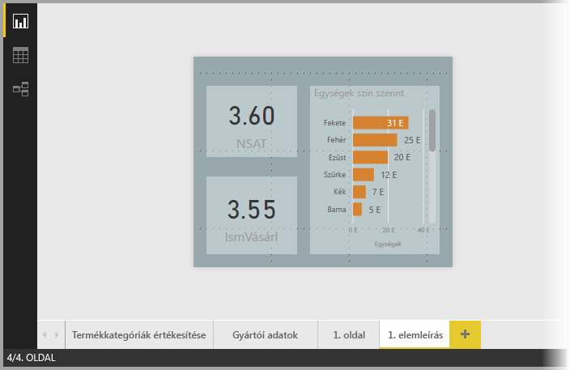

Ahhoz, hogy az elemleírásnak szánt jelentésoldal elemleírásként használható legyen, szükség van még néhány további lépésre. Az elemleírás-oldalt több módon is konfigurálni kell a következő szakaszban leírtak alapján. 

## Elemleírásként szolgáló jelentésoldal konfigurálása

Az elemleírásként szolgáló jelentésoldal létrehozása után az oldalt konfigurálni kell, hogy a **Power BI Desktop** elemleírásként ismerje fel, és hogy a megfelelő vizualizációk felett jelenjen meg.

Elsőként az **Elemleírás** kapcsolót kell **Be** állásba húzni az **Oldal információi** kártyán, hogy az oldal elemleírás legyen. 

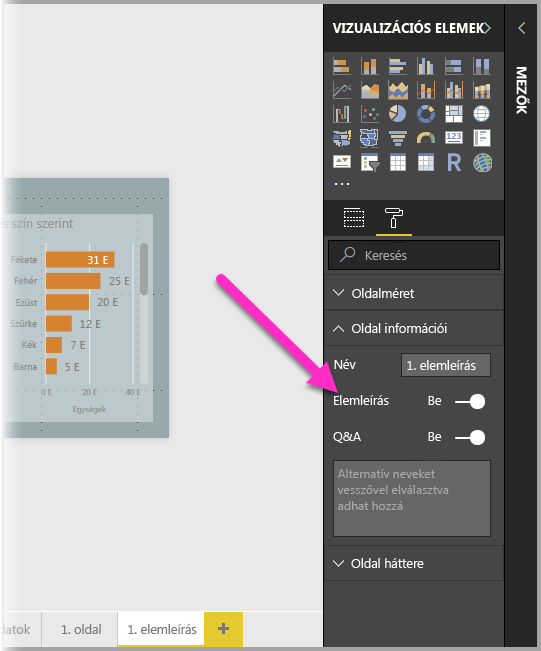

A kapcsoló beállítása után megadhatja azokat a mezőket, amelyeknél az elemleírást meg kívánja jeleníteni. Az elemleírás azoknál a vizualizációknál fog megjelenni, amelyek tartalmazzák a megadott mezőt. A kívánt egy vagy több mezőt úgy adhatja meg, hogy a **Vizualizációk** panel **Mezők** oszlopában lévő **Elemleírás-mezők** gyűjtőbe húzza őket. A következő ábrán a *SalesAmount* mező van az **Elemleírás-mezők** gyűjtőbe húzva.

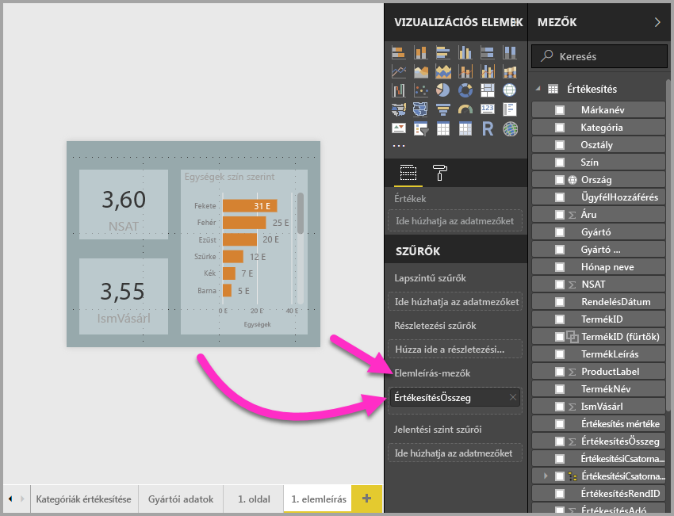
 
Az **Elemleírás-mezők** gyűjtőben kategorikus és numerikus mezők, akár mértékek is elhelyezhetők.

Ha ez kész, akkor a létrehozott elemleírás-oldal az alapértelmezett Power BI-elemleírást helyettesítő elemleírásként lesz használva a jelentésnek az **Elemleírás-mezők** gyűjtőben megadott mezőket használó vizualizációihoz.

## Elemleírás manuális beállítása jelentéshez

A megadott mezőt tartalmazó vizualizáció fölé vitt egérmutatónál automatikusan megjelenő elemleírásokon kívül manuálisan is állíthat be elemleírásokat. 

A jelentés-elemleírásokat támogató vizualizációk **Formázás** paneljén már található egy **Elemleírás** kártya. 

Elemleírás manuális beállításához jelölje ki azt a vizualizációt, amelyhez manuális elemleírást kíván megadni, majd válassza a **Vizualizációk** panel **Formátum** szakaszát, és bontsa ki az **Elemleírás** kártyát.

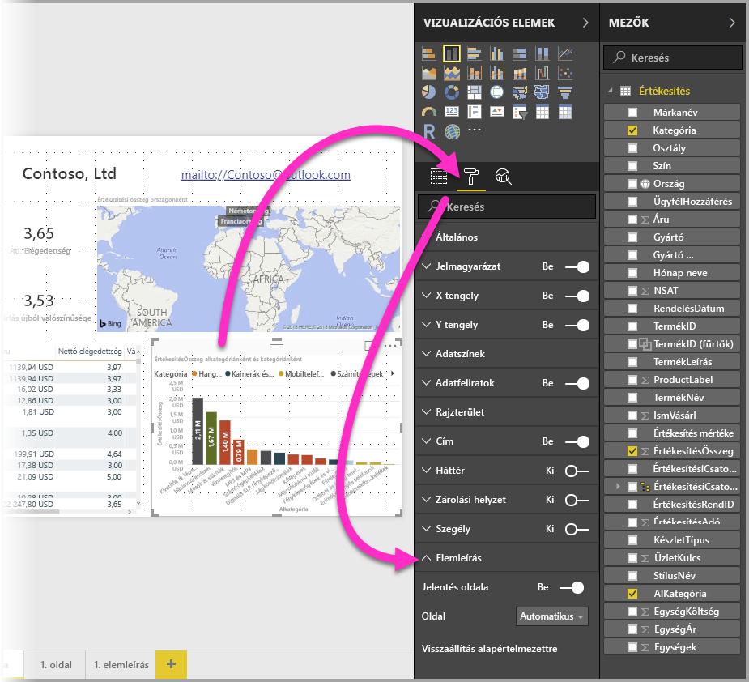

A **Lap** legördülő listából válassza ki az adott vizualizációhoz használni kívánt elemleírást. Fontos, hogy a párbeszédpanelen csak az **Elemleírás** tulajdonsággal megadott jelentésoldalak jelennek meg.

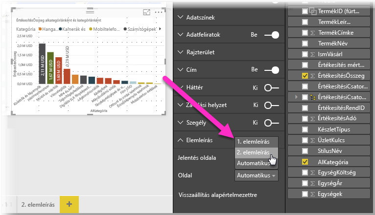

A manuálisan beállított elemleírások számos célra felhasználhatók. Beállíthat elemleírásként egy üres lapot, hogy felülírja az alapértelmezett Power BI-elemleírást. A manuáli elemleírások akkor is hasznosak, ha nem szeretné, hogy a Power BI által automatikusan kiválasztott elemleírás jelenjen meg. Ha egy vizualizáció például két mezőt tartalmaz, és mindkettőhöz tartozik elemleírás, akkor a Power BI csak az egyiket jeleníti meg. Lehetséges, hogy Ön nem ezt szeretné. Ilyenkor manuálisan kiválaszthatja a megjelenítendő elemleírást.

## Alapértelmezett elemleírások visszaállítása

Ha manuálisan hoz létre elemleírást egy vizualizációhoz, de mégis az alapértelmezett elemleírás használata mellett dönt, akkor bármikor visszatérhet a Power BI által biztosított alapértelmezett elemleíráshoz. Az alapértelmezés visszaállításához elég a kijelölt vizualizáció kibontott **Elemleírás** kártyájának **Lap** legördülő menüjéből az *Auto* lehetőséget megadni.

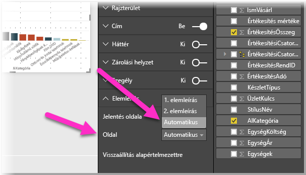

## Egyéni jelentés-elemleírások vonaldiagramokhoz

Ha a jelentéshez készült elemleírás vonaldiagram típusú vagy keresztkiemelést használó vizualizációkhoz van kötve, akkor figyelembe kell venni néhány szempontot.

### Jelentés-elemleírások vonaldiagramokhoz

Ha a jelentés elemleírása vonaldiagramhoz tartozik, akkor a diagram minden vonalához csak egy elemleírás jelenik meg. Ez a vonaldiagramok alapértelmezett elemleírásainak viselkedéséhez hasonló, ahol szintén csak egy elemleírás jelenik meg. 

Ennek az az oka, hogy jelmagyarázat mezője nem szűrőként van átadva az elemleírásnak. A következő ábrán látható elemleírás az adott napon a jelentésben ábrázolt három kategóriában (a példában Deluxe, Economy és Regular) értékesített egységeket mutatja be. 

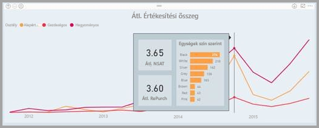

### Jelentés-elemleírások keresztkiemeléssel

Ha egy jelentés vizualizációja keresztkiemeléssel készült, akkor a jelentés elemleírása mindig a keresztkiemelt adatokat mutatja még akkor is, ha az egérmutató az adatpont elhalványított része felett van. A következő ábrán az egér az oszlopdiagram elhalványított (nem kiemelt) részére mutat, az jelentés elemleírásában mégis az adatpont kiemelt részéhez tartozó adat jelenik meg.

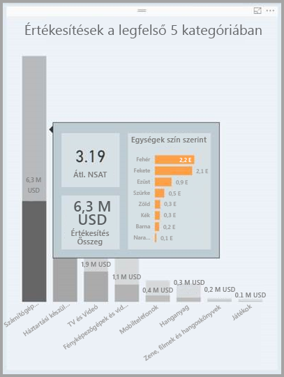

## Korlátozások és szempontok
A jelentésalapú **elemleírások** jelenlegi előzetes verziójú kiadásának a használatára vonatkozik néhány korlátozás és egyéb szempont.

* A jelentésekhez készült elemleírások mobilalkalmazásban vagy beágyazott környezetekben, például webes közzététel használatával megtekintett jelentésekben nem támogatottak. 
* A jelentésekhez készült elemleírások egyéni vizualizációkhoz való használata nem támogatott. 
* A fürtök mezőként történő megjelenítése a jelentésekhez készült elemleírásokban jelenleg nem támogatott. 
* Ha az elemleírásban megjeleníteni kívánt mező egy kategóriát helyettesít, akkor a mezőt tartalmazó vizualizációknál csak akkor jelenik meg az adott elemleírás, ha a kiválasztott mezők összegzése megegyezik. 

## Következő lépések
Az elemleírásokhoz hasonló vagy azokkal együtt használható funkciókkal kapcsolatos részletesebb információkat az alábbi cikkekben talál:

* [Részletezés használata a Power BI Desktopban](desktop-drillthrough.md)
* [Irányítópult-csempe vagy jelentésvizualizáció megjelenítése Fókusz módban](service-focus-mode.md)

