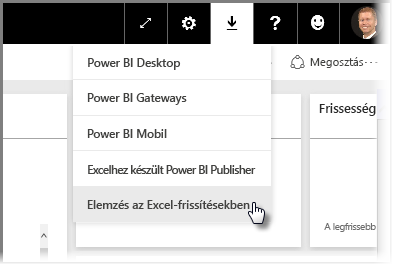
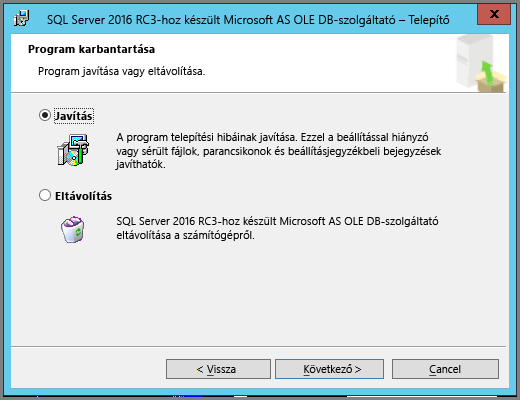
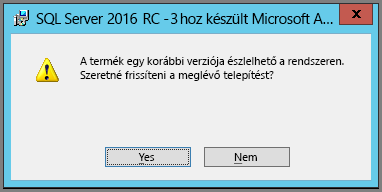

# Az Elemzés az Excelben hibaelhárítása
Előfordulhat az Elemzés az Excelben funkció használata során, hogy nem várt eredményt kap, vagy nem a kívánt módon működik. Ez az oldal az Elemzés az Excelben használata során felmerülő gyakori problémákra nyújt megoldást.

> [!NOTE]
> Az [Elemzés az Excelben](service-analyze-in-excel.md) ismertetése és engedélyezésének bemutatása egy különálló oldalon található.
> 
> Ha olyan helyzet miatt tapasztal problémákat, amely nem szerepel az alábbi listán, a [közösségi webhelyen](http://community.powerbi.com/) kérhet további segítséget, vagy létrehozhat egy [támogatási jegyet](https://powerbi.microsoft.com/support/).
> 
> 

A jelen cikk az alábbi hibaelhárítási szakaszokat tartalmazza:

* Excel-kódtárak frissítése az OLE DB-szolgáltató esetében
* Annak megállapítása, hogy szükség van-e az Excel-kódtárak frissítésére
* Nem létesíthető kapcsolat hibaüzenet
* Tiltott hibaüzenet
* Nincs adatmodell
* A token lejárt hibaüzenet
* A helyszíni Elemzési szolgáltatások nem érhetők el
* Semmi nem húzható a Kimutatási értékek területre (nincsenek mértékek)

## Excel-kódtárak frissítése az OLE DB-szolgáltató esetében
Az **Elemzés az Excelben** használatához a számítógépnek rendelkeznie kell egy telepített aktuális AS OLE DB-szolgáltatóval. A [közösségi bejegyzés](http://community.powerbi.com/t5/Service/Analyze-in-Excel-Initialization-of-the-data-source-failed/m-p/30837#M8081) remek módja az OLE DB-szolgáltató telepítésének ellenőrzésének, vagy egy újabb verzió letöltésének.

Az Excel-kódtáraknak meg kell egyezniük a Windows-verzió architektúrájával. Ha 64 bites Windows rendszerrel rendelkezik, akkor a 64 bites OLE DB-szolgáltatót kell telepítenie.

A legújabb Excel-kódtárak letöltéséhez keresse fel a Power BI felületét, koppintson a jobb felső sarokban található **lefelé mutató nyílra**, majd válassza az **Elemzés az Excelben-frissítések** lehetőséget.

A megjelenő párbeszédablakban válassza a **Letöltés (előzetes verzió)** lehetőséget.

## Annak megállapítása, hogy szükség van-e az Excel-kódtárak frissítésére
Az Excel OLE DB-szolgáltatói kódtárak legújabb verzióját az előző szakaszban található hivatkozások használatával töltheti le. A megfelelő OLD DB-szolgáltatói kódtár letöltése és a telepítés megkezdése után a rendszer ellenőrzi az aktuálisan telepített verziót.

Ha az Excel OLE DB-szolgáltatói ügyfélkódtárak naprakészek, a rendszer egy ehhez hasonló párbeszédablakot jelenít meg:

C:\Users\davidi\Desktop\powerbi-content-pr\articles\media\powerbi-desktop-troubleshooting-analyze-in-excel

Amennyiben a telepíteni kívánt verzió újabb, mint a számítógépen lévő, az alábbi párbeszédablak jelenik meg:

Ha a frissítésre felszólító párbeszédablak jelenik meg, folytassa a telepítést, hogy az OLE DB-szolgáltató legújabb verziója kerüljön a számítógépre.

## Nem létesíthető kapcsolat hibaüzenet
A *nem létesíthető kapcsolat* hibaüzenet elsődleges oka, hogy a számítógép OLE DB-szolgáltatójának ügyfélkódtára nem naprakész. A megfelelő frissítés megállapításával kapcsolatos további információk és a letöltési hivatkozások a jelen cikk korábbi, **Excel-kódtárak frissítése az OLE DB-szolgáltató esetében** című szakaszában találhatók.

## Tiltott hibaüzenet
Egyes felhasználóknak egynél több Power BI-fiókja van, és amikor az Excel megpróbál kapcsolódni a Power BI szolgáltatáshoz a meglévő hitelesítő adatok segítségével, előfordulhat, hogy a használt hitelesítő adatok nem rendelkeznek hozzáféréssel az elérni kívánt adatkészlethez vagy jelentéshez.

Ebben az esetben **Tiltott** elnevezésű hibaüzenetet kaphat, ami azt jelenti, hogy olyan hitelesítő adatok segítségével lehet bejelentkezve a Power BI szolgáltatásba, amelyekkel nem rendelkezik hozzáféréssel az adatkészlethez. A **tiltott** hibaüzenettel való találkozás után, amikor a rendszer felkéri a hitelesítő adatok megadására, használja azokat az adatokat, amelyekkel jogosult a használni kívánt adatkészlet elérésére.

Ha továbbra is hibákba ütközik, jelentkezzen be a Power BI szolgáltatásba az engedéllyel rendelkező fiókkal, és ellenőrizze a szolgáltatásban, hogy meg tudja-e tekinteni és hozzáfér-e az Excelben elérni kívánt adatkészlethez.

## Nincs adatmodell
Ha olyan hibaüzenetbe ütközik, mely szerint **Nem található OLAP-kockamodell**, akkor az elérni kívánt adatkészlet nem rendelkezik adatmodellel, és ezért nem elemezhető Excelben.

## A token lejárt hibaüzenet
Ha **a token lejárt** hibaüzenetet kap, akkor mostanában nem használta az **Elemzés az Excelben** funkciót a jelenlegi számítógépen. Egyszerűen csak adja meg ismét hitelesítő adatait, vagy nyissa meg újra a fájlt, és a hibaüzenet eltűnik.

## A helyszíni Elemzési szolgáltatások nem érhetők el
Ha olyan adatkészlethez próbál hozzáférni, amely helyszíni Analysis Services-adatokhoz kapcsolódik, előfordulhat, hogy hibaüzenetet kap. Az **Elemzés az Excelben** nem támogatja a helyszíni **Analysis Services** szolgáltatásban található adatkészletekhez és jelentésekhez történő kapcsolódást kapcsolati karakterlánc segítségével, ha a számítógép és az **Analysis Services**-kiszolgáló ugyanabban a tartományban található, és a fiókja hozzáféréssel rendelkezik az adott **Analysis Services**-kiszolgálóhoz.

## Semmi nem húzható a Kimutatási értékek területre (nincsenek mértékek)
Amikor az **Elemzés az Excelben** egy külső OLAP-modellhez kapcsolódik (azaz ahogyan az Excel a Power BI szolgáltatáshoz kapcsolódik), a *Kimutatáshoz* [kötelező a külső modellben **mértékeket** megadni](https://support.microsoft.com/kb/234700), mivel a számítások elvégzése a kiszolgálón történik. Ez eltér attól, amikor helyi adatforrással dolgozik (pl. Excel-táblákkal, vagy amikor adatkészletekkel dolgozik a **Power BI Desktopban** vagy a **Power BI szolgáltatásban**), mert ebben az esetben a táblázatos modell helyileg elérhető, és [implicit mértékek is használható](https://msdn.microsoft.com/library/gg399077.aspx). Ezek olyan dinamikusan előállított mértékek, amelyek nem az adatmodellben vannak tárolva. Ezekben az esetekben az Excel viselkedése eltér a **Power BI Desktop** vagy a **Power BI szolgáltatás** viselkedésétől: lehetnek olyan oszlopok az adatok között, amelyek mértékekként kezelhetők a Power BI szolgáltatásban, de nem használhatók értékként (mértékkén) az Excelben.

A probléma megoldására több lehetőség van:

1. Létrehozhat [mértékeket az adatmodellben a **Power BI Desktopban**](desktop-tutorial-create-measures.md), majd közzéteheti az adatmodellt a **Power BI szolgáltatásban**, és így hozzáférhet a közzétett adatkészlethez az Excelből.
2. Létrehozhat [mértékeket az adatmodellben az Excel PowerPivot alatt](https://support.office.com/article/Create-a-Measure-in-Power-Pivot-d3cc1495-b4e5-48e7-ba98-163022a71198).
3. Ha csak táblákkal (és adatmodellel nem) rendelkező Excel-munkafüzetből importált adatokat, akkor [hozzáadhatja a táblákat az adatmodellhez](https://support.office.com/article/Add-worksheet-data-to-a-Data-Model-using-a-linked-table-d3665fc3-99b0-479d-ba09-a37640f5be42), majd követheti a fenti 2. lehetőségben leírt lépéseket, és létrehozhat mértékeket az adatmodellben.

Ha meghatározta a modell mértékeit a Power BI szolgáltatásban, használhatja azokat az Excel-kimutatások **Értékek** területén.

## Következő lépések
[Elemzés az Excelben](service-analyze-in-excel.md)

[Oktatóanyag: Saját mértékek létrehozása a Power BI Desktopban](desktop-tutorial-create-measures.md)

[Mértékek a PowerPivotban](https://msdn.microsoft.com/library/gg399077.aspx)

[Mérték létrehozása a PowerPivotban](https://support.office.com/article/Create-a-Measure-in-Power-Pivot-d3cc1495-b4e5-48e7-ba98-163022a71198)

[Munkalapadatok hozzáadása egy Adatmodellhez csatolt külső tábla használatával](https://support.office.com/article/Add-worksheet-data-to-a-Data-Model-using-a-linked-table-d3665fc3-99b0-479d-ba09-a37640f5be42)

[Az OLAP és nem OLAP Excel-kimutatások közötti különbségek](https://support.microsoft.com/kb/234700)

