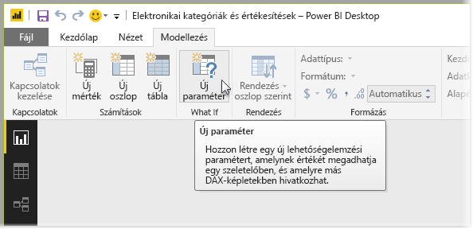
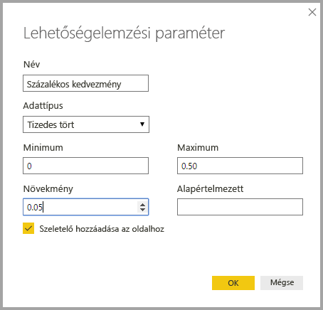
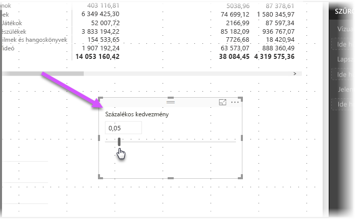
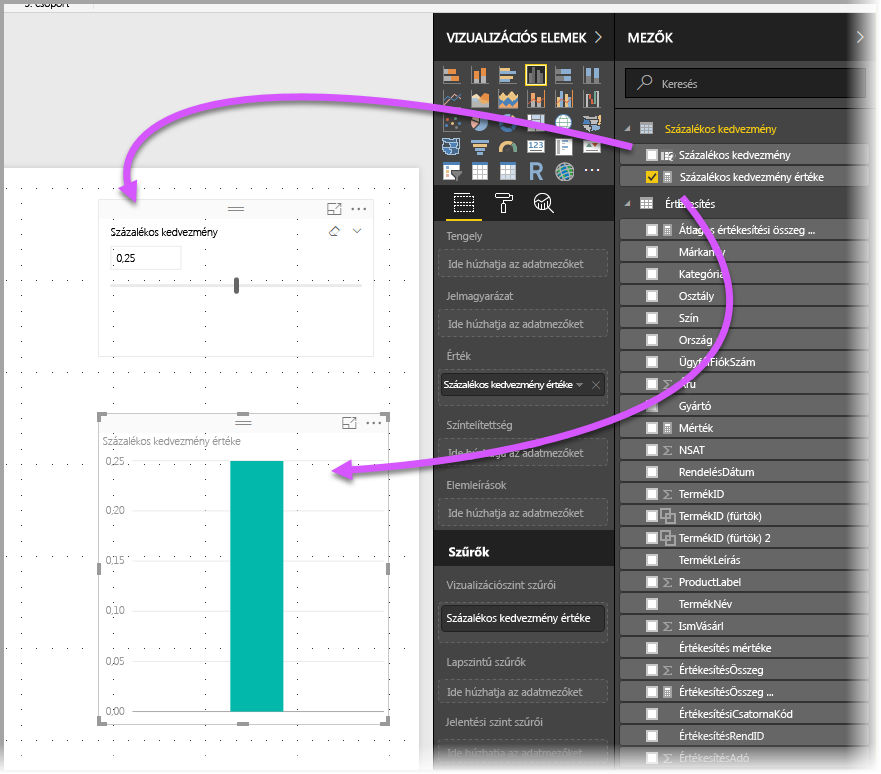
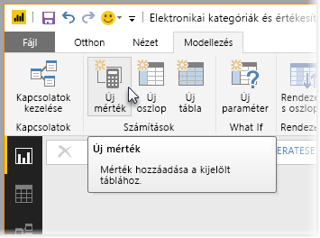
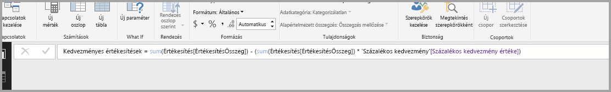
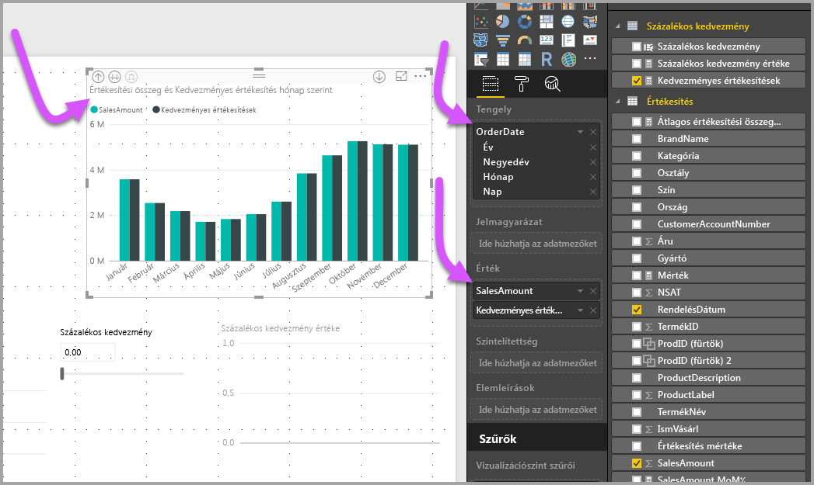
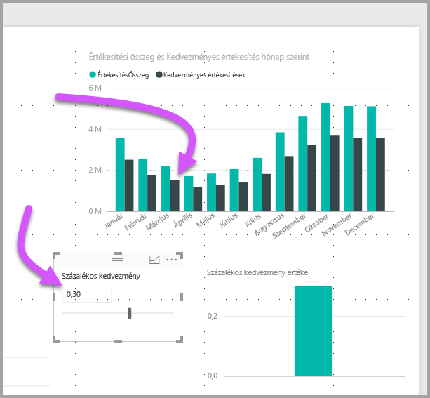

# Lehetőségelemzési paraméter létrehozása és használata változók vizualizációjához a Power BI Desktopban
A **Power BI Desktop** 2017 augusztusi kiadásától kezdve létrehozhat **Lehetőségelemzési** változókat a jelentésekhez, szeletelőként dolgozhat a változókkal, és így a jelentésekben szereplő különböző kulcsértékeket jeleníthet meg és számszerűsíthet.

A **Lehetőségelemzési** paraméter a **Power BI Desktop** **Modellezés** lapján található. A kiválasztáskor megjelenik egy párbeszédpanel, ahol beállíthatja a paramétert.

## Lehetőségelemzési paraméter létrehozása
**Lehetőségelemzési** paraméter létrehozásához kattintson a **Lehetőségelemzés** gombra a **Power BI Desktop** **Modellezés** lapján. Az alábbi képen létrehoztunk egy *Kedvezmény százaléka* nevű paramétert, és az adattípusát *Tizedes törtre* állítottuk. A *Minimális* érték nulla, a *Maximális* érték 0,50 (ötven százalék). A *Növekményt* 0,05-re, vagyis 5%-ra állítottuk. Ennyit fog a paraméter módosítani, ha egy jelentésben dolgozik vele.

> [!NOTE]
> Tizedes törtek esetében ügyeljen arra, hogy nullával kezdje a számot, például 0,50 szerepeljen ,50 helyett. Ellenkező esetben a szám nem lesz érvényesítve, és az **OK** gomb nem válaszható ki.
> 
> 

Kényelmi funkcióként a **Szeletelő hozzáadása az oldalhoz** jelölőnégyzet automatikusan elhelyez egy szeletelőt a **Lehetőségelemzési** paraméterrel a jelentés aktuális oldalán.

Továbbá a paraméter létrehozása mellett egy **Lehetőségelemzési** paraméter létrehozása egy mértéket is létrehoz, amely a **Lehetőségelemzési** paraméter aktuális értékének megjelenítésére használható.

Érdemes és hasznos megjegyezni, hogy miután létrehozott egy **Lehetőségelemzési** paramétert, a paraméter és a mérték is a modell része lesz. Ezért elérhetők a jelentésen keresztül, és a jelentés egyéb oldalain is használhatók. Mivel a modell részei, törölheti a szeletelőt a jelentés oldaláról, és ha vissza szeretné kapni, fogja meg a **Lehetőségelemzési** paramétert a **Mezők** listájából, és húzza a vászonra (majd módosítsa a vizualizációt szeletelőre), így egyszerűen visszahelyezheti a paramétert a jelentésbe.

## Lehetőségelemzési paraméter használata
Hozzunk létre egy, a **Lehetőségelemzési** paraméter használatáról szóló, egyszerű példát. Az előző szakaszban létrehoztunk egy **Lehetőségelemzési** paramétert, most pedig használatba állítjuk egy új mérték létrehozásával, amelynek az értéke egy csúszkával állítható. Ehhez létrehozunk egy új mértéket.

Az új mérték egyszerűen a teljes értékesítés mennyisége lesz, a kedvezménnyel együtt. Természetesen összetett és érdekes mértékeket is létrehozhat, amelyek lehetővé teszik a jelentések felhasználói számára, hogy megjelenítsék a **Lehetőségelemzési** paraméter változóit. Például létrehozhat egy jelentést, amely lehetővé teszi az értékesítés területén dolgozó személyeknek a kompenzáció megtekintését, ha elérnek bizonyos értékesítési célokat vagy százalékokat, vagy megtekintsék a megnövekedett értékesítés nagyobb kedvezményekre gyakorolt hatását.

Miután beírtuk a mérték képletét a képletsávba, és az **Értékesítés kedvezmény után** nevet adtuk neki, megjelennek az eredmények:

Ezután létrehozunk egy oszlopvizualizációt *OrderDate* névvel a tengelyen, valamint a *SalesAmount* és a most létrehozott *Értékesítés kedvezmény után* mértékkel mint értékekkel.

Ezután ahogy mozgatjuk a csúszkát, láthatjuk, hogy az *Értékesítés kedvezmény után* oszlop a kedvezményes értékesítések mennyiségét tükrözi.

Ennyi az egész! Bármilyen esetben használhatja a **Lehetőségelemzési** paramétereket, így lehetővé teheti a jelentések felhasználói számára, hogy a jelentésekben létrehozott különböző forgatókönyvekkel dolgozzanak.

