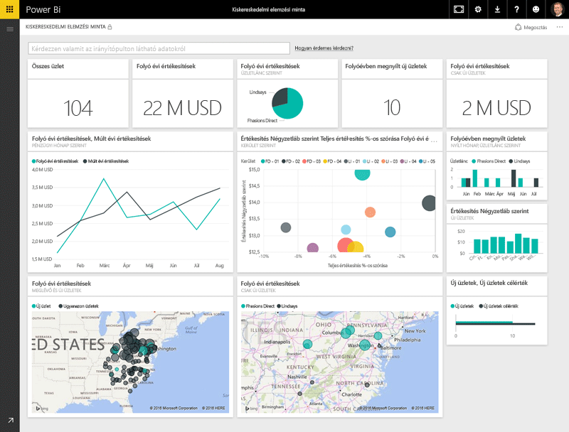
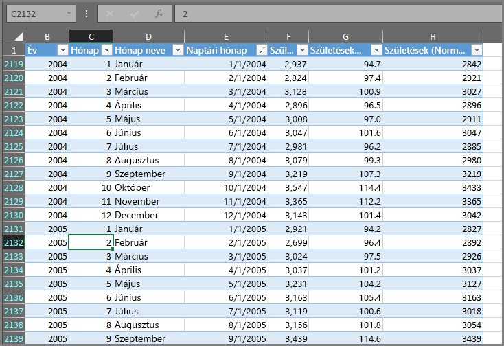
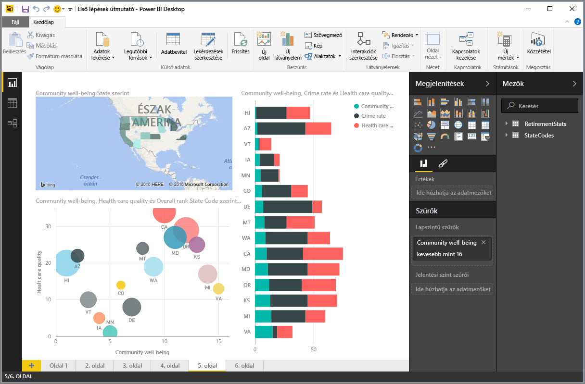
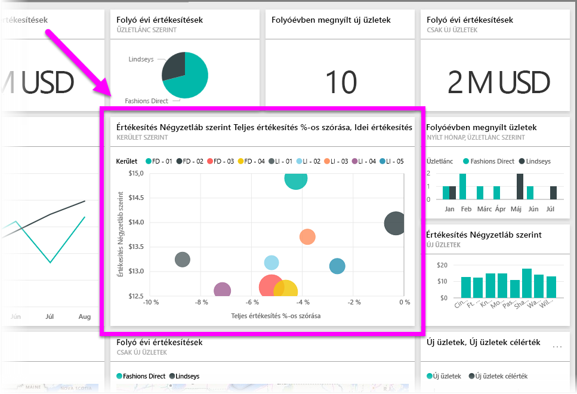

A Power BI-ban végzett összes művelet lebontható néhány egyszerű **alkotóelemre**. Miután megértette ezeknek az alkotóelemeknek a működését, kibővítheti őket, és megkezdheti a bonyolultabb jelentések létrehozását. Hiszen a látszólag összetett dolgok is egyszerű alkotóelemekből állnak – az épületek például fából, acélból, betonból és üvegből, az autók pedig fémből, szövetekből és gumiból. Természetesen az épületek és az autók lehetnek egyszerűek és bonyolultak is, függően attól, hogy ezek az alapvető alkotóelemek miként vannak elrendezve.

Az alábbiakban sorra vesszük az alapvető alkotóelemeket, ismertetjük, hogy milyen egyszerűbb dolgokat tud építeni velük, majd pedig betekintést nyújtunk az összetett dolgok létrehozásába is.

A Power BI-ban az alábbi alapvető alkotóelemeket használhatja:

* Vizualizációs elemek
* Adatkészletek
* Jelentések
* Irányítópultok
* Csempék

## Vizualizációs elemek
A **vizualizáció** (vagy más néven **vizualizációs elem**) az adatokat vizuálisan megjelenítő elemekre utal. Ilyen lehet például egy diagram, egy grafikon, egy színkódolt térkép vagy bármilyen más olyan érdekes elem, amellyel az adatát vizuális módon tudja ábrázolni. A Power BI sok különböző típusú vizualizációs elemmel rendelkezik, és folyamatosan bővül továbbiakkal. Az alábbi képen a Power BI szolgáltatásban létrehozott vizualizációs elemek számos típusát szemügyre veheti.

A vizualizációk lehetnek egyszerűek – például egyetlen szám, mely egy jelentős adatot ábrázol –, illetve vizuálisan összetettek – például egy színátmenetes térkép, mely a szavazók véleményét ábrázolja bizonyos társadalmi problémával vagy kérdéssel kapcsolatban. A vizualizációk célja az, hogy az adatokat egy adott környezetben, következtetések levonására alkalmas módon mutassa, melyek a számokat vagy szöveget tartalmazó nyers táblázatokból általában nehezen olvashatók ki.

## Adatkészletek
Az **adatkészlet** az adatok olyan gyűjteménye, amely alapján a Power BI előállítja a vizualizációkat.

Használhat egyszerű adatkészletet, mely egy Excel-munkafüzet egyetlen táblázatán alapul, például az alábbi képen látható táblázaton.

Másik lehetőségként az **adatkészlet** állhat számos különböző forrás kombinációjából is, melyeket szűrhet és kombinálhat egy Power BI-ban használható egyedi adatgyűjtemény (adatkészlet) létrehozásához.

Létrehozhat például egy adatkészletet három különböző adatbázismezőből, egy webhelytáblázatból, egy Excel-táblázatból, illetve egy e-mailes marketingkampány online eredményeiből. Ez az egyedi kombináció továbbra is egyetlen **adatkészlet** lesz, jóllehet számos különböző forrás felhasználásával lett létrehozva.

Az adatokat a Power BI-ba való beolvasás előtt érdemes szűrnie, hogy az Ön számára lényeges részekre összpontosíthasson. Szűrheti például a partnereket tartalmazó adatbázisát úgy, hogy az adatkészletben csak a marketingkampány során e-mailt kapott ügyfelek szerepeljenek. Ezután hozhat létre vizualizációs elemeket a csak a kampányban résztvevő ügyfelek alkészlete (szűrt gyűjteménye) alapján. A szűrés segít fókuszálni az adatokat és az erőfeszítéseit.

A Power BI rengeteg különféle **adatösszekötőt** tartalmaz, mely a szolgáltatás egy fontos és sok lehetőséget nyújtó része. A használni kívánt adatok lehetnek Excel-munkafüzetben, SQL-adatbázisban, Azure vagy Oracle rendszerben, illetve a Facebook, a Salesforce vagy a MailChimp szolgáltatásban – a Power BI mindezekhez beépített adatösszekötőt nyújt, mellyel könnyedén csatlakozhat az adatokhoz, szűrheti őket igény esetén, és bevonhatja őket az adatkészletébe.

Miután felépítette az adatkészletét, megkezdheti az adatkészlet különböző részeit eltérő módokon megjelenítő vizualizációk létrehozását, majd a látott információkból levonhatja a megfelelő következtetéseket. Ezen a ponton válnak fontossá a jelentések.

## Jelentések
A Power BI-ban a **jelentés** a vizualizációk egy vagy több lapon együtt megjelenő gyűjteménye. Éppen úgy, ahogy az egyszerű jelentéseknél, például amelyeket egy értékesítési előadáshoz vagy egy iskolai feladathoz készítene, a **jelentés** Power BI-ban is egymáshoz kapcsolódó elemek egy gyűjteménye. Az alábbi képen egy **jelentést** láthat a Power BI Desktop alkalmazásban – ez jelen esetben egy hatlapos jelentés ötödik lapja. Jelentéseket a Power BI szolgáltatásban is létrehozhat.

A jelentésekkel sokféle vizualizációs elemet hozhat létre, akár különböző lapokon is, és elrendezheti őket az elképzeléseihez leginkább illő módon.

Készíthet például jelentést a negyedéves értékesítési eredményekről, egy adott piaci szegmensben végbemenő növekedésről, vagy a jegesmedvék vándorlási szokásairól. Bármilyen tárgyat is válasszon, a jelentésekkel egy (vagy több) lapra rendszerezheti a kívánt vizualizációs elemeket.

## Irányítópultok
Ha meg szeretné osztani egy jelentés egyetlen lapját vagy a vizualizációk egy csoportját, létrehozhat egy **irányítópultot**. Az autók műszerfalához némileg hasonlóan a Power BI-ban lévő **irányítópult** is a vizualizációk egyetlen lapon elhelyezett gyűjteménye, melyeket másokkal is megoszthat. Gyakran a vizualizációs elemek egy úgy kiválasztott csoportjáról van szó, amely gyors betekintést nyújt az adatokba, vagy alátámasztja a mondanivalóját.

Az irányítópultnak el kell férnie egyetlen lapon, melyet gyakran vászonnak is nevezünk (a vászon az az üres háttérterület a Power BI Desktop alkalmazásban és szolgáltatásban, amely a vizualizációs elemek elhelyezésére szolgál). Hasonlóan működik, mint a festők által használt vásznak – munkaterületként szolgál különféle érdekes vagy meggyőző vizualizációk létrehozásához, kombinálásához és átdolgozásához.
Az irányítópultokat megoszthatja más felhasználókkal vagy csoportokkal, akik vagy amelyek ezután felhasználhatják őket a Power BI szolgáltatáson vagy a mobilalkalmazáson keresztül.

## Csempék
A Power BI-ban a **csempe** egy jelentés vagy egy irányítópult egyetlen vizualizációs eleme. Arra a téglalap alakú dobozra utal, amely az egyes vizualizációs elemeket tartalmazza. Az alábbi képen egy világos kerettel kiemelt csempét láthat, melyet más csempék vesznek körül.

Amikor egy jelentés vagy irányítópult *létrehozásán* dolgozik a Power BI-ban, mozgathatja és átrendezheti a csempéket aszerint, hogy hogyan szeretné bemutatni az információkat. Megnövelheti a méretüket, módosíthatja a magasságukat vagy szélességüket, illetve más csempékhez illesztheti őket.

Az irányítópult vagy a jelentés *megtekintésekor* vagy *felhasználásakor* – utóbbi azt jelenti, hogy nem Ön a létrehozó vagy a tulajdonos, hanem csak megosztották Önnel – végezhet műveleteket a megjelenítő elemeken, a csempék méretét és elrendezését azonban nem tudja módosítani.

## Összegzés
A fentiekben megismerhette a Power BI alapjait és alkotóelemeit. Foglaljuk össze a tanultakat.

A Power BI a szolgáltatások, alkalmazások és összekötők egy olyan gyűjteménye, amelynek segítségével csatlakozhat az adataihoz – bárhol is legyenek –, igény szerint szűrheti őket, majd az adatokat a Power BI-ba importálva meggyőző vizuális ábrázolásokat hozhat létre, melyeket másokkal is megoszthat.  

Most, hogy már érti a Power BI néhány alapvető alkotóelemének működését, láthatja, hogy hozhat létre az *Ön számára* logikus adatkészleteket, és készíthet vizuálisan meggyőző jelentéseket, melyek hatékonyan közvetítik a saját mondanivalóját. A Power BI használatával bemutatott üzeneteknek nem kell összetettnek vagy bonyolultnak lenniük ahhoz, hogy meggyőzők legyenek.

Vannak, akik számára a Power BI használatának hatékony módja lehet már az is, ha egyetlen Excel-táblázatból készítenek adatkészletet, majd megosztanak egy irányítópultot a csapatukkal.

Mások ugyanakkor a Power BI előnyét abban találhatják meg, ha valós idejű Azure SQL Data Warehouse-táblákat használnak más adatbázisokkal és valós idejű forrásokkal kombinálva, melyeket aztán valós időben szűrnek olyan adatkészletek építéséhez, amelyek pillanatról pillanatra figyelik a gyártási folyamatok előrehaladását.

A folyamat mindkét esetben azonos: adatkészletek létrehozása, meggyőző látványelemek építése, majd azok megosztása másokkal. Ugyanígy az eredmény is hasonló mindkét fenti esetben: kihasználhatja az egyre növekvő adatkészletét döntéshozatalra alkalmas információk kinyeréséhez.

Akár egyszerű, akár összetett folyamat ezeknek az információknak a kinyerése, a Power BI segít Önnek a gyors kezdésben, és képes követni az igényei bővülését, bármennyire összetett megoldást is kelljen kidolgoznia. És mivel a Power BI egy Microsoft-termék, bízhat annak működésében, bővíthetőségében, Office-kompatibilitásában és nagyvállalati használatra való alkalmasságában.

Most ismerjük meg, hogyan is működik mindez. Először a Power BI szolgáltatást fogjuk röviden áttekinteni.

