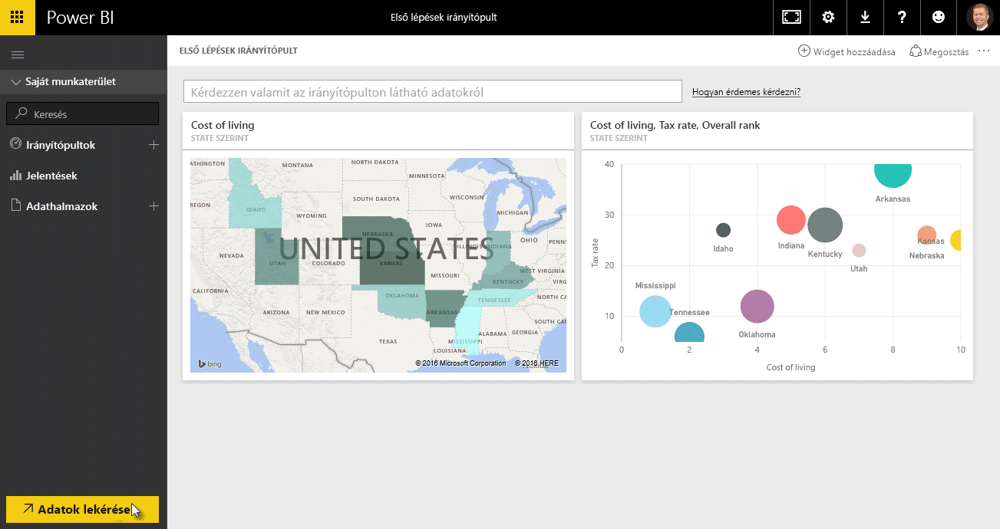
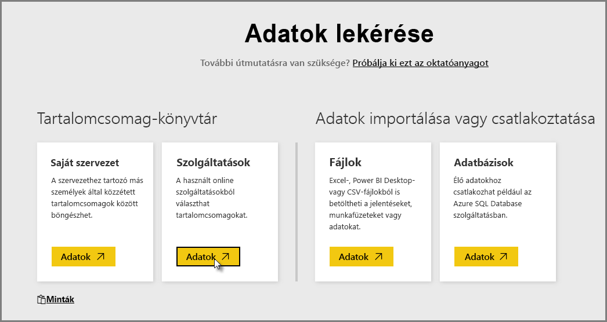
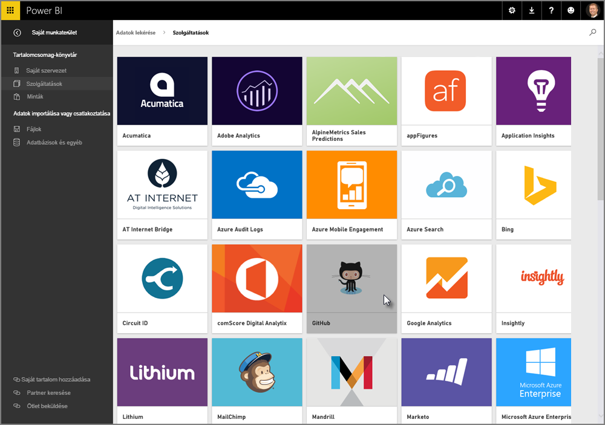
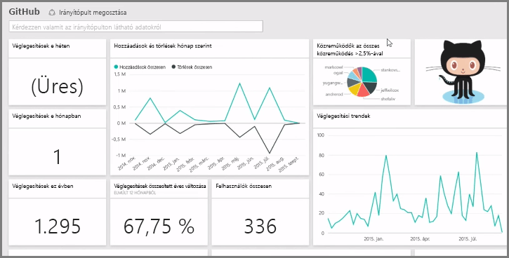
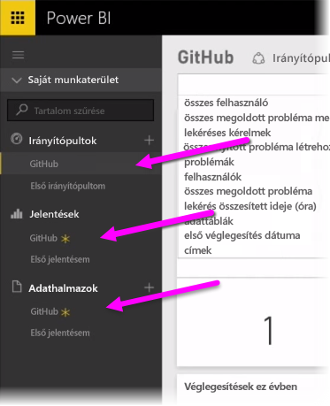
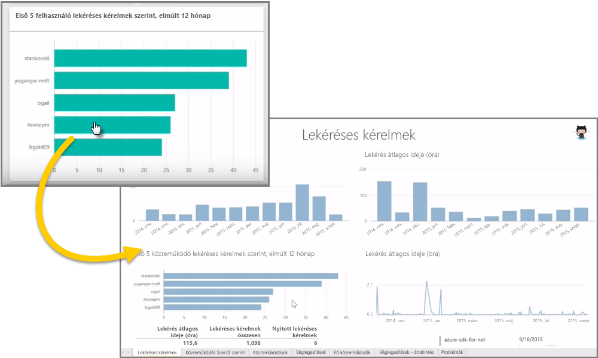
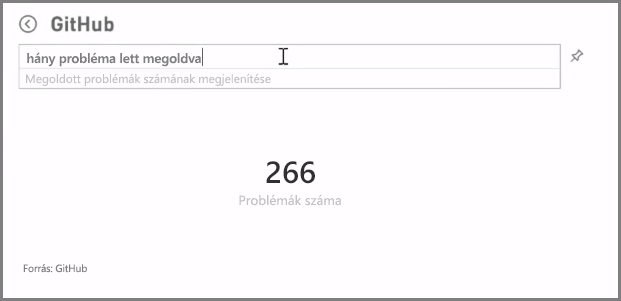
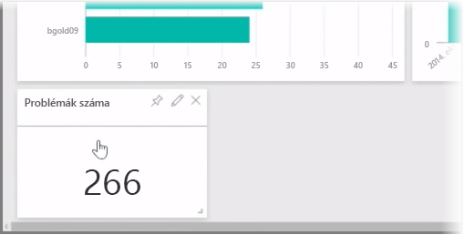

Ahogy megtudtuk, a Power BI-ban való munka leggyakoribb folyamata az, hogy létrehozunk egy jelentést a Power BI Desktop alkalmazásban, közzétesszük azt a Power BI szolgáltatásba, majd megosztjuk másokkal, hogy megtekinthessék a szolgáltatáson vagy a mobilalkalmazáson keresztül.

Vannak, akik először a Power BI szolgáltatással kezdenek, ezért röviden bemutatjuk a szolgáltatást, illetve a Power BI-vizualizációk létrehozásának egy egyszerű és közkedvelt módját: a *tartalomcsomagokat*.

**Tartalomcsomagnak** az előre konfigurált, használatra kész vizualizációs elemek és jelentések egy olyan gyűjteményét nevezzük, amely bizonyos adatforrásokon alapul, például Salesforce-adatforrásokon. A tartalomcsomagok használata ahhoz hasonló, mint amikor csomagolt készételt melegít fel a mikrohullámú sütőben, vagy gyorsételt rendel: néhány egyszerű kattintás és más művelet után kapni fog egy egymáshoz illő elemekből álló gyűjteményt, mely egy ízléses, felhasználásra kész csomagot alkot.

Vessünk tehát egy pillantást először a tartalomcsomagokra, a szolgáltatásra, és ezek működésére. A tartalomcsomagokat (és a szolgáltatást) a későbbi szakaszokban részletesebben is ismertetjük; az alábbiakat tekintse csak amolyan kedvcsinálónak.

## Beépített irányítópultok létrehozása a felhőszolgáltatásokkal
A Power BI segítségével egyszerűen csatlakozhat adatokhoz. A Power BI szolgáltatásban válassza az **Adatok lekérése** gombot a kezdőlap bal alsó sarkában.

A *vászon* (a Power BI szolgáltatás lapjának közepén lévő terület) ekkor megjeleníti a Power BI szolgáltatásban elérhető adatforrásokat. Az egyszerű adatforrások, például az Excel-fájlok, adatbázisok és Azure-adatok mellett a Power BI képes ugyanolyan könnyedén kapcsolódni **szoftverszolgáltatásokhoz** (más néven SaaS típusú szolgáltatásokhoz vagy felhőszolgáltatásokhoz) is, ideértve például a Salesforce, a Facebook, a Google Analytics, illetve számos más SaaS típusú szolgáltatást.

Ezen szoftverszolgáltatásokhoz a **Power BI szolgáltatás** használatra kész vizualizációk gyűjteményét nyújtja előre összeállított irányítópultokként és jelentésekként, melyeket **tartalomcsomagnak** nevezünk. A tartalomcsomagok révén gyorsan használatba veheti a Power BI-t a választott szolgáltatásból származó adatok használatával. A Salesforce-tartalomcsomag használatakor például a Power BI csatlakozik az Ön Salesforce-fiókjához (miután megadta a hitelesítő adatait), majd kitölti adatokkal a látványelemek és irányítópultok Power BI-ban előre definiált gyűjteményét.

A Power BI a szolgáltatások széles köréhez nyújt tartalomcsomagokat. Az alábbi képernyőkép a szolgáltatások első lapját szemlélteti, melyen betűrendben látható a szolgáltatások listája, miután a **Szolgáltatások** területen a **Beszerzés** gombot választotta (lásd az előző képen). Ahogy az alábbi képen láthatja, rengeteg szolgáltatás közül választhat.

A jelen példában a **GitHub** lehetőséget választjuk. A GitHub egy online verziókövetési rendszer alkalmazása. Miután megadtuk a GitHub-tartalomcsomaghoz szükséges információkat és hitelesítő adatokat, a rendszer megkezdi az adatok importálását.

Az adatok betöltése után megjelenik a GitHub-tartalomcsomag előre definiált irányítópultja.

Az **Irányítópult** mellett elérhető még az irányítópult létrehozásához (a GitHub-tartalomcsomag részeként) generált **Jelentés** is, illetve az **Adatkészlet** (a GitHubról beolvasott adatok gyűjteménye), mely az adatok importálása során jött létre a GitHub-jelentés elkészítéséhez.

Az irányítópulton az egyes vizualizációs elemekre kattintva közvetlenül eljuthat a **Jelentés** azon lapjára, amely az adott elem létrehozásának alapjául szolgált. Ezért amikor a **Top 5 users by pull requests** (Első 5 felhasználó lekéréses kérelem szerint) elemre kattint, a Power BI megnyitja a jelentés **Pull Requests** (Lekéréses kérelmek) lapját (vagyis az elem létrehozásának alapjául szolgáló jelentéslapot).

## Kérdések az adatokról
Kérdéseket is feltehet az adatokról, és a Power BI szolgáltatás valós időben létrehozza a kérdésének megfelelő vizualizációt. Az alábbi képen láthatja, ahogyan a Power BI létrehoz egy számot megjelenítő vizualizációt a lezárt problémák számával, mely a **természetes nyelvet használó lekérdezés** mezőjébe beírt kérdésen alapul.

Ha a létrehozott vizualizációt szeretné megtartani, a természetes nyelvet használó lekérdezés mezőjétől jobbra lévő **Rögzítés** ikont választva rögzítheti a vizualizációt az irányítópulton. Jelen esetben a vizualizációt a GitHub irányítópultra rögzítettük, hiszen ez a pillanatnyilag aktív irányítópult.

## Adatok frissítése a Power BI szolgáltatásban
A tartalomcsomaghoz tartozó adatkészletet, illetve a Power BI-ban használt más adatokat **frissítheti** is. A frissítési beállítások megadásához válassza a három pontot ábrázoló ikont az adatkészlet mellett. Ekkor megjelenik egy menü.

Válassza a menü alján lévő **Frissítés ütemezése** lehetőséget. Ekkor megjelenik a Beállítások párbeszédpanel a vásznon, melyen megadhatja az igényeinek megfelelő frissítési beállításokat.

Ezzel végeztünk is a Power BI szolgáltatás gyors áttekintésével. A szolgáltatásban számos más műveletet is végezhet, melyekre a tanfolyam későbbi részeiben fogunk kitérni. Ne feledje, hogy sok különböző típusú adathoz csatlakozhat, használhat különféle tartalomcsomagokat, és a szolgáltatás folyamatosan bővül továbbiakkal.

Folytassuk most a következő témakörrel, melyben összegezni fogjuk a jelen **Első lépések** szakasz tartalmát, és felkészítjük Önt a további tartalmakra.

