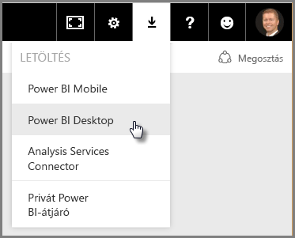
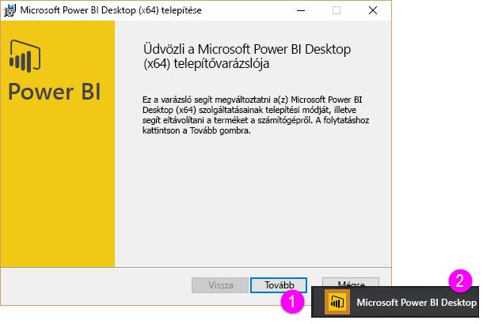
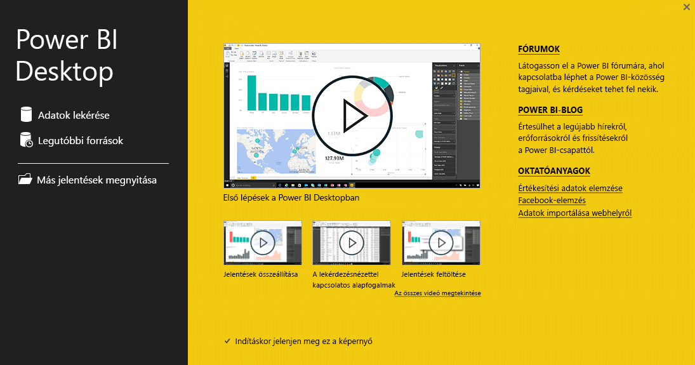

Üdvözli a Power BI **Interaktív tanulás** oktatóanyagának második, **Adatok beolvasása** című szakasza. Ez a szakasz a Power BI számos adatközpontú funkcióját és eszközét mutatja be a Power BI Desktop alkalmazásra koncentrálva. Számos eszköz vonatkozik a Power BI szolgáltatásra is, így duplán hatékony munkát végez ennek a szakasznak az elsajátításával.

A kapott adatok nem feltétlenül felelnek meg az elvárt formátumnak vagy *tisztaságnak*. Ebben a szakaszban megismerheti az adatok beolvasását és tisztítását (ez a fogalom néha *tisztításként* vagy *adatátalakításként* ismert), valamint olyan speciális trükköket sajátíthat el, amelyekkel egyszerűsítheti az adatok beolvasását.

Ahogyan ebben a tanfolyamban már megszokhatta, a tanulási folyamat a Power BI munkafolyamatának lépéseit követi. Kezdjük a **Power BI Desktop** alkalmazással, ahonnan minden munkafolyamat indul.

## A Power BI Desktop áttekintése
A Power BI Desktop egy olyan eszköz, amely lehetővé teszi az adatokhoz való kapcsolódást, az adattisztítást, valamint az adatok megjelenítését. A Power BI Desktop alkalmazásban adatokhoz kapcsolódhat, majd különböző módon modellezheti és jelenítheti meg azokat. Az üzletiintelligencia-projekteken dolgozó felhasználók többsége az ideje nagy részét a Power BI Desktop használatával tölti.

A **Power BI Desktop** alkalmazást letöltheti a [webről](http://go.microsoft.com/fwlink/?LinkID=521662), alkalmazásként telepítheti a [**Windows Áruházból**](http://aka.ms/pbidesktopstore), vagy letöltheti a Power BI szolgáltatásból is. Ha a **Power BI Desktopot** a szolgáltatásból szeretné letölteni, egyszerűen válassza ki a Power BI szolgáltatás jobb felső sarkában lévő lefelé mutató nyilat, majd válassza a Power BI Desktop elemet.

A Power BI Desktop alkalmazásként telepíthető a Windows rendszerű számítógépekre.

Tehát letöltés után telepítheti a Power BI Desktopot, és ugyanúgy futtathatja, mint bármely más windowsos alkalmazást. Az alábbi ábrán a Power BI Desktop kezdőképernyője látható, amely az alkalmazás indításakor jelenik meg.

A Power BI Desktop adatforrások széles köréhez kapcsolódik a helyi adatbázisoktól kezdve az Excel-munkalapokon át a felhőszolgáltatásokig. Az adatok tisztításával és formázásával segít az adatok használhatóbbá tételében, beleértve az oszlopok felosztását és átnevezését, az adattípusok módosítását, illetve a dátumokkal való munkát. Ezenkívül kapcsolatokat is létre lehet hozni az egyes oszlopok között, így egyszerűbbé válik az adatok modellezése és elemzése.

