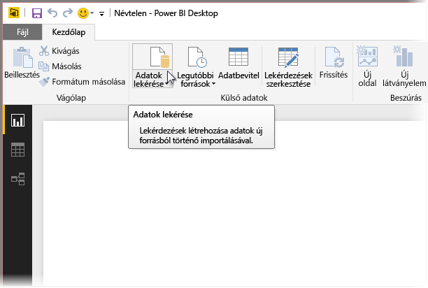
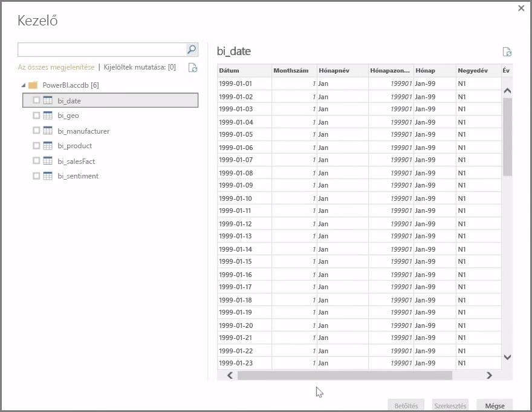
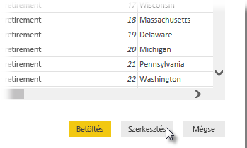

A **Power BI Desktop** az adatforrások széles palettájához képes csatlakozni, köztük helyszíni adatbázisokhoz, Excel-munkafüzetekhez és felhőszolgáltatásokhoz. Jelenleg több mint 59 felhőszolgáltatás, például a GitHub és a Marketo rendelkezik saját összekötővel, de az XML, a CSV, a szöveg és az ODBC segítségével általános adatforrásokhoz is csatlakozhat. A Power BI közvetlenül egy webhely URL-címéről is begyűjthet táblázatos adatokat. De először is tekintsük át a Power BI Desktop megnyitását és adatokhoz való csatlakoztatását.

Miután elindította a **Power BI Desktopot**, és továbblépett az indítóképernyőn, a **Kezdőlapon** választhatja a Get Data (Adatok beolvasása) lehetőséget.

A Power BI Desktop havonta frissül, amiről beszámol a **Power BI Desktop Újdonságok** oldal is, amely tudósít a frissítésekről, valamint a blogra és a letöltésekre mutató hivatkozásokat tesz közzé.

A Power BI Desktoppal hozzáférhet a legkülönbözőbb adatforrásokhoz. A csatlakozás létrehozásához válasszon ki egy adatforrást. A választástól függően a rendszer arra kéri, hogy keresse meg az adatforrást a saját számítógépén vagy hálózatán, vagy jelentkezzen be egy szolgáltatásba a kérelem hitelesítéséhez.

A csatlakozás után a **Kezelő** ablak jelenik meg először. A Kezelőn megjelennek az adatforrás táblái vagy entitásai, ha pedig rákattint valamelyikre, előnézeti képet kap a tartalmáról. Ezt követően azonnal importálhatja a kiválasztott táblákat vagy entitásokat, de a **Szerkesztés** elemre kattintva át is alakíthatja vagy tisztíthatja az adatokat importálás előtt.

Miután kiválasztotta a Power BI Desktopra importálni kívánt táblákat, a **Kezelő** jobb alsó sarkában található **Betöltés** gombra kattintva betöltheti őket a Power BI Desktopra. Előfordulhat azonban, hogy változtatni kíván a táblákon, mielőtt a Power BI Desktopra importálná őket. Dönthet úgy, hogy csak az ügyfelek egy részhalmazát szeretné importálni, vagy leszűkítené az eladási adatokat egy adott országra. Ilyenkor a Szerkesztés gombra kattintva szűrheti vagy módosíthatja az adatokat, mielőtt a Power BI Desktopra kerülnének.

A következő szakaszban az adatok szerkesztésével foglalkozunk.

