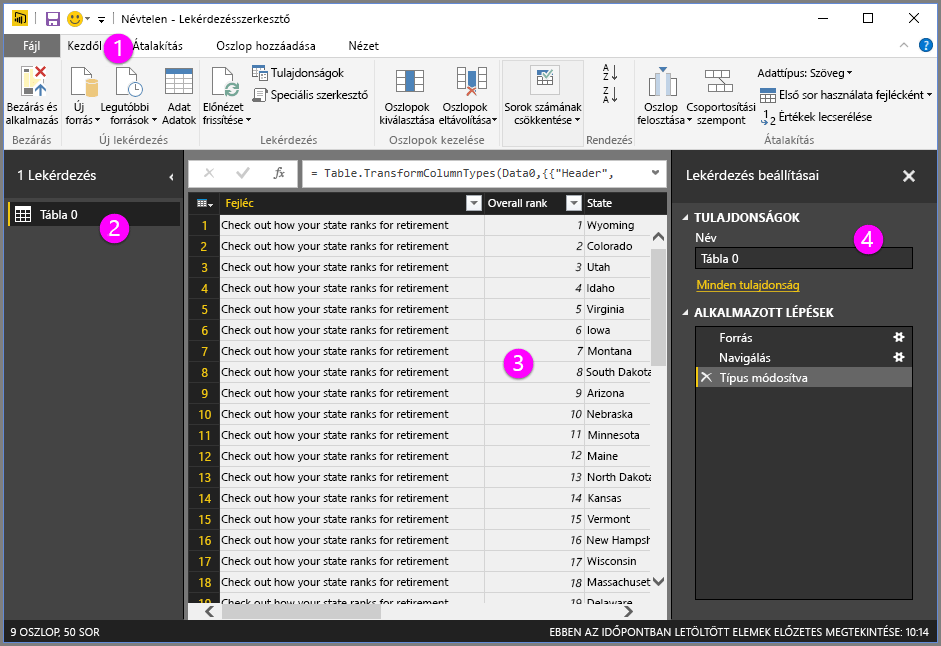
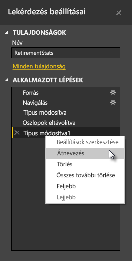
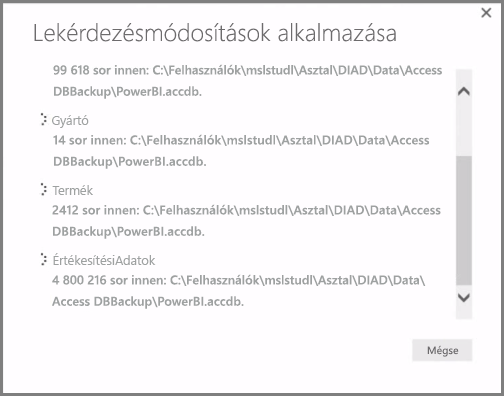

**A Power BI Desktop** **Lekérdezésszerkesztője** hatékony eszköz az adatoknak a modellek és vizualizációk számára való (át)alakításához. A Kezelő Szerkesztés elemére kattintva megnyílik a Lekérdezésszerkesztő, amely az adatforrásban kijelölt táblázatokat vagy egyéb entitásokat jeleníti meg.

A **Lekérdezésszerkesztőt** közvetlenül a **Power BI Desktop** felületén is megnyithatja a **Kezdőlap** menüszalag **Lekérdezések szerkesztése** gombjával.

Miután a Lekérdezésszerkesztő betöltötte az alakítani kívánt adatokat, több szakasz jelenik meg:

1. A menüszalagon számos gomb aktiválódik, és használható a lekérdezés adataival
2. A bal oldali ablaktáblán a kiválasztásra, megtekintésre és alakításra rendelkezésre álló lekérdezések (táblázatonként vagy entitásonként egy) vannak felsorolva
3. A középső ablaktáblán a kiválasztott lekérdezéshez tartozó adatok jelennek meg, melyek rendelkezésre állnak alakításra
4. Megjelenik a Lekérdezés beállításai ablak, ahol a lekérdezés tulajdonságai és alkalmazott lépései tekinthetők meg

A középső ablaktábla egyik oszlopára jobb gombbal kattintva megjelenik számos különböző átalakítás, például az oszlop eltávolítása a táblából, az oszlop duplikálása új névvel, valamint az értékcsere művelet. Ebben a menüben elválasztókkal fel is oszthatja a szöveges oszlopokat.

A **Lekérdezésszerkesztő** menüszalagon további eszközök találhatók, például az oszlopok adattípusának módosítására, a tudományos jelölések hozzáadására és a dátumok elemeinek kinyerésére (például a hét napjai) szolgáló eszközök.

Az átalakítások során minden lépés megjelenik a **Lekérdezésszerkesztő** jobb oldalán található **Lekérdezés beállításai** ablaktábla **Alkalmazott lépések** listájában. Ezzel a listával visszavonhat vagy áttekinthet egyes módosításokat, és a lépések nevét is módosíthatja. Az átalakítások mentéséhez válassza a **Kezdőlap** lap **Bezárás és alkalmazás** lehetőségét.

A **Bezárás és alkalmazás** lehetőségre kattintás után a Lekérdezésszerkesztő alkalmazza a lekérdezésen végrehajtott módosításokat, majd azokat a Power BI Desktopban is érvénybe lépteti.

A **Lekérdezésszerkesztővel** számos különböző műveletet elvégezhet az adatok átalakításakor, többek között speciális átalakításokat. A következő szakaszban ismertetünk néhány speciális átalakítási műveletet, így ízelítőt kaphat a **Lekérdezésszerkesztő** szinte végtelen lehetőségeinek tárházából.

