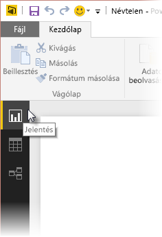
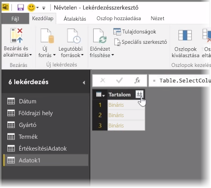
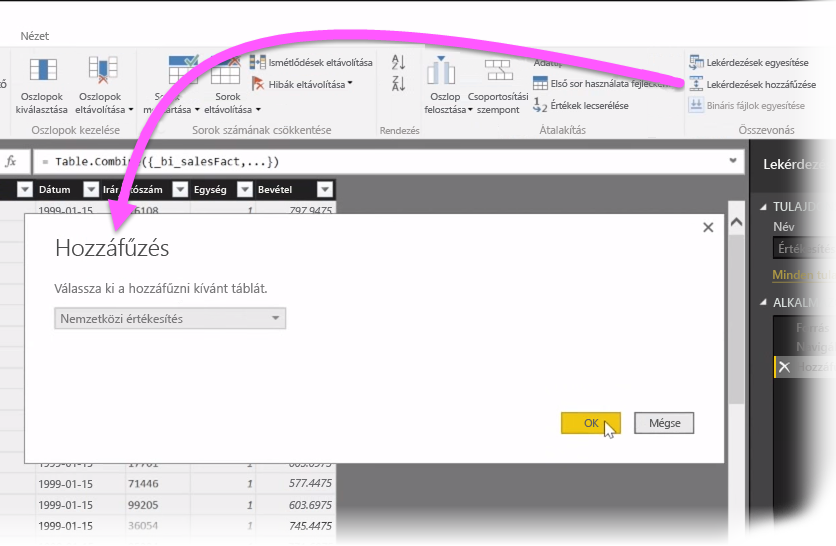
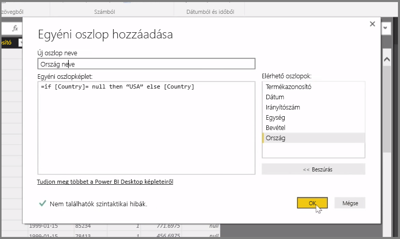

Ebben a cikkben megvizsgáljuk a **Power BI Desktop** néhány fejlettebb adatimportálási és adattisztítási módszerét. Ha az adatokat a **Lekérdezésszerkesztőben** már megfelelő formára hozta és bevitte a **Power BI Desktopba**, akkor a megtekintésükre többféle lehetősége is van. A Power BI Desktopban három nézet található: **Jelentés** nézet, **Adatok** nézet és **Kapcsolatok** nézet. Az egyes nézeteket a vászon bal felső oldalán található ikonjukra kattintva választhatja ki. A következő képen a **Jelentés** nézet van kiválasztva. Az aktív nézetet az ikonja mellett található sárga oszlop jelzi.

A nézet módosításához válassza ki a másik két ikon közül valamelyiket. Az aktív nézetet az ikonja mellett található sárga oszlop jelzi.

A Power BI Desktop a modellezési folyamat során bármikor képes több adatforrás adatát egyetlen jelentésben kombinálni. Ha meglévő jelentéshez szeretne újabb adatforrást hozzáadni, válassza a **Kezdőlap** menüszalagon a **Lekérdezések szerkesztése** lehetőséget, majd a **Lekérdezésszerkesztőben** az **Új forrás** lehetőséget.

A **Power BI Desktopban** többféle adatforrást is használhat, köztük mappákat is. Egy mappához történő csatlakozással több fájlt is importálhat egyszerre, például több Excel-fájlt vagy CSV-fájlt. A kiválasztott mappában található fájlok bináris tartalomként jelennek meg a **Lekérdezésszerkesztőben**, itt a **Tartalom** oszlop tetején található kettős nyíl ikonra kattintva töltheti be az értékeiket.

A *Szűrők* a Power BI egyik leghasznosabb eszközei. Például ha kiválasztja valamelyik oszlop legördülő listájának nyíl gombját, akkor megnyílik egy szöveges szűrőlista, amely segítségével értékeket távolíthat el a modelljéből.

Emellett egyesíthet lekérdezéseket vagy hozzáfűzhet egyet egy másikhoz, és több táblázatot (vagy különböző fájlokat egy mappában) egyetlen olyan táblázattá alakíthat, amely csak a kívánt adatokat tartalmazza. A **Lekérdezések hozzáfűzése** eszközzel hozzáadhatja egy új táblázat adatait egy meglévő lekérdezéshez. A Power BI Desktop megkísérli összeilleszteni az oszlopokat a lekérdezésben, amely a **Lekérdezésszerkesztőben** szükség esetén módosítható.

Az **Egyéni oszlop hozzáadása** lehetőség pedig a hozzáértő felhasználóknak biztosít lehetőséget arra, hogy a hatékony M nyelven előzmények nélkül írjanak meg lekérdezési kifejezéseket. Az M lekérdezési nyelv utasításaival hozzáadhat egyéni oszlopokat és lekérheti csak a kívánt adatokat.

