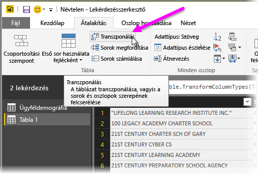
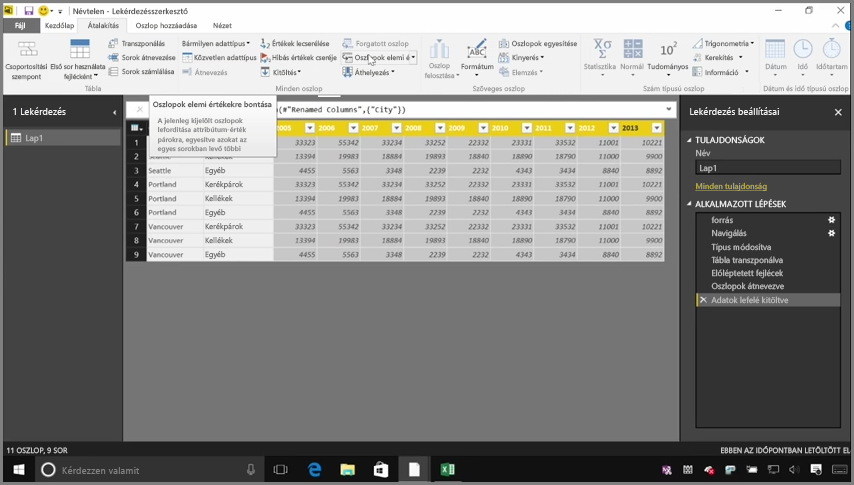
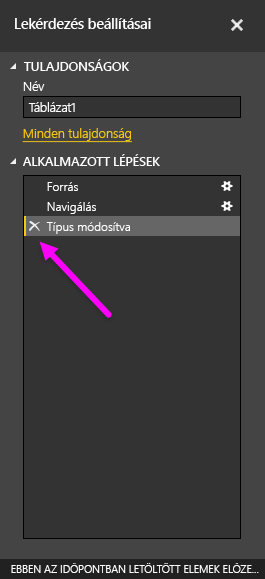
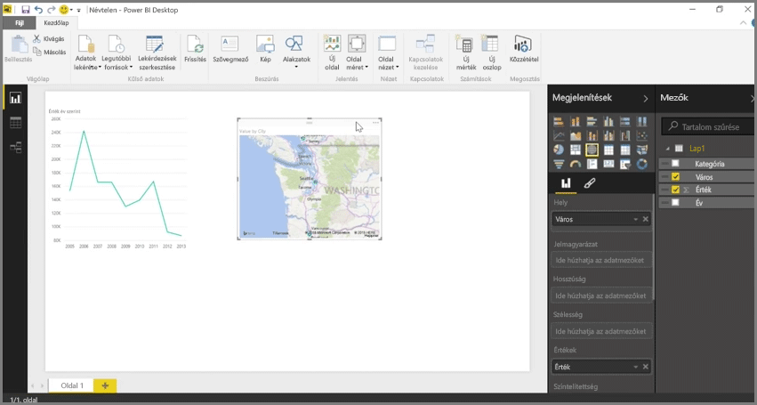

A Power BI szinte bármilyen forrásból képes adatokat importálni, azonban a modellezési és vizualizációi az oszlopos adatok esetén működnek a legjobban. Előfordulhat, hogy az adatok nem egyszerű oszlopok formájában találhatók meg, ami az Excel-táblázatok esetén gyakori, ahol az emberi szemnek kényelmes táblázatos elrendezés nem feltétlenül optimális automatikus lekérdezésekre. Az alábbi táblázatban például több oszlopon átnyúló fejlécek is találhatók.

Szerencsére a Power BI rendelkezik olyan eszközökkel, amelyekkel a többoszlopos táblázatokat használható adatkészletekké tudja alakítani.

## Adatok transzponálása
A **Lekérdezésszerkesztőben** a **Transzponálás** lehetőséggel megfordíthatja az adatokat (oszlopokból sorokat készíthet, vagy sorokból oszlopokat), hogy kezelhető formátumba hozza őket.

Ha néhányszor elvégzi ezt, ahogyan azt a videó is bemutatja, akkor a táblázata elkezd olyan alakot ölteni, amellyel a Power BI is könnyen tud dolgozni.

## Adatok formázása
Az adatok formázására is szükség lehet, hogy a Power BI megfelelően tudja kategorizálni és azonosítani őket az importálásukat követően.

Néhány átalakítással megtisztíthatja az adatokat, így létrehozhat egy, a Power BI-ban használható adatkészletet. Ilyen átalakítás például az *Első sor használata fejlécként*, amellyel feloszthatja a fejléceket, a **Kitöltés**, amellyel a *null* értékeket cserélheti le egy, az adott oszlopban feljebb vagy lejjebb található értékre, illetve **Az oszlop elemi értékeire bontása**.

A Power BI-ban kísérletezhet ezekkel az adatátalakításokkal, hogy kiderítse, melyek hozzák az adatokat oszlopos formába, amellyel a Power BI is dolgozni tud. És ne feledje, minden elvégzett lépés rögzítésre kerül a Lekérdezésszerkesztőben az Alkalmazott lépések részen, így ha egy átalakítás nem olyan eredményt hoz, mint amilyet szeretne, akkor a lépés visszavonásához egyszerűen csak kattintson a mellette található **x**-re.

## Vizualizációk létrehozása
Amint az adatok az átalakításokkal és megtisztításokkal olyan formába kerültek, amelyet a Power BI is használni tud, nekiláthat a vizualizációk létrehozásának.

## Következő lépések
**Gratulálunk!** Ön teljesítette a Power BI **Interaktív tanulás** oktatóanyagának ezt a fejezetét. Most hogy már tudja, hogyan **olvashat be** adatokat a Power BI Desktopban, és hogyan *formálhatja* és *alakíthatja át* őket, lenyűgöző vizualizációkat is készíthet belőlük.

A **modellezés** megértése a Power BI megismerésének következő lépése, illetve annak is, hogy hogyan érheti el, hogy a Power BI az *Ön igényeinek megfelelően* működjön. Amint már tudja, az **adatkészlet** a Power BI legfontosabb építőeleme, azonban néhány adatkészlet több különböző adatforráson is alapulhat, és nagyon bonyolult is lehet. Továbbá időnként arra is szükség lehet, hogy hozzáadja egy létrehozott adatkészlethez a saját speciális módosítását (vagy *mezőjét*).

A következő részben megismerheti a **modellezést** és sok egyéb dolgot is. Ott találkozunk!

