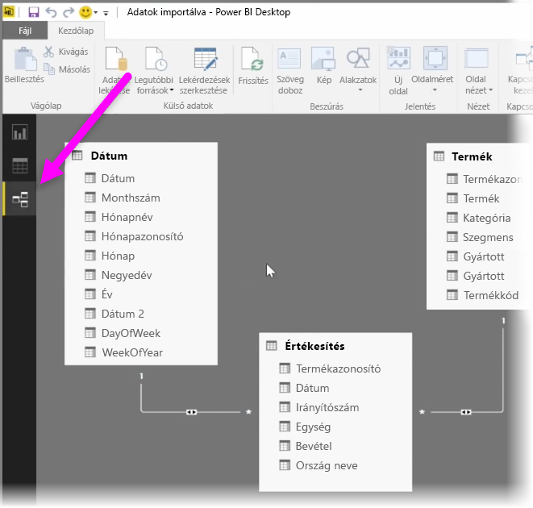
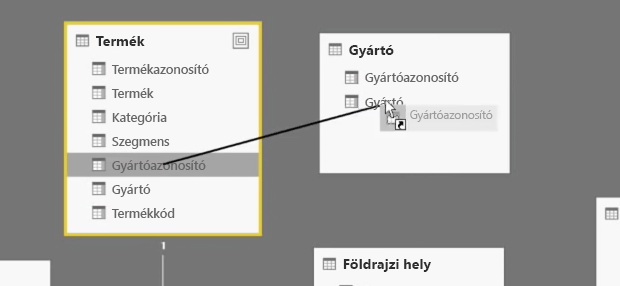
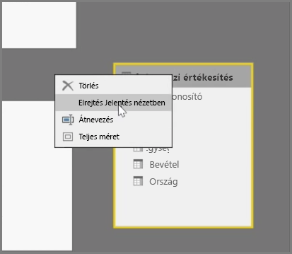
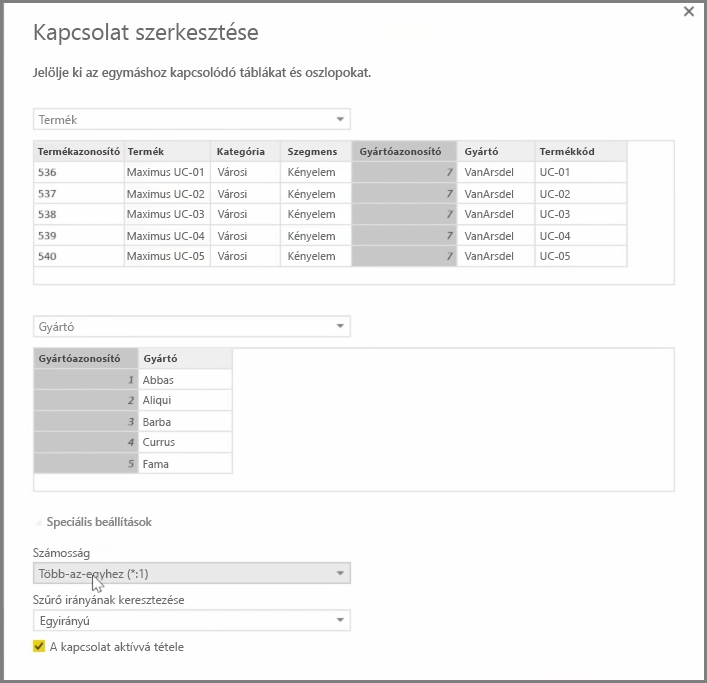

A Power BI lehetővé teszi, hogy a táblák vagy más elemek közötti kapcsolatot vizuális módon állítsa be. Az adatok diagramnézetben való megtekintéséhez használja a **Kapcsolatok nézetet**, amely a képernyő bal szélén, a jelentésvászon mellett található.

A **Kapcsolatok** nézet az egyes táblákat és azok oszlopait téglatestekkel ábrázolja, és vonalak jelzik a közöttük lévő kapcsolatot.

A kapcsolatok hozzáadása és eltávolítása egészen egyszerű. Kapcsolat eltávolításához kattintson jobb gombbal a kapcsolatra, és válassza a **Törlés** lehetőséget. Kapcsolat létrehozásához húzza be az összekapcsolni kívánt mezőket a táblákból.

Egy egész tábla vagy egyetlen oszlop elrejtéséhez kattintson rá jobb gombbal a Kapcsolatok nézetben, és válassza az **Elrejtés a Jelentés nézetben** lehetőséget.

A **Kezdőlap** **Kapcsolatok kezelése** gombját választva további részleteket tudhat meg az adatkapcsolatokról. Ez megnyitja a **Kapcsolatok kezelése** párbeszédpanelt, amely a diagramnézet helyett listanézetben ábrázolja a kapcsolatokat. Ha itt az **Automatikus észlelés** lehetőséget választja, megkeresheti a kapcsolatokat az új vagy frissített adatokban. A kapcsolatok kézi szerkesztéséhez válassza a **Szerkesztés** lehetőséget a **Kapcsolatok kezelése** párbeszédpanelen. Az ugyanitt található speciális beállításokkal megadhatja a kapcsolatok *Számosság*értékét és a *Keresztszűrő* irányát is.

A Számosságnál a *Több-az-egyhez* és az *Egy-az-egyhez* lehetőségek közül választhat. A *Több-az-egyhez* egy tényadatokat dimenzióadatokhoz rendelő kapcsolat, ilyen például egy értékesítési tábla, amelyben egy termékhez számos sor tartozik, amelyek egy, a termékeket egyetlen egyedi sorral felsoroló másik tábla egyik sorához kapcsolódnak. Az *Egy-az egyhez* kapcsolatot leginkább akkor használjuk, amikor egyetlen bejegyzésére hivatkozunk referenciatáblákban.

Alapértelmezés szerint a kapcsolatokhoz kétirányú keresztszűrés van beállítva. Az egyirányú keresztszűrés csak korlátozott modellezési lehetőségeket biztosít egy kapcsolatnál.

A kapcsolatok pontos meghatározásával összetett számításokat hozhat létre számos adatelem között.

