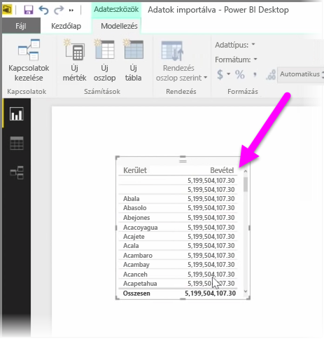
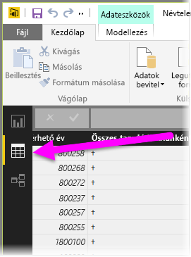
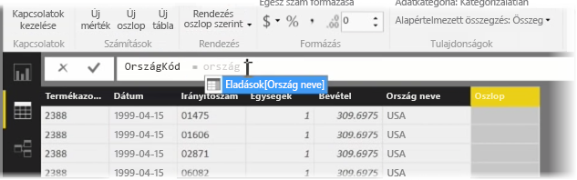
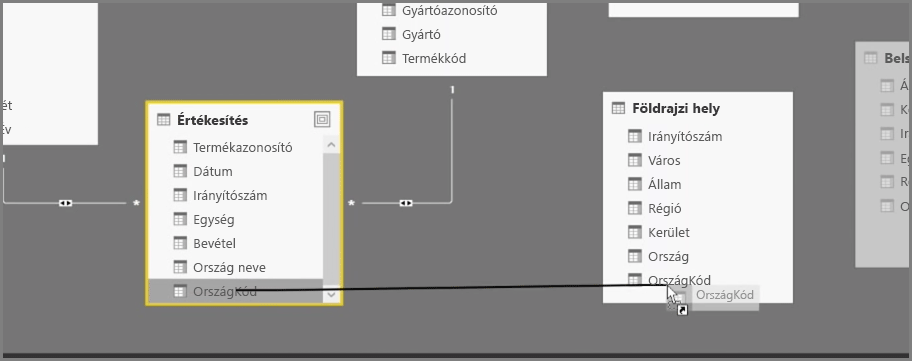
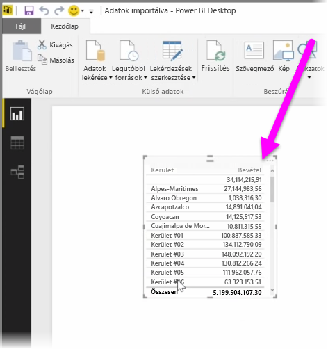

A számított oszlopok létrehozásával egyszerűen lehet az adatokat bővíteni és hatékonyabbá tenni. A **számított oszlop** egy olyan új oszlop, amely a meglévő adatok közül legalább két elemet átalakító vagy összevonó számítás definiálásával jön létre. Például létre lehet hozni egy új oszlopot két oszlop összevonásával.

Hasznos lehet számított oszlopokat készíteni, ha táblák közötti kapcsolatot szeretne létrehozni, amikor nem léteznek kapcsolat létrehozására szolgáló egyedi mezők. A kapcsolat hiánya akkor válik nyilvánvalóvá, amikor a felhasználó egy egyszerű, tábla típusú vizualizációt hoz létre a Power BI Desktop alkalmazásban, és ugyanazt az értéket kapja az összes bejegyzésnél annak ellenére, hogy a mögöttes adatok nyilvánvalóan eltérnek.

Ha kapcsolatot szeretne létrehozni az adatok egyedi mezői alapján, készíthet például egy teljes telefonszámot tartalmazó, új számított oszlopot, amelyben összevonja a „Körzetszám” és a „Helyi telefonszám” oszlopokban lévő értékeket (ha léteznek ilyen értékek az adatokban). A számított oszlopok hasznos eszköznek bizonyulnak modellek és vizualizációk gyors létrehozásakor.

Számított oszlop létrehozásához válassza a Power BI Desktop alkalmazásban az **Adatnézet** elemet a jelentésvászon bal oldalán.

A Modellezés lapon válassza az **Új oszlop** elemet. Ezzel engedélyezi a képletsávot, ahol a számítást a DAX (Data Analysis Expressions) nyelv használatával adhatja meg. A DAX egy hatékony képletnyelv, amely megtalálható az Excelben is, és robusztus kalkulációk létrehozását teszi lehetővé. A képletek beírásakor a Power BI Desktop megjeleníti az egyező képleteket és adatelemeket, így segíti és felgyorsítja a képletek létrehozását.

A Power BI képletsáv konkrét DAX-függvényeket és kapcsolódó adatoszlopokat is javasolhat a kifejezések beírásakor.

Miután a számított oszlopok létrejöttek az egyes táblákban, azok egyedi kulcsként használhatók a táblák közötti kapcsolat létrehozásakor. Ha a **Kapcsolat** nézetre vált, áthúzhatja az adott mezőt az egyik táblából a másikba a kapcsolat létrehozásához.

A **Jelentés** nézetre való visszatéréskor már láthatja az egyes területekhez tartozó különböző értékeket.

A számított oszlopok létrehozásával különböző egyéb műveletekre is van lehetőség.

