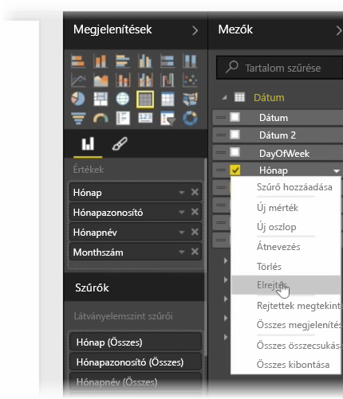
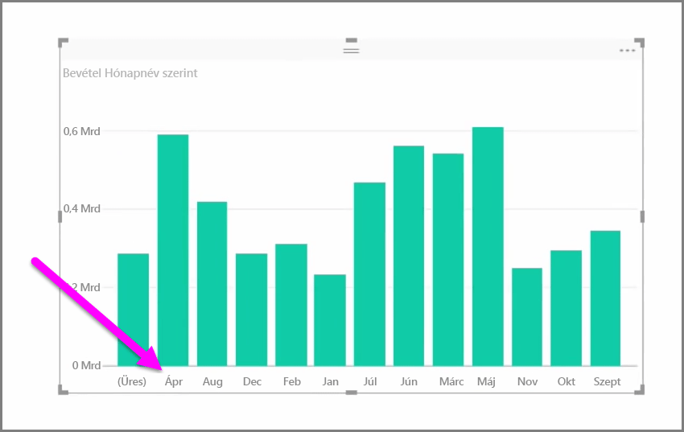
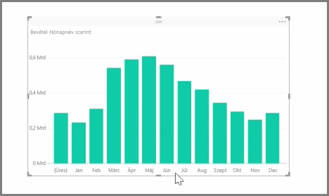

Az importált adatok gyakran tartalmaznak olyan mezőket, amelyek ténylegesen nem szükségesek a jelentéskészítési és a vizualizációs feladatokhoz, vagy azért, mert extra információk, vagy azért, mert az adatok már elérhetők egy másik oszlopban. A Power BI Desktop rendelkezik eszközökkel az adatok optimalizálásához és használhatóbbá tételéhez a jelentések és vizualizációk létrehozásához és a megosztott jelentések megtekintéséhez.

## Mezők elrejtése
Egy oszlop elrejtéséhez rá a jobb gombbal a Power BI Desktop **Mezők** ablaktábláján kattintson, és válassza az **Elrejtés** parancsot. Vegye figyelembe, hogy a rejtett oszlopok nem törlődnek; ha már használta ezt a mezőt a meglévő vizualizációkban, a megfelelő vizualizáció továbbra is tartalmazza az adatokat, amelyeket továbbra is használhat más vizualizációkban, a rejtett mezők mindössze nem jelennek meg a **Mezők** ablaktáblán.

Ha a **Kapcsolatok** nézetben jeleníti meg a táblákat, a rejtett mezők halványítva jelennek meg. Ebben az esetben az adatok továbbra is elérhetők, és továbbra is a modell részét képezik, csak éppen rejtettek. Bármikor felfedheti bármelyik rejtett mezőt: kattintson a jobb gombbal a megfelelő mezőre, majd válassza a **Felfedés** parancsot.

## Vizualizáció adatainak rendezése másik mező szerint
A **Modellezés** lapon található **Rendezés oszlop szerint** eszköz nagyon hasznos annak biztosítására, hogy az adatok a kívánt sorrendben jelenjenek meg.

Általános példaként a hónap nevét tartalmazó adatok alapértelmezés szerint ábécésorrendben vannak, így például az „augusztus” előbb jelenik meg, mint a „február”.

Ebben az esetben a probléma megoldásához elég lehet, ha kiválasztja a mezőt a Mezők listából, majd a **Modellezés** lapon a **Rendezés oszlop szerint** lehetőséget választja, végül pedig kijelöl egy mezőt a rendezés szempontjaként. Ebben az esetben a „MonthNo” kategóriarendezési beállítás a kívánt módon rendezi a hónapokat.

A mező adattípusának beállításával is optimalizálhatja adatait úgy, hogy azok kezelése megfelelően történjen. Adattípus jelentésvászonról való módosításához jelölje ki az oszlopot a **Mezők** ablaktáblán, majd a **Formátum** legördülő menüben válasszon egyet a formázási beállítások közül. Az ezt a mezőt megjelenítő létrehozott vizualizációk automatikusan frissülnek.

