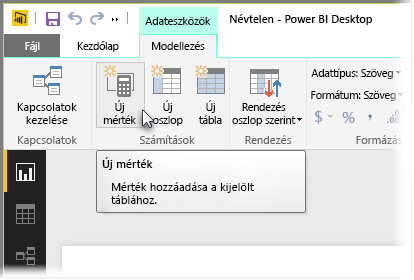
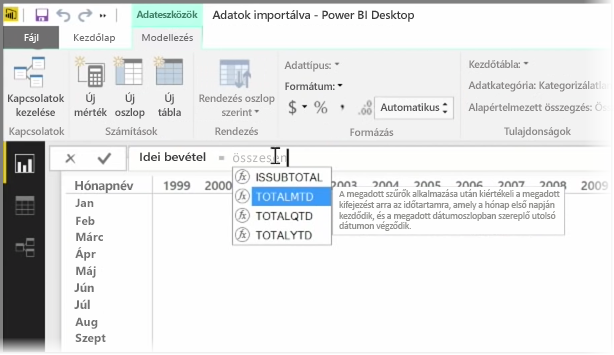
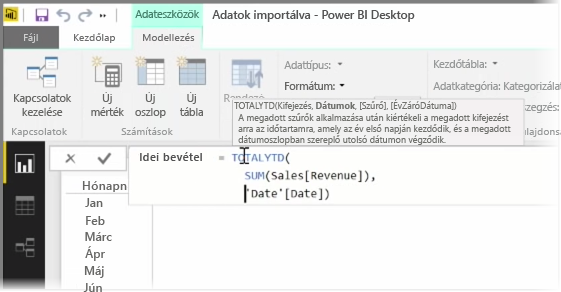
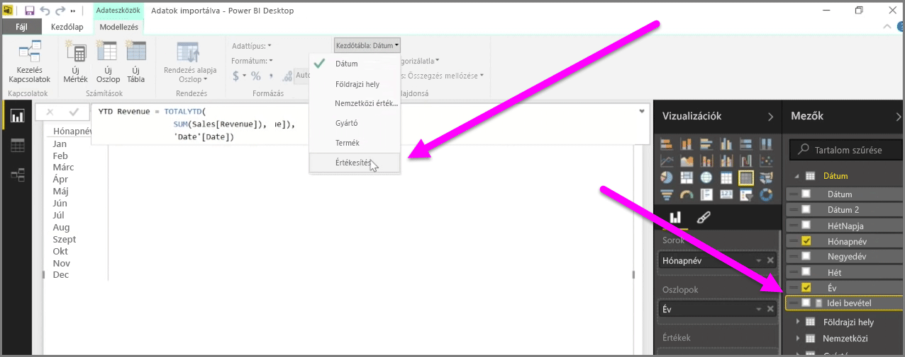

A *mérték* a Power BI adatmodell egyik számítása. Mérték készítéséhez a **Jelentés** nézetben, a **Modeling** (Modellezés) lapon kattintson a **New Measure** (Új mérték) lehetőségre.

A Power BI által használt DAX adatelemzési kifejezésnyelv egyik remek vonása a sok hasznos funkció, főleg az olyan időalapú számítások terén, mint a *Year to Date* (Folyó év a mai napig), vagy a *Year Over Year* (Éves változás). A DAX segítségével elég egyszer meghatározni az idő mértékét, utána tetszés szerinti számú különböző mezővel szeletelheti az adatmodellből.

A Power BI-ban a definiált számítás neve a *mérték*. *Mérték* létrehozásához kattintson a **New Measure** (Új mérték) elemre a **Kezdőlapon**. Ez megnyitja a képletsávot, ahol megadhatja a mérték meghatározásához szükséges DAX-kifejezést. Beíráskor és a számítás megadásakor a Power BI felajánlja a megfelelő DAX-függvényeket és adatmezőket, valamint eszköztippet ad, amely elmagyarázza a szintaxis és a funkcióparaméterek egyes elemeit.

Túl hosszú számítás esetén az **ALT-Enter** billentyűkombinációval vehet fel további sortöréseket a Kifejezésszerkesztőben.

Miután létrehozta az új mértéket, az meg fog jelenni a **Fields** (Mezők) ablaktábla egyik táblázatában a képernyő jobb oldalán. A Power BI bármely aktuálisan kiválasztott táblába beilleszti az új mértéket, és bár nem számít, hogy a mérték pontosan hol van az adatokban, könnyen áthelyezheti, ha rákattint a mértékre, és a **Kezdőtábla** legördülő menüt használja.

A mértéket úgy használhatja, mint bármely táblaoszlopot: egyszerűen áthúzhatja a jelentésvászonra, vagy a vizualizációk mezőire. A mértékek a szeletelőkkel is könnyen együttműködnek, és menet közben szegmentálják az adatokat, így elég egyszer meghatározni egy mértéket ahhoz, hogy aztán több különféle vizualizációhoz is felhasználhassa.

A **Calculate** (Számítás) nevű igen hatékony DAX-függvény a legkülönbözőbb hasznos számításokat teszi lehetővé, ami főleg a pénzügyi jelentéseknél és a vizualizációknál segít.

