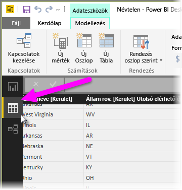
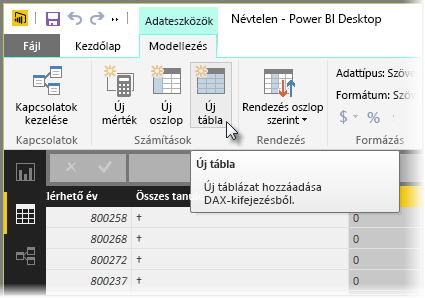
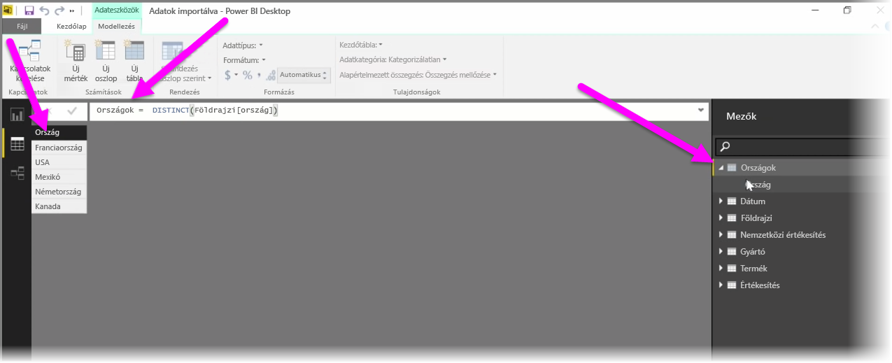

A számított táblák használata olyan lehetőség a DAX-ban, amellyel új modellezési képességek egész sora válik elérhetővé. Számított táblák használhatóak többek között akkor, ha egy függvényképlet eredményét felhasználva szeretne különféle típusú egyesítő illesztéseket végezni, vagy menet közben új táblát létrehozni.

Számított tábla létrehozásához nyissa meg a Power BI Desktopban az **Adatok** nézetet, amelyet a jelentésvászon bal oldalán aktiválhat.

A Modellezés lapon válassza az **Új tábla** lehetőséget, amellyel megnyitja a képletsávot.

Az egyenlőségjel bal oldalára írja be az új tábla nevét, a jobb oldalára pedig azt a számítást, amelyet a tábla létrehozásához használni szeretne. Ha végzett a számítással, az új tábla megjelenik a modell Mezők táblájában.

Létrehozása után az új tábla ugyanúgy használható kapcsolatokban, képletekben és jelentésekben, mint bármely más tábla.

