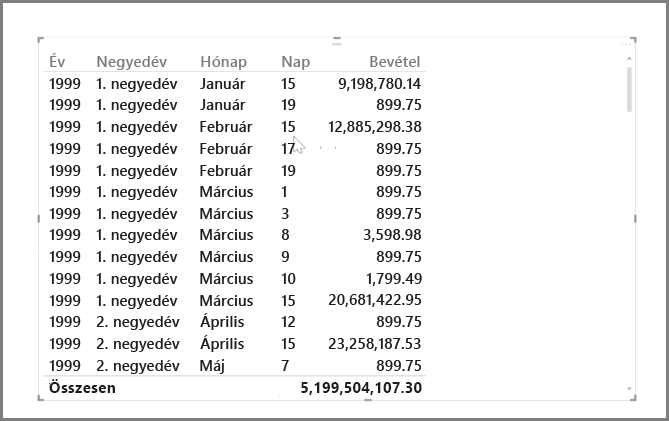
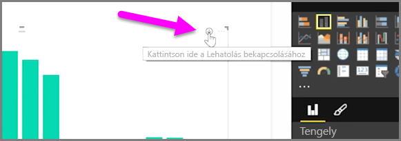
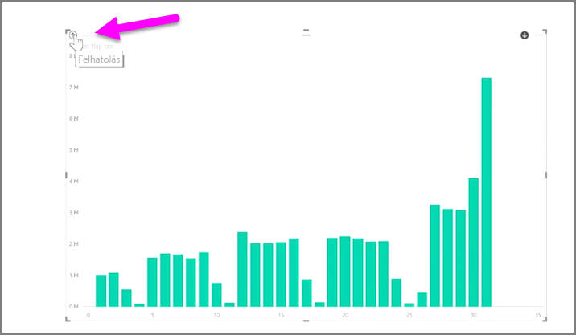
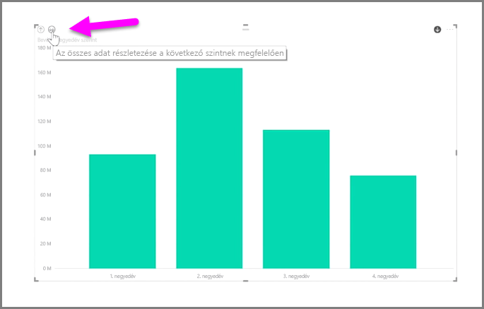
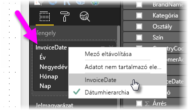

A Power BI segítségével könnyen elemezhetők az idő alapú adatok. A Power BI Desktop modellezési eszközei automatikusan létrehoznak olyan mezőket, melyek alapján egyetlen kattintással le lehet hatolni az évek, negyedévek, hónapok és napok szintjére.  

Amikor a felhasználó dátum mezőt használva jelenít meg egy táblát jelentésében, a Power BI Desktop automatikusan megjeleníti az időszakonkénti bontást. Az alábbi ábrán látható **Dátum** tábla egyetlen dátum mezőjét például automatikusan évre, negyedévre, hónapra és napra bontotta a Power BI.

Alapértelmezés szerint a vizualizációs elemek az adatok *éves* szintjét jelenítik meg, ez azonban a vizualizációs elem jobb felső sarkában látható **Részletezés** bekapcsolásával módosítható.

Ha ezután rákattint a diagram oszlopaira vagy soraira, azok eggyel mélyebb szintre hatolnak majd az időhierarchiában, például az *éves* szintről a *negyedéves* szintre. A részletezési szintet addig mélyítheti, amíg el nem éri a hierarchia legrészletesebb szintjét, ami ebben a példában a *napok* szintje. Felfelé a vizualizációs elem bal felső sarkában látható **Felhatolás** ikonra kattintva léphet az időhierarchiában.

A vizualizációs elem jobb felső sarkában található, dupla nyilat ábrázoló **Összes kibontása** ikont használva ugyanakkor, egy-egy periódus részletezési szintje helyett a vizualizációs elemen megjelenő adatok minden szintje kibontható.

Ha a modell rendelkezik dátum mezővel, a Power BI automatikusan különböző nézeteket generál az időhierarchia különböző szintjeihez.

Ha dátumhierarchia használata helyett az egyes dátumokkal szeretne dolgozni, egyszerűen kattintson jobb egérgombbal az oszlop nevére a **Mezőknél** (az alábbi ábrán az oszlop neve *InvoiceDate*), majd az előbukkanó menüből a **Dátumhierarchia** helyett válassza ki az oszlop nevét. A vizualizációs elem ezután ennek az oszlopnak az adatai alapján fogja megjeleníteni az adatokat, a dátumhierarchia alkalmazása nélkül. Vissza szeretne térni a dátumhierarchia használatához? Egyszerűen csak kattintson ismét a jobb egérgombbal, és válassza ki a **Dátumhierarchiát** az előugró menüből.

## Következő lépések
**Gratulálunk!** Ön teljesítette a Power BI **Interaktív tanulás** oktatóanyagának ezt a fejezetét. Most, hogy megismerkedett az adatok *modellezésével*, készen áll arra, hogy továbblépjen a következő rész izgalmas témájához, a **vizualizációkhoz**.

Ahogy arról korábban már szó esett, ez az oktatóanyag a Power BI használatával végzett munka szokásos menetét követve bővíti az Ön ismereteit:

* Az adatok beolvasása a **Power BI Desktopba**, és jelentéskészítés.
* Közzététel a Power BI szolgáltatásba, ahol új **vizualizációk** vagy irányítópultok hozhatók létre
* Az irányítópultok **megosztása** másokkal, különösen azokkal, akik mozgásban vannak
* A megosztott irányítópultok és jelentések megtekintése és kezelése **Power BI Mobile** alkalmazásokkal

Bár lehet, hogy nem fogja végrehajtani az összes lépést, mire végighalad ezen az oktatóanyagon *tisztában lesz azzal*, hogyan lehet ilyen irányítópultokat létrehozni és, hogy a létrehozott irányítópultok hogyan kapcsolódnak az adatokhoz, így Ön is létre tudja majd hozni saját irányítópultját.

Találkozunk a következő szakaszban!

