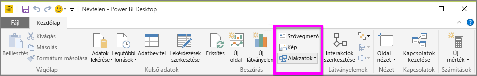
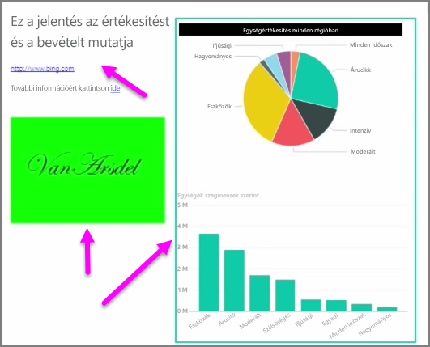

Az adatokhoz kötött vizuális elemek mellett a szebb kinézet érdekében statikus elemeket is hozzáadhat a jelentésekhez, például szövegmezőket, képeket, vagy alakzatokat. Adott vizuális elem hozzáadásához kattintson a **Kezdőlap** **Szövegmező**, **Kép** vagy **Alakzat** gombjára.

A **Szövegmezők** ideális megoldást nyújtanak,hogy kiemelt címeket, feliratokat vagy rövid tájékoztató bekezdéseket adjon hozzá a vizualizációhoz. A szövegmezőkben hivatkozásokat is megoszthat a teljes URL-cím szerepeltetésével, vagy úgy, hogy kijelöl egy szövegrészletet, és megnyomja a láncszemet szimbolizáló gombot a szövegmező beállítási sávján. Ha a teljes URL-címet teszi a szövegdobozba, azt a Power BI automatikusan érzékeli, és élő hivatkozássá alakítja.

A **Kép** lehetőségre kattintva megnyílik egy fájlböngésző, ahol kiválaszthat egy képet a számítógépről vagy a hálózaton elérhető másik forrásból. Alapértelmezés szerint a képek átméretezéskor is megőrzik az eredeti oldalarányt, de ezt kikapcsolhatja a vizuális formázási beállításoknál.

Az **Alakzatok** öt különböző formabeállítást kaphatnak – ilyen például a téglalap és a nyíl. Az alakzatok lehetnek kitöltöttek vagy áttetszőek színes szegéllyel. (Ez utóbbi akkor hasznos, ha vizuális elemek egy csoportját szeretné keretbe foglalni.)

