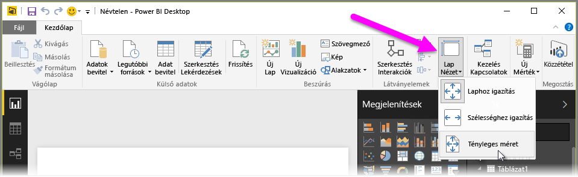
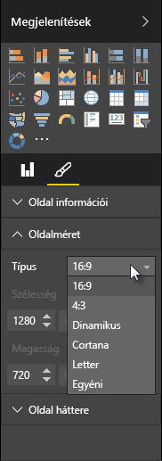

A Power BI Desktop lehetővé teszi, hogy szabályozza a jelentésoldalak elrendezését és formázását, például a méretét és tájolását.

A jelentésoldalak méretezési módjának módosításához használja a Kezdőlap **Oldal nézet** menüjét. Az elérhető lehetőségek a következők: **Laphoz igazítás** (alapértelmezett), **Szélességhez igazítás** és **Tényleges méret**.

Módosíthatja az oldalak átméreteződését is. Alapértelmezés szerint a jelentésoldalak 16:9 oldalarányúak. Az oldalméret módosításához győződjön meg róla, hogy nincs kiválasztva vizualizáció, majd válassza az ecsetikont a Vizualizációk ablaktáblán, majd válassza az **Oldalméret** elemet a szakasz kibontásához.

Az oldalméretre vonatkozó lehetőségek között szerepel a 4:3 (négyzetesebb oldalarány) és a Dinamikus (az oldalak nyújtása, hogy kitöltsék a rendelkezésre álló területet). A jelentésekre vonatkozó szabványos betűméret is elérhető. Ne feledje, hogy az oldalméret módosítása után szükség lehet a vizualizációk átméretezésére annak érdekében, hogy teljesen kitöltsék a vásznat.

Megadhat egyéni méretet is, a méretet hüvelykben vagy képpontban megadva, és módosíthatja a jelentés teljes háttérszínét is.

Egy másik választható lehetőség a Cortana, amely úgy méretezi a jelentést, hogy a Cortana használatával végzett keresések eredményeként legyen használható.

