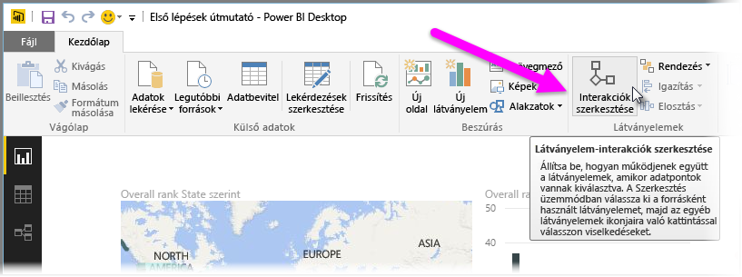
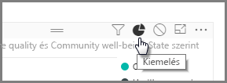
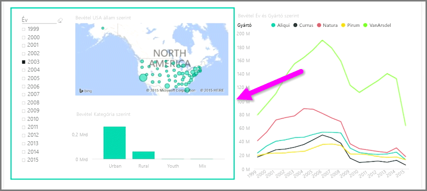

Ha egyazon jelentésoldalon több vizualizáció van, a kattintással vagy szeletelővel történő szegmensválasztás az oldal összes vizualizációt befolyásolni fogja. Mégis előfordulhat, hogy csak egyes vizualizációkat kíván szeletelni. Ez különösen érvényes az olyan elemek használatánál, mint a pontdiagram, ahol az adatok egy bizonyos szegmensre való korlátozása alapvető fontosságú információt távolít el. Szerencsére a Power BI Desktop lehetővé teszi a vizualizációk közti interakció szabályozását.

A vizualizációk közti interakció módosításához a **Home** menüszalagon lévő Visuals (Látványelemek) szakasz **Edit** (Szerkesztés) elemére kattintva kapcsolja be a **Szerkesztési módot**.

>[!NOTE]
>A videó elkészülte óta megváltozott a Power BI Desktop **Edit Interactions** (Interakciók szerkesztése) ikonja.
> 
> 

Ha kijelöl egy vizualizációt a jelentésvásznon, egy kisméretű, átlátszatlan *szűrő* ikon jelenik meg minden olyan egyéb látványelem jobb felső sarkában, amelyet a beavatkozás érinteni fog. Ha ki szeretne zárni egy vizualizációt az interakcióból, kattintson a jobb felső sarokban a *szűrő* ikon mellett található *Nincs* szimbólumra.

Bizonyos esetekben beállíthatja a vizualizációk közti szűrés-interakció típusát. Bekapcsolt **Szerkesztési mód** mellett válassza ki a szűrni kívánt vizualizációt. Ha módosítható egy másik vizualizációval való interakció típusa, a jobb felső sarokban *kördiagram* ikon jelenik meg a szűrő ikon mellett.

A szegmentált adatok kiemeléséhez kattintson a *kördiagram* ikonra. Ha ezt nem teszi meg, a rendszer szűrni fogja az adatokat. Ahogy az előbb is, a *Nincs* elemre kattintva eltávolíthat minden interakciót.

Hasznos lehet, ha tervezésnél átlátszó alakzatba foglalja az egymással interakcióban álló vizualizációkat, így a felhasználó számára világos lesz a köztük lévő kapcsolat.

