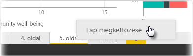

A jelentés egyes lapjai igen összetettek lehetnek, ha többféle pontosan formázott vizualizációs elemet tartalmaznak, amelyek megadott módon működnek együtt. Jelentés készítésekor előfordulhat, hogy két különböző oldal témájához ugyanazokat a vizualizációkat és elrendezéseket kívánja felhasználni. Például ha elkészített egy jelentést a bruttó bevételről, szüksége lehet egy szinte ugyanilyen oldalra a nettó bevételről is.

A teljes munkát nehéz lenne újra elvégezni, de a Power BI Desktop használatával egyszerűen megkettőzheti az oldalt.

Kattintson a jobb gombbal a másolni kívánt lapra, majd válassza a **Duplicate Page**.(Lap megkettőzése) elemet.

Ekkor tetszés szerint átnevezheti az új lapfület, frissítheti a már meglévő szövegcímet, majd pedig frissítheti a vizualizációkat a követni kívánt új mezővel.

