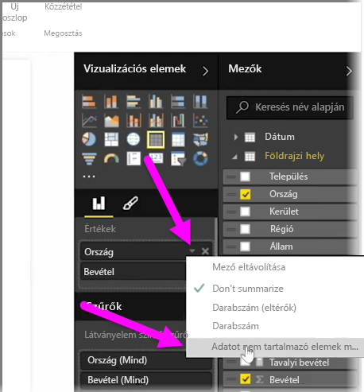
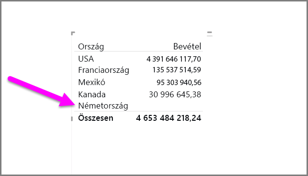
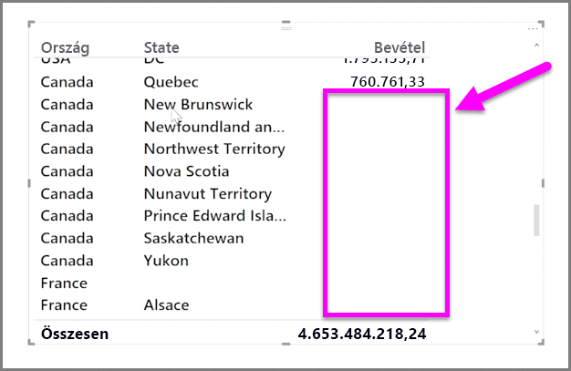

Alapértelmezés szerint csak azok az oszlopfejlécek jelennek meg a jelentésekben, amelyek adatot tartalmaznak. Ha például országokra lebontva jeleníti meg bevételeit, és Norvégiában nem értékesített, akkor Norvégia egyáltalán nem fog szerepelni a vizualizációban.

Az üres kategóriák megjelenítéséhez a **Vizualizációk** panelen a változtatni kívánt mezőben kattintson a lefelé mutató nyílra, és válassza az **Adatot nem tartalmazó elemek megjelenítése** lehetőséget.

A vizualizációban láthatóvá válnak az üres oszlopok az üres értékekkel.

Ha akárcsak egyetlen mezőnél kiválasztja az **Adatot nem tartalmazó elemek megjelenítése** lehetőséget a **Vizualizációk** panelen, a beállítás a Vizualizációk panel összes mezőjére érvényes lesz. Tehát, ha egy további mezőt ad hozzá, annak összes adatot nem tartalmazó eleme látható lesz anélkül, hogy azt be kellene újra állítani a legördülő menüben.

