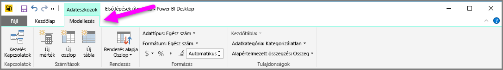
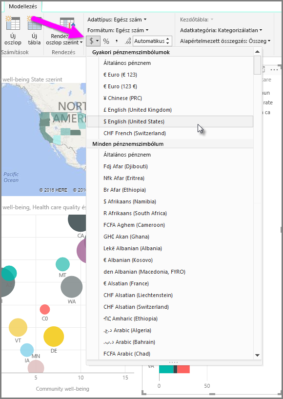
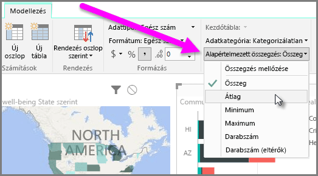
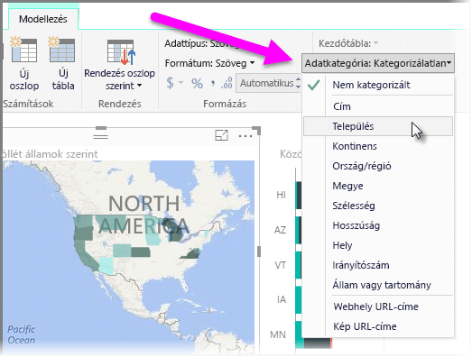

A Power BI-ban tulajdonságokat rendelhet a modell mezőihez, így világosabban számolhat be az adatokról, jelenítheti meg és mutathatja be őket. Például előfordulhat, hogy átlagolni akar egy számsort, de a Power BI automatikusan összeadja az elemeket. A Power BI segítségével beállíthatja a számsorok összegzésének módját.

## Numerikus összegzések szabályozása
A következő példában bemutatjuk, hogyan lehet szabályozni azt a módot, ahogy a Power BI összegzi a numerikus adatmezőket.

Válasszon ki egy vizualizációt a jelentésvásznon, majd a **Fields** (Mezők) ablaktáblán jelöljön ki egy mezőt. A **Modeling** (Modellezés) lap megjelenik a menüszalagon, és lehetőségeket kínál fel az adatok és az adattulajdonságok formázására.

A pénznemszimbólumok legördülő listájából kiválaszthatja a használni kívánt pénznem szimbólumát, ahogyan az alábbi képen látható.

A mezők formázására több lehetőség is adódik. Például pénznemről százalékra módosíthatja a formátumot,

és azt is módosíthatja, hogy a Power BI miképpen összegzi az adatokat. A **Default Summarization** (Alapértelmezett összegzés) ikonra kattintva módosíthatja a mező összegzésének módját, például összegre, darabszámra vagy átlagra.

## Helyadatok kezelése és tisztázása
Hasonló változtatásokat hajthat végre a térképen a helyszínek azonosításakor. Válassza ki a térképet, majd a *Location* (Hely) értékhez használt **Fields** (Mezők) ablaktáblán válassza ki a mezőt. A **Modeling** (Modellezés) lapon kattintson a **Data Category** (Adatkategória) elemre, majd válassza ki a saját helynek megfelelő kategóriát a legördülő menüből. Választhatja például az országot, a megyét, vagy a várost.

